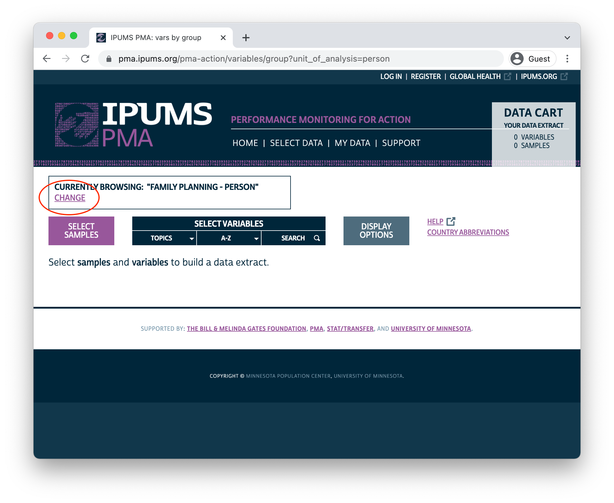
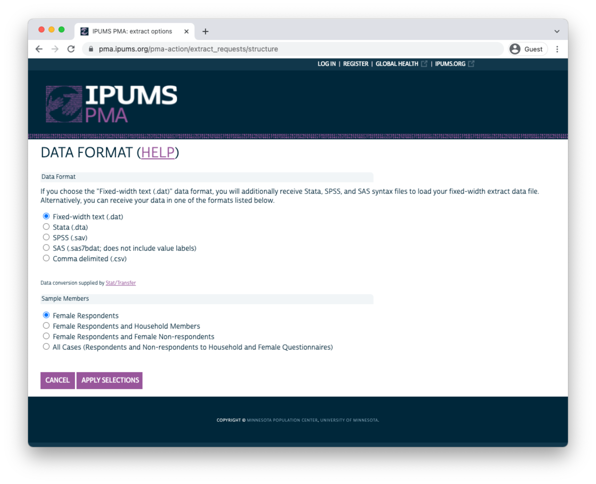
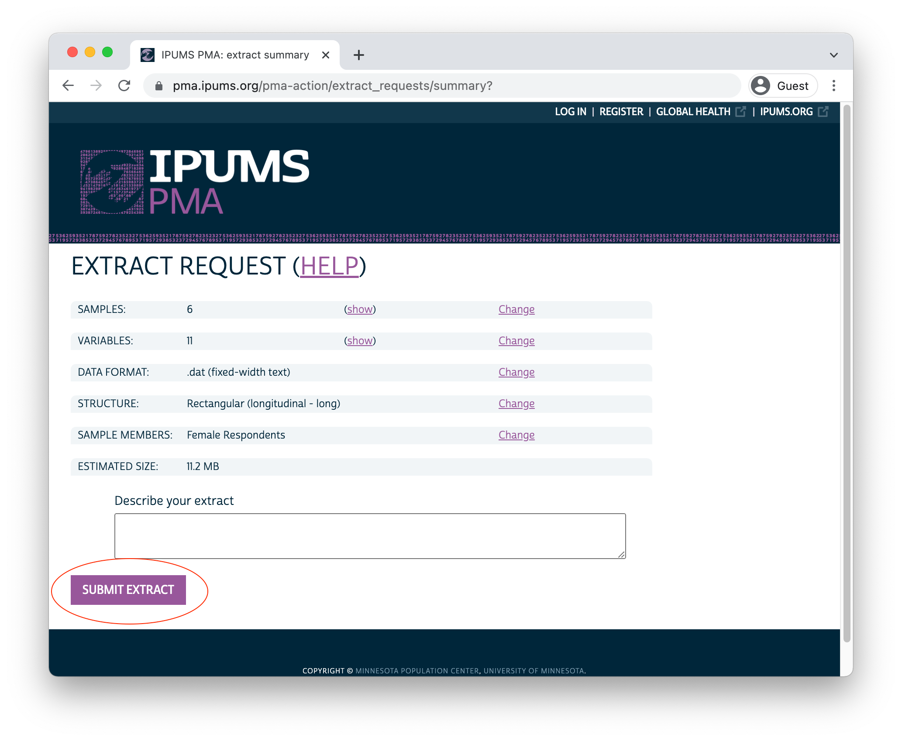
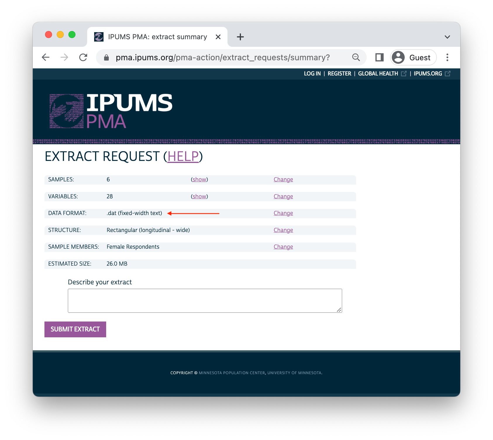

```{r, setup, echo=FALSE}
knitr::opts_chunk$set(
  echo = FALSE, 
  comment = NA, 
  message = FALSE,
  R.options = list(width = 88)
)

source(here::here("r/utilities.r"))
```

# Introduction

```{r, echo=FALSE, results='hide'}
knitr::opts_chunk$set(echo = FALSE)
source(here::here("r/utilities.r"))


widef <- read_ipums_micro(
  ddi = "data/pma_00079.xml",
  data = "data/pma_00079.dat.gz"
)
```

[Performance Monitoring for Action (PMA)](https://www.pmadata.org/) uses innovative mobile technology to support low-cost, rapid-turnaround surveys that monitor key health and development indicators.

PMA surveys collect longitudinal data throughout a country at the household and health facility levels by female data collectors, known as resident enumerators, using mobile phones. The survey collects information from the same women and households over time for regular tracking of progress and for understanding the drivers of contraceptive use dynamics. The data are rapidly validated, aggregated, and prepared into tables and graphs, making results quickly available to stakeholders. PMA surveys can be integrated into national monitoring and evaluation systems using a low-cost, rapid-turnaround survey platform that can be adapted and used for various health data needs.

The PMA project is implemented by local partner universities and research organizations who train and deploy the cadres of female resident enumerators.

<aside>
PMA has also published a guide to **cross-sectional** analysis in both [English](https://www.pmadata.org/media/1243/download?attachment) and [French](https://www.pmadata.org/media/1244/download?attachment).
</aside>

The purpose of this manual is to provide guidance on the analysis of **harmonized panel data** for women age 15-49 surveyed by PMA and published in partnership with [IPUMS PMA](https://pma.ipums.org/pma/). IPUMS provides census and survey products from around the world in an integrated format, making it easy to compare data from multiple countries. IPUMS PMA data are available free of charge, subject to terms and conditions: please [register here](https://pma.ipums.org/pma/register.shtml) to request access to the data featured in this guide. 

The contents of this guide are also available on the IPUMS PMA [data analysis blog](https://tech.popdata.org/pma-data-hub/index.html), which features coding examples in [R](https://www.r-project.org/) posted every two weeks.  


## Background

Dating back to 2013, the original PMA survey design included high-frequency, **cross-sectional** samples of women and service delivery points collected from eleven countries participating in [Family Planning 2020](http://progress.familyplanning2020.org/) (FP2020) - a global partnership that supports the rights of women and girls to decide for themselves whether, when, and how many children they want to have. These surveys were designed to monitor annual progress towards [FP2020 goals](http://progress.familyplanning2020.org/measurement) via population-level estimates for several [core indicators](http://www.track20.org/pages/data_analysis/core_indicators/overview.php). 

Beginning in 2019, PMA surveys were redesigned under a renewed partnership called [Family Planning 2030](https://fp2030.org/) (FP2030). These new surveys have been refocused on reproductive and sexual health indicators, and they feature a **longitudinal panel** of women of childbearing age. This design will allow researchers to measure contraceptive dynamics and changes in women’s fertility intentions over a **three year period** via annual in-person interviews.^[In addition to these three in-person surveys, PMA also conducted telephone interviews with panel members focused on emerging issues related to the COVID-19 pandemic in 2020. These telephone surveys are already available for several countries - see our series on [PMA COVID-19 surveys](../../index.html#category:COVID-19) for details.] 

Questions on the redesigned survey cover topics like:

  * awareness, perception, knowledge, and use of contraceptive methods
  * perceived quality and side effects of contraceptive methods among current users
  * birth history and fertility intentions 
  * aspects of health service provision 
  * domains of empowerment 
  
## Sampling 

PMA panel data includes a mixture of **nationally representative** and **sub-nationally representative** samples. The panel study consists of three data collection phases, each spaced one year apart. 

As of this writing, IPUMS PMA has released data from the first *two* phases for four countries where Phase 1 data collection began in 2019; IPUMS PMA has released data from only the *first* phase for three countries where Phase 1 data collection began in August or September 2020. Phase 3 data collection and processing is currently underway. 

```{r, results='hide', message=FALSE}
library(kableExtra)
options(knitr.kable.NA = '')

avail <- read_csv("data/sample_avail.csv", show_col_types = F) 
names(avail)[2] <- paste0(
  names(avail)[2], 
  footnote_marker_symbol(1)
)

```
```{r}
avail %>%   
  arrange(Sample) %>% 
  kable(escape = FALSE, format = "html", table.attr = "style='width:100%;'") %>% 
  kable_styling() %>% 
  add_header_above(c(" " = 2, "Now Available from IPUMS PMA" = 3)) %>% 
  scroll_box(
    width = "100%", 
    box_css = paste(
      sep = "; ",
      "margin-bottom: 1em",
      "margin-top: 0em",
      "border: 0px solid #ddd",
      "padding: 5px"
    )
  ) %>%
  footnote(
    symbol = "<em>Each data collection phase is spaced one year apart</em>", 
    escape = FALSE
  )

```

<aside>
Questionnaires are administered in-person by **resident enumerators** visiting selected households in each EA. 

These are typically women over age 21 living in (or near) each EA and who hold at least a high school diploma.
</aside>

PMA uses a multi-stage clustered sample design, with stratification at the urban-rural level or by sub-region. Sample clusters - called [enumeration areas](https://pma.ipums.org/pma-action/variables/EAID#description_section) (EAs) -- are provided by the national statistics agency in each country.^[[Displaced GPS coordinates](https://tech.popdata.org/pma-data-hub/posts/2021-10-15-nutrition-climate/PMA_displacement.pdf) for the centroid of each EA are available for most samples [by request](https://www.pmadata.org/data/request-access-datasets) from PMA. IPUMS PMA provides shapefiles for PMA countries [here](https://pma.ipums.org/pma/gis_boundary_files.shtml).] These EAs are sampled using a *probability proportional to size* (PPS) method relative to the population distribution in each stratum.

At Phase 1, 35 household dwellings were selected at random within each EA. Resident enumerators visited each dwelling and invited one household member to complete a [Household Questionnaire](https://pma.ipums.org/pma/resources/questionnaires/hhf/PMA-Household-Questionnaire-English-2019.10.09.pdf)^[Questionnaires administered in each country may vary from this **Core Household Questionnaire** - [click here](https://pma.ipums.org/pma/enum_materials.shtml) for details.] that includes a census of all household members and visitors who stayed there during the night before the interview. Female household members and visitors aged 15-49 were then invited to complete a subsequent Phase 1 [Female Questionnaire](https://pma.ipums.org/pma/resources/questionnaires/hhf/PMA-Female-Questionnaire-English-2019.10.09.pdf).^[Questionnaires administered in each country may vary from this **Core Female Questionnaire** - [click here](https://pma.ipums.org/pma/enum_materials.shtml) for details.]

<aside>
`r varlink(SAMEDWELLING)` indicates whether a Phase 2 female respondent resided in her Phase 1 dwelling or a new one. 

`r varlink(PANELWOMAN)` indicates whether a Phase 2 household member completed the Phase 1 Female Questionnaire.  
</aside>

One year later, resident enumerators visited the same dwellings and administered a Phase 2 Household Questionnaire. A panel member in Phase 2 is any woman still age 15-49 who could be reached for a second Female Questionnaire, either because:

  * she still lived there, or
  * she had moved elsewhere within the study area,^[The "study area" is area within which resident enumerators should attempt to find panel women that have moved out of their Phase 1 dwelling. This may extend beyond the woman's original EA as determined by in-country administrators - see [PMA Phase 2 and Phase 3 Survey Protocol](https://www.pmadata.org/data/survey-methodology) for details.] but at least one member of the Phase 1 household remained and could help resident enumerators locate her new dwelling.^[In cases where no Phase 1 household members remained in the dwelling at Phase 2, women from the household are considered lost to follow-up (LTFU). A panel member is also considered LTFU if a Phase 2 Household Questionnaire was not completed, if she declined to participate, or if she was deceased or otherwise unavailable.]
  
Additionally, resident enumerators administered the Phase 2 Female Questionnaire to *new* women in sampled households who:

  * reached age 15 after Phase 1
  * joined the household after Phase 1
  * declined the Female Questionnaire at Phase 1, but agreed to complete it at Phase 2
  
When you select the new **Longitudinal** sample option at checkout, you'll be able to include responses from every available phase of the study. These samples are available in either "long" format (responses from each phase will be organized in separate rows) or "wide" format (responses from each phase will be organized in columns). 

```{r}
knitr::include_graphics("images/long_radio.png")
```

<aside>
`r varlink(CROSS_SECTION)` indicates whether a household member in a longitudinal sample is also included in the cross-sectional sample for a given year (every person in a cross-sectional sample is included in the longitudinal sample). 
</aside>

In addition to following up with women in the panel over time, PMA also adjusted sampling so that a cross-sectional sample could be produced concurrently with each data collection phase. These samples mainly overlap with the data you'll obtain for a particular phase in the longitudinal sample, except that replacement households were drawn from each EA where more than 10% of households from the previous phase were no longer there. Conversely, panel members who were located in a new dwelling at Phase 2 will not be represented in the cross-sectional sample drawn from that EA. These adjustments ensure that population-level indicators may be derived from cross-sectional samples in a given year, even if panel members move or are lost to follow-up. 

You'll find PMA cross-sectional samples dating back to 2013 if you select the **Cross-sectional** sample option at checkout. 

```{r}
knitr::include_graphics("images/cross_radio.png")
```

## Survey Design Elements

Throughout this guide, we'll demonstrate how to incorporate PMA sampling weights and information about its stratified cluster sampling procedure into your analysis. To do so, we'll rely on tools from the [srvyr](http://gdfe.co/srvyr/index.html) package.^[The `srvyr` package is a [tidy](https://tidyverse.tidyverse.org/) implementation of the popular [survey](http://r-survey.r-forge.r-project.org/survey/) package for R, authored by Dr. Thomas Lumley. For thorough discussion of the types of weights available in both R and Stata, we recommend [this blog post](https://notstatschat.rbind.io/2020/08/04/weights-in-statistics/) by Dr. Lumley.]  

Whether you intend to work with a new **Longitudinal** or **Cross-sectional** data extract, you'll find the same set of sampling weights available for all PMA Family Planning surveys dating back to 2013: 

<aside>
A fourth Family Planning survey weight, `r varlink(POPWT, description)`, is currently available only for **Cross-sectional** data extracts and Phase 1 panel data.^[`POPWT` can be used to estimate population-level *counts* - [click here](https://pma.ipums.org/pma/population_weights.shtml) or view [this video](https://www.youtube.com/watch?v=GnCq26t4zgM) for details.] 
</aside>

  * `r varlink(HQWEIGHT, description)` can be used to generate cross-sectional population estimates from questions on the Household Questionnaire.^[`HQWEIGHT` reflects the [calculated selection probability](https://pma.ipums.org/pma/resources/documentation/weighting_memo.pdf) for a household in an EA, normalized at the population-level. Users intending to estimate population-level indicators for *households* should restrict their sample to one person per household via `r varlink(LINENO, description)` - see [household weighting guide](https://pma.ipums.org/pma/weightguide.shtml#hh) for details.]
  * `r varlink(FQWEIGHT, description)` can be used to to generate cross-sectional population estimates from questions on the Female Questionnaire.^[`FQWEIGHT` adjusts `HQWEIGHT` for female non-response within the EA, normalized at the population-level - see [female weighting guide](https://pma.ipums.org/pma/weightguide.shtml#female) for details.]
  * `r varlink(EAWEIGHT, description)` can be used to compare the selection probability of a particular household with that of its EA. 
  
Additionally, PMA created a new weight, `r varlink(PANELWEIGHT, description)`, 
which should be used in longitudinal analyses spanning multiple phases, as it adjusts for loss to follow-up. `PANELWEIGHT` is available only for **Longitudinal** data extracts. 

<aside>
Variable names in a "wide" extract have a numeric suffix corresponding with a data collection phase. `CP_1` is the Phase 1 version of `r varlink(CP)`, while `CP_2` comes from Phase 2. 
</aside>

For example, suppose we wanted to estimate the proportion of reproductive age women in Burkina Faso who were using contraception at the time of data collection for both Phase 1 and Phase 2. In a cross-sectional or "long" longitudinal extract, you'll find this information in the variable `r varlink(CP)`. In a "wide" longitudinal extract, you'll find it in `CP_1` for Phase 1, and in `CP_2` for Phase 2. We'll be working with a "wide" extract loaded into R as an object called `dat`.

```{r, echo = FALSE}
# n = 5491 (checked with flowchart)
dat <- widef %>% 
  filter(SAMPLE_1 == 85409) %>% 
  filter(RESULTFQ_1 %in% c(1,5)) %>%
  filter(AGEHQ_1 < 49) %>% 
  filter(SURVEYWILLING_1 == 1) %>%  # 6532 women aged and agreed
  filter(RESULTHQ_2 %in% 1) %>%  # completed HQ
  filter(RESULTFQ_2 %in% 1) # completed FQ

# Target: n=5207 (final report)  
# drop du jure (usual member, slept away last night), n = 5212
dat <- dat %>% 
  filter(RESIDENT_1 != 21) %>% 
  filter(RESIDENT_2 != 21 & RESIDENT_2 != 31)

# dropping NIU in CP, we get n = 5207
knitr::opts_chunk$set(echo = TRUE)
```

```{r}
dat %>% count(CP_1, CP_2)
```

The `srvyr` package provides two functions we'll need to obtain our population estimate. The first, [as_survey_design](http://gdfe.co/srvyr/reference/as_survey_design.html), allows us to specify `PANELWEIGHT` as a sampling weight. The second, [survey_mean](http://gdfe.co/srvyr/reference/survey_mean.html), uses that weight in an estimating function; in this case, we'll get the estimated proportion where `CP_1` and `CP_2` both have the value `1 [Yes]` after removing missing / NIU responses with `CP_1 < 90 & CP_2 < 90`. 

In subsequent chapters, we'll use `vartype = "ci"` to include a 95% confidence interval set by `level = 0.95` any time we calculate a population estimate. For discrete variables, we'll also include `proportion = TRUE` and `prop_method = "logit"`. In practice, there are large number of ways to calculate a confidence interval for a proportion.^[See Dean & Pagano [-@Dean-Pagano] for discussion.] The [srvyr](http://gdfe.co/srvyr/index.html) package includes several options for `prop_method`,^[See [svyciprop](https://rdrr.io/pkg/survey/man/svyciprop.html) for a complete list of methods.] but we'll use these settings because: 

  1) they ensure that each proportion's confidence interval only includes values between 0% and 100%,
  2) they will include the real-world population proportion close to 95% of the time,
  3) the `logit` method yields a relatively narrow interval compared with other options, and 
  4) these intervals will match the default intervals reported by Stata and SPSS survey proportion functions.

<aside>
`coef` shows the estimated population proportion

`_low` and `_upp` show the lower and upper bounds of a 95% confidence interval
</aside>

```{r}
library(srvyr)

dat %>% 
  as_survey_design(weight = PANELWEIGHT) %>% 
  filter(CP_1 < 90 & CP_2 < 90) %>% 
  summarise(
    survey_mean(
      CP_1 * CP_2,
      vartype = "ci",
      level = 0.95,
      proportion = TRUE,
      prop_method = "logit"
    )
  )
```

You can also provide information about sample clusters via [as_survey_design](http://gdfe.co/srvyr/reference/as_survey_design.html). In general, we expect households selected from the same EA to share certain characteristics, such that some degree of variation seen in a variable of interest may be non-random at the EA-level. To compensate, you may wish the expand the standard errors produced by `survey_mean` by providing EA identifiers in `r varlink(EAID)`.

Here, we include `id = EAID_1`.^[As we'll see in an upcoming post, women are considered "lost to follow-up" if they moved outside the study area after Phase 1. Therefore, `EAID_1` and `EAID_2` are identical for all panel members: you can use either one to identify sample clusters.] Compared with our original estimate, notice that the 95% confidence interval for our contraceptive use estimate is wider when we provide information about the clustered sample design - these are "cluster-robust" standard errors.

```{r}
dat %>% 
  as_survey_design(weight = PANELWEIGHT, id = EAID_1) %>% 
  filter(CP_1 < 90 & CP_2 < 90) %>% 
  summarise(
    survey_mean(
      CP_1 * CP_2,
      vartype = "ci",
      level = 0.95,
      proportion = TRUE,
      prop_method = "logit"
    )
  )
```

Finally, we'll also use [as_survey_design](http://gdfe.co/srvyr/reference/as_survey_design.html) to specify sample strata. For most samples, including Burkina Faso, this information is included in the variable `r varlink(STRATA)`. We'll include it here with `strata = STRATA_1`.^[As with `r varlink(EAID)`, you may use either `STRATA_1` or `STRATA_2` if your analysis is restricted to panel members.] 

```{r}
dat %>% 
  as_survey_design(weight = PANELWEIGHT, id = EAID_1, strata = STRATA_1) %>% 
  filter(CP_1 < 90 & CP_2 < 90) %>% 
  summarise(
    survey_mean(
      CP_1 * CP_2,
      vartype = "ci",
      level = 0.95,
      proportion = TRUE,
      prop_method = "logit"
    )
  )
```

The variable `r varlink(STRATA)` is *not available* for samples collected from DRC - Kinshasa or DRC - Kongo Central. If your extract includes any DRC sample, you'll need to amend this variable to include one unique numeric code for each of those regions.    

For example, let's look at a different "wide" extract, `dat2`, containing all of the samples included in this data release. Notice that `STRATA_1` lists the sample strata for every `r varlink(COUNTRY)` *except* for DRC, where you see the value `NA`. 

```{r, echo = FALSE, results='hide'}
# I created a new version of the data extract we were using that includes 
# `GEOCD`. In case any revisions have been made since the original publication # of this post, I only load it here (rather than at the beginning).
dat2 <- read_ipums_micro(
  ddi = "data/pma_00144.xml",
  data = "data/pma_00144.dat.gz"
)

dat2 <- dat2 %>% 
  filter(RESIDENT_1 %in% c(11, 22) & RESIDENT_2 %in% c(11, 22)) %>%
  filter(RESULTFQ_2 == 1)

# Bigger tibbles 
options(tibble.print_min = 30)
```

```{r}
dat2 %>% count(COUNTRY, STRATA_1)
```

Now let's see what happens when we try to produce population-level estimates with `STRATA_1`: 

```{r, error=TRUE}
dat2 %>% 
  as_survey_design(weight = PANELWEIGHT, id = EAID_1, strata = STRATA_1) %>% 
  filter(CP_1 < 90 & CP_2 < 90) %>% 
  group_by(COUNTRY, GEOCD, GEONG) %>% 
  summarise(
    survey_mean(
      CP_1 * CP_2,
      vartype = "ci",
      level = 0.95,
      proportion = TRUE,
      prop_method = "logit"
    )
  )
```

This fails because [as_survey_design](http://gdfe.co/srvyr/reference/as_survey_design.html) encounters `NA` values in `STRATA_1`. Fortunately, we can replace those values with numeric codes from the variable `r varlink(GEOCD)`: 

```{r}
dat2 %>% count(GEOCD)
```

If `GEOCD` is not `NA`, we'll use its numeric code in place of `STRATA_1`. Otherwise, we'd like to leave `STRATA_1` unchanged. However, because both variables include *value labels*, we'll first need remove them with [as.numeric](https://rdrr.io/r/base/numeric.html). To avoid confusion with the original variable `STRATA_1`, we'll call our new variable `STRATA_RECODE`.

```{r}
dat2 <- dat2 %>% 
  mutate(
    STRATA_RECODE = if_else(
      is.na(GEOCD), 
      as.numeric(STRATA_1), 
      as.numeric(GEOCD)
    )
  ) 

dat2 %>% count(GEOCD, STRATA_1, STRATA_RECODE)
```

Now, we can use `STRATA_RECODE` with [as_survey_design](http://gdfe.co/srvyr/reference/as_survey_design.html) to obtain population estimates for each nationally representative or sub-nationally representative sample.

```{r, error=TRUE}
dat2 %>% 
  as_survey_design(weight = PANELWEIGHT, id = EAID_1, strata = STRATA_RECODE) %>% 
  filter(CP_1 < 90 & CP_2 < 90) %>% 
  group_by(COUNTRY, GEOCD, GEONG) %>%
  summarise(
    survey_mean(
      CP_1 * CP_2,
      vartype = "ci",
      level = 0.95,
      proportion = TRUE,
      prop_method = "logit"
    )
  )
```


## Inclusion Criteria for Analysis 

The remainder of this guide will feature code you can use to reproduce key indicators included in the **PMA Longitudinal Brief** for each sample. In many cases, you'll find separate reports available in English and French, and for both national and sub-national summaries. For reference, here are the highest-level population summaries available in English for each sample where Phase 2 IPUMS PMA data is currently available:

  * [Burkina Faso](https://www.pmadata.org/sites/default/files/data_product_results/Burkina%20National_Phase%202_Panel_Results%20Brief_English_Final.pdf)
  * [DRC - Kinshasa](https://www.pmadata.org/sites/default/files/data_product_results/DRC%20Kinshasa_%20Phase%202%20Panel%20Results%20Brief_English_Final.pdf)
  * [DRC - Kongo Central](https://www.pmadata.org/sites/default/files/data_product_results/DRC%20Kongo%20Central_%20Phase%202%20Panel%20Results%20Brief_English_Final.pdf)
  * [Kenya](https://www.pmadata.org/sites/default/files/data_product_results/Kenya%20National_Phase%202_Panel%20Results%20Brief_Final.pdf)
  * [Nigeria - Kano](https://www.pmadata.org/sites/default/files/data_product_results/Nigeria%20KANO_Phase%202_Panel_Results%20Brief_Final.pdf)
  * [Nigeria - Lagos](https://www.pmadata.org/sites/default/files/data_product_results/Nigeria%20LAGOS_Phase%202_Panel_Results%20Brief_Final.pdf) 

Panel data in these reports is limited to the *de facto* population of women who completed the Female Questionnaire in both Phase 1 and Phase 2. This includes women who slept in the household during the night before the interview for the Household Questionnaire. The *de jure* population includes women who are usual household members, but who slept elsewhere that night. We'll remove *de jure* cases recorded in the variable `r varlink(RESIDENT)`. 

For example, returning to our "wide" data extract for Burkina Faso, you can see the number of women who slept in the household before the Household Questionnaire for each phase reported in `RESIDENT_1` and `RESIDENT_2`: 

<aside>
`NA` cases in `RESIDENT_2` represent women who were lost to follow-up in Phase 2. In Stata, these cases will be represented by blank values.
</aside>

```{r, echo = FALSE}
# n = 5491 (checked with flowchart)
dat <- widef %>% 
  filter(SAMPLE_1 == 85409)
```  

```{r}
dat %>% count(RESIDENT_1)
dat %>% count(RESIDENT_2)
```

The *de facto* population is represented in codes 11 and 22. We'll use `filter` to include only those cases. 

```{r}
dat_2 <- dat %>% 
  filter(
    RESIDENT_1 == 11 | RESIDENT_1 == 22, 
    RESIDENT_2 == 11 | RESIDENT_2 == 22
  ) 

dat_2 %>% count(RESIDENT_1, RESIDENT_2)
```

Additionally, these reports only include women who completed (or partially completed) both Female Questionnaires. This information is reported in `r varlink(RESULTFQ)`. In our "wide" extract, this information appears in `RESULTFQ_1` and `RESULTFQ_2`: if you select the "Female Respondents" option at checkout, only women who completed (or partially completed) the Phase 1 Female Questionnaire will be included in your extract. 

```{r, echo = FALSE}
knitr::include_graphics("images/cases1.png")
```

We'll further restrict our sample by selecting only cases where `RESULTFQ_2` shows that the woman also completed the Phase 2 questionnaire. Notice that, in addition to each of the value 1 through 10, there are several **non-response codes** numbered 90 through 99. You'll see similar values repeated across all IPUMS PMA variables, except that they will be left-padded to match the maximum width of a particular variable (e.g. `9999` is used for `r varlink(INTFQYEAR)`, which represents a 4-digit year for the Female Interview). 

```{r}
dat %>% count(RESULTFQ_2)
```

Possible **non-response codes** include: 

  * `95` Not interviewed (female questionnaire)
  * `96` Not interviewed (household questionnaire)
  * `97` Don't know
  * `98` No response or missing 
  * `99` NIU (not in universe)

The value `NA` in an IPUMS extract indicates that a particular variable is not provided for a selected sample. In a "wide" **Longitudinal** extract, it may also signify that a particular person was not included in the data from a particular phase. Here, an `NA` appearing in `RESULTFQ_2` indicates that a Female Respondent from Phase 1 was not found in Phase 2.

You can drop incomplete Phase 2 female responses as follows: 

```{r}
dat_3 <- dat %>% filter(RESULTFQ_2 == 1) 

dat_3 %>% count(RESULTFQ_1, RESULTFQ_2)
```

Generally, we will combine both filtering steps together in a single function like so:

```{r}
dat <- dat %>% 
  filter(
    RESIDENT_1 == 11 | RESIDENT_1 == 22, 
    RESIDENT_2 == 11 | RESIDENT_2 == 22,
    RESULTFQ_2 == 1
  ) 
```

In subsequent analyses, we'll use the remaining cases to show how PMA generates key indicators for **contraceptive use status** and **family planning intentions and outcomes**. The summary report for each country includes measures disaggregated by demographic variables like:

  * `r varlink(MARSTAT)` - marital status 
  * `r varlink(EDUCATT)` and `r varlink(EDUCATTGEN)` - highest attended level of education^[Levels in `EDUCATT` may vary by country; `EDUCATTGEN` recodes country-specific levels in four general categories.] 
  * `r varlink(AGE)` - age^[Ages are frequently reported in five-year groups: 15-19, 20-24, 25-29, 30-34, 35-39, 40-44, and 45-49.] 
  * `r varlink(WEALTHQ)` and `r varlink(WEALTHT)` - household wealth quintile or tertile^[Households are divided into quintiles/tertiles relative to the distribution of an asset `r varlink(SCORE, description)` weighted for all sampled households. For subnationally-representative samples (DRC and Nigeria), separate wealth distributions are calculated for each sampled region.]
  * `r varlink(URBAN)` and `r varlink(SUBNATIONAL)` - geographic location^[`SUBNATIONAL` includes subnational regions for all sampled countries; country-specific variables are also available on the [household - geography](https://pma.ipums.org/pma-action/variables/group?id=hh_geo) page.]

# Post 2

```{r, echo=FALSE, results='hide'}
knitr::opts_chunk$set(echo = FALSE, eval = T)
```

When we introduced new [harmonized panel data from PMA](../2022-03-01-phase2-discovery/) in our last post, we mentioned that we've made big changes to the [IPUMS PMA website](https://pma.ipums.org/pma/) making it easy to compare women's responses across each phase of data collection. This includes a new option allowing users to choose whether to organize panel data in either **long** or **wide** format. In this post, we'll practice building a data extract in both formats and discuss the advantages of each.

<aside>
**New users:** make sure you [register](https://pma.ipums.org/pma/register.shtml) for a **free** IPUMS account! See our [user guide](https://pma.ipums.org/pma/userguide.shtml) for details.
</aside>

<iframe width="640" height="360" src="https://www.youtube.com/embed/VwjYHDvpHk0" title="YouTube video player" frameborder="0" allow="accelerometer; autoplay; clipboard-write; encrypted-media; gyroscope; picture-in-picture" allowfullscreen="" style="margin-top: 20px; margin-bottom: 20px;">
</iframe>

## Getting Started

PMA panel data represent women aged 15-49 from [sampled households](../2022-03-01-phase2-discovery/#sampling) in eight participating countries. IPUMS PMA makes it possible to combine data from multiple samples from the same unit of analysis: you'll need to select the **Family Planning** topic under the **Person** unit of analysis to begin browsing available samples and variables. 

```{r}

```

<div>
```{r}
knitr::include_graphics("images/unit.png")
```
</div>

<aside>
Check out our previous series on the [Nutrition](../../#category:Nutrition), [Client Exit Interview](../../#category:Client_Exit_Interviews), [COVID-19](../../#category:COVID-19), and [Service Delivery Point](../../#category:Service_Delivery_Points) surveys you'll also find in the **unit of analysis** menu. 
</aside>

## Sample Selection

Once you've selected the **Family Planning** option, you'll next need to choose between cross-sectional or longitudinal samples. Cross-sectional samples are selected by default; these are nationally or sub-nationally representative samples collected each year dating backward as far as 2013.

```{r}
knitr::include_graphics("images/cross-sectional.png")
```

<aside>
Annual cross-sectional samples are also available for each of the countries participating in the new PMA panel study. See our [last post](../2022-03-01-phase2-discovery/) for details.
</aside>

Longitudinal samples are only available from 2019 onward, and they include all of the available phases for each sampled country (sub-nationally representative samples for DRC and Nigeria are listed separately). You'll only find longitudinal samples for countries where Phase 2 data has been made available; Phase 1 data for Cote d'Ivoire, India, and Uganda can currently be found under the Cross-sectional sample menu (Phase 2 data will be released soon!). 

Clicking the Longitudinal button reveals options for either **long** or **wide** format. You'll find the same samples available in either case:

```{r}
knitr::include_graphics("images/long.png")
knitr::include_graphics("images/wide.png")
```

**Important:** if you decide to change formats after selecting variables, your Data Cart will be emptied and you'll need to begin again from scratch.

```{r}
knitr::include_graphics("images/dialogue.png")
```

After you've selected one of the available longitudinal formats, choose one or more samples listed below. There are also several Sample Members options listed:

  * **Female Respondents** only includes women who completed *all or part* of a Female Questionnaire. **This option selects all members of the panel study.** In addition, it includes women who only participated in only one phase - we will demonstrate how to identify and drop these cases below.^[Women who completed all or part of the Female Questionnaire in *more than one phase* of the study are considered **panel members**. Women who completed it only at Phase 1 are included in a longitudinal extract, but they are not **panel members**. Likewise, women who completed it for the first time at Phase 2 are included, but are not **panel members** if they 1) will reach age 50 before Phase 3, or 2) declined the invitation to participate again in Phase 3.]  
  * **Female Respondents and Household Members** adds records for all other members of a Female Respondent's household. These household members did not complete the Female Questionnaire, but were listed on the household roster provided by the respondent to a Household Questionnaire. Basic [demographic](https://internal.pma.ipums.org/pma-action/variables/group?id=hh_roster) variables are available for each household member, as are common [wealth](https://internal.pma.ipums.org/pma-action/variables/group?id=hh_wealth), [water](https://internal.pma.ipums.org/pma-action/variables/group?id=water_watersource), [sanitation](https://internal.pma.ipums.org/pma-action/variables/group?id=water_wash), and other variables shared for all members of the same household.  
  * **Female Respondents and Female Non-respondents** includes all women who were eligible to participate in a Female Questionnaire. Eligible women are those age 15-49 who were listed on the roster collected in a Household Questionnaire. If an eligible woman declined the Female Questionnaire or was not available, variables associated with that questionnaire will be coded "Not interviewed (female questionnaire)".
  * **All Cases** includes all members listed on the household roster from a Household Questionnaire. If the Household Questionnaire was declined or if no respondent was available, any panel member appearing in other phases of the study will be coded "Not interviewed (household questionnaire)" for variables associated with the missing Household Questionnaire. 
  
<aside>
`r varlink(PANELWOMAN)` indicates whether an individual is a member of the panel study. 

`r varlink(RESULTFQ)` indicates whether an individual completed the Female Questionnaire. 

`r varlink(RESIDENT)` indicates whether an individual is included in the *de facto* population.

`r varlink(ELIGIBLE)` indicates whether an individual was eligible for the female questionnaire.

`r varlink(RESULTHQ)` indicates whether a member of the individual's household completed the Household Questionnaire. 
</aside>

```{r}
knitr::include_graphics("images/cases.png")
```

After you've selected samples and sample members for your extract, click the "Submit Sample Selections" button to return to the main data browsing menu.

## Variable Selection

You can browse IPUMS PMA variables by topic or alphabetically by name, or you can [search](https://pma.ipums.org/pma-action/variables/search) for a particular term in a variable name, label, value labels, or description. 

```{r}
knitr::include_graphics("images/topics.png")
```

In this example, we'll select the [Discontinuation of Family Planning](https://pma.ipums.org/pma-action/variables/group?id=fem_fpst) topic. The availability of each associated variable is shown in a table containing all of the samples we've selected. 

  * `X` indicates that the variable is available for *all phases*
  * `/` indicates that the variable is available for *one phase*
  * `-` indicates that the variable is not available for *any phase*
  
You can click the `+` button to add a variable to your cart, or click a variable name to learn more.
  
```{r}
knitr::include_graphics("images/table.png")
```

Let's take a look at the variable `r varlink(PREGNANT)`. You'll find the variable name and label shown at the top of the page. Below, you'll see several tabs beginning with the [CODES](https://pma.ipums.org/pma-action/variables/PREGNANT#codes_section) tab. For discrete variables, this tab shows all of the available codes and value labels associated with each response. You'll also see the same `X`, `/`, and `-` symbols in a table indicating the availability of each response in each sample.

```{r}
knitr::include_graphics("images/codes-fr.png")
```

<aside>
"Case-count view" is not available for longitudinal samples, where each sample includes data from multiple phases. For cross-sectional samples, this option shows the frequency of each response.
</aside>

Above, there are no responses for "Not interviewed (female questionnaire)" and "Not interviewed (household questionnaire)"; this is because only samples members included in a "Female Respondents" extract are displayed by default. If we instead choose "All Cases", this variable will include those response options because we'll include every person listed on the household roster (even if the Household or Female Questionnaire was not completed). 

```{r}
knitr::include_graphics("images/codes-all.png")
```

The symbol `/` again indicates that a particular response is available for some - but not all - phases of the study. For `PREGNANCY` it indicates that one of the options was either unavailable or was not selected by any sample respondents in a particular phase. If a variable was not included in all phases of the study, all response options will be marked with this symbol. For example, consider the variable `r varlink(COVIDCONCERN)`, indicating the respondent's level of concern about becoming infected with COVID-19.  

```{r}
knitr::include_graphics("images/covidconcern.png")
```

Because Phase 1 questionnaires were administered prior to the emergence of COVID-19, this variable only appeared on Phase 2 questionnaires. The symbol `/` indicates limited availability across phases. 

You'll find a detailed description for each variable on the [DESCRIPTION](https://pma.ipums.org/pma-action/variables/PREGNANT#description_section) tab. This tab also indicates whether a particular question appeared on the Household or Female Questionnaire.

```{r}
knitr::include_graphics("images/desc.png")
```

The [COMPARABILITY](https://pma.ipums.org/pma-action/variables/PREGNANT#comparability_section) tab describes important differences between samples. Additionally, it may contain information about similar variables appearing in [DHS](https://dhsprogram.com/) samples provided by [IPUMS DHS](https://www.idhsdata.org/idhs/). 

```{r}
knitr::include_graphics("images/comp.png")
```

The [UNIVERSE](https://pma.ipums.org/pma-action/variables/PREGNANT#universe_section) tab describes selection criteria for this question. In this case, there are some differences between samples: 

  * In DRC samples, all women aged 15-49 received this question.
  * For all other samples, the question was skipped if any such woman previously indicated that she was menopausal or had a hysterectomy.
  
```{r}
knitr::include_graphics("images/universe.png")
```

The [AVAILABILITY](https://pma.ipums.org/pma-action/variables/PREGNANT#availability_section) tab shows all other samples (including cross-sectional samples) where this variable is available. 

```{r}
knitr::include_graphics("images/avail.png")
```

Finally, you'll find the full text of each question on the [QUESTIONNAIRE TEXT](https://pma.ipums.org/pma-action/variables/PREGNANT#questionnaire_text_section) tab. Each phase of the survey is shown separately, and you may click the "view entire document: text" link to view the complete questionnaire for a particular sample in any given phase. 

```{r}
knitr::include_graphics("images/question.png")
```

Use the buttons at the top of this page to add the variable to your Data Cart, or to "VIEW CART" and begin checkout. 

```{r, fig.align='center'}
# knitr::include_graphics("images/buttons.png")
htmltools::img(
  src = "images/buttons.png",
  style = 
    "margin-top: 20px; margin-bottom: 25px; max-width: 100%; width: 1033px;"
)
```

## Loading an Extract into R

Your Data Cart shows all of the variables you've selected, plus several "preselected" variables that will be automatically included in your extract. Click the "CREATE DATA EXTRACT" button to prepare your download. 

```{r}
knitr::include_graphics("images/cart.png")
```

Before you submit an extract request, you'll have the opportunity to choose a "Data Format". **R users should selected Fixed-width text (.dat)** - you'll notice that data formatted for Stata, SPSS, and SAS are also available. CSV files are provided, but not recommended. (If you wish to change Sample Members, you may do so again here.) 

```{r}
knitr::include_graphics("images/checkout1.png")
```

```{r}

```

Click "APPLY SELECTIONS" to return to the previous screen. There, you may add a description and then proceed to the download page. 

```{r}

```

After a few moments, you'll receive an email indicating that your extract has been created. You'll need to obtain two files from the download page: 

  * Click the green "Download DAT" button to download the data file. You'll receive a file with a number like "pma_00001.dat.gz".  
  * Right click on "DDI" and click "Save link as". You'll receive a corresponding XML file like "pma_00001.xml". 


```{r, fig.align='center'}
# knitr::include_graphics("images/download.png")
htmltools::img(
  src = "images/download.png", 
  style = "margin-top: 20px; margin-bottom: 25px;"
)
```

<div>
Place both files in a folder that R can use as its [working directory](https://r4ds.had.co.nz/workflow-projects.html?q=working%20directory#where-does-your-analysis-live). We **strongly recommend** using [RStudio projects](https://r4ds.had.co.nz/workflow-projects.html?q=working%20directory#rstudio-projects) to manage all of the files and analysis scripts used for a particular research project. We'll place our files in a subfolder called "data" within our own RStudio project folder. 

The [ipumsr](https://tech.popdata.org/ipumsr/) package offers the easiest way to import an IPUMS PMA extract into R. You can install it from [CRAN](https://cloud.r-project.org/web/packages/ipumsr/index.html) like so: 

```{r, echo = TRUE, eval = FALSE}
install.packages("ipumsr")
```

After installation, you'll be able to load `ipumsr` and use the function `read_ipums_micro` to import your data extract. We'll now demonstrate loading both a **long** and a **wide** extract, and we'll take a brief look at the structure of each. 
</div>

<aside>
```{r} 
hex("ipumsr")
```
</aside>

<div>
To do so, we'll use functions from the [tidyverse](https://tidyverse.tidyverse.org/) family of R packages. You can install all of the tidyverse packages in a single step: 

```{r, echo = TRUE, eval = FALSE}
install.packages("tidyverse")
```

Once per session, you'll need to load the [ipumsr](https://tech.popdata.org/ipumsr/) and [tidyverse](https://tidyverse.tidyverse.org/) packages into R.

```{r, echo = TRUE, eval = FALSE}
library(ipumsr)
library(tidyverse)
```
</div>

<aside>
```{r}
hex("tidyverse")
```
</aside>

```{r}
knitr::opts_chunk$set(echo = TRUE, eval = TRUE)
```

## Long Data Structure

We've downloaded a **long** data extract (Female Respondents only) and saved it in a folder called "data" in our working directory. We'll now load it into R as an object called `long`. 

```{r, results='hide'}
long <- read_ipums_micro(
  ddi = "data/pma_00095.xml",
  data = "data/pma_00095.dat.gz"
)
```

In a **long** extract, data from each phase will be organized in *separate rows*. Here, responses from three panel members are shown: 

```{r}
long %>% 
  filter(FQINSTID %>% str_starts("011") | FQINSTID %>% str_starts("015")) %>% 
  arrange(FQINSTID) %>% 
  select(FQINSTID, PHASE, AGE, PANELWOMAN)
```

Each panel member receives a unique ID shown in `r varlink(FQINSTID)`. The variable `r varlink(PHASE)` shows that each woman's responses to the Phase 1 Female Questionnaire appears in the first row, while her Phase 2 responses appear in the second. `r varlink(AGE)` shows each woman's age when she completed the Female Questionnaire for each phase.

`r varlink(PANELWOMAN)` indicates whether the woman completed all or part of the Female Questionnaire in a *prior* phase, and that she'd agreed to continue participating in the panel study at that time. The value `NA` appears in the rows for Phase 1, as `PANELWOMAN` was not included in Phase 1 surveys. 

We mentioned above that you'll also include responses from some non-panel members when you request an extract with Female Respondents. These include women who did not complete all or part the Female Questionnaire in a prior phase, as indicated by `r varlink(PANELWOMAN)`. These women are not assigned a value for `r varlink(FQINSTID)` - instead, you'll find an empty string:

```{r}
long %>% count(PHASE, PANELWOMAN, FQINSTID == "")
```

For most longitudinal analysis applications, you'll need to drop non-panel members together with any women who did not fully complete the Phase 2 Female Questionnaire. We'll demonstrate using [group_by](https://dplyr.tidyverse.org/reference/group_by.html) to ensure that there is one row for every `r varlink(FQINSTID)` where `PHASE == 1` and another row where `PHASE == 2 & RESULTFQ == 1`. 

```{r}
long <- long %>% 
  group_by(FQINSTID) %>% 
  filter(any(PHASE == 1) & any(PHASE == 2 & RESULTFQ == 1)) %>% 
  ungroup() 
```

The [PMA Longitudinal Briefs](../2022-03-01-phase2-discovery/index.html#inclusion-criteria-for-analysis) published for each sample also include only members of the *de facto* population. These are women who slept in the household during the night prior to the interview for each Household Questionnaire, such that `r varlink(RESIDENT)` takes the value `11` or `22`. We'll use [group_by](https://dplyr.tidyverse.org/reference/group_by.html) again to include only *de facto* women from both phases. 

```{r}
long <- long %>% 
  group_by(FQINSTID) %>% 
  filter(all(RESIDENT %in% c(11, 22))) %>% 
  ungroup() 
```

Following these steps, you can check the size of each analytic sample like so: 

```{r}
long %>% count(COUNTRY, GEOCD, GEONG, PHASE)
```

<aside>
Reminder: samples for DRC and Nigeria are sub-nationally representative, so we'll show separate frequencies for each `r varlink(GEOCD)` and `r varlink(GEONG)`.
</aside>

## Wide Data Structure

We've also downloaded a **wide** data extract (Female Respondents only) and saved it in the "data" folder in our working directory. We'll also load this extract into R as an object named `wide`. 

```{r, results='hide', eval = TRUE}
wide <- read_ipums_micro(
  ddi = "data/pma_00084.xml",
  data = "data/pma_00084.dat.gz"
)
```

In a **wide** extract, all of the responses from one woman appear in the *same row*. The IPUMS extract system appends a numeric suffix to each variable name corresponding with the phase from which it was drawn. Consider our three example panel members again: 

```{r}
wide %>% 
  filter(FQINSTID %>% str_starts("011") | FQINSTID %>% str_starts("015")) %>% 
  select(FQINSTID, AGE_1, AGE_2, PANELWOMAN_1, PANELWOMAN_2)
```

Each panel member has one unique ID shown in `r varlink(FQINSTID)`. However, `r varlink(AGE)` is parsed into two columns: `AGE_1` shows each woman's age at Phase 1, and `AGE_2` shows her age at Phase 2. 

As we've discussed, `r varlink(PANELWOMAN)` is not available for Phase 1, as it indicates whether the woman completed all or part of the Female Questionnaire in a *prior* phase. For this reason, all values in `PANELWOMAN_1` are `NA`. Most variables are copied once for each phase, even if they - like `PANELWOMAN_1` - are not available for all phases. 

You might expect the total length of a **wide** extract to be half the length of a corresponding **long** extract. This is not the case! A **wide** extract includes one row for each woman who completed all or part of the Female Questionnaire *for any phase* - you'll find placeholder columns for phases where the interview was not conducted. 

```{r}
wide %>% 
  filter(FQINSTID == "0C8VQU6B03BXLAVVZ8SB90EKQ") %>% 
  select(RESULTFQ_1, AGE_1, RESULTFQ_2, AGE_2)
```

In a **long** extract, rows for the missing phase are dropped. In this example, the woman was "not at home" for the Phase 2 Female Questionnaire. When we select a **long** extract containing only Female Respondents, her Phase 2 row is excluded automatically (it will be included if you request an extract containing Female Respondents and Female Non-respondents). 

```{r, results='hide', echo = FALSE}
long <- read_ipums_micro(
  ddi = "data/pma_00095.xml",
  data = "data/pma_00095.dat.gz"
)
```

```{r}
long %>% 
  filter(FQINSTID == "0C8VQU6B03BXLAVVZ8SB90EKQ") %>% 
  select(PHASE, RESULTFQ, AGE)
```

Again: for most longitudinal analysis applications, you'll need to remove cases where women were not interviewed for Phase 1 or where the Phase 2 Female Questionnaire was not completed: 

```{r}
wide <- wide %>% filter(RESULTFQ_2 == 1 & !is.na(RESULTFQ_1)) 
```

The *de facto* population appearing in [PMA Longitudinal Briefs](../2022-03-01-phase2-discovery/index.html#inclusion-criteria-for-analysis) is defined in **wide** extracts by cases where the values `11` or `12` appear in *both* `RESIDENT_1` and `RESIDENT_2`:

```{r}
wide <- wide %>% filter(RESIDENT_1 %in% c(11, 22) & RESIDENT_2 %in% c(11, 22))
```

Following these steps, each analytic sample contains the same number of cases shown in the final **long** format extract above. 

```{r}
wide %>%
  group_by(COUNTRY, GEOCD, GEONG) %>%
  count()
```

## Which format is best for me? 

The choice between **long** and **wide** formats ultimately depends on your research objectives. 

Many data manipulation tasks, for example, are faster and easier to perform in the **wide** format. In the example above, we needed to identify women who completed a Female Questionnaire and were members of the *de facto* population in both phases. In the **long** format, we first had to group the data by `FQINSTID` with [group_by](https://dplyr.tidyverse.org/reference/group_by.html), thereby ensuring that a Phase 1 and Phase 2 check could be performed for each woman. In preparing for this post, this approach took about 36.5 seconds. By comparison, the same task was achieved without [group_by](https://dplyr.tidyverse.org/reference/group_by.html) in **wide** format in just 0.16 seconds. If your workflow requires multiple comparisons between phases, the **wide** format may be the best choice! 

On the other hand, many of the longitudinal modeling packages available for R require data to be in a **long** format - this includes both the [survival](https://cran.r-project.org/web/packages/survival/index.html) package for Cox regression and the [lme4](https://github.com/lme4/lme4) package for multilevel models. Users who prefer the **wide** format for data cleaning and exploration can manually switch to **long** format with help from [pivot_longer](https://tidyr.tidyverse.org/reference/pivot_longer.html), for example:

```{r}
wide %>% select(FQINSTID, AGE_1, PREGNANT_1, AGE_2, PREGNANT_2)
```

With [pivot_longer](https://tidyr.tidyverse.org/reference/pivot_longer.html), you can strip the suffix `1` or `2` from each variable, placing the result in a new column called `PHASE`. Then, we'll pivot each woman's age and pregnancy status from 2 **wide** columns into a single **long** one. 

```{r}
wide %>% 
  select(FQINSTID, AGE_1, PREGNANT_1, AGE_2, PREGNANT_2) %>% 
  pivot_longer(
    !FQINSTID, 
    names_pattern = "(.*)_([1-2])",
    names_to = c(".value", "PHASE")
  )
```

<aside>
For more examples using [pivot_longer](https://tidyr.tidyverse.org/reference/pivot_longer.html), check out our posts on [contraceptive calendar](../2021-05-15-paa-2021/) and [migration](../2021-04-15-migration-discovery/) data!
</aside>

Manipulating patterns in variable names with  [pivot_longer](https://tidyr.tidyverse.org/reference/pivot_longer.html) takes practice, and we imagine many users will find it easier to simply work with data in the **long** format from the beginning.

Fortunately, the updated IPUMS PMA extract system makes it easy to select the samples, sample members, and variables that matter to your particular research question. New choices for **long** and **wide** data formats save an additional data cleaning step, allowing you to jump into longitudinal analysis as quickly as possible. 

# Post 3

When we introduced new [Family Planning Panel Data](../../index.html#category:Panel_Data) from PMA last month, we mentioned that PMA uses a **multi-stage cluster sample design** for each phase of the panel study. This means you'll find data from a Household Questionnaire administered once each year, and you'll find data from a subsequent Female Questionnaire collected shortly afterward. Three years - or phases - of data will be collected in total. 

Because data are collected through two questionnaires administered in three phases, there are several places where incomplete or missing data may indicate **loss to follow-up** - dropped cases from the original panel design. At the same time, PMA uses an **open panel** design, whereby women who move into the study area or reach participation age after Phase 1 are permitted to join the panel at any subsequent phase. 

In this post, we'll cover these issues in detail. To illustrate, we'll be using a **wide format** data extract from [IPUMS PMA](https://pma.ipums.org/pma/) that includes "All cases" from both currently available phases. In other words, we'll include every member of the household roster collected in the Household Questionnaire at the start of each phase (even if no Female Questionnaire was completed by that person). 

<aside>
Check out our [last post](../2022-03-15-phase2-formats/) for information on advantages of **wide** vs. **long** data extracts, and for details on case selection. 
</aside>

To make our explanation easier to follow, we'll make use of a data visualization tool known in clinical research settings as a [CONSORT diagram](http://www.consort-statement.org/consort-statement/flow-diagram). 

## CONSORT Diagram 

A CONSORT diagram is a flowchart showing enrollment and attrition points, most typically in longitudinal studies. PMA publishes a CONSORT diagram together with the User Notes for each longitudinal sample. We'll consider the 6 samples for which harmonized Phase 1 and Phase 2 data are currently available: 

  * [Burkina Faso](https://pma.ipums.org/pma/resources/longitudinal_flowcharts/Burkina_Faso_panel_phase2.pdf)
  * [DRC - Kinshasa](https://pma.ipums.org/pma/resources/longitudinal_flowcharts/Kinshasa_panel_phase2.pdf)
  * [DRC - Kongo Central](https://pma.ipums.org/pma/resources/longitudinal_flowcharts/Kongo_Central_panel_phase2.pdf)
  * [Kenya](https://pma.ipums.org/pma/resources/longitudinal_flowcharts/Kenya_panel_phase2.pdf)
  * [Nigeria - Lagos](https://pma.ipums.org/pma/resources/longitudinal_flowcharts/Lagos_panel_phase2.pdf)
  * [Nigeria - Kano](https://pma.ipums.org/pma/resources/longitudinal_flowcharts/Kano_panel_phase2.pdf)
  
We've constructed a multi-sample CONSORT diagram for this post using the [ggplot2](https://ggplot2.tidyverse.org/index.html) package for R, but we've hidden the source code for readers who might want to stay focused on our sample design discussion. In you're interested, click the "Show CONSORT diagram source code" button to follow along as we build our diagram below.

```{r, echo=FALSE, results='hide'}
knitr::opts_chunk$set(echo = T, eval = T, layout="l-screen", fig.width = 16)
options(tibble.print_min = 20)

# all cases
hh <- read_ipums_micro(
  ddi = "data/pma_00086.xml",
  data = "data/pma_00086.dat.gz"
)

# create user-facing data: `dat`
dat <- hh
```

```{r, code_folding = "Show CONSORT diagram source code"}
# load custom font
library(sysfonts)
library(showtext)
sysfonts::font_add(
  family = "cabrito", 
  regular = "../../fonts/cabritosansnormregular-webfont.ttf"
)
showtext::showtext_auto()

# define consort function 
consort <- function(dat){
  dat <- dat %>%
    ungroup() %>%
    arrange(pop, step, keep) %>%
    mutate(
      across(c(pop, label), ~as_factor(.x)),
      label = fct_rev(label),
      x = as.double(pop) %>% ifelse(keep, ., . + 0.19),
      y = as.double(label),
      x_line1 = ifelse(keep, x, x - 0.19), # start horiz line at origin
      x_line2 = ifelse(keep, x, x - 0.05), # end horiz line 0.05 before label
      y_line1 = ifelse(keep, y - 0.3, y),
      y_line2 = ifelse(keep, y - 1.7, y),
      across(
        starts_with("x"),
        ~case_when(
          step <= 6 & (is.na(samedw) | !keep) ~ .x,  # leave as-is
          step == 9 ~ .x,                            # leave as-is
          keep & samedw ~ .x + 0.19,                 # right-side dwelling
          keep & !samedw ~ .x - 0.19,                # left-side dwelling
          !keep ~ .x + .19,                          # dwelling discard 
        )
      ),
      across(
        starts_with("x"), # flip dwelling discard 
        ~case_when(!keep & !samedw ~ .x - 2*(.x - floor(.x)), T ~.x)
      ),
      x_line2 = case_when(
        step == 8 & keep & samedw ~ x_line2 - 0.13,  # back to origin  at step 8
        step == 8 & keep & !samedw ~ x_line2 + 0.13, 
        TRUE ~ x_line2
      ),
      across(
        matches("line"), 
        ~ifelse(keep & step == max(step), NA, .x) %>%   # no lines at final step
          as.double()
      ),
      y = case_when(step == 9 ~ y - 1, TRUE ~ as.double(y)),
      y_line1 = ifelse(step == 6 & keep, y_line1 - 0.5, y_line1),
      hjust = case_when(
        keep ~ "center",
        !keep & !samedw ~ "right",
        TRUE ~ "left"
      )
    )
  
  dat %>% 
    ggplot(aes(x = x, y = y)) + 
    geom_text(
      aes(label = n, hjust = hjust),
      size = 3,
      family = "cabrito"
    ) + 
    geom_segment(
      arrow = arrow(length = unit(0.008, "npc")),
      aes(x = x_line1, xend = x_line2, y = y_line1, yend = y_line2),
      size = .3
    )  +
    scale_x_continuous(
      position = "top", 
      breaks = 1:6, 
      labels = levels(dat$pop)
    ) +
    scale_y_continuous(
      breaks = if(max(dat$step) == 9){
        seq(0, 2*max(dat$step)-1, by = 2)
      } else if(max(dat$step) == 1){
        1
      } else {
        seq(0, 2*max(dat$step)-1, by = 2) + 1
      },
      labels = dat %>% filter(keep) %>%
        count(label) %>% pull(label) %>% str_wrap(20),
      sec.axis = sec_axis(
        trans = ~.,
        breaks = if(max(dat$step) == 9){
          seq(3, 2*max(dat$step)-2, by = 2)
        } else if(max(dat$step) == 1){
          NULL
        } else {
          seq(2, 2*max(dat$step)-1, by = 2)
        },
        labels = if(max(dat$step) > 1){
          dat %>% filter(!keep) %>% count(label) %>% 
            pull(label) %>% str_wrap(20)
        } else {
          NULL
        }
      ),
      expand = if(max(dat$step) > 4){
        expansion(mult = 0.05)
      } else {
        expansion(mult = 0.3)
      }
    ) +
    theme_minimal() + 
    theme(
      text = element_text(family = "cabrito"),
      axis.ticks = element_blank(),
      axis.title = element_blank(),
      axis.text.x = element_text(size = 12),
      panel.grid = element_blank(),
      panel.border = element_blank(),
      plot.margin = margin(20, 100, 20, 100)
    )
}
```

```{r, fig.height=10, echo = FALSE, preview = TRUE}
# fix sample names: `pop`
hh <- hh %>% 
  mutate(
    across(
      c(COUNTRY, GEOCD, GEONG),
      ~as_factor(.x) %>% as.character()
    ),
    COUNTRY = if_else(str_detect(COUNTRY, "Congo"), "DRC", COUNTRY),
    pop = case_when(
      !is.na(GEOCD) ~ paste(COUNTRY, "-", GEOCD),
      !is.na(GEONG) ~ paste(COUNTRY, "-", GEONG),
      TRUE ~ COUNTRY
    )
  )

# Step 1: HH members at P1
hh <- hh %>% group_by(pop) %>%  mutate(step = 1, keep = RESULTHQ_1 %in% c(1, 5))
hh_plot <- hh %>% 
  filter(keep) %>% 
  count(step, keep) %>% 
  mutate(
    samedw = NA,
    label = "Phase 1 household members"
  )

# Step 2: HH members Eligible at P1
hh <- hh %>% filter(keep) %>% mutate(step = 2, keep = ELIGIBLE_1 == 1)
hh_plot <- hh %>% 
  count(step, keep) %>% 
  mutate(label = if_else(
    keep,
    "Women aged 15-49 at Phase 1",
    "Not eligible for Phase 1 FQ"
  )) %>% 
  bind_rows(hh_plot)

# Step 3: RESULTFQ_1
hh <- hh %>% filter(keep) %>% mutate(step = 3, keep = RESULTFQ_1 %in% c(1, 5))
hh_plot <- hh %>% 
  count(step, keep) %>% 
  mutate(label = if_else(
    keep,
    "Completed all / part of Phase 1 FQ",
    "Not interviewed for Phase 1 FQ: not home, refused, vacant, etc"
  )) %>% 
  bind_rows(hh_plot)

# Step 4: SURVEYWILLING_1
hh <- hh %>% filter(keep) %>% mutate(step = 4, keep = SURVEYWILLING_1 == 1)
hh_plot <- hh %>% 
  count(step, keep) %>% 
  mutate(label = if_else(
    keep,
    "Consented at Phase 1 to Phase 2 follow-up",
    "Declined Phase 2 follow-up at Phase 1"
  )) %>% 
  bind_rows(hh_plot)

# Step 5: Aged out 
hh <- hh %>% filter(keep) %>% mutate(step = 5, keep = AGE_1 < 49)
hh_plot <- hh %>% 
  count(step, keep) %>% 
  mutate(label = if_else(
    keep,
    "Women aged 15-49 at Phase 2",
    "Women age 50 at Phase 2"
  )) %>% 
  bind_rows(hh_plot)

# Step 6: Same dwelling or not 
hh <- hh %>% 
  filter(keep) %>% 
  mutate(
    step = 6, 
    keep = RESULTHQ_2 %in% 1,
    samedw = SAMEDWELLING_2 %in% 1
  ) %>%
  group_by(pop, samedw)
hh_plot <- hh %>%
  mutate(samedw = ifelse(!keep, TRUE, samedw)) %>% 
  count(step, keep) %>% 
  mutate(
    n = case_when(
      keep & samedw ~ paste(n, "Phase 1", "Dwelling", sep = "\n"),
      keep & !samedw ~ paste(n, "New", "Dwelling", sep = "\n"), 
      !keep ~ as.character(n)
    ),
    label = if_else(
      keep,
      "Completed all of the Phase 2 HQ survey",
      "Household not found, HQ incomplete, or woman missing from HQ roster"
    )
  ) %>%
  bind_rows(hh_plot %>% mutate(n = as.character(n))) 


# Step 7: Resident in dwelling
hh <- hh %>% 
  filter(keep) %>% 
  mutate(step = 7, keep = HHMEMSTAT_2 %in% c(1, 99))
hh_plot <- hh %>%
  count(step, keep) %>%
  mutate(
    n = as.character(n),
    label = if_else(
      keep,
      "Resident in dwelling",
      "No longer residents"
    )
  ) %>%
  bind_rows(hh_plot)

# Step 8: RESULTFQ_2
hh <- hh %>% filter(keep) %>% mutate(step = 8, keep = RESULTFQ_2 == 1)
hh_plot <- hh %>%
  count(step, keep) %>%
  mutate(
    n = as.character(n),
    label = if_else(
      keep,
      "Completed all of the Phase 2 FQ survey",
      "Incomplete Phase 2 FQ survey: not home, refused, incapacitated, etc"
    )
  ) %>% 
  bind_rows(hh_plot)

# Step 9: Final 
hh <- hh %>% filter(keep) %>% mutate(step = 9, keep = TRUE)
hh_plot <- hh %>%
  group_by(pop) %>%
  count(step, keep) %>%
  mutate(
    n = as.character(n),
    label = "Panel Members at Phase 2"
  ) %>%
  bind_rows(hh_plot)

# re-write `hh` with original data 
hh <- dat
consort(hh_plot) 
```

## Setup

To get started, we'll need to request a **wide** longitudinal extract from the [IPUMS PMA data website](https://pma.ipums.org/pma/). As shown above, we'll select all 6 of the available samples, and choose "All Cases (Respondents and Non-respondents to Household and Female Questionnaires)". Notice that *both phases* are included with each sample when you request a longitudinal extract.

```{r, echo=FALSE, layout="l-body"}
knitr::include_graphics("images/select-samples2.png")
```

Variables describing sample composition are located under the "Technical" topics heading. Our extract will contain all of the variables in the "Technical Variables" and "Longitudinal Panel" subheadings shown:

```{r, echo=FALSE,layout="l-body"}
knitr::include_graphics("images/technical.png")
```

Once you've finished selecting variables and downloaded an extract, you'll receive two files: an `.xml` DDI codebook, and a `.dat.gz` data file. We've saved both of these files in a folder called "data" in our R Working Directory, so we'll load them into R together with the [tidyverse](https://tidyverse.tidyverse.org/) and [ipumsr](https://tech.popdata.org/ipumsr/) packages.

<aside>
Need help downloading an IPUMS PMA data extract? Check out our [full walkthrough](../2022-03-15-phase2-formats/). 
</aside>

```{r, results='hide'}
library(ipumsr)
library(tidyverse)

dat <- read_ipums_micro(
  ddi = "data/pma_00086.xml",
  data = "data/pma_00086.dat.gz"
)
```

When you first load your **wide** data extract into R, you'll notice that most variable names are duplicated: the same variable will appear once with the suffix "1" for Phase 1 variables, and again with the suffix "2" for Phase 2 variables. For example, you'll find two copies of `r varlink(SAMPLE)`:

```{r}
dat %>% count(SAMPLE_1)
dat %>% count(SAMPLE_2)
```

IPUMS PMA combines sub-nationally representative samples for DRC (Kinshasa and Kongo Central) and Nigeria (Kano and Lagos) with one `r varlink(SAMPLE)` code each. Here, we'll separate those samples and abbreviate country names to ensure that everything fits nicely in our graphics output. We'll also use the same recoded variable for Phase 1 and Phase 2 samples together. Let's call this variable `pop` (for "population of study"). 

We'll combine the `r varlink(COUNTRY)` name for each sample together with the DRC and Nigeria regions shown in `r varlink(GEOCD)` and `r varlink(GEONG)`, respectively. 

```{r}
# Preview country and region names 
dat %>% count(COUNTRY, GEOCD, GEONG)

# Abbreviate "DRC" and combine `COUNTRY` with `GEOCD` and `GEONG`
dat <- dat %>% 
  mutate(
    across(
      c(COUNTRY, GEOCD, GEONG),
      ~as_factor(.x) %>% as.character()
    ),
    COUNTRY = if_else(str_detect(COUNTRY, "Congo"), "DRC", COUNTRY),
    pop = case_when(
      !is.na(GEOCD) ~ paste(COUNTRY, "-", GEOCD),
      !is.na(GEONG) ~ paste(COUNTRY, "-", GEONG),
      TRUE ~ COUNTRY
    )
  )

dat %>% count(pop)
```

## Phase 1 

Phase 1 marks the beginning of the PMA panel study (baseline). As we've mentioned, it consists of two separate questionnaires administered in stages: first, resident enumerators visited 35 household dwellings selected at random within each sample cluster, or [enumeration area](../2022-03-01-phase2-discovery/#sampling). If a qualifying respondent was available, they were invited to complete a [Household Questionnaire](https://pma.ipums.org/pma/resources/questionnaires/hhf/PMA-Household-Questionnaire-English-2019.10.09.pdf)^[Questionnaires administered in each country may vary from this **Core Household Questionnaire** - [click here](https://pma.ipums.org/pma/enum_materials.shtml) for details.] including a census of all household members and visitors who stayed there during the night before the interview. If this census included any women aged 15-49, the enumerator would later return to the household and invite each eligible woman to complete a  [Female Questionnaire](https://pma.ipums.org/pma/resources/questionnaires/hhf/PMA-Female-Questionnaire-English-2019.10.09.pdf)^[Questionnaires administered in each country may vary from this **Core Female Questionnaire** - [click here](https://pma.ipums.org/pma/enum_materials.shtml) for details.] and participate in the three-year panel study. 

We'll take a look at the inclusion criteria and missing data codes for each questionnaire, in turn. 

### Household Questionnaire

In our **wide** data extract, each `r varlink(PANELWOMAN)` is a woman who completed all or part of the Phase 1 Female Questionnaire and agreed to participate in the longitudinal panel study: as a result, you'll find all of her Phase 1 responses and her Phase 2 responses together in *a single row*. 

This is *not* the case for household members who are not, themselves, participants in the panel study. These household members are represented by *one row per phase*. For example, if a young child was listed on the Phase 1 Household Questionnaire, you'll find details about their age in [AGEHQ_1](https://pma.ipums.org/pma-action/variables/AGEHQ), their sex in [SEX_1](https://pma.ipums.org/pma-action/variables/SEX), and their relationship to the head of household in [RELATE_1](https://pma.ipums.org/pma-action/variables/RELATE). If you look in the same row for corresponding Phase 2 variables ([AGEHQ_2](https://pma.ipums.org/pma-action/variables/AGEHQ), [SEX_2](https://pma.ipums.org/pma-action/variables/SEX), and [RELATE_2](https://pma.ipums.org/pma-action/variables/RELATE)), you'll find `NA` values even if the child still lived in the household at Phase 2: their Phase 2 data may be located in another row (with `NA` values listed for Phase 1), or it may not exist if the child was not listed on the Phase 2 household roster. It is not possible to link Phase 1 and Phase 2 responses for household members who were not participants in the panel study.

This explains why, for example, you'll see a large number of `NA` values in [RESULTHQ_1](https://pma.ipums.org/pma-action/variables/RESULTHQ), which gives the result of the Phase 1 Household Questionnaire. 

```{r}
dat %>% count(RESULTHQ_1)
```

Close to half of the values in [RESULTHQ_1](https://pma.ipums.org/pma-action/variables/RESULTHQ) are `NA`: these are household members for whom no linked Phase 2 data exists. 

What about the other values in [RESULTHQ_1](https://pma.ipums.org/pma-action/variables/RESULTHQ)? You'll notice a range of outcomes including: 

  * `1` - Completed
  * `5` - Partly completed 
  * several other codes giving the reason why no household interview occurred 
  
If no household interview occurred, PMA creates one row to represent the household in [RESULTHQ_1](https://pma.ipums.org/pma-action/variables/RESULTHQ). Otherwise, if the household roster was completed during the interview, PMA creates one row for each person on the roster. 

In order to determine the proportion of households that completed all or part of the Household Questionnaire - or any other **household-level statistics** - you must count only one row per household. Each Phase 1 household receives a unique identifier in [HHID_1](https://pma.ipums.org/pma-action/variables/HHID) - this value is an empty string `""` for household members included only in Phase 2. All Phase 1 households have a unique [HHID_1](https://pma.ipums.org/pma-action/variables/HHID), regardless of the outcome recorded in [RESULTHQ_1](https://pma.ipums.org/pma-action/variables/RESULTHQ).

Therefore, you can use [group_by](https://dplyr.tidyverse.org/reference/group_by.html) to find the [RESULTHQ_1](https://pma.ipums.org/pma-action/variables/RESULTHQ) outcome for each household via [HHID_1](https://pma.ipums.org/pma-action/variables/HHID). To obtain the proportion of Phase 1 households that completed all or part of the questionnaire, we'll first use [filter](https://dplyr.tidyverse.org/reference/filter.html) to drop Phase 2 households with the value `""`. Then, we'll use [slice](https://dplyr.tidyverse.org/reference/slice.html) to include only the first row in each household. Finally, we'll count the number of fully (code 1) or partly (code 5) completed questionnaires in [RESULTHQ_1](https://pma.ipums.org/pma-action/variables/RESULTHQ) - the base R function [prop.table](https://www.rdocumentation.org/packages/base/versions/3.6.2/topics/prop.table) derives proportions for these counts. 

```{r}
dat %>% 
  filter(HHID_1 != "") %>% # drop Phase 2 households
  group_by(HHID_1) %>%     
  slice(1) %>%  # include only the first row in each household
  ungroup() %>%            
  count(RESULTHQ_1 %in% c(1, 5)) %>% # how many households completed all / part?
  mutate(prop = prop.table(n))
```

<aside>
Across samples, 96.4% of households completed all or part of the Phase 1 Household Questionnaire. 
</aside>

Conversely, it is often useful to exclude non-interviewed households when calculating **person-level statistics**. In the first row of our CONSORT diagram above, we drop these households before we count the total number of sampled Phase 1 household members. 

```{r}
dat %>%
  filter(RESULTHQ_1 %in% c(1, 5)) %>% 
  count(pop)
```

```{r, code_folding = "Show CONSORT diagram source code", fig.height=2, layout = "l-page"}
hh <- dat 

# Step 1: Household members at Phase 1
hh <- hh %>% group_by(pop) %>%  mutate(step = 1, keep = RESULTHQ_1 %in% c(1, 5))
hh_plot <- hh %>% 
  filter(keep) %>% 
  count(step, keep) %>% 
  mutate(
    samedw = NA,
    label = "Phase 1 household members"
  )

consort(hh_plot)
```

### Female Questionnaire 

IPUMS PMA uses a **non-response code** labeled "Not interviewed (household questionnaire)" for variables related to questions that were only relevant if the Household Questionnaire was fully or partly completed. This includes [ELIGIBLE_1](https://pma.ipums.org/pma-action/variables/ELIGIBLE), which indicates whether a particular household member was a woman aged 15-49 at Phase 1, and therefore eligible for the Phase 1 Female Questionnaire. If the household was not interviewed, eligibility for the Female Questionnaire could not be determined.

```{r, R.options = list(width = 100)}
dat %>% count(RESULTHQ_1, ELIGIBLE_1)
```

[RESULTLFQ_1](https://pma.ipums.org/pma-action/variables/RESULTLFQ) shows the result of the Female Questionnaire for eligible women. The **non-response code** "NIU (not in universe)" is used for household members who were not eligible. 

```{r, eval = FALSE}
dat %>% count(RESULTFQ_1)
```
```{r, echo = FALSE}
# data entry error: code 95 is invalid 
dat %>% 
  filter(RESULTFQ_1 != 95 | is.na(RESULTFQ_1)) %>% 
  count(RESULTFQ_1)
```

You can calculate the proportion of eligible women who completed the Phase 1 Female Questionnaire like so: 

```{r}
dat %>% 
  filter(ELIGIBLE_1 == 1) %>% # drops ineligible / Phase 2 household members
  count(RESULTFQ_1 %in% c(1, 5)) %>% 
  mutate(prop = prop.table(n))
```

<aside>
Across samples, 96.9% of eligible women completed the Phase 1 Female Questionnaire.
</aside>

Our CONSORT diagram shows the total number of women who were eligible to participate in the panel study at Phase 1, after excluding women who:
  
  * were members of a household where no Phase 1 Household Questionnaire was administered
  * were not eligible (aged 15-49)
  * did not complete at least part of the Phase 1 Female Questionnaire 
  
```{r}
dat %>% 
  filter(RESULTFQ_1 %in% c(1, 5)) %>% 
  count(pop)
```

<aside>
If you select a data extract with "Female Respondents" rather than "All cases", you will receive only records for women who completed all or part of the Female Questionnaire in at least one phase. See our [last post](../2022-03-15-phase2-formats/) for details. 
</aside>

```{r, code_folding = "Show CONSORT diagram source code", fig.height=3, layout="l-page"}
# Step 2: HH members Eligible at Phase 1
hh <- hh %>% filter(keep) %>% mutate(step = 2, keep = ELIGIBLE_1 == 1)
hh_plot <- hh %>% 
  count(step, keep) %>% 
  mutate(label = if_else(
    keep,
    "Women aged 15-49",
    "Not eligible for Phase 1 FQ"
  )) %>% 
  bind_rows(hh_plot)

# Step 3: Result of Phase 1 FQ
hh <- hh %>% filter(keep) %>% mutate(step = 3, keep = RESULTFQ_1 %in% c(1, 5))
hh_plot <- hh %>% 
  count(step, keep) %>% 
  mutate(label = if_else(
    keep,
    "Completed all / part of Phase 1 FQ",
    "Not interviewed for Phase 1 FQ: not home, refused, vacant, etc"
  )) %>% 
  bind_rows(hh_plot)

consort(hh_plot)
```

Enumerators invited these women to participate in Phase 2 of the panel study one year later. Only women who agreed to participate at that time are considered panel members at Phase 2, as shown in [PANELWOMAN_2](https://pma.ipums.org/pma-action/variables/PANELWOMAN).^[Women who completed the Phase 1 Female Questionnaire but declined to participate in the panel were given an opportunity to join the panel again at Phase 2 (if eligible). They are not panel members as shown in [PANELWOMAN_2](https://pma.ipums.org/pma-action/variables/PANELWOMAN), but they may be listed as such in [PANELWOMAN_3](https://pma.ipums.org/pma-action/variables/PANELWOMAN) if they agree to participation in the panel going forward.] 

Their responses to the panel invitation are recorded in [SURVEYWILLING_1](https://pma.ipums.org/pma-action/variables/SURVEYWILLING). IPUMS PMA uses the **non-response code** "Not interviewed (female questionnaire)" to indicate women who were eligible, but not interviewed for the Female Questionnaire as shown in [RESULTLFQ_1](https://pma.ipums.org/pma-action/variables/RESULTLFQ). Additionally, "No response or missing" is used for women who did not respond to the panel invitation. 

```{r}
dat %>% count(SURVEYWILLING_1)
```

You should include "No response or missing" cases when calculating the proportion of Phase 1 female respondents who agreed to participate in the panel follow-up: 

```{r}
dat %>% 
  filter(RESULTFQ_1 %in% c(1, 5)) %>% # Drops NIU and Not interviewed cases 
  count(SURVEYWILLING_1) %>% 
  mutate(prop = prop.table(n))
```

<aside>
Across samples, 95.4% of women who completed the Phase 1 Female Questionnaire agreed to participate in panel follow-ups one year later. 
</aside>

```{r, code_folding = "Show CONSORT diagram source code", fig.height=4, layout="l-page"}
# Step 4: Willing to participate in Phase 2
hh <- hh %>% filter(keep) %>% mutate(step = 4, keep = SURVEYWILLING_1 == 1)
hh_plot <- hh %>% 
  count(step, keep) %>% 
  mutate(label = if_else(
    keep,
    "Consented at Phase 1 to Phase 2 follow-up",
    "Declined Phase 2 follow-up at Phase 1"
  )) %>% 
  bind_rows(hh_plot)

consort(hh_plot)
```

## Phase 2 

Both questionnaires were administered again in Phase 2, approximately one year later. Resident enumerators visited the same dwellings where Phase 1 interviews occurred; if the woman's household had moved elsewhere within the study area,^[The “study area” is area within which resident enumerators should attempt to find panel women that have moved out of their Phase 1 dwelling. This may extend beyond the woman’s original EA as determined by in-country administrators - see [PMA Phase 2 and Phase 3 Survey Protocol](https://www.pmadata.org/data/survey-methodology) for details.] enumerators used local contacts to find its new location. If found, they administered a Household Questionnaire including an updated household roster.

As we've mentioned, any woman aged 15-49 listed on the Phase 2 household roster was eligible to complete a Phase 2 Female Questionnaire. However, only women who completed all or part of a Phase 1 Female Questionnaire are considered members of the panel in [PANELWOMAN_2](https://pma.ipums.org/pma-action/variables/PANELWOMAN). 

### Household Questionnaire

Several variables are available to describe the [status of households](https://pma.ipums.org/pma-action/variables/group?id=tech_panel) surveyed at Phase 2. As with Phase 1, [RESULTHQ_2](https://pma.ipums.org/pma-action/variables/RESULTHQ) describes the result of the Phase 2 Household Questionnaire. 

```{r}
dat %>% count(RESULTHQ_2)
```

[SAMEDWELLING_2](https://pma.ipums.org/pma-action/variables/SAMEDWELLING) indicates whether the Household Questionnaire was administered at the same physical dwelling from Phase 1, or whether the enumerator located the woman's household in a new dwelling. 

```{r}
dat %>% count(SAMEDWELLING_2)
```

Each Phase 2 sample may also include new households that were not included in Phase 1, as indicated by [HHTYPE_2](https://pma.ipums.org/pma-action/variables/HHTYPE): these are replacement households drawn for enumeration areas where more than 10% of Phase 1 households were no longer present. They account for all of the **non-response code** shown in [SAMEDWELLING_2](https://pma.ipums.org/pma-action/variables/SAMEDWELLING), as no prior dwelling was sampled. 

```{r, R.options = list(width = 100)}
dat %>% count(SAMEDWELLING_2, HHTYPE_2)
```

As mentioned above, it is not possible to link Phase 1 and Phase 2 records for household members who were not women participating in the panel study. However, the variable [HHMEMSTAT_2](https://pma.ipums.org/pma-action/variables/HHMEMSTAT) does describe whether a Phase 1 household member was listed on the household roster for Phase 2; if not, PMA creates a Phase 2 record for that person indicating whether they moved or were deceased.

```{r}
dat %>% count(HHMEMSTAT_2)
```

After excluding women who reached age 50 at Phase 2, our CONSORT diagram diverges to show whether panel members were found in their Phase 1 dwelling or a new one. Women whose household was not found in the study area are considered **lost to follow-up**, as are those where the Phase 2 Household Questionnaire was not completed. 

The variable [HHPANELP2_2](https://pma.ipums.org/pma-action/variables/HHPANELP2) indicates whether any woman who completed the Phase 1 Female Questionnaire was living in the dwelling at Phase 2. Women who were no longer residents of the household are also considered **lost to follow-up**. 

```{r}
dat %>% count(HHPANELP2_2)
```

```{r, code_folding = "Show CONSORT diagram source code", fig.height=8, layout="l-page"}
# Step 5: Aged out 
hh <- hh %>% filter(keep) %>% mutate(step = 5, keep = AGE_1 < 49)
hh_plot <- hh %>% 
  count(step, keep) %>% 
  mutate(label = if_else(
    keep,
    "Women aged 15-49 at Phase 2",
    "Women age 50 at Phase 2"
  )) %>% 
  bind_rows(hh_plot)

# Step 6: Same dwelling 
hh <- hh %>% 
  filter(keep) %>% 
  mutate(
    step = 6, 
    keep = RESULTHQ_2 %in% 1,
    samedw = SAMEDWELLING_2 %in% 1
  ) %>%
  group_by(pop, samedw)
hh_plot <- hh %>%
  mutate(samedw = ifelse(!keep, TRUE, samedw)) %>% 
  count(step, keep) %>% 
  mutate(
    n = case_when(
      keep & samedw ~ paste(n, "Phase 1", "Dwelling", sep = "\n"),
      keep & !samedw ~ paste(n, "New", "Dwelling", sep = "\n"), 
      !keep ~ as.character(n)
    ),
    label = if_else(
      keep,
      "Completed all of the Phase 2 HQ survey",
      "Household not found, HQ incomplete, or woman missing from HQ roster"
    )
  ) %>%
  bind_rows(hh_plot %>% mutate(n = as.character(n))) 

# Step 7: Resident in dwelling
hh <- hh %>% filter(keep) %>% mutate(step = 7, keep = HHMEMSTAT_2 %in% c(1, 99))
hh_plot <- hh %>%
  count(step, keep) %>%
  mutate(
    n = as.character(n),
    label = if_else(
      keep,
      "Resident in dwelling",
      "No longer residents"
    )
  ) %>%
  bind_rows(hh_plot)

consort(hh_plot)
```

### Female Questionnaire 

Finally, eligible women who were found in a household at Phase 2 were invited to complete a Female Questionnaire. [RESULTFQ_2](https://pma.ipums.org/pma-action/variables/RESULTFQ) indicates the result of the Phase 2 Female Questionnaire both for panel members and women who were otherwise eligible to participate. 

```{r}
dat %>% count(RESULTFQ_2)
```

You can find the proportion of women who completed the Phase 2 Female Questionnaire that were also available at Phase 1 (i.e. panel members) like so:

```{r}
dat %>% 
  filter(RESULTFQ_2 == 1) %>% 
  count(PANELWOMAN_2) %>% 
  mutate(prop = prop.table(n))
```

<aside>
Across samples, Phase 1 data are available for 73.4% of women who completed the Phase 2 Female Questionnaire. 

26.6% of these women are newcomers at Phase 2.
</aside>

**Wide** data extracts make it particularly easy to combine Phase 1 and Phase 2 variables for the same woman. Note that potential panel members were identified at Phase 1: they are women who agreed to participate in [SURVEYWILLING_1](https://pma.ipums.org/pma-action/variables/SURVEYWILLING) and were under age 49 in [AGE_1](https://pma.ipums.org/pma-action/variables/AGE). In order to calculate the proportion of potential panel members who ultimately completed the Female Questionnaire at Phase 2, you must include Phase 1 female respondents for whom no Phase 2 data exists. These cases are marked `NA` in [RESULTFQ_2](https://pma.ipums.org/pma-action/variables/RESULTFQ), so they are easily included like so:

```{r}
dat %>% 
  filter(SURVEYWILLING_1 == 1 & AGE_1 < 49) %>% 
  count(RESULTFQ_2 == 1) %>% 
  mutate(prop = prop.table(n))
```

<aside>
Across samples, 81.7% of potential panel members completed the Phase 2 Female Questionnaire. 
</aside>

The final row of our CONSORT diagram shows the total number of completed Phase 2 Female Questionnaires for each sample. The totals below match the results reported in each of the PMA User Guides published for individual samples.

```{r}
dat %>% 
  group_by(pop) %>% 
  # denominator: potential panel members at Phase 1
  filter(SURVEYWILLING_1 == 1 & AGE_1 < 49) %>% 
  # numerator: did a potential panel member complete Phase 2 FQ? 
  count(final = RESULTFQ_2 == 1) %>% 
  mutate(prop = prop.table(n)) %>% 
  # drop members who did not compete Phase 2 FQ / no record in Phase 2
  filter(final) %>% 
  select(-final)
```

```{r, code_folding = "Show CONSORT diagram source code", fig.height=10, layout="l-page", preview = TRUE}
# Step 8: Result of Phase 2 FQ
hh <- hh %>% filter(keep) %>% mutate(step = 8, keep = RESULTFQ_2 == 1)
hh_plot <- hh %>%
  count(step, keep) %>%
  mutate(
    n = as.character(n),
    label = if_else(
      keep,
      "Completed all of the Phase 2 FQ survey",
      "Incomplete Phase 2 FQ survey: not home, refused, incapacitated, etc"
    )
  ) %>% 
  bind_rows(hh_plot)

# Step 9: Final diagram
hh <- hh %>% filter(keep) %>% mutate(step = 9, keep = TRUE)
hh_plot <- hh %>%
  group_by(pop) %>%
  count(step, keep) %>%
  mutate(
    n = as.character(n),
    label = "Panel Members at Phase 2"
  ) %>%
  bind_rows(hh_plot)

consort(hh_plot)
```

## Summary 

There are ultimately several causes of **loss to follow-up** that may occur at different time points throughout the panel study. An individual is considered **lost to follow-up** if: 

  1. The household moved out of the Phase 1 dwelling, and the new dwelling could not be located within the study area 
  2. The Phase 2 Household Questionnaire was not completed (a respondent refused, was not available, etc)
  3. A panel member from the household was no longer a resident (deceased, moved, or status unknown)
  4. A panel member did not complete a Phase 2 Household Questionnaire (she refused, was not available, etc)
  
At the same time, the **open panel design** allows new participants to complete a Female Questionnaire at any phase. These women are not panel members at Phase 2, but they may become panel members at Phase 3 if they are eligible and agree to complete a forthcoming Phase 3 Female Questionnaire. Women can join the panel at Phase 2, for example, if they:

  1. Reach age 15 only after Phase 1 interviews were completed 
  2. Move into a household sampled at Phase 2
  
For more details on sample design, check out the IPUMS PMA [sample notes](https://pma.ipums.org/pma/sample_notes.shtml#long) and User Guides published for individual samples at [pmadata.org](https://www.pmadata.org/).

# Post 4  

```{r, echo=FALSE, results='hide'}
# knitr options 
knitr::opts_chunk$set(
  echo = TRUE, 
  eval = T,
  layout="l-page", 
  fig.width = 12,
  fig.height = 8,
  R.options = list(width = 100)
)

# tibble options 
options(tibble.print_min = 30)

# load dat 
dat <- read_ipums_micro(
  ddi = "data/pma_00106.xml",
  data = "data/pma_00106.dat.gz"
) 
```

We've mentioned in previous posts in [this series](../../#category:Panel_Data) that data from the new [PMA panel study](../2022-03-01-phase2-discovery/index.html) gives researchers an important tool for understanding how women's family planning demand and utilization changes over time. In particular, PMA surveys cover topics like: 

  * pregnancy intentions and outcomes
  * current use of long-acting, short-acting, and traditional contraceptives
  * discontinuation of family planning 
  * intentions for future use of family planning 
  * unmet need for family planning 
  * partner's support for use of family planning 

IPUMS PMA recently released **harmonized data** from four of the participating countries where the first two phases of data collection in this three-year panel study have already been completed. In this post, we'll demonstrate how to use an [IPUMS PMA data extract](../2022-03-15-phase2-formats/) to calculate and compare key family planning indicators across multiple samples.

Our partners at PMA have published indicators for each of these samples, individually. Phase 2 panel results summaries are available for: 

  * [Burkina Faso](https://www.pmadata.org/sites/default/files/data_product_results/Burkina%20National_Phase%202_Panel_Results%20Brief_English_Final.pdf)
  * [DRC - Kinshasa](https://www.pmadata.org/sites/default/files/data_product_results/DRC%20Kinshasa_%20Phase%202%20Panel%20Results%20Brief_English_Final.pdf)
  * [DRC - Kongo Central](https://www.pmadata.org/sites/default/files/data_product_results/DRC%20Kongo%20Central_%20Phase%202%20Panel%20Results%20Brief_English_Final.pdf)
  * [Kenya](https://www.pmadata.org/sites/default/files/data_product_results/Kenya%20National_Phase%202_Panel%20Results%20Brief_Final.pdf)
  * [Nigeria - Kano](https://www.pmadata.org/sites/default/files/data_product_results/Nigeria%20KANO_Phase%202_Panel_Results%20Brief_Final.pdf)
  * [Nigeria - Lagos](https://www.pmadata.org/sites/default/files/data_product_results/Nigeria%20LAGOS_Phase%202_Panel_Results%20Brief_Final.pdf) 

<aside>
Interested in building the **alluvial plots** seen in these reports? Join us again in two weeks, when we'll dig into the [ggalluvial](https://corybrunson.github.io/ggalluvial/index.html) package!
</aside>

Here, we'll share code you can use to reproduce the findings in each report, and we'll demonstrate one simple approach to visualizing indicators across samples with [ggplot2](https://ggplot2.tidyverse.org/index.html), a popular graphics package included in the [tidyverse](https://tidyverse.tidyverse.org/index.html) toolkit for R.  

## Setup 

To get started, you'll need to load three main packages: 

  * [tidyverse](https://tidyverse.tidyverse.org/index.html), which includes [ggplot2](https://ggplot2.tidyverse.org/index.html) and other data manipulation tools 
  * [ipumsr](https://tech.popdata.org/ipumsr/) for working with IPUMS data 
  * [srvyr](http://gdfe.co/srvyr/index.html) for use of survey design information (survey weights and sample cluster IDs) 
  
<aside>
[srvyr](http://gdfe.co/srvyr/index.html) brings [tidyverse](https://tidyverse.tidyverse.org/index.html) syntax to the popular [survey](http://r-survey.r-forge.r-project.org/survey/) package. 
</aside> 

```{r}
library(tidyverse)
library(ipumsr)
library(srvyr)
```

We'll feature data organized in **wide format** for each of the six samples currently available from IPUMS PMA. You'll find the "wide" option under the "Longitudinal" sample button on our [Select Samples](https://pma.ipums.org/pma-action/samples) page. 

<aside>
IPUMS PMA also publishes panel data in **long format**. Check out our complete [guide to longitudinal data extracts](../2022-03-15-phase2-formats/) for details. 
</aside>

```{r, echo = FALSE, eval = TRUE, layout="l-body"}
knitr::include_graphics("images/samples.png")
```

Notice that, under "Sample Members", we've selected the button for "Female Respondents". This excludes records for all household members who are not, themselves, members of the panel study. You'll find one row for each woman who completed all or part of the Female Questionnaire for at least one phase of the study. 

<aside>
For details on panel enrollment and loss to follow-up, see our [panel membership](../2022-04-01-phase2-members/) guide. 
</aside>

Add the following variables to you Data Cart, then click the [View Cart](https://pma.ipums.org/pma-action/extract_requests/variables) button to begin checkout ([preselected](https://pma.ipums.org/pma-action/faq#ques28) variables are added automatically).

  * `r varlink(RESULTFQ)` - Result of female questionnaire
  * `r varlink(PANELWEIGHT)` - Phase 2 female panel weight
  * `r varlink(RESIDENT)` - Household residence / membership
  * `r varlink(AGE)` - Age in female questionnaire
  * `r varlink(PREGNANT)` - Pregnancy status
  * `r varlink(BIRTHEVENT)` - Number of birth events
  * `r varlink(EDUCATTGEN)` - Highest level of school attended (4 categories)
  * `r varlink(MARSTAT)` - Marital status 
  * `r varlink(GEOCD)` - Province, DRC
  * `r varlink(GEONG)` - State, Nigeria
  * `r varlink(CP)` - Contraceptive user
  * `r varlink(FPCURREFFMETHRC)` - Most effective current FP method 
  * `r varlink(UNMETYN)` - Total unmet need
  * `r varlink(FPPARTSUPPORT)` - Husband / partner would be supportive of FP use
  * `r varlink(FPPLANVAL)` - When will start using FP method in the future - value
  * `r varlink(FPPLANWHEN)` - When will start using FP method in the future - unit
  * `r varlink(COUNTRY)` - PMA country (preselected)
  * `r varlink(EAID)` - Enumeration area (preselected)

Before completing checkout, make sure that you've selected the `dat` data format (fixed-width text). 

```{r, echo = FALSE, eval = TRUE, layout="l-body"}

```

Finally, you'll need to download 2 files: an `xml` metadata file and a `dat.gz` compressed data file. We've saved both of these files in the "data" folder in R's working directory, so we'll import both to create a dataframe called `dat`: 

```{r, eval = FALSE}
dat <- read_ipums_micro(
  ddi = "data/pma_00106.xml",
  data = "data/pma_00106.dat.gz"
)
```

## Populations of Interest 

We've mentioned in previous posts that PMA samples are only valid for the [de facto](../2022-03-01-phase2-discovery/#inclusion-criteria-for-analysis) population: these are women who slept in the household during the night before the interview for the Household Questionnaire in both phases. These women are coded either `11` or `22` in both `RESIDENT_1` and `RESIDENT_2`. 

```{r}
dat <- dat %>% filter(RESIDENT_1 %in% c(11, 22) & RESIDENT_2 %in% c(11, 22))
```

We also mentioned in our [sample membership guide](../2022-04-01-phase2-members/) that women who completed the Phase 1 Female Questionnaire may have been **lost to follow-up** at Phase 2. As a reminder, we'll need to drop any cases where `RESULTFQ_2` is not coded `1` for "completed". 

```{r}
dat <- dat %>% filter(RESULTFQ_2 == 1)
```

Additionally, a small number of women in each sample elected not to respond to key questions regarding current use of contraceptives. These cases are coded `90` and above, as shown on the `r varlink(CP)` Codes tab. In a **wide** extract, these cases can be identified with `CP_1` and `CP_2`. 

```{r}
dat <- dat %>% filter(CP_1 < 90, CP_2 < 90) 
```

Finally, recall that only the Burkina Faso and Kenya samples are **nationally representative**. Samples from DRC represent regions identified by `r varlink(GEOCD)`, while samples from Nigeria represent regions identified by `r varlink(GEONG)`. In order to distinguish each population of interest, we'll define a custom variable `POP` that shows each sample's `r varlink(COUNTRY)` label concatenated with each of these regions where appropriate. 

  * `POP` - Population of interest 

```{r}
dat <- dat %>% 
  mutate(POP = case_when(
    !is.na(GEOCD) ~ paste("DRC -", as_factor(GEOCD)),
    !is.na(GEONG) ~ paste("Nigeria -", as_factor(GEONG)),
    TRUE ~ as_factor(COUNTRY) %>% as.character()
  ))
```

The remaining sample size for each population of interest is simply a [count](https://dplyr.tidyverse.org/reference/count.html) of each level in `POP`. 

```{r}
dat %>% count(POP)
```

## Population Inference

We'll use the [srvyr](http://gdfe.co/srvyr/index.html) package to incorporate survey design information into each of the population estimates calculated below. This includes `r varlink(PANELWEIGHT)`, which represents the calculated inverse selection probability for all panel members, adjusted for loss to follow-up. 

You might remember from [earlier posts](../2022-03-01-phase2-discovery/#survey-design-elements) that PMA surveys are collected within spatially-defined **sample clusters**. We'll also include identifying numbers for each cluster as survey design information via `r varlink(EAID)`. Here, we'll use clusters identified in `EAID_1`.^[Because women are considered "lost to follow-up" if they moved outside the study area, `EAID_1` and `EAID_2` are identical for all panel members: you can use either one to identify sample clusters.]

Most PMA samples are also collected within separate strata indicated by `r varlink(STRATA)`. We've [previously noted](../2022-03-01-phase2-discovery/#survey-design-elements) that `STRATA` is *not available* for samples collected from DRC - Kinshasa and DRC - Kongo Central, so we demonstrated how to create placeholder codes for those samples in a variable we called `STRATA_RECODE`. To review: `STRATA_RECODE` uses unique numeric codes from `STRATA`, except that it also includes unique identifiers for each sampled region in `GEOCD`.

```{r}
dat <- dat %>% 
  mutate(
    STRATA_RECODE = if_else(
      is.na(GEOCD), 
      as.numeric(STRATA_1), 
      as.numeric(GEOCD)
    )
  ) 

dat %>% count(STRATA_1, GEOCD, STRATA_RECODE) 
```

The [srvyr](http://gdfe.co/srvyr/index.html) function [as_survey_design](http://gdfe.co/srvyr/reference/as_survey_design.html) allows us to pass the information in `PANELWEIGHT`, `EAID_1`, and `STRATA_RECODE` to other package functions like [survey_mean](http://gdfe.co/srvyr/reference/survey_mean.html). We'll also demonstrate how to use this information in formal significance tests within each sample via [svychisq](http://gdfe.co/srvyr/reference/svychisq.html).

<aside>
Check out [this post](../2022-03-01-phase2-discovery/#survey-design-elements) for more information on PMA survey design and the [srvyr](http://gdfe.co/srvyr/index.html) package.
</aside>

Let's begin with a simple example. The variable `r varlink(CP)` indicates whether a woman was currently using any family planning method. The variables `CP_1` and `CP_2` in our **wide** extract represent responses collected at Phase 1 and Phase 2, respectively. With help from [srvyr](http://gdfe.co/srvyr/index.html), we'll obtain a population-level estimate of the proportion of women who were using a method at Phase 2, given their status at Phase 1. 

```{r}
cp_tbl <- dat %>% 
  group_by(POP) %>% 
  summarise(
    .groups = "keep",
    cur_data() %>% 
      as_survey_design(weight = PANELWEIGHT, id = EAID_1, strata = STRATA_RECODE) %>% 
      group_by(CP_1, CP_2) %>% 
      summarise(survey_mean(vartype = "ci", prop = TRUE, prop_method = "logit"))
  )

cp_tbl
```

Here, we first use [group_by](http://gdfe.co/srvyr/reference/group_by.html) to divide the data extract into individual samples defined by `POP`. We then reference each of these samples as [cur_data](https://dplyr.tidyverse.org/reference/context.html) inside a summary function defined by [summarise](http://gdfe.co/srvyr/reference/summarise.html) - this ensures that the population estimates obtained from our combined data extract are identical to those you would obtain if you downloaded one extract for each sample and analyzed them separately. 

Within [summarise](http://gdfe.co/srvyr/reference/summarise.html), we use [as_survey_design](http://gdfe.co/srvyr/reference/as_survey_design.html) to specify information about the design of each sample, and we then use a second [group_by](http://gdfe.co/srvyr/reference/group_by.html) to identify each of our variables of interest, `CP_1` and `CP_2`. Finally, we use a second [summarise](http://gdfe.co/srvyr/reference/summarise.html) function to calculate a [srvyr](http://gdfe.co/srvyr/index.html) summary statistic: in this case, we use [survey_mean](http://gdfe.co/srvyr/reference/survey_mean.html) to estimate proportions in the population. 

The population estimate for each row appears in the column `_coef`. Looking at row 1, we would estimate that 79% of women aged 15-49 in Burkina Faso used *no method* both at Phase 1 and again at Phase 2. The columns `_low` and `_upp` report the limits of a 95% confidence interval: 76.3% and 81.5%.

<aside>
You may change the confidence interval to, for example, 99% by setting `level = 0.99` in [survey_mean](http://gdfe.co/srvyr/reference/survey_mean.html).
</aside>

Comparing these confidence intervals gives us an informal, conservative way to test for a significant difference between outcomes for each `POP`: if the intervals for any pair of outcomes in the same sample include no common values, we'll say that a significant difference exists. *Formal testing may also reveal significant differences between pairs of outcomes where these intervals overlap only slightly.* Our approach is well suited for data visualization, but it should not replace formal testing. Fortunately, you can adapt our code to replace (or complement) the output from [survey_mean](http://gdfe.co/srvyr/reference/survey_mean.html). 

For example, here we demonstrate how to calculate a Rao-Scott chi-square test for significant differences between the estimated population proportions for each `POP` and the proportions we would *expect* to observe if Phase 2 outcomes were statistically independent from Phase 1 conditions.^[The Rao-Scott second-order correction to Pearson's chi-square test is used to incorporate survey design information from [as_survey_design](http://gdfe.co/srvyr/reference/as_survey_design.html), reflecting weighted population estimates. Wald-type chi-square tests are also available: see [svychisq](https://rdrr.io/cran/survey/man/svychisq.html) for details.] Because we're interested in just one summary statistic per sample, we no longer need to [group_by](http://gdfe.co/srvyr/reference/group_by.html) `CP_1` and `CP_2`; instead, we'll use the formula `~CP_1 + CP_2` in the function [svychisq](https://rdrr.io/cran/survey/man/svychisq.html).

```{r}
rao_tbl <- dat %>% 
  group_by(POP) %>% 
  summarise(
    .groups = "keep",
    cur_data() %>% 
      as_survey_design(weight = PANELWEIGHT, id = EAID_1,  strata = STRATA_RECODE) %>% 
      summarise(rao = svychisq(~CP_1 + CP_2, design = .) %>% list)
  )

rao_tbl
```

Our new summary column `rao` contains output for each sample's test in a [list](https://www.rdocumentation.org/packages/base/versions/3.6.2/topics/list). From here, you can extract output elements [rowwise](https://dplyr.tidyverse.org/articles/rowwise.html) by name like so: 

```{r}
rao_tbl %>% 
  rowwise() %>% 
  mutate(
    `F` = rao$statistic, 
    p.value = rao$p.value,
    sig95 = p.value < 0.05
  )
```

## Visualization 

We'll use simple **grouped bar charts** to show population estimates for each proportion below. A grouped bar chart differs from the **stacked bar charts** shown in PMA reports in that each response is plotted along an axis (rather than stacked together in a single bar). We'll show **grouped bar charts** here so that we can also include **error bars** representing a 95% confidence interval for each proportion.

For example, let's plot the estimates created in `cp_tbl` above. As a preliminary step, we'll recode `CP_1` and `CP_2` with [as_factor](https://forcats.tidyverse.org/reference/as_factor.html) and sort their levels with [fct_relevel](https://forcats.tidyverse.org/reference/fct_relevel.html). This ensures that the *value labels* for each variable will be printed on our plot.

```{r}
cp_tbl <- cp_tbl %>% 
  mutate(
    across(
      c(CP_1, CP_2),
      ~as_factor(.x) %>% fct_relevel("No", "Yes")
    )
  )
```

Next, we'll use [ggplot2](https://ggplot2.tidyverse.org/reference/ggplot.html) to build the plot. Because our data includes multiple samples, we'll use [facet_grid](https://ggplot2.tidyverse.org/reference/facet_grid.html) to plot all summary data in multiple panels. The functions [geom_bar](https://ggplot2.tidyverse.org/reference/geom_bar.html) and [geom_errorbar](https://ggplot2.tidyverse.org/reference/geom_linerange.html) plot the grouped bars and error bars, respectively. A baseline plot should look something like this:   

```{r, layout = "l-body", fig.height=5}
cp_tbl %>% 
  ggplot(aes(x = coef, y = CP_2)) + 
  facet_grid(rows = vars(POP), cols = vars(CP_1)) + 
  geom_bar(stat = "identity") + 
  geom_errorbar(aes(xmin = `_low`, xmax = `_upp`), width = 0.2)
```

One of the powerful features of [ggplot2](https://ggplot2.tidyverse.org/reference/ggplot.html) is that you can use [pre-built themes](https://ggplot2.tidyverse.org/reference/ggtheme.html) to customize this baseline layout. We'll build on [theme_minimal](https://ggplot2.tidyverse.org/reference/ggtheme.html) to create our own `theme_pma` (with custom fonts incorporated by the [sysfonts](https://cran.r-project.org/package=sysfonts) and [showtext](https://cran.rstudio.com/web/packages/showtext/vignettes/introduction.html) packages). **Feel free to use our theme, or tweak it to create your own!** 

```{r}
library(showtext)

sysfonts::font_add(
  family = "cabrito", 
  regular = "../../fonts/cabritosansnormregular-webfont.ttf"
)
showtext::showtext_auto()

theme_pma <- theme_minimal() %+replace% 
  theme(
    text = element_text(family = "cabrito", size = 13),
    plot.title = element_text(size = 22, color = "#00263A", 
                              hjust = 0, margin = margin(b = 5)),
    plot.subtitle = element_text(hjust = 0, margin = margin(b = 10)),
    strip.background = element_blank(),
    strip.text.y = element_text(size = 16, angle = 0),
    panel.spacing = unit(1, "lines"),
    axis.title.y = element_text(angle = 0, margin = margin(r = 10))
  )
```

Throughout this post, we'll be repeating the same functions to create grouped bars, error bars, and labels for our plot. In order to avoid repeating ourselves each time, we'll combine these functions together with `theme_pma` in a single function called `pma_bars`.

```{r}
pma_bars <- function(
  title = NULL,     # an optional title 
  subtitle = NULL,  # an optional subtitle 
  xaxis = NULL,     # an optional label for the x-axis (displayed above)
  yaxis = NULL      # an optional label for the y-axis (displayed left)
){
  components <- list(
    if(exists("theme_pma")){theme_pma},
    labs(
      title = title,
      subtitle = subtitle,
      y = str_wrap(yaxis, 10),
      x = NULL,
      fill = NULL
    ),
    scale_x_continuous(
      position = 'bottom',
      sec.axis = sec_axis(trans = ~., name = xaxis, breaks = NULL),
      labels = scales::label_percent()
    ),
    scale_y_discrete(limits = rev),
    geom_bar(stat = "identity", fill = "#98579BB0"),
    geom_errorbar(
      aes(xmin = `_low`, xmax = `_upp`), 
      width = 0.2, 
      color = "#00263A"
    )
  )
}
```

Going forward, we'll incorporate `pma_bars` together with a [ggplot](https://ggplot2.tidyverse.org/reference/ggplot.html) and [facet](https://ggplot2.tidyverse.org/reference/index.html#facetting) function for a given set of variables like so:

```{r, fig.height=6}
cp_tbl %>% 
  ggplot(aes(x = coef, y = CP_2)) + 
  facet_grid(rows = vars(POP), cols = vars(CP_1)) + 
  pma_bars(
    title = "Change in Contracptive Use Status",
    subtitle = "A grouped bar chart, faceted by population of interest",
    xaxis = "Phase 1",
    yaxis = "Phase 2"
  )
```

## Key Indicators 

### Contraceptive Use or Non-Use

Let's continue our examination of `r varlink(CP)`. In the PMA reports for each sample linked above, you'll notice that women who were pregnant at either phase are distinguished from women who reported use or non-use in `CP_1` or `CP_2`. We'll identify these women in the variable `r varlink(PREGNANT)`, and then we'll create a combined indicator called `FPSTATUS`. 

  * `FPSTATUS` - Pregnant, using contraception, or using no contraception 

```{r}
dat <- dat %>% 
  mutate(
    FPSTATUS_1 = case_when(
      PREGNANT_1 == 1 ~ "Pregnant",
      CP_1 == 1 ~ "Using FP",
      CP_1 == 0 ~ "Not Using FP"
    ), 
    FPSTATUS_2 = case_when(
      PREGNANT_2 == 1 ~ "Pregnant",
      CP_2 == 1 ~ "Using FP",
      CP_2 == 0 ~ "Not Using FP"
    ),
    across(
      c(FPSTATUS_1, FPSTATUS_2),
      ~.x %>% fct_relevel("Pregnant", "Not Using FP", "Using FP")
    )
  )
```

We'll now revise `cp_tbl` to include information from `FPSTATUS_1` and `FPSTATUS_2`. This will help us answer key questions like: 

  * Are women who were pregnant at Phase 1 more likely to use or not use family planning at Phase 2? 
  * Are women who were using (or not using) contraception at Phase 1 likely to maintain the same status at Phase 2? 
  
```{r}
cp_tbl <- dat %>% 
  group_by(POP) %>% 
  summarise(
    .groups = "keep",
    cur_data() %>% 
      as_survey_design(weight = PANELWEIGHT, id = EAID_1, strata = STRATA_RECODE) %>% 
      group_by(FPSTATUS_1, FPSTATUS_2) %>% 
      summarise(survey_mean(vartype = "ci", prop = TRUE, prop_method = "logit"))
  )
```

Next, we'll plot `cp_tbl` with `pma_bars`:

```{r, preview = TRUE}
cp_tbl %>% 
  ggplot(aes(x = coef, y = FPSTATUS_2)) + 
  facet_grid(cols = vars(FPSTATUS_1), rows = vars(POP)) + 
  pma_bars(
    "CHANGE IN CONTRACEPTIVE USE OR NON-USE",
    "Percent women age 15-49 who changed contraceptive use status",
    xaxis = "Phase 1 Status",
    yaxis = "Phase 2 Status"
  )
```

To reiterate: comparing the error bars within each of these 18 panels gives us a informal, but conservative test for significant difference. We'll say that a significant difference occurs where two pairs of error bars **do not overlap** (but additional testing may be necessary to determine whether a significant difference occurs where error bars overlap only slightly). A few observations: 

   * For women who were pregnant at Phase 1, there is usually no apparent difference between using and not using family planning at Phase 2. Kenya and Nigeria - Kano are the exception: in Kenya, pregnant women at Phase 1 were appear more likely to be using FP at Phase 2, while the opposite is true in Kano.  
  * Overall, non-pregnant women at Phase 1 appeared more likely to maintain the same status (use or non-use) at Phase 2 than they were to switch or become pregnant. 
  
### Contraceptive Method Type 

PMA surveys also ask contraceptive users to indicate which method they are currently using at each phase of the study. If a woman reports using more than one method, `r varlink(FPCURREFFMETH)` shows her most *effective* currently used method. These responses are combined with detailed information about use of the lactational amenorrhea method (LAM), emergency contraception, or injectable type in  `r varlink(FPCURREFFMETHRC)`. PMA reports use `r varlink(FPCURREFFMETHRC)` to determine whether each woman's most effective current method is a short-acting, long-acting, or traditional method. 

Long-acting methods include:

  * IUDs
  * implants
  * male sterilization 
  * female sterilization
  
Short-acting methods include: 

  * injectables (intramuscular and subcutaneous) 
  * the pill
  * emergency contraception 
  * male condoms
  * female condoms
  * LAM
  * diaphragm
  * foam/jelly
  * standard days method

Traditional methods include: 

   * rhythm 
   * withdrawal 
   * other traditional 

These methods are coded sequentially by group in `r varlink(FPCURREFFMETHRC)`. Women who are "NIU (not in universe)" were using no method. 

```{r}
dat %>% count(FPCURREFFMETHRC_1)
```

We'll use [across](https://dplyr.tidyverse.org/reference/across.html) to recode the Phase 1 and Phase 2 versions of `r varlink(FPCURREFFMETHRC)` simultaneously. We'll also attach the prefix `CAT` to each variable, indicating that we've created "categorized" versions of each. 

  * `CAT_FPSFPCURREFFMETHRC_1` - Phase 1 contraceptive method type 
  * `CAT_FPSFPCURREFFMETHRC_2` - Phase 2 contraceptive method type 

```{r}
dat <- dat %>% 
  mutate(
    across(
      c(FPCURREFFMETHRC_1, FPCURREFFMETHRC_2),
      ~case_when(
        .x < 120 ~ "long-acting",
        .x < 200 ~ "short-acting",
        .x < 900 ~ "traditional",
        TRUE ~ "none") %>% 
        fct_relevel( "long-acting", "short-acting", "traditional", "none"),
      .names = "CAT_{.col}"
    )
  ) 
```

Next, we'll generate population estimates for our derived variables, `CAT_FPCURREFFMETHRC_1` and `CAT_FPCURREFFMETHRC_2`. 

```{r}
meth_tbl <- dat %>% 
  group_by(POP) %>% 
  summarise(
    .groups = "keep",
    cur_data() %>% 
      as_survey_design(weight = PANELWEIGHT, id = EAID_1, strata = STRATA_RECODE) %>% 
      group_by(CAT_FPCURREFFMETHRC_1, CAT_FPCURREFFMETHRC_2) %>% 
      summarise(survey_mean(vartype = "ci", prop = TRUE, prop_method = "logit"))
  )
```

We'll again use `pma_bars` to plot the results. 

```{r}
meth_tbl %>% 
  ggplot(aes(x = coef, y = CAT_FPCURREFFMETHRC_2)) + 
  facet_grid(cols = vars(CAT_FPCURREFFMETHRC_1), rows = vars(POP)) + 
  pma_bars(
    "CHANGE IN CONTRACEPTIVE METHOD TYPE",
    "Percent of women age 15-49 who changed contraceptive method or use status",
    xaxis = "Phase 1 Method",
    yaxis = "Phase 2 Method"
  )
```

What do we learn from this plot? Let's consider each column in turn:

  * Users of "long-acting" methods at Phase 1 appear more likely to have used "long-acting" methods at Phase 2 than to have changed status (except perhaps in Kano, where the intervals for "long-acting" and "none" overlap at Phase 2). 
  * Users of "short-acting" methods at Phase 1 appeared generally likely to use them again at Phase 2, but some samples show that women are equally likely to be using "none" at Phase 2. A difference between these two outcomes is visually apparent only in Kinshasa, Kenya, and Lagos (where women were more likely to be using "short-acting" methods than "none"). 
  * The status of Phase 1 "traditional" users is generally unclear at Phase 2. In Kinshasa, Kongo Central, and Lagos, these women seem most likely to remain "traditional" users at Phase 2. Elsewhere, there are no clear trends. 
  * Users of "none" at Phase 1 were clearly most likely to remain as such at Phase 2.
  
### Contraceptive Dynamics by Subgroup

We can also use `r varlink(FPCURREFFMETHRC)` to see whether women switched methods, stopped using any method, started using any method, or made no changes. Let's summarize this information as `CHG_FPCURR`:

  * `CHG_FPCURR` - Change in contraceptive use between Phase 1 and Phase 2

```{r}
dat <- dat %>% 
  mutate(
    CHG_FPCURR = case_when(
      FPCURREFFMETHRC_1 > 900 & FPCURREFFMETHRC_2 > 900 ~ "Continued non-use",
      FPCURREFFMETHRC_1 > 900 ~ "Started using",
      FPCURREFFMETHRC_2 > 900 ~ "Stopped using",
      FPCURREFFMETHRC_1 != FPCURREFFMETHRC_2 ~ "Changed methods",
      FPCURREFFMETHRC_1 == FPCURREFFMETHRC_2 ~ "Continued method"
    )
  ) 
```

PMA reports disaggregate the outcomes captured in `CHG_FPCURR` by age, marital status, education level, and parity (number of live childbirths). 

#### Age

We'll use PMA's categorization of `AGE_2` to examine differences between women in three categories. 

  * `CAT_AGE_2` - Phase 2 age (3 categories)

```{r}
dat <- dat %>% 
  mutate(
    CAT_AGE_2 = case_when(
      AGE_2 < 20 ~ "15-19",
      AGE_2 < 25 ~ "20-24",
      TRUE ~ "25-49"
    )
  ) 
```

Plotting `CAT_AGE_2` on the y-axis allows us to compare confidence intervals across age groups. For example, notice that women aged 15-19 in every population seem more likely to continue non-use than women who are aged 20-24 or 25-49 (column 3). 

```{r}
dat %>% 
  group_by(POP) %>% 
  summarise(
    .groups = "keep",
    cur_data() %>% 
      as_survey_design(weight = PANELWEIGHT, id = EAID_1, strata = STRATA_RECODE) %>% 
      group_by(CAT_AGE_2, CHG_FPCURR) %>% 
      summarise(survey_mean(vartype = "ci", prop = TRUE, prop_method = "logit"))
  ) %>% 
  ggplot(aes(x = coef, y = CAT_AGE_2)) + 
  facet_grid(cols = vars(CHG_FPCURR), rows = vars(POP)) + 
  pma_bars(
    "CHANGE IN CONTRACEPTIVEUSE STATUS, BY AGE",
    yaxis = "Phase 2 Age"
  )
```

#### Education level

The variable `r varlink(EDUCATTGEN)` standardizes educational categories across countries (see `r varlink(EDUCATT)` for country-specific codes). To match PMA reports, we'll recode `r varlink(EDUCATTGEN)` into just three groups: 

  * `CAT_EDUCATTGEN_2` - Phase 2 education level (3 categories)
  
```{r}
dat <- dat %>% 
  mutate(
    CAT_EDUCATTGEN_2 = case_when(
      EDUCATTGEN_2 < 3 ~ "None / Primary",
      EDUCATTGEN_2 == 3 ~ "Secondary",
      EDUCATTGEN_2 == 4 ~ "Tertiary"
    )
  ) 
```

As with age, we'll plot `CAT_EDUCATTGEN_2` on the y-axis. There aren't many clear takeaways here: confidence intervals overlap in each column for almost every education level, so visual inspection reveals no clear significant differences: 

```{r}
dat %>% 
  filter(EDUCATTGEN_2 < 90) %>% # drop if missing 
  group_by(POP) %>% 
  summarise(
    .groups = "keep",
    cur_data() %>% 
      as_survey_design(weight = PANELWEIGHT, id = EAID_1, strata = STRATA_RECODE) %>% 
      group_by(CAT_EDUCATTGEN_2, CHG_FPCURR) %>% 
      summarise(survey_mean(vartype = "ci", prop = TRUE, prop_method = "logit"))
  ) %>% 
  ggplot(aes(x = coef, y = CAT_EDUCATTGEN_2)) + 
  facet_grid(cols = vars(CHG_FPCURR), rows = vars(POP)) + 
  pma_bars(
    "CHANGE IN CONTRACEPTIVEUSE STATUS, BY EDUCATION LEVEL",
    yaxis = "Phase 2 Education Level"
  )
```

#### Marital status

The variable `r varlink(MARSTAT)` indicates each woman's marital / partnership status. PMA considers women "in union" to be those who are currently married (code `21`) or currently living with their partner (code `22`). Otherwise, women who were never married, divorced / separated, or widowed are considered "not in union". 

  * `CAT_MARSTAT_2` - Phase 2 marital status (2 categories)

```{r}
dat <- dat %>% 
  mutate(
    CAT_MARSTAT_2 = case_when(
      MARSTAT_2 %in% 21:22 ~ "In union",
      TRUE ~ "Not in union"
    )
  ) 
```

Here, we see that women who were *not* in a union at Phase 2 were significantly more likely to continue non-use of contraception compared to married / partnered women in each population. On the other hand, women who *were* in a union mainly appeared more likely to continue using the same method, or perhaps to change methods (most clearly in Kenya). 

```{r}
dat %>% 
  group_by(POP) %>% 
  summarise(
    .groups = "keep",
    cur_data() %>% 
      as_survey_design(weight = PANELWEIGHT, id = EAID_1, strata = STRATA_RECODE) %>% 
      group_by(CAT_MARSTAT_2, CHG_FPCURR) %>% 
      summarise(survey_mean(vartype = "ci", prop = TRUE, prop_method = "logit"))
  ) %>% 
  ggplot(aes(x = coef, y = CAT_MARSTAT_2)) + 
  facet_grid(cols = vars(CHG_FPCURR), rows = vars(POP)) + 
  pma_bars(
    "CHANGE IN CONTRACEPTIVE METHOD TYPE, BY MARITAL STATUS",
    yaxis = "Phase 2 Marital Status"
  )
```

#### Parity

Parity refers to the number of times a women has given live birth (excluding stillbirths). This information is recorded in the IPUMS variable `r varlink(BIRTHEVENT)`, in which the values `0` and `99` (not in universe) can both be interpreted as "none". 

  * `CAT_BIRTHEVENT_2` - Phase 2 number of live births (4 categories)

```{r}
dat <- dat %>% 
  mutate(
    CAT_BIRTHEVENT_2 = case_when(
      BIRTHEVENT_2 %in% c(0, 99) ~ "None",
      BIRTHEVENT_2 %in% c(1, 2) ~ "One-two",
      BIRTHEVENT_2 %in% c(3, 4) ~ "Three-four",
      BIRTHEVENT_2 >= 5 ~ "Five +") %>% 
      fct_relevel("None", "One-two", "Three-four", "Five +")
  ) 
```

There are few clear patterns related to parity, except that women who have never given birth are also more likely to continue non-use of contraception between phases. 

```{r}
dat %>% 
  filter(BIRTHEVENT_2 != 98) %>% # drops 2 missing cases (code 98)
  group_by(POP) %>% 
  summarise(
    .groups = "keep",
    cur_data() %>% 
      as_survey_design(weight = PANELWEIGHT, id = EAID_1, strata = STRATA_RECODE) %>% 
      group_by(CAT_BIRTHEVENT_2, CHG_FPCURR) %>% 
      summarise(survey_mean(vartype = "ci", prop = TRUE, prop_method = "logit"))) %>% 
  ggplot(aes(x = coef, y = CAT_BIRTHEVENT_2)) + 
  facet_grid(cols = vars(CHG_FPCURR), rows = vars(POP)) + 
  pma_bars(
    "CHANGE IN CONTRACEPTIVE METHOD TYPE, BY PARITY",
    yaxis = "Phase 2 Childbirths"
  )
```

### Other Panel Dynamics

The final page in each PMA report covers family planning dynamics related to unmet need, partner support, and plans for future use of family planning methods. In each case, we'll be focusing on women who were *not* using any method at Phase 1. We'll show how each of these dynamics impacts the likelihood that Phase 1 non-users would have adopted any family planning method at Phase 2. 

```{r}
dat <- dat %>% filter(CP_1 == 0)
```

#### Unmet need 

PMA defines unmet need for family planning according to each woman's fertility preferences, current use of family planning methods, and risk factors for pregnancy. Women may have "unmet need" for birth spacing (e.g. pregnant women whose pregnancy was mistimed) or for limiting births (e.g. pregnant women whose pregnancy was unwanted), while women are considered "not at risk" if they are not sexually active or cannot become pregnant. The variable `r varlink(UNMETNEED)` provides detailed information on types of need for each woman, and on related variables that were used to calculate unmet need. 

The binary variable `r varlink(UNMETYN)` recodes `r varlink(UNMETNEED)` as either "Unmet need", or "No unmet need". We'll reword these labels only slightly to minimize the amount of repeated text on our plot: 

```{r, fig.height=5}
dat %>% 
  mutate(UNMETYN_1 = if_else(UNMETYN_1 == 1, "Yes", "No")) %>% 
  group_by(POP) %>% 
  summarise(
    .groups = "keep",
    cur_data() %>% 
      as_survey_design(weight = PANELWEIGHT, id = EAID_1, strata = STRATA_RECODE) %>% 
      group_by(UNMETYN_1, CP_2) %>% 
      summarise(survey_mean(vartype = "ci", prop = TRUE, prop_method = "logit"))
  ) %>% 
  filter(CP_2 == 1) %>% 
  ggplot(aes(x = coef, y = UNMETYN_1)) + 
  facet_grid(rows = vars(POP)) + 
  pma_bars(
    "UNMET NEED FOR FAMILY PLANNING",
    "Percent of women age 15-49 who were not using a method at Phase 1",
    xaxis = "Phase 2: Adopted a method",
    yaxis = "Phase 1: Unmet Need"
  )
```

Overall, these results suggest that non-users with unmet need for family planning at Phase 1 were more likely to adopt a method at Phase 2 compared to non-users who had none (e.g. women who were not sexually active, could not become pregnant, etc.). However, formal testing is needed to determine whether these trends were statistically significant in Burkina Faso and Nigeria - Lagos. 

#### Partner support 

Women who were not using family planning and not pregnant at Phase 1 were asked whether they thought their husband / partner would be supportive of use of family planning in the future. These results are recorded in `r varlink(FPPARTSUPPORT)`. We'll exclude non-partnered women here, as they are "NIU (not in universe)".  

```{r, fig.height=6}
dat %>% 
  filter(FPPARTSUPPORT_1 %in% c(0, 1, 97)) %>% 
  mutate(FPPARTSUPPORT_1 = FPPARTSUPPORT_1 %>% as_factor) %>% 
  group_by(POP) %>% 
  summarise(
    .groups = "keep",
    cur_data() %>% 
      as_survey_design(weight = PANELWEIGHT, id = EAID_1, strata = STRATA_RECODE) %>% 
      group_by(FPPARTSUPPORT_1, CP_2) %>% 
      summarise(survey_mean(vartype = "ci", prop = TRUE, prop_method = "logit"))
  ) %>% 
  filter(CP_2 == 1) %>% 
  ggplot(aes(x = coef, y = FPPARTSUPPORT_1)) + 
  facet_grid(rows = vars(POP)) + 
  pma_bars(
    "PARTNER SUPPORT FOR FAMILY PLANNING",
    "Percent of women age 15-49 who were not using a method at Phase 1",
    xaxis = "Phase 2: Adopted a method",
    yaxis = "Phase 1: Partner would support FP"
  )
```

We've included responses for women who were unsure whether their partner would or would not support future use of FP ("Dont know"), but Phase 2 outcomes for these women were usually not visually distinct from those who answered "Yes" or "No". Formal testing is needed to determine whether any significant differences exist.

Meanwhile, women with Phase 1 partner support in DRC - Kongo Central and Kenya were more likely to adopt a method than not. Outcomes for women in other populations are not visibly different based on partner support, one way or the other (again, formal testing may prove otherwise). 

#### Intentions

Lastly, we'll demonstrate the impact of women's plans for future family planning use at Phase 1. The variable `r varlink(FPUSPLAN)` indicates whether women had plans for future use *at any point* in the future, but here we'll consider whether women had plans to adopt a method *within the next year* to correspond with the timing of Phase 2 surveys. 

There are two variables that describe the approximate time when women said they would adopt a family planning method (if at all). `r varlink(FPPLANVAL)` contains a raw number that should be matched with a *unit* of time (months, years) or a categorical response ("soon / now", "after the birth of this child") in `r varlink(FPPLANWHEN)`:

```{r}
dat %>% count(FPPLANWHEN_1)
```

We'll create `FPPLANYR_1` to indicate whether each woman planned to use family planning within a year's time at Phase 1. 

  * `FPPLANYR_1` - Phase 1 plans to use FP within one year 

```{r}
dat <- dat %>% 
  mutate(
    FPPLANYR_1 = case_when(
      FPPLANWHEN_1 == 1 & FPPLANVAL_1 <= 12 ~ "Yes", # Within 12 months 
      FPPLANWHEN_1 == 2 & FPPLANVAL_1 == 1 ~ "Yes", # Within 1 year
      FPPLANWHEN_1 %in% c(3, 4) ~ "Yes", # Soon / now or after current pregnancy
      TRUE ~ "No" # Includes date unknown, no response, or no intention (FPUSPLAN)
    )
  )
```

Our final plot shows the difference in FP adoption between women who planned to do so within the year, compared with women with no such plans. 

```{r, fig.height=5}
dat %>% 
  group_by(POP) %>% 
  summarise(
    .groups = "keep",
    cur_data() %>% 
      as_survey_design(weight = PANELWEIGHT, id = EAID_1, strata = STRATA_RECODE) %>% 
      group_by(FPPLANYR_1, CP_2) %>% 
      summarise(survey_mean(vartype = "ci", prop = TRUE, prop_method = "logit"))
  ) %>% 
  filter(CP_2 == 1) %>% 
  ggplot(aes(x = coef, y = FPPLANYR_1)) + 
  facet_grid(rows = vars(POP)) + 
  pma_bars(
    "INTENTION TO USE FAMIILY PLANNING WITHIN ONE YEAR",
    "Percent of women age 15-49 who were not using a method at Phase 1",
    xaxis = "Phase 2: Adopted a method",
    yaxis = "Phase 1: Plan to use FP"
  )
```

In every population, Phase 1 non-users who planned to adopt a method by Phase 2 were significantly more likely to do so. However, a significant *majority* of Phase 1 non-users with plans to adopt a method actually did so only in Kenya, where the 95% confidence interval for "Yes" responses includes only proportions greater than the 50% threshold. In fact, women who adopted a method at Phase 2 represent a significant *minority* of Phase 1 non-users who planned to do so in Burkina Faso, DRC - Kongo Central, and Nigeria - Kano. 

## Wrap-up 

As we've seen, **grouped bar charts** give us a simple way to identify clear differences between Phase 2 outcomes for subgroups defined by baseline family planning conditions or key demographic features. Additionally, when we **facet** populations of interest on the same axis, we can easily compare differences between subgroups for many samples in a single figure. 

One drawback to this approach is that it's more conservative than formal statistical tests. We are not able to easily spot differences near the conventional 95% certainty threshold. However, we demonstrated how you can adapt our code to conduct formal hypothesis tests like the [Rao-Scott chi-square test](https://rdrr.io/cran/survey/man/svychisq.html) for weighted proportions.

Another drawback to this approach is that we've been unable to showcase estimates for the proportion of responses at any *one* phase of the study. For example, in our last figure, we estimated that about 35% of women who *planned to use* contraception within the year at Phase 1 did so at Phase 2; our figure does not show how many women planned to use contraception within the year *as a share of the Phase 1 population*. 

To better understand the change over time relative to the size of each subgroup in our analysis, we'll turn to a slightly more complicated data visualization method. In our next post, we'll show how to create **alluvial plots**, like those shown in the first two pages of each PMA report. 

# Post 5 


```{r, echo=FALSE}
# knitr options 
knitr::opts_chunk$set(
  echo = TRUE, 
  eval = T,
  layout="l-page", 
  fig.width = 12,
  fig.height = 8,
  R.options = list(width = 100)
)

# tibble options 
options(tibble.print_min = 10)
```

In our last post, we demonstrated [how to calculate](../2022-04-15-phase2-indicators/) key indicators for women's family planning status with new [panel surveys](../2022-03-01-phase2-discovery/index.html) from our partners at [PMA](https://www.pmadata.org/). When you download PMA data from [IPUMS PMA](https://pma.ipums.org/), you can include multiple samples together in the same data extract. Currently, Phase 1 and Phase 2 data are available for six samples, and we've devoted much of [this series](../../index.html#category:Panel_Data) to reproducing and synthesizing the major findings published in individual [PMA reports](https://www.pmadata.org/data/survey-results-summaries) for each sample: 

  * [Burkina Faso](https://www.pmadata.org/sites/default/files/data_product_results/Burkina%20National_Phase%202_Panel_Results%20Brief_English_Final.pdf)
  * [DRC - Kinshasa](https://www.pmadata.org/sites/default/files/data_product_results/DRC%20Kinshasa_%20Phase%202%20Panel%20Results%20Brief_English_Final.pdf)
  * [DRC - Kongo Central](https://www.pmadata.org/sites/default/files/data_product_results/DRC%20Kongo%20Central_%20Phase%202%20Panel%20Results%20Brief_English_Final.pdf)
  * [Kenya](https://www.pmadata.org/sites/default/files/data_product_results/Kenya%20National_Phase%202_Panel%20Results%20Brief_Final.pdf)
  * [Nigeria - Kano](https://www.pmadata.org/sites/default/files/data_product_results/Nigeria%20KANO_Phase%202_Panel_Results%20Brief_Final.pdf)
  * [Nigeria - Lagos](https://www.pmadata.org/sites/default/files/data_product_results/Nigeria%20LAGOS_Phase%202_Panel_Results%20Brief_Final.pdf) 

Now that we've learned how to compare population-level estimates for indicators in each population with [grouped bar charts](../2022-04-15-phase2-indicators/#visualization), we'd like to dig into some of the other data visualization tools that are commonly used for two-phase panel data. We'll quickly recap our approach to building bar charts, and then we'll explore color-coded crosstabs - or **heatmaps** - followed by **alluvial plots** built with [ggalluvial](https://corybrunson.github.io/ggalluvial), an extension to the [ggplot2](https://ggplot2.tidyverse.org) package for R. 

## Setup 

In addition to [ggalluvial](https://corybrunson.github.io/ggalluvial), we'll also showcase just a few of the helpful functions in [scales](https://scales.r-lib.org/), a package devoted to making axes, labels, and legends easier to read (in particular, we'll use [percent](https://scales.r-lib.org/reference/label_percent.html) to transform proportions into percentages labeled with the `%` symbol). You'll need those two packages, plus the three packages we've already used at length in this series: [tidyverse](https://tidyverse.tidyverse.org/), [ipumsr](https://tech.popdata.org/ipumsr/), and [srvyr](http://gdfe.co/srvyr).

```{r}
library(tidyverse)
library(ipumsr)
library(srvyr)
library(ggalluvial)
library(scales)
```

As a reminder, our last post featured a [wide format](../2022-03-15-phase2-formats/) data extract with "Female Respondents" only (other household members not participating in the panel study are excluded). If you're following along with this series, you can use the same extract again in this post; if not, you'll need to build a new extract that contains all of the variables we'll use here ([preselected](https://pma.ipums.org/pma-action/faq#ques28) variables are added automatically): 

  * `r varlink(RESULTFQ)` - Result of female questionnaire
  * `r varlink(PANELWEIGHT)` - Phase 2 female panel weight
  * `r varlink(RESIDENT)` - Household residence / membership
  * `r varlink(PREGNANT)` - Pregnancy status
  * `r varlink(GEOCD)` - Province, DRC
  * `r varlink(GEONG)` - State, Nigeria
  * `r varlink(CP)` - Contraceptive user
  * `r varlink(COUNTRY)` - PMA country (preselected)
  * `r varlink(EAID)` - Enumeration area (preselected)

Today's analysis will focus on three **recoded** variables we derived in our last post: 

  * `POP` - Population of interest 
  * `FPSTATUS_1` - Pregnant, using contraception, or using no contraception at Phase 1
  * `FPSTATUS_2` - Pregnant, using contraception, or using no contraception at Phase 2

Finally, our analysis dropped cases for women who only completed one of the two Female Questionnaires, were not members of the *de facto* population, or skipped critical questions regarding current use of family planning. If you'd like a refresher on the steps we took to load, filter, and recode data from our previous post, click the button below:

```{r, code_folding="Remind me about our data cleaning steps", results='hide'}
# import the data extract and metadata files
dat <- read_ipums_micro(
  ddi = "data/pma_00106.xml",
  data = "data/pma_00106.dat.gz"
) 

# inclusion criteria for analysis
dat <- dat %>% 
  filter(
    RESULTFQ_2 == 1,  # must have completed Phase 1 FQ
    RESIDENT_1 %in% c(11, 22) & # must be de facto population (both phases)
      RESIDENT_2 %in% c(11, 22),
    CP_1 < 90 & CP_2 < 90 # must answer "current FP use" question (both phases)
  ) 

# custom variables: `POP` and `FPSTATUS`
dat <- dat %>% 
  mutate(
    # Population of interest (country + region, where applicable)
    POP = case_when(
      !is.na(GEOCD) ~ paste("DRC -", as_factor(GEOCD)),
      !is.na(GEONG) ~ paste("Nigeria -", as_factor(GEONG)),
      TRUE ~ as_factor(COUNTRY) %>% as.character()
    ),
    # strata: includes placeholder values for DRC regions 
    STRATA_RECODE = if_else(
      is.na(GEOCD), 
      as.numeric(STRATA_1), 
      as.numeric(GEOCD)
    ),
    # Family planning use-status at Phase 1 
    FPSTATUS_1 = case_when(
      PREGNANT_1 == 1 ~ "Pregnant",
      CP_1 == 1 ~ "Using FP",
      CP_1 == 0 ~ "Not Using FP"
    ), 
    # Family planning use-status at Phase 2 
    FPSTATUS_2 = case_when(
      PREGNANT_2 == 1 ~ "Pregnant",
      CP_2 == 1 ~ "Using FP",
      CP_2 == 0 ~ "Not Using FP"
    ),
    # Create factors to control order of display in graphics output 
    across(
      c(FPSTATUS_1, FPSTATUS_2),
      ~.x %>% fct_relevel("Pregnant", "Not Using FP", "Using FP")
    )
  )

```

One more thing: our blog uses a particular font, layout, and color scheme that we've incorporated into a [custom theme](https://ggplot2.tidyverse.org/reference/index.html#themes) we call `theme_pma`. Feel free to use our theme, tweak it, or create your own. In case you're interested, we've included the code necessary to create our theme below (you'll need the [showtext](https://cran.rstudio.com/web/packages/showtext/vignettes/introduction.html) package to load a custom font). 

```{r, code_folding = "Remind me how we built `theme_pma`"}
# Custom font 
library(showtext)
sysfonts::font_add(
  family = "cabrito", 
  regular = "../../fonts/cabritosansnormregular-webfont.ttf"
)
showtext::showtext_auto()
update_geom_defaults("text", list(family = "cabrito", size = 4))

# Theme 
theme_pma <- theme_minimal() %+replace% 
  theme(
    text = element_text(family = "cabrito", size = 13),
    plot.title = element_text(size = 22, color = "#00263A",
    hjust = 0, margin = margin(b = 5)),
    plot.subtitle = element_text(hjust = 0, margin = margin(b = 10)),
    strip.background = element_blank(),
    strip.text.y = element_text(size = 16, angle = 0),
    panel.spacing = unit(1, "lines"),
    axis.title.y = element_text(angle = 0, margin = margin(r = 10))
  )
```

## Grouped Bar Charts

Now let's revisit the **grouped bar chart** we made to compare `FPSTATUS_1` and `FPSTATUS_2` for each population `POP`. We made this chart in basically two steps. 

First, we used [srvyr](http://gdfe.co/srvyr/index.html) to build a summary table that incorporates survey weights from `r varlink(PANELWEIGHT)` and generates a 95% confidence interval for each estimate. We used [EAID_1](https://pma.ipums.org/pma-action/variables/EAID#codes_section) to generate the cluster-robust standard errors underlying each confidence interval, and we stratified standard error estimation by `STRATA_RECODE`.

Notice that we [group_by](http://gdfe.co/srvyr/reference/group_by.html) `FPSTATUS_1` and `FPSTATUS_2` here. When we do this, [survey_mean](http://gdfe.co/srvyr/reference/survey_mean.html) estimates the proportion of outcomes represented by the variable that appears *last*, which is `FPSTATUS_2`. The proportions sum to `1.0` for each combination of `POP` and `FPSTATUS_1`: in other words, we obtain the proportion of `FPSTATUS_2` *on the condition* that women from a given `POP` held a particular status represented by `FPSTATUS_1`. For this reason, this is known as a **conditional distribution**. 

```{r}
status_tbl <- dat %>% 
  group_by(POP) %>% 
  summarise(
    .groups = "keep",
    cur_data() %>% 
      as_survey_design(weight = PANELWEIGHT, id = EAID_1, strata = STRATA_RECODE) %>%
      group_by(FPSTATUS_1, FPSTATUS_2) %>% 
      summarise(survey_mean(prop = TRUE, prop_method = "logit", vartype = "ci"))
  )

status_tbl
```

As a second step, we plotted each conditional distribution as a series of grouped bar charts arranged in [facets](https://ggplot2.tidyverse.org/reference/index.html#facetting) by `POP`. Because we wanted to recycle the same layout for several similar variables, we wrapped all of the necessary [ggplot2](https://ggplot2.tidyverse.org) tools together in a custom function called `pma_bars`.

```{r, code_folding = "Remind me how we built `pma_bars`"}
pma_bars <- function(
  title = NULL,     # an optional title 
  subtitle = NULL,  # an optional subtitle 
  xaxis = NULL,     # an optional label for the x-axis (displayed above)
  yaxis = NULL      # an optional label for the y-axis (displayed left)
){
  components <- list(
    theme_pma,
    labs(
      title = title,
      subtitle = subtitle,
      y = str_wrap(yaxis, 10),
      x = NULL,
      fill = NULL
    ),
    scale_x_continuous(
      position = 'bottom',
      sec.axis = sec_axis(trans = ~., name = xaxis, breaks = NULL),
      labels = scales::label_percent()
    ),
    scale_y_discrete(limits = rev),
    geom_bar(stat = "identity", fill = "#98579BB0"),
    geom_errorbar(
      aes(xmin = `_low`, xmax = `_upp`), 
      width = 0.2, 
      color = "#00263A"
    )
  )
}
```

```{r, fig.height=8}
status_tbl %>% 
  ggplot(aes(x = coef, y = FPSTATUS_2)) + 
  facet_grid(cols = vars(FPSTATUS_1), rows = vars(POP)) + 
  pma_bars(
    "CHANGE IN CONTRACEPTIVE USE OR NON-USE",
    "Percent women age 15-49 who changed contraceptive use status",
    xaxis = "Phase 1 Status",
    yaxis = "Phase 2 Status"
  )
```

## Heatmaps

We love this bar chart because it packs a lot of information into a single, reader-friendly graphic. However, we mentioned that it has some considerable drawbacks. Most importantly, we weren't able to include information from the **marginal distribution** in each phase. 

A marginal distribution for `FPSTATUS_1` would indicate the likelihood that a woman began the survey period pregnant, using family planning, or not using family planning. Likewise the marginal distribution for `FPSTATUS_2` estimates the likelihood that a woman would hold any such status at Phase 2, *independently of* her status at Phase 1. We call these distributions "marginal" because they're usually included in the row or column margins of a crosstab. 

Let's return to `status_tbl`, but this time we'll plot it as a crosstab with `color` and `alpha` (transparency) aesthetics. This type of crosstab is usually called a **heatmap**. First, we'll again wrap a few cosmetic layout options into a custom function we'll call `pma_heatmap`.

<aside>
For consistency, `pma_heatmap` uses the same color scheme shown in the first figure of each PMA report. 
</aside>

```{r, code_folding="Show me how `pma_heatmap` controls layout options"}
pma_heatmap <- function(
    title = NULL,     # an optional title 
    subtitle = NULL,  # an optional subtitle 
    xaxis = NULL,     # an optional label for the x-axis (displayed below)
    yaxis = NULL      # an optional label for the y-axis (displayed right)
){
  components <- list(
    theme_pma %+replace% theme(
      axis.text = element_text(size = 10),
      strip.text.x = element_text(size = 16,
                                  margin = margin(t = 10, b = 10)),
      axis.title.y.right = element_text(angle = 0, margin = margin(l = 10)),
      axis.title.x.bottom = element_text(margin = margin(t = 20)),
      panel.grid = element_blank(),
      legend.position = "none"
    ),
    labs(
      title = title,
      subtitle = subtitle,
      x = xaxis,
      y = str_wrap(yaxis, 10),
    ),
    scale_fill_manual(values = c(
      "Pregnant" = "#B4B3B3",
      "Not Using FP" = "#4E4F71",
      "Using FP" = "#EFD372"
    )),
    scale_color_manual(values = c("black", "white")),
    scale_y_discrete(position = "right", limits = rev)
  )
}
```

The plot, itself, is built with rectangles from [geom_tile](https://ggplot2.tidyverse.org/reference/geom_tile.html) and text labels from [geom_text](https://ggplot2.tidyverse.org/reference/geom_text.html). Both of these require a pair of x and y-coordinates, so we'll specify them globally in a [ggplot](https://ggplot2.tidyverse.org/reference/ggplot.html) function. 

Then, we tell [geom_tile](https://ggplot2.tidyverse.org/reference/geom_tile.html) to use one `fill` color for each type of response in `FPSTATUS_1`: this makes it easy for the reader to see that the totals in each tile sum to 100% in columns (not rows). The `alpha` aesthetic uses the value in `coef` to control the transparency of each color (by default, our minimum value `0` would be 100% transparent). 

The aesthetics in [geom_text](https://ggplot2.tidyverse.org/reference/geom_text.html) include `label` and `color`. Only `label` is really necessary: it tells the function to use the value in `coef` as a text label, except that we use [percent](https://scales.r-lib.org/) to stylize each number as a percentage rounded to the nearest integer. We're also including `color` to switch the font color from black to white for purple tiles where `coef` is higher than `0.5`: black text would be too hard to read here. 

Finally, [facet_wrap](https://ggplot2.tidyverse.org/reference/facet_wrap.html) plots each `POP` separately. We use `nrow = 3` to specify three rows, and we use `scales = "fixed"` to save a bit of space: the labels for `FPSTATUS_1` and `FPSTATUS_2` are printed only once in the row and column margins for the entire plot. 

```{r}
status_tbl %>% 
  ggplot(aes(x = FPSTATUS_1, y = FPSTATUS_2)) +
  geom_tile(aes(fill = FPSTATUS_1, alpha = coef)) + 
  geom_text(aes(
    label = scales::percent(coef, 1),
    color = coef > 0.5 & FPSTATUS_1 == "Not Using FP" # white vs black text
  )) + 
  facet_wrap(~POP, nrow = 3, scales = "fixed") + 
  pma_heatmap(
    "CHANGE IN CONTRACEPTIVE USE OR NON-USE",
    "Percent women age 15-49 who changed contraceptive use status",
    xaxis = "Phase 1 Status",
    yaxis = "Phase 2 Status"
  ) 
```

The nice thing about this heatmap layout is that we *can* easily include data from the marginal distribution of `FPSTATUS_1` and `FPSTATUS_2`. To do so, we'll first need to add them to `status_tbl`. Note: because our heatmap is not well-suited for comparing confidence intervals, we'll omit them in [survey_mean](http://gdfe.co/srvyr/reference/survey_mean.html) with the argument `vartype = NULL`.

```{r}
col_margins <- dat %>% 
  group_by(POP) %>% 
  summarise(
    .groups = "keep",
    cur_data() %>% 
      as_survey_design(weight = PANELWEIGHT, id = EAID_1, strata = STRATA_RECODE) %>%
      group_by(FPSTATUS_1) %>% 
      summarise(cols = survey_mean(prop = TRUE, prop_method = "logit", vartype = NULL))
  )
  
row_margins <- dat %>% 
  group_by(POP) %>% 
  summarise(
    .groups = "keep",
    cur_data() %>% 
      as_survey_design(weight = PANELWEIGHT, id = EAID_1, strata = STRATA_RECODE) %>%
      group_by(FPSTATUS_2) %>% 
      summarise(rows = survey_mean(prop = TRUE, prop_method = "logit", vartype = NULL))
  )

status_tbl <- status_tbl %>% right_join(col_margins) %>% right_join(row_margins)

status_tbl
```

To keep things simple, we've named the marginal distribution for `FPSTATUS_1` "cols", and the marginal distribution for `FPSTATUS_2` "rows". Ultimately, we think it's clearest to [paste](https://www.rdocumentation.org/packages/base/versions/3.6.2/topics/paste) these values (as percentages) together with the original labels from `FPSTATUS_1` and `FPSTATUS_2` (the symbol `\n` represents a line break). We'll also transform each character string into a [factor](https://forcats.tidyverse.org/reference/as_factor.html), which ensures that the values will be plotted in the same order that they appear in our table. 

Finally, we switch from `scales = "fixed"` to `scales = "free"`. This time, we'll want to print the row and column margins for each `POP` separately. 

```{r, fig.height=9}
status_tbl %>% 
  ggplot(aes(
    x = paste0(scales::percent(cols, 1), "\n", FPSTATUS_1) %>% as_factor, 
    y = paste0(scales::percent(rows, 1), "\n", FPSTATUS_2) %>% as_factor
  )) +
  geom_tile(aes(fill = FPSTATUS_1, alpha = coef)) + 
  geom_text(aes(
    label = scales::percent(coef, 1),
    color = coef > 0.5 & FPSTATUS_1 == "Not Using FP"
  )) + 
  facet_wrap(~POP, nrow = 3, scales = "free") + 
  pma_heatmap(
    "CHANGE IN CONTRACEPTIVE USE OR NON-USE",
    "Percent women age 15-49 who changed contraceptive use status",
    xaxis = "Phase 1 Status",
    yaxis = "Phase 2 Status"
  )
```

The information contained in our heatmap is similar to what we saw in our bar chart, except for two things:

  1. There are no error bars on our heatmap. If we wanted to include information about the confidence interval for each estimation, we would have to include [text symbols](https://search.r-project.org/CRAN/refmans/gtools/html/stars.pval.html).
  2. While both plots show information about the conditional distribution of `FPSTATUS_2` given a starting point in `FPSTATUS_1`, only the heatmap includes the marginal distribution of each variable in its row and column margins. 
  
The marginal distribution may provide crucial information about the conditional distribution that we would otherwise miss. Consider Burkina Faso, where both users and non-users of family planning at Phase 1 were generally most likely to maintain their status at Phase 2. The marginal distribution adds additional information: non-users comprise a larger share of the overall population at Phase 1.    

In certain contexts, you may want to combine information from the Phase 1 marginal distribution together with the conditional distribution of outcomes at Phase 2. To continue with our example from Burkina Faso, you might report that - because
non-users represent about 62% of the population, only about 11% of the population adopted family planning at Phase 2 following non-use at Phase 1. That is: 18% of 62% is 11%. 

In contrast with the conditional distribution, this type of distribution describes the share of the population that experiences some combination of Phase 1 and Phase 2 outcomes *without* assuming a particular starting point at Phase 1. It's known as a **joint distribution** because it gives the probability that two events will happen together (in sequence). Let's return to our summary table, `status_tbl`: 

```{r}
status_tbl
```

To find the estimated joint distribution for each combination of `FPSTATUS_1` and `FPSTATUS_2`, you could simply multiply each value in `cols` by the value in `coef`: 

```{r, R.options = list(width = 100)}
status_tbl %>% mutate(joint = cols * coef)
```

In practice, you'll usually want to let [srvyr](http://gdfe.co/srvyr) calculate a confidence interval for each joint probability. To do so, we'll add an [interact](http://gdfe.co/srvyr/reference/interact.html) function listing the variables in [group_by](http://gdfe.co/srvyr/reference/group_by.html) that we want to model jointly. 

```{r, R.options = list(width = 100)}
joint_tbl <- dat %>% 
  group_by(POP) %>% 
  summarise(
    .groups = "keep",
    cur_data() %>% 
      as_survey_design(weight = PANELWEIGHT, id = EAID_1, strata = STRATA_RECODE) %>%
      group_by(interact(FPSTATUS_1, FPSTATUS_2)) %>% 
      summarise(joint = survey_mean(prop = TRUE, prop_method = "logit", vartype = "ci"))
  )
  
joint_tbl
```

Now, the values in `joint` sum to `1.0` for each `POP`. Returning to our heatmap, we'll want to use the same color for every column, indicating that the percentages sum for 100% for each population. 

```{r}
joint_tbl %>% 
  ggplot(aes(x = FPSTATUS_1, y = FPSTATUS_2)) +
  geom_tile(aes(alpha = joint), fill = "#98579B") + 
  geom_text(aes(
    label = scales::percent(joint, 1),
    color = joint > 0.5 & FPSTATUS_1 == "Not Using FP"
  )) + 
  facet_wrap(~POP, nrow = 3, scales = "fixed") + 
  pma_heatmap(
    "CHANGE IN CONTRACEPTIVE USE OR NON-USE",
    "Percent women age 15-49 who changed contraceptive use status",
    xaxis = "Phase 1 Status",
    yaxis = "Phase 2 Status"
  ) 
```

Information provided by the joint distribution nuances our story a bit further. To continue with our examination of Burkina Faso: we knew that family planning users and non-users at Phase 1 were each most likely to maintain, rather than switch their status at Phase 2. However, it's now clear that *continuous non-users* (non-users at both Phase 1 and Phase 2) represent a near-majority of the population.

## Alluvial plots 

**Alluvial plots** are an especially popular way to visualize longitudinal data, in part, because they combine information from each of the three distributions we've discussed. They also make it possible to show data from more than two variables (we'll use them again when Phase 3 data become available). You'll find alluvial plots on the first two pages of the PMA report for each sample. 

In an alluvial plot, the marginal distribution of responses for each variable are usually plotted in vertical stacks. The [ggalluvial](https://corybrunson.github.io/ggalluvial/index.html) package authors refer to these stacks as "strata", and they may be layered onto a [ggplot](https://ggplot2.tidyverse.org/reference/ggplot.html) with [geom_stratum](https://corybrunson.github.io/ggalluvial/reference/geom_stratum.html). In our case, the strata will show the marginal distribution of women in `FPSTATUS_1` and `FPSTATUS_2`. 

The **joint distribution** for any pair of variables is plotted in horizontal splines called "alluvia", which bridge the space between any given pair of strata. Alluvia are plotted with [geom_flow](https://corybrunson.github.io/ggalluvial/reference/geom_flow.html). 

Finally, we'll use color to map each alluvium with an originating stratum from `FPSTATUS_1`. This will help the reader visualize the conditional distribution of `FPSTATUS_2` responses given a starting point in `FPSTATUS_1`. 

To begin, let's revisit `joint_tbl`, which only contains the joint distribution for `FPSTATUS_1` and `FPSTATUS_2`. In fact, [ggalluvial](https://corybrunson.github.io/ggalluvial/index.html) will calculate the marginal distribution for both variables automatically if we reshape `joint_tbl` with [pivot_longer](https://tidyr.tidyverse.org/reference/pivot_longer.html) like so: 

```{r, R.options = list(width = 100)}
joint_tbl <- joint_tbl %>% 
  rowid_to_column("alluvium") %>% 
  pivot_longer(
    c(FPSTATUS_1, FPSTATUS_2), 
    names_to = "x", 
    values_to = "stratum"
  ) %>% 
  mutate(x = ifelse(x == "FPSTATUS_1", "Phase 1", "Phase 2")) %>% 
  arrange(x, alluvium)

joint_tbl
```

Here, we create the column `alluvium` to hold the original row number for each of the 56 combinations of `POP`, `FPSTATUS_1`, and `FPSTATUS_2`. When we [pivot_longer](https://tidyr.tidyverse.org/reference/pivot_longer.html), we repeat the value in `joint` once for each end of the same `alluvium`. The values in `stratum` describe the strata to to which each alluvium is attached, and `x` indicates whether the stratum is located in the Phase 1 or Phase 2 stack. 

As with our heatmap, we'll want to define some custom fonts, color, and layout options adapted from `theme_pma`. We'll bundle these together in a function called `pma_alluvial` - feel free to use, adjust, or omit this function for your own purposes. 

<aside>
For consistency, `pma_alluvial` uses the same color scheme shown in the first alluvial plot in each PMA report.
</aside>

```{r, code_folding="Show me how `pma_alluvial` controls layout options"}
pma_alluvial <- function(
    title = NULL,     # an optional title 
    subtitle = NULL,  # an optional subtitle 
    xaxis = NULL,     # an optional label for the x-axis (displayed below)
    yaxis = NULL      # an optional label for the y-axis (displayed left)
){
  components <- list(
    theme_pma %+replace% theme(
      plot.title = element_text(size = 22, color = "#541E5A", 
                                hjust = 0.5, mar = margin(b = 5)),
      plot.subtitle = element_text(hjust = 0.5, margin = margin(b = 20)),
      axis.text.x = element_text(color = "#541E5A", 
                                 margin = margin(t = 5, b = 10)),
      strip.text.x = element_text(size = 13, margin = margin(b = 5)),
      plot.margin = margin(0, 100, 0, 100),
      legend.position = "bottom",
      legend.title = element_blank(),
      legend.spacing.x = unit(10, "pt"),
      panel.grid = element_blank(),
      axis.text.y = element_blank()
    ),
    labs(
      title = title,
      subtitle = subtitle,
      x = xaxis,
      y = str_wrap(yaxis, 10),
    ),
    scale_fill_manual(values = c(
      "Pregnant" = "#B4B3B3", 
      "Not Using FP" = "#4E4F71", 
      "Using FP" = "#EFD372"
    )),
    scale_y_continuous(expand = c(0, 0))
  )
}
```

We'll start by mapping common aesthetics in a [ggplot](https://ggplot2.tidyverse.org/reference/ggplot.html) function. We'll map the values in `x` onto our x-axis, and we'll map the values in `joint` onto the y-axis. The remaining aesthetics are specific to the functions from [ggalluvial](https://corybrunson.github.io/ggalluvial/index.html): we'll use `stratum` to build vertical strata and to define colors mapped with "fill". We also use the identifying numbers in `alluvium` to organize responses into alluvia.

The remaining functions are straightforward, since they mainly use information passed from [ggplot](https://ggplot2.tidyverse.org/reference/ggplot.html). We make only one small modification to [geom_stratum](https://corybrunson.github.io/ggalluvial/reference/geom_stratum.html): setting `size = 0` removes border lines that appear around each stratum, by default. 

```{r, layout = "l-screen", fig.width=18, fig.height=8, message=FALSE}
status_alluvial <- joint_tbl %>% 
  ggplot(aes(
    x = x, 
    y = joint,
    fill = stratum,
    stratum = stratum,
     alluvium = alluvium
  )) + 
  geom_flow() + 
  geom_stratum(size = 0) + 
  facet_wrap(~POP, scales = "free_x", nrow = 1) + 
  pma_alluvial(
    "CHANGE IN CONTRACEPTIVE USE OR NON-USE",
    "Percent women age 15-49 who changed contraceptive use status",
  ) 

status_alluvial
```

Of course, you should always include either y-axis gridlines or text labels for the probabilities shown on a plot like this one. We find it clearer to include the latter, which we'll build with [geom_text](https://ggplot2.tidyverse.org/reference/geom_text.html). 

These labels are a bit tricky, but the basic idea is that you use `stat = "stratum"` to label strata, and `stat = "flow"` to label alluvia. Then, you use [after_stat](https://ggplot2.tidyverse.org/reference/aes_eval.html) to build labels from statistics that [ggalluvial](https://corybrunson.github.io/ggalluvial/index.html) uses to construct the plot - check out [this list](https://corybrunson.github.io/ggalluvial/reference/stat_stratum.html#computed-variables) of available statistics for details. We'll use the `prop` statistic to obtain *both* the marginal and joint probabilities for each outcome (we'll leave the conditional probabilities unlabeled, but you could adjust this code to include them here).

<aside>
Values may not add to 100% due to rounding (values rounded to 0% are not labelled).
</aside>

```{r, layout = "l-screen", fig.width=18, fig.height=8}
status_alluvial +
  geom_text(
    stat = "stratum",   # label strata
    aes(label = ifelse( 
      x == 1, # labels the strata for Phase 1, otherwise blank ""           
      scales::percent(after_stat(prop), 1), 
      ""
    )),
    nudge_x = -0.2,  # nudge a bit to the left 
    hjust = "right", # right-justify
  ) + 
  geom_text(
    stat = "stratum", # label strata
    aes(label = ifelse(
      x == 2, # labels the strata for Phase 2, otherwise blank ""    
      scales::percent(after_stat(prop), 1), 
      ""
    )),
    nudge_x = 0.2,  # nudge a bit to the right 
    hjust = "left", # left-justify
  ) +
  geom_text(
    stat = "flow",   # label alluvia 
    aes(label = ifelse( 
      after_stat(flow) == "to" &  # only label the destination (right-side)
        after_stat(prop) >= 0.01, # hide if 0%
      scales::percent(after_stat(prop), 1), 
      "" 
    )),
    nudge_x = -0.2,  # nudge a bit to the left
    hjust = "right", # right-justify
    size = 3         # use a slightly smaller font 
  ) 
```

Now, it's easy to identify the proportion of women at each phase *and* the proportion who switched or maintained their status between phases. If possible, we recommend aligning alluvial plots for every sample in a single row as shown: this allows the readers to visually compare the relative size of strata and alluvia across samples. 

## Next Steps 

So far in [this series](../../index.html#category:Panel_Data), we've covered topics related to: 

  * [Data availability](../2022-03-01-phase2-discovery/)
  * [Instructions of obtaining data](../2022-03-15-phase2-formats/) 
  * [Sample design](../2022-04-01-phase2-members/) 
  * [Key family planning indicators](../2022-04-15-phase2-indicators/) 
  * [Data Visualization](../2022-05-01-phase2-alluvial/) 
  
In two weeks, we'll be wrapping up this introduction to PMA Panel Data with an update on a topic we first covered last year: the [contraceptive calendar](https://tech.popdata.org/pma-data-hub/posts/2021-05-15-paa-2021/) section of the Female Questionnaire. As we'll see, the calendar adds a different temporal dimension to the panel study: it represents the contraceptive use, non-use, and pregnancy status of women recalled on a *monthly basis* for several months prior the interview. We'll show how to parse these data from string-format, and how to merge responses obtained at Phase 1 and Phase 2 for each woman. 

# Post 6


```{r, echo=FALSE}
# knitr options 
knitr::opts_chunk$set(
  echo = TRUE, 
  eval = TRUE,
  fig.width = 12,
  fig.height = 8,
  R.options = list(width = 80)
)
```

We're wrapping up our introduction to the new [PMA Panel Surveys](../../index.html#category:Panel_Data) this week with an update to a topic we first introduced [one year ago](../2021-05-15-paa-2021/) when [IPUMS PMA](https://pma.ipums.org/pma/) released Phase 1 data from Burkina Faso, DRC, Kenya, and Nigeria. With the release of Phase 2 data from these countries this spring, it's now possible to combine monthly [contraceptive calendar](https://pma.ipums.org/pma-action/variables/group?id=fem_cal) data collected at multiple timepoints, each covering partially overlapping periods in the reproductive health history of every panel member. 

The contraceptive calendar data are particularly exciting because they offer researchers an opportunity to explore longitudinal analysis techniques that are otherwise not feasible with the first two phases of panel observations. For example, we'll demonstrate how you might use [survival analysis](https://github.com/therneau/survival) to test whether women with [unmet need](https://pma.ipums.org/pma-action/variables/UNMETYN#codes_section) or [plans to adopt](https://pma.ipums.org/pma-action/variables/FPPLANWHEN#codes_section) a family planning method at Phase 1 were quicker to begin using one in the months between Phase 1 and Phase 2. Additionally, because calendar data are collected once *per phase*, there are unique opportunities to study the reliability of self-reporting for the same month recalled at different times [@Anglewicz2022-mx].

<aside>
Newcomers to the **contraceptive calendar** should check out our [previous blog post](..//2021-05-15-paa-2021/), including video from a workshop from the [2021 Population Association of America](https://www.populationassociation.org/paa-2021/home) annual meeting.
</aside>

In this post, we'll share code you can use to parse and analyze calendar data collected in each phase in a data extract containing multiple samples. We'll use the [survival](https://github.com/therneau/survival) package for R to model "time-to-event" for adoption of a family planning method for women who were not using one on the day of the Phase 1 interview. Finally, we'll use [ggplot2](https://ggplot2.tidyverse.org/index.html) to build a Kaplan-Meier curve for the cumulative incidence of adoption over each month between the Phase 1 and Phase 2 interviews. 

## Setup

Over on the contraceptive calendar [variable group page](https://pma.ipums.org/pma-action/variables/group/fem_cal), you'll find two types of calendars for every sample: 

```{r, echo = FALSE}
knitr::include_graphics("images/vargroup.png")
```

We refer to the main calendar as the "contraceptive calendar", and it includes the following variables: 

  * `r varlink(CALENDARBF)`
  * `r varlink(CALENDARCD)`
  * `r varlink(CALENDARKE)`
  * `r varlink(CALENDARNG)`
  
This calendar represents contraceptive use, pregnancy, pregnancy termination, and birth information for each month preceding the interview for the Female Questionnaire in a particular phase of the panel study. Women are asked to recall their status for each month in the calendar period, and their responses are recorded in a single comma delimited string with the following codes: 

  * `B` - Birth
  * `P` - Pregnant
  * `T` - Pregnancy ended
  * `0` - No family planning method used
  * `1` - Female Sterilization
  * `2` - Male Sterilization
  * `3` - Implant
  * `4` - IUD
  * `5` - Injectables
  * `7` - Pill
  * `8` - Emergency Contraception
  * `9` - Male Condom
  * `10` - Female Condom
  * `11` - Diaphragm
  * `12` - Foam / Jelly
  * `13` - Standard Days / Cycle beads
  * `14` - LAM
  * `30` - Rhythm method
  * `31` - Withdrawal
  * `39` - Other traditional methods

The second calendar is the "discontinuation calendar", and it gives the reason why a woman stopped using a family planning method for each month following an episode of continuous use. This calendar is represented by the following variables: 

  * `r varlink(CALENDARBFWHY)`
  * `r varlink(CALENDARCDWHY)`
  * `r varlink(CALENDARKEWHY)`
  * `r varlink(CALENDARNGWHY)`

Like the main contraceptive calendar, the discontinuation calendar is a single comma delimited string. It contains the following codes for months when a method was discontinued (and is blank otherwise): 

  * `1` - Infrequent sex / husband away
  * `2` - Became pregnant while using
  * `3` - Wanted to become pregnant
  * `4` - Husband / partner disapproved
  * `5` - Wanted more effective method
  * `6` - Side effects / health concerns
  * `7` - Lack of access / too far
  * `8` - Costs too much
  * `9` - Inconvenient to use
  * `10` - Up to God / fatalistic
  * `11` - Difficult to get pregnant / menopausal
  * `12` - Marital dissolution / separation
  * `96` - Other

We've created a data extract containing all of the eight calendar variables, plus these additional variables that we'll need for our analysis: 

  * `r varlink(RESULTFQ)` - Result of female questionnaire
  * `r varlink(FQINSTID)` - Unique ID for female questionnaire 
  * `r varlink(RESIDENT)` - Household residence / membership
  * `r varlink(COUNTRY)` - Country of residence
  * `r varlink(INTFQMON)` & `r varlink(INTFQYEAR)` - Date of Female Questionnaire interview 
  * `r varlink(FPCURREFFMETHRC)` - Most effective current family planning method (recoded^[The related variable `r varlink(FPCURREFFMETH)` reports the most effective method reported by each woman. In `r varlink(FPCURREFFMETHRC)`, these responses are combined with detailed information about her use of the lactational amenorrhea method (LAM), emergency contraception, or specific types of injectable methods.]) 
  * `r varlink(PREGNANT)` - Current pregnancy status
  * `r varlink(UNMETYN)` - Total unmet need
  * `r varlink(FPPLANVAL)` - When will start using FP method in the future - value
  * `r varlink(FPPLANWHEN)` - When will start using FP method in the future - unit 
  * `r varlink(KID1STBIRTHMO)` & `r varlink(KID1STBIRTHYR)` - Date of first childbirth
  * `r varlink(LASTBIRTHMO)` & `r varlink(LASTBIRTHYR)` - Date of most recent childbirth
  * `r varlink(PANELBIRTHMO)` & `r varlink(PANELBIRTHYR)` - Date of childbirth during the panel study
  * `r varlink(OTHERBIRTHMO)` & `r varlink(OTHERBIRTHYR)` - Date of any other childbirth during the calendar period 
  * `r varlink(PREGENDMO)` & `r varlink(PREGENDYR)` - Date of most recent pregnancy termination (miscarriage, abortion, or stillbirth)
  * `r varlink(PANELPREGENDMO)` & `r varlink(PANELPREGENDYR)` - Date of pregnancy termination during the panel study (miscarriage, abortion, or stillbirth)
  * `r varlink(FPBEGINUSEMO)` & `r varlink(FPBEGINUSEYR)` - Date of adoption for currently used family planning method

Our extract contains data from all available longitudinal samples.^[Burkina Faso, Kenya, DRC (Kinshasa and Kongo Central), and Nigeria (Kano and Lagos)] As in [previous posts](../2022-03-15-phase2-formats/index.html), we've selected "Female Respondents" organized in wide format: **each row** represents the Phase 1 and Phase 2 responses for **one female respondent**. Variables from the Phase 1 questionnaire are named with the suffix `_1` (e.g. `CALENDARKE_1`), while variables from the Phase 2 questionnaire are named with the suffix `_2` (e.g. `CALENDARKE_2`).

We'll load the data extract into R together with each of the packages we'll feature in this post. Then, we'll drop cases for women who did not fully complete the Female Questionnaire or were not members of the *de facto* population in both phases. 

Finally, we'll modify two variables to make this post a bit easier to read. First, we'll transform `r varlink(COUNTRY)` into a [factor](https://forcats.tidyverse.org/reference/as_factor.html) containing a two-letter ISO country code for each sample.^[`r varlink(COUNTRYSTR)` also contains ISO codes for each country, but it contains blank values for women with responses from only one phase.] Second, we'll generate a short ID for each woman based on her location in the dataframe: **this is for display purposes only** - we recommend that users adopt `r varlink(FQINSTID)` for their own analyses. 

<aside>
Note: there are two regionally representative samples each from DRC and Nigeria. We'll combine samples from the same country here, as both use the same variables for the contraceptive calendar. 
</aside>

```{r, results='hide'}
library(ipumsr)
library(tidyverse)
library(survival)

dat <- read_ipums_micro(
  ddi = "data/pma_00111.xml",
  data = "data/pma_00111.dat.gz"
) 

dat <- dat %>% 
  filter(
    RESULTFQ_1 == 1 & RESULTFQ_2 == 1, 
    RESIDENT_1 %in% c(11, 22) & 
      RESIDENT_2 %in% c(11, 22)
  ) %>% 
  mutate(COUNTRY = COUNTRY %>% as_factor %>% recode(
    "Burkina Faso" = "BF",
    "Congo, Democratic Republic" = "CD",
    "Kenya" = "KE",
    "Nigeria" = "NG"
  )) %>% 
  rowid_to_column("ID")
```

<aside>
```{r, echo = FALSE} 
hex("survival")
```
</aside>

```{r, echo = FALSE}
# drop FPSTOPUSECMC
# unfortunately, this variable is not helpful for missing calendar data: 
# its universe only includes women who used a method in the past 12 months, which
# is shorter than the length of any calendar period 
dat <- dat %>% select(-starts_with("FPSTOPUS"))

# drop LASTDOBCMC: we'll make our own below (with a consistant naming pattern)
dat <- dat %>% select(-starts_with("LASTDOB"))
```


## Century Month Codes (CMC)

As shown above, we'll be referencing several variables representing **dates** in this post. Generally, IPUMS PMA publishes every date with two variables: one representing the month (e.g. `r varlink(INTFQMON)`) and one representing the year (e.g. `r varlink(INTFQYEAR)`). Sometimes, you'll notice a third variable representing dates with a **century month code (CMC)**: each CMC represents the number of months that have passed between a given date and January 1900. CMC dates are particularly useful for calculating the time between events because they replace two variables (with different units) with one simple integer. 

Some CMC variables are available directly from IPUMS PMA (e.g. `r varlink(INTFQCMC)`), but we'll create our own CMC variables for all of the dates we'll reference in this post. CMC dates are simply calculated as follows: 

$$CMC = Month + 12*(Year – 1900)$$

Because all or part of a date may be **missing** (the month or year), and because certain dates may be **NIU (not in universe)** (e.g. "date of most recent childbirth" for women who have never given birth), we'll need to consider specific circumstances where we should use the value `NA` in a CMC variable. 

In the contraceptive calendar, we'll be measuring the time between events in *months*. Therefore, it would be insufficient to include cases where a woman only reported the *year* in which an event occurred. We'll create a function that generates `NA` values if the numeric code representing a month is `90` or higher (all valid months are coded 1 through 12), and if a year is `9000` or higher (all valid years are in the 1900s or 2000s). Otherwise, we'll use the CMC formula to calculate the appropriate CMC value for each date. 

<div>
Let's call this function `make_cmc`:

```{r}
make_cmc <- function(mo, yr){
  case_when(mo < 90 & yr < 9000 ~ mo + 12*(yr - 1900))
}
```
</div>

<aside>
With [case_when](https://dplyr.tidyverse.org/reference/case_when.html), any "case" not explicitly covered by `mo < 90 & yr < 9000` is assigned the value `NA`. 
</aside>

You can apply `make_cmc` to any combination of variables representing the month and year for a date. We'll create one `CMC` for each date in our data extract. 

```{r}
dat <- dat %>% 
  mutate(
    INTFQCMC_1 = make_cmc(INTFQMON_1, INTFQYEAR_1),
    INTFQCMC_2 = make_cmc(INTFQMON_2, INTFQYEAR_2),
    KID1STBIRTHCMC_1 = make_cmc(KID1STBIRTHMO_1, KID1STBIRTHYR_1),
    KID1STBIRTHCMC_2 = make_cmc(KID1STBIRTHMO_2, KID1STBIRTHYR_2),
    LASTBIRTHCMC_1 = make_cmc(LASTBIRTHMO_1, LASTBIRTHYR_1),
    LASTBIRTHCMC_2 = make_cmc(LASTBIRTHMO_2, LASTBIRTHYR_2),
    OTHERBIRTHCMC_1 = make_cmc(OTHERBIRTHMO_1, OTHERBIRTHYR_1),
    OTHERBIRTHCMC_2 = make_cmc(OTHERBIRTHMO_2, OTHERBIRTHYR_2),
    PANELBIRTHCMC_1 = make_cmc(PANELBIRTHMO_1, PANELBIRTHYR_1),
    PANELBIRTHCMC_2 = make_cmc(PANELBIRTHMO_2, PANELBIRTHYR_2),
    PREGENDCMC_1 = make_cmc(PREGENDMO_1, PREGENDYR_1),
    PREGENDCMC_2 = make_cmc(PREGENDMO_2, PREGENDYR_2),
    PANELPREGENDCMC_1 = make_cmc(PANELPREGENDMO_1, PANELPREGENDYR_1),
    PANELPREGENDCMC_2 = make_cmc(PANELPREGENDMO_2, PANELPREGENDYR_2),
    FPBEGINUSECMC_1 = make_cmc(FPBEGINUSEMO_1, FPBEGINUSEYR_1),
    FPBEGINUSECMC_2 = make_cmc(FPBEGINUSEMO_2, FPBEGINUSEYR_2)
  ) 
```

Let's check our work. For example, consider how we've handled `PANELBIRTHCMC_2` - the date of a woman's childbirth that happened during the panel study. If we count the dates by `PANELBIRTHMO_2` and use [tail](https://rdrr.io/r/utils/head.html) to examine the last few rows, we see that one woman reported code `97` indicating that she did not know the precise month of birth. Meanwhile, there were 15,064 cases coded `99` indicating that they were **NIU (not in universe)** (no birth occurred during the panel study). We've coded both of these case types with the value `NA`; all other values follow the CMC formula to count the number of months between January 1900 and the month of birth. 

```{r}
dat %>% 
  count(PANELBIRTHMO_2, PANELBIRTHYR_2, PANELBIRTHCMC_2) %>% 
  tail()
```

## Merging Country Calendars  

You may be wondering: why does IPUMS PMA publish a separate calendar variable for *each country*? 

In fact, the width of each calendar variable differs by the number of months women were asked to recall in a particular sample. This, in turn, depends on the range of dates in which women were interviewed for the Female Questionnaire in a particular phase. 

### Start and Stop Dates 

You can find the precise range of dates included in each calendar on the [description tab](https://pma.ipums.org/pma-action/variables/CALENDARKE#universe_section) for each country's calendar variable.

```{r, echo = FALSE}
knitr::include_graphics("images/startmo.png")
```

The first month in each country's calendar is listed below: 

| Country        | Phase 1         | Phase 2      |
| -------------- |---------------- | ------------ |
| Burkina Faso   | Jan 2018        | Jan 2018     |
| DRC            | Jan 2017        | Jan 2018     |
| Kenya          | Jan 2017        | Jan 2018     |
| Nigeria        | Jan 2017        | Jan 2018     |

Before we can merge calendars for multiple samples, we'll need to determine the correct beginning and ending points for each woman's calendar. First, we'll create `CALSTART_1` and `CALSTART_2` to record the CMC date for the first month. 

```{r}
dat <- dat %>% 
  mutate(
    CALSTART_1 = if_else(COUNTRY == "BF", 2018, 2017),
    CALSTART_2 = 2018,
    across(c(CALSTART_1, CALSTART_2), ~12*(.x - 1900) + 1)
  ) 
```

Next, we'll create `CALSTOP_1` and `CALSTOP_2` to record the CMC date we created in `INTFQCMC_1` and `INTFQCMC_2`. These dates cover a range of months in each sample.

| Country        | Phase 1             | Phase 2             |
| -------------- |-------------------- | ------------------- |
| Burkina Faso   | Dec 2019 - Mar 2020 | Dec 2020 - Apr 2021 |
| DRC            | Dec 2019 - Feb 2020 | Dec 2020 - Mar 2021 |
| Kenya          | Nov 2019 - Dec 2019 | Nov 2020 - Dec 2020 |
| Nigeria        | Dec 2019 - Jan 2020 | Dec 2020 - Feb 2021 |

```{r}
dat <- dat %>% 
  mutate(
    CALSTOP_1 = INTFQCMC_1,
    CALSTOP_2 = INTFQCMC_2
  )
```

Now, let's take a look at the calendar variables we want to merge. You'll only find responses in the calendar for the country in which a woman resides. The other calendars in her row will appear as an empty character string, the value `""`. For example, notice that the variable `CALENDARKE_1` is blank for these women from Burkina Faso:

```{r}
dat %>% 
  filter(COUNTRY == "BF") %>% 
  select(ID, COUNTRY, CALENDARBF_1, CALENDARKE_1)
```

### Pivot Country Calendars

We'll want to use [pivot_longer](https://tidyr.tidyverse.org/reference/pivot_longer.html) to reformat `dat` so that *each calendar variable appears in a separate row*, including calendars collected in different phases of the panel study. Let's call our reformatted data frame `cals`. For now, it will only include `ID`, `COUNTRY`, and all variables that start with `CAL`. 

```{r}
cals <- dat %>% select(ID, COUNTRY, starts_with("CAL"))
```

We'll "pivot" `cals` in two steps. First, we'll strip the numeric suffix from each calendar variable: we'll store this information in a new column called `PHASE`. All of the calendar variables from the same phase will then be stored in a separate row (resulting in two rows per woman). 

```{r}
cals <- cals %>% 
  pivot_longer(
    cols = starts_with("CAL"),
    names_pattern = "(.*)_(.*)",
    names_to = c(".value", "PHASE")
  )
```

```{r, echo=FALSE}
cals <- cals %>% 
  relocate(starts_with("CALENDARBF"), .before = CALENDARKE)
```

```{r}
cals 
```

Before we "pivot" a second time, we'll want to identify suffixes that we can again strip and use as new column names (just as we did with `_1` and `_2` when we created `PHASE`). Let's use `FPSTATUS` for the main contraceptive calendar, and `WHYSTOP` for the discontinuation calendar. When we [pivot_longer](https://tidyr.tidyverse.org/reference/pivot_longer.html) again, these suffixes will appear as two new columns containing each type of calendar. 

```{r}
cals <- cals %>% 
  rename_with(
    ~paste0(.x, "FPSTATUS"),
    .cols = starts_with("CALENDAR") & !ends_with("WHY")
  ) %>% 
  rename_with(
    ~paste0(.x, "STOP"),
    .cols = starts_with("CALENDAR") & ends_with("WHY")
  ) %>% 
  pivot_longer(
    cols = starts_with("CALENDAR"),
    names_pattern = "CALENDAR(..)(.*)",
    names_to = c("COUNTRY_CAL", ".value"),
    values_to = "CALENDAR_STRING"
  )
```

Now, each woman occupies eight rows (4 country calendars per phase). We've also stripped the 2-letter country code from each calendar name to create `COUNTRY_CAL`: this indicates the country associated with each calendar. 

```{r}
cals 
```

Lastly, we can drop any row where `COUNTRY` does not match the value in `COUNTRY_CAL`:

```{r}
cals <- cals %>% 
  filter(COUNTRY_CAL == COUNTRY) %>% 
  select(-COUNTRY_CAL)

cals 
```

We're nearly ready to split each string into more usable variables for our analysis. But, before we do so: you might notice that there are still some calendars represented by empty character strings `""` (see `FPSTATUS` in rows 6 and 10 above). These are cases where calendar data are not available. 

## Data Availability

There are two reasons why a woman's calendar might be unavailable. 

First, these women might be **NIU (not in universe)**, as described on the IPUMS PMA [universe tab](https://pma.ipums.org/pma-action/variables/CALENDARKE#universe_section) for each country's contraceptive calendar. Generally, NIU cases are women who reported no qualifying event during the calendar period: a blank string could indicate that she was never pregnant and never adopted or discontinued a family planning method in any month during that period. 

```{r, echo = FALSE}
knitr::include_graphics("images/universe2.png")
```

<aside>
The **universe tab** explains why some cases are **NIU (not in universe)**.
</aside>

Second, a blank might reflect **missing** data, like the duration of a pregnancy or an episode of continuous contraceptive use. Contraceptive calendars **do not contain missing values for individual months**, so you'll find the complete calendar missing if data from any one month was missing. 

Currently, about 1 in every 5 calendars is blank `""` for one of these two reasons. 

```{r}
cals %>% count(FPSTATUS == "") %>% mutate(prop = prop.table(n))
```

In some research applications, you might want to complete the empty calendars for women who were NIU. For example: if a woman used the contraceptive pill from the beginning of the calendar period continuously through the day of the interview, her calendar is currently blank because she did not adopt or discontinue using the pill in that time span. You might want to fill her calendar with the value `7` repeated once for every month between `CALSTART` and `CALSTOP`. 

Similarly, we can complete all calendars for women who never used a family planning method and were never pregnant during the calendar period: in this case, we'll repeat the value `0`. 

Note, however, that it is *not* possible to complete calendars for women who experienced birth or pregnancy termination during the calendar period. If these calendars are blank, we cannot determine the duration of the pregnancy or whether any family planning method was used prior to the pregnancy. We'll flag these cases with a new variable we'll call `CALMISSING`. 

We'll begin by attaching all of the `CMC` variables we created above (except `INTFQCMC`) along with the variables `r varlink(PREGNANT)` and `r varlink(FPCURREFFMETHRC)`. In order to match the format of `cals`, we'll again use [pivot_longer](https://tidyr.tidyverse.org/reference/pivot_longer.html) to create separate rows for the dates collected from each `PHASE`. 

```{r}
cals <- dat %>% 
  select(
    ID, matches("CMC") & !matches("INTFQ"),
    starts_with("PREGNANT"), starts_with("FPCURREFFMETHRC"),
  ) %>% 
  pivot_longer(
    !ID,
    names_pattern = "(.*)_(.*)",
    names_to = c(".value", "PHASE")
  ) %>% 
  full_join(cals, by = c("ID", "PHASE"))

cals 
```

Now, we'll create `CALMISSING` to indicate whether women with an empty value `""` in `FPSTATUS` were *actually* pregnant or adopted a family planning method at some point during the calendar period. In other words: we'll test whether any one of our `CMC` variables shows an event that occurred after `CALSTART`, but is not recorded in `FPSTATUS`. Likewise, this check will determine whether any such women are *currently* pregnant. 

```{r}
cals <- cals %>% 
  mutate(
    .after = PHASE,
    CALMISSING = FPSTATUS == "" & WHYSTOP == "" & {
      PREGNANT == 1 | if_any(ends_with("CMC"), ~!is.na(.x) & .x >= CALSTART)
    }
  ) %>% 
  relocate(CALSTART, .after = CALMISSING)

cals 
```

You can see in this output, for example, that the woman in row 10 (`ID == 5` and `PHASE == 2`) should have a calendar starting in month `1417`. She tells us in `LASTBIRTHCMC` that she gave birth in month `1422`, 5 months after the calendar period began, but the string we would expect to find in `FPSTATUS` is blank. We have flagged this row with `CALMISSING` because we won't be able to reconstruct her `FPSTATUS` calendar without knowing exactly when she became pregnant for this birth, or whether she was using a family planning method in any month prior. 

On the other hand, women with blank `FPSTATUS` calendars who were *not* flagged with `CALMISSING` have not given birth or switched family planning methods during the calendar period. We can assume that they have held their current status between `CALSTART` and `CALSTOP`. 

Prior to this procedure, 1 in 5 rows in `cals` contained an empty `FPSTATUS` calendar. With help from `CALMISSING`, we'll now be able to reduce the proportion of empty calendars to less than 1 in 20.  

```{r}
cals %>% count(CALMISSING, FPSTATUS == "") %>% mutate(prop = prop.table(n))
```

We'll now complete the blank calendars for women who were not flagged by `CALMISSING`. First, we'll recode `FPCURREFFMETHRC` to match the values used in the calendar:

```{r}
cals <- cals %>% 
  mutate(
    FPCURREFFMETHRC = FPCURREFFMETHRC %>% 
      zap_labels() %>% 
      # NA if "No response or missing" (1 case)
      na_if(998) %>%
      # Note: 5 is used twice, and 6 is not used 
      recode(
        "999" = 0, "101" = 1, "102" = 2, "111" = 3, "112" = 4, "121" = 5,
        "123" = 5, "131" = 7, "132" = 8, "141" = 9, "142" = 10, "151" = 11, 
        "152" = 12, "160" = 13, "170" = 14, "210" = 30, "220" = 31, "240" = 39
      )
  ) 
```

Then, we'll create `CALDUR` to calculate the duration (in months) of each woman's calendar. 

```{r}
cals <- cals %>% mutate(CALDUR = CALSTOP - CALSTART + 1)
```

Finally, we'll complete each empty string in `FPSTATUS` for women not flagged by `CALMISSING` (leaving it the same otherwise). To clean-up, we'll also drop any variables that are no longer needed.

```{r}
cals <- cals %>% 
  mutate(FPSTATUS = if_else(
    # If `FPSTATUS` is blank and `CALMISSING` is FALSE...
    FPSTATUS == "" & !CALMISSING,
    # Repeat "," and the value in `FPCURREFFMETHRC` as many times as `CALDUR`:
    str_c(",", FPCURREFFMETHRC) %>% str_dup(CALDUR), 
    # Otherwise, recycle `FPSTATUS` as a character string:
    as.character(FPSTATUS)
  )) %>% 
  select(-c(
    ends_with("CMC"), CALDUR, CALSTOP, 
    CALMISSING, PREGNANT, FPCURREFFMETHRC
  ))
```


## Splitting months into columns   

We've now completed as many of the blank calendars as we can, so it's time to transform each calendar string into variables that will be usable in survival analysis. 

We'll begin with another [pivot_longer](https://tidyr.tidyverse.org/reference/pivot_longer.html) function to position `FPSTATUS` and `WHYSTOP` together in a single column. Notice the temporary column `name` describes the type of calendar that appears in the temporary column `value`. 

```{r}
cals <- cals %>% pivot_longer(c("FPSTATUS", "WHYSTOP"))

cals 
```

Now, we'll use [separate](https://tidyr.tidyverse.org/reference/separate) to split each string into several columns. You can manually specify the maximum number of columns you'll need to hold all of the calendars in your data extract, or you can let R determine the [max](https://rdrr.io/r/base/Extremes.html) length of each string.^[Here, we're counting the number of commas in each string, so we add `+1` (e.g. `0,0,0` has two commas, but three responses).] We'll call this number `ncols`.

```{r}
# How many columns would be needed for the single longest calendar? 
ncols <- max(str_count(cals$value, ","), na.rm = TRUE) + 1
ncols 
```

In [separate](https://tidyr.tidyverse.org/reference/separate), we tell R to split each string `into` 48 columns: if any given calendar has fewer than 48 values, we `fill` the left-most columns with the value `NA` as needed. 

```{r}
# Create one column for every month in the longest calendar
cals <- cals %>% 
  separate(value, into = paste0("cal", ncols:1), sep = ",", fill = "left", )

cals 
```

As you can see, this produced 48 columns named `cal48` to `cal1`, where `cal1` is the earliest month in chronological time. You'll notice some blank strings for women whose calendar included empty placeholders (e.g. `,,,,,,,3,3,3...`). We'll now use [across](https://dplyr.tidyverse.org/reference/across.html) to convert blank strings `""` to `NA` as well. 

```{r}
cals <- cals %>% 
  mutate(across(
    starts_with("cal", ignore.case = FALSE),
    ~na_if(.x, "")
  ))

cals 
```

We'll now [pivot_longer](https://tidyr.tidyverse.org/reference/pivot_longer.html) again, placing each month into a single column temporarily called `value`. The label in `name` describes whether a particular `value` originated in the `FPSTATUS` or `WHYSTOP` calendar. We strip the numeric suffix from each column to create `MONTH`, which indicates the sequential month associated with each `value`. 

```{r}
cals <- cals  %>% 
  pivot_longer(
    starts_with("cal", ignore.case = FALSE), 
    names_to = "MONTH", 
    names_prefix = "cal"
  )

cals 
```

From `MONTH` and `CALSTART`, we'll derive `CALCMC` to mark the *calendar* month for each `value`. 

```{r}
cals <- cals %>%
  mutate(CALCMC = CALSTART + as.integer(MONTH) - 1)

cals
```

Finally, we'll use [pivot_wider](https://tidyr.tidyverse.org/reference/pivot_wider) to align the months for each available calendar, and then arrange each woman's calendar by `CALCMC`. If any month includes no value from either Phase 1 or Phase 2, we'll use [filter](https://dplyr.tidyverse.org/reference/filter.html) to remove it from our data frame (these are placeholder values for future months). 

In its final format, `cals` contains one row for every month covered by the contraceptive calendar from either Phase 1 or Phase 2. You'll notice that the two calendars contain overlapping months, as with the dates between `CALCMC` 1417 and 1442 for the first woman shown below. 

```{r, echo = FALSE}
options(tibble.print_min = 40)
```

```{r}
cals <- cals %>% 
  select(ID, PHASE, CALCMC, name, value) %>% 
  pivot_wider(
    names_from = c(name, PHASE), 
    values_from = value
  ) %>% 
  filter(!(is.na(FPSTATUS_1) & FPSTATUS_2 == "")) %>% 
  arrange(ID, desc(CALCMC)) 

cals
```

## Analysis  

```{r, echo = FALSE}
options(tibble.print_min = 20)

knitr::opts_chunk$set(
  echo = TRUE, 
  eval = TRUE,
  layout="l-body-outset",
  fig.width = 12,
  fig.height = 8,
  R.options = list(width = 100)
)
```

We mentioned at the beginning of this post that there are many ways to work with the contraceptive calendar data once you've formatted it this way. For example, we just saw that the `FPSTATUS_1` and `FPSTATUS_2` columns are a *nearly* perfect match for the woman marked `ID == 1`: she reports that she used no method of contraception between month `1417` until month `1421`. Then, in Phase 1 she recalled that she became pregnant in month `1422`; in Phase 2, she instead recalled that she became pregnant in month `1423`. In both phases, she reports that she gave birth in month `1430`, and then returned to using no family planning method. 

We encourage researchers to explore sources of **recall bias** that may account for discrepancies between the Phase 1 and Phase 2 calendars. Generally, we assume that individuals remember events more reliably when they are in recent memory, but this may not always be true! For more on the reliability of responses in contraceptive calendars across PMA samples, we strongly recommend checking out work by Anglewicz et al. [-@Anglewicz2022-mx].

Here, we'd like to highlight just one way that the PMA panel design might help researchers understand patterns in the calendar data. When we introduced the Phase 1 contraceptive calendars [one year ago](..//2021-05-15-paa-2021/), we mentioned that Phase 2 calendars would allow researchers to compare the rate of adoption for women who were using no method at Phase 1; we also suggested that you might compare adoption rates for women with [unmet need](https://pma.ipums.org/pma-action/variables/UNMETYN#codes_section) or [plans to adopt](https://pma.ipums.org/pma-action/variables/FPPLANWHEN#codes_section) a method within the next year. Let's now check to see whether these factors had any effect on the monthly contraceptive use status for each month between Phase 1 and Phase 2. 

First, we'll need to identify women who were not using any family planning method at Phase 1. These are cases where [FPCURREFFMETHRC_1](https://pma.ipums.org/pma-action/variables/FPCURREFFMETHRC#codes_section) is coded `999` for **NIU (not in universe)**. We'll drop any other cases from our original data frame `dat`, and we'll call this new data frame `nonusers`. 

```{r}
nonusers <- dat %>% filter(FPCURREFFMETHRC_1 == 999)
```

We'll follow steps in a [previous post](../2022-04-15-phase2-indicators/index.html) to identify women who meet the PMA criteria for "unmet need" in [UNMETYN_1](https://pma.ipums.org/pma-action/variables/UNMETYN#codes_section), and also those who planned to adopt a family planning method within one year at Phase 1 as shown in [FPPLANVAL_1](https://pma.ipums.org/pma-action/variables/FPPLANVAL#codes_section) and [FPPLANWHEN_1](https://pma.ipums.org/pma-action/variables/FPPLANWHEN#codes_section). 

```{r}
nonusers <- nonusers %>% 
  mutate(
    UNMETYN_1 = UNMETYN_1 == 1,
    FPPLANYR_1 = case_when(
      FPPLANWHEN_1 == 1 & FPPLANVAL_1 <= 12 ~ TRUE, # Within 12 months 
      FPPLANWHEN_1 == 2 & FPPLANVAL_1 == 1 ~ TRUE, # Within 1 year
      FPPLANWHEN_1 %in% c(3, 4) ~ TRUE, # Soon / now, after current pregnancy
      TRUE ~ FALSE # Includes date unknown, no response, or no intention (FPUSPLAN)
    )
  ) 
```

In that same post, we shared code you can use to create a custom [theme](https://ggplot2.tidyverse.org/reference/ggtheme.html) for graphics built with [ggplot2](https://ggplot2.tidyverse.org). We named our theme `theme_pma`; if you'd like to review the code for our graphics theme, click the button below.

```{r, code_folding = "Show code for theme_pma"}
library(showtext)

sysfonts::font_add(
  family = "cabrito", 
  regular = "../../fonts/cabritosansnormregular-webfont.ttf"
)
showtext::showtext_auto()
update_geom_defaults("text", list(family = "cabrito", size = 4))

theme_pma <- theme_minimal() %+replace% 
  theme(
    text = element_text(family = "cabrito", size = 13),
    plot.title = element_text(size = 22, color = "#00263A", 
                              hjust = 0, margin = margin(b = 5)),
    plot.subtitle = element_text(hjust = 0, margin = margin(b = 10)),
    strip.background = element_blank(),
    strip.text.y = element_text(size = 16, angle = 0),
    panel.spacing = unit(1, "lines"),
    axis.title.y = element_text(angle = 0, margin = margin(r = 10)),
    axis.title.x = element_text(margin = margin(t = 10))
  )
```

Before we begin our analysis, let's see the proportion of `nonusers` in each country who had unmet need or plans to adopt a family planning method within one year at Phase 1.

```{r, code_folding = "Show code for this plot", fig.height=6}
nonusers %>% 
  count(COUNTRY, UNMETYN_1, FPPLANYR_1) %>% 
  mutate( 
    UNMETYN_1 = if_else(UNMETYN_1, "Unmet Need\n", "No Unmet Need\n"),
    FPPLANYR_1 = if_else(FPPLANYR_1, "Plan 1 Yr\n", "No Plan 1 Yr\n")
  ) %>% 
  group_by(COUNTRY) %>% 
  mutate(prop = prop.table(n), tot = sum(n)) %>% # joint percentages
  group_by(COUNTRY, UNMETYN_1) %>% 
  mutate(propcol = sum(n)/tot) %>% # column margins 
  group_by(COUNTRY, FPPLANYR_1) %>% 
  mutate(proprow = sum(n)/tot) %>% # row margins 
  ungroup() %>% 
  mutate(
    propcol = paste(UNMETYN_1, scales::percent(propcol, .1)),
    proprow = paste(FPPLANYR_1, scales::percent(proprow, .1)),
    proplbl =  scales::percent(prop, .1)
  ) %>% 
  ggplot(aes(x = propcol, y = proprow)) + 
  geom_tile(fill = "#98579BB0", aes(alpha = prop)) + 
  facet_wrap(vars(COUNTRY), scales = "free") + 
  geom_text(aes(label = proplbl)) + 
  labs(
    title = "Non-users: Unmet Need and Intentions to Adopt a Method within 1 Year",
    subtitle = "Percentage among sampled women not currently using any method at Phase 1",
    x = NULL, y = NULL
  ) + 
  theme_pma %+replace% 
  theme(panel.grid = element_blank(), legend.position = "none")
```

As you can see, a majority of Phase 1 `nonusers` in each country had both no unmet need and no plans to adopt a method within the next year. We might expect these women to be *least likely* to adopt a method within the subsequent months covered by the Phase 2 contraceptive calendar. Conversely, we might expect that women who planned to adopt a method within the year would be *most likely* to adopt a method during the calendar period, but this might be mitigated by factors related to unmet need. 

Let's now attach the contraceptive calendar data from Phase 2 to `nonusers`. We'll exclude months before `INTFQCMC_1` and women we identified with `CALMISSING` (where all values in `FPSTATUS_2` are now `NA`). Finally, we'll exclude women for whom either `UNMETYN_1` or `FPPLANYR_1` is missing, NIU, or otherwise coded `NA`.

```{r}
nonusers <- nonusers %>% 
  select(ID, COUNTRY, INTFQCMC_1, UNMETYN_1, FPPLANYR_1) %>% 
  full_join(cals, ., by = "ID") %>% 
  filter(
    CALCMC >= INTFQCMC_1, 
    !if_any(c(FPSTATUS_2, UNMETYN_1, FPPLANYR_1), is.na)
  )
```

The next several steps will help us remove every month for each woman *except* for the last consecutive month in which she was not using a family planning method after the Phase 1 interview. For those who were still not using a method by the date of the Phase 2 interview, we might say say she "survived" the full observation period. We'll use the [survival](https://github.com/therneau/survival) package to model the likelihood that a woman would have progressed through each month of the calendar without adopting a family planning method. 

First, we'll classify every month in each woman's calendar with a new variable `USE` indicating whether she used any family planning method that month. We'll then create `MO` to count the number of months that have passed between each month and the earliest month in `CALCMC`.

```{r}
nonusers <- nonusers %>% 
  transmute(
    ID, COUNTRY, CALCMC, 
    FPSTATUS_2, UNMETYN_1, FPPLANYR_1,
    MO = CALCMC - INTFQCMC_1,
    USE = !FPSTATUS_2 %in% c("0", "B", "P", "T")
  ) 

nonusers 
```

Next, we'll create `USEMO` to copy the month recorded in `MO` for each month of `USE` (otherwise, [case_when](https://dplyr.tidyverse.org/reference/case_when) assigns the value `NA`). If there are any months of `USE` for an individual woman, we'll identify the first such month with `ADOPT`; if there are no cases of `USE`, `ADOPT` will record the last month in `MO`. Finally we'll use `RC` to indicate whether `ADOPT` is "right censored" - these are cases where `ADOPT` is the last month in `MO`. 

```{r}
nonusers <- nonusers %>% 
  group_by(ID) %>% 
  mutate(
    USEMO = case_when(USE ~ MO),
    ADOPT = ifelse(any(USE), min(USEMO, na.rm = T), max(MO)),
    RC = case_when(ADOPT == MO ~ !USE)
  ) %>% 
  ungroup() 

nonusers 
```

Notice, for example, that the first month of `USE` for `ID == 1` occurs in month 6. Hence, `ADOPT == 6` and, because she adopted a method before the end of the calendar, `RC == FALSE`. 

Finally, we'll now drop every row except for those matching `ADOPT`. This leaves one row for each woman in `nonusers`. 

```{r}
nonusers <- nonusers %>% filter(ADOPT == MO)

nonusers 
```

We'll now fit three survival models predicting the duration of continuous non-use for the women in `nonusers`: one model for `UNMETYN_1`, one for `FPPLANYR_1`, and one for their interaction effect, which we'll call `INTERACT_1`. For each model, [survfit](https://rdrr.io/cran/survival/man/survfit.html) reports the likelihood that a baseline non-user would have adopted any family planning method for each month in the calendar period. We'll run each model separately for each country, and we'll use [broom::tidy](https://generics.r-lib.org/reference/tidy.html) to create a tidy summary table for each model.

```{r}
adopt_models <- nonusers %>% 
  # Create a variable capturing the interaction between intentions and unmet need
  mutate(INTERACT_1 = case_when(
    UNMETYN_1 & FPPLANYR_1 ~ "Unmet Need, Plan 1 Yr",
    UNMETYN_1 & !FPPLANYR_1 ~ "Unmet Need, No Plan 1 Yr",
    !UNMETYN_1 & FPPLANYR_1 ~ "No Unmet Need, Plan 1 Yr",
    !UNMETYN_1 & !FPPLANYR_1 ~ "No Unmet Need, No Plan 1 Yr"
  )) %>% 
  # Separate survival models for each country 
  group_by(COUNTRY) %>% 
  summarise(
    unmet = survfit(Surv(MO, !RC) ~ UNMETYN_1, data = cur_group()) %>% list, 
    plan = survfit(Surv(MO, !RC) ~ FPPLANYR_1, data = cur_group()) %>% list, 
    interact = survfit(Surv(MO, !RC) ~ INTERACT_1, data = cur_group()) %>% list
  ) %>% 
  # Tidy the output and relabel `COUNTRY` for the figure
  mutate(
    across(where(is.list), ~map(.x, broom::tidy)),
    COUNTRY = COUNTRY %>% recode(
      "BF" = "Burkina Faso",
      "CD" = "DRC",
      "KE" = "Kenya",
      "NG" = "Nigeria"
    )
  )
```

Let's start with the model featuring `UNMETYN_1`. If you [unnest](https://tidyr.tidyverse.org/reference/nest.html) the `unmet` model output, you'll see a separate row for each month reported for women with "No Unmet Need" and "Unmet Need". 

```{r}
m_unmet <- adopt_models %>% 
  unnest(unmet) %>% 
  mutate(strata = if_else(
    str_detect(strata, "TRUE"), "Unmet Need", "No Unmet Need"
  )) %>% 
  relocate(strata, .after = COUNTRY)

m_unmet
```

The column `n.risk` shows the total number of non-users remaining after the number of months passed in `time`. The column `estimate` shows the estimated probability that a randomly selected woman would remain in `n.risk` by that month (`conf.high` and `conf.low` report a 95% confidence interval by default). 
For example, row 1 shows that there were 2245 women in the Phase 1 Burkina Faso sample who were not using family planning did not meet PMA criteria for "unmet need". Among these, `n.event` shows that 157 adopted a family planning method less than one month after the interview: this leaves 93.0% of the group remaining before one month had passed. 

Below that, row 16 shows that there were 632 women in the Phase 1 Burkina Faso sample who were not using family planning, but *did* meet PMA criteria for "unmet need". Among these, `n.event` shows that 86 adopted a family planning method less than one month after the interview: this leaves 86.4% of the group remaining before one month had passed. 

We'll produce a "time-to-event" plot by inverting the probabilities reported in `event` and its accompanying confidence interval. This plot uses [geom_step](https://ggplot2.tidyverse.org/reference/geom_path.html) to draw a step-wise function, and [geom_rect](https://ggplot2.tidyverse.org/reference/geom_tile.html) to create a shaded confidence interval for each step. 

```{r}
m_unmet %>% 
  group_by(COUNTRY, strata) %>% 
  mutate(
    across(where(is.double) & !time, ~1-.x),
    xmax = if_else(time == max(time), time, time + 1), # horizontal ci shading
  ) %>% 
  ggplot(aes(x = time, y = estimate, fill = strata)) + 
  geom_step() + 
  geom_rect(
    aes(xmin = time, xmax = xmax, ymin = conf.low, ymax = conf.high),
    alpha = 0.5, 
    color = 0
  ) + 
  facet_wrap(~COUNTRY) + 
  scale_y_continuous(labels = scales::label_percent()) + 
  scale_fill_manual(values = c(
    "Unmet Need" = "#F2300E", 
    "No Unmet Need" = "#352749"
  )) + 
  labs(
    title = "Predicted Time to FP Adoption by Phase 1 Unmet Need Status",
    x = "Consecutive Months after Phase 1 FQ Interview", y = NULL, fill = NULL
  ) +  
  theme_pma 
```

In general, we see evidence that non-users with unmet need at Phase 1 were significantly quicker to adopt a method compared to women with no unmet need in each country. 

Let's now consider how the adoption rate might be influenced to by `FPPLANYR_1`. 

```{r}
adopt_models %>% 
  unnest(plan) %>% 
  mutate(strata = if_else(
    str_detect(strata, "TRUE"), "Plan 1 Yr", "No Plan 1 Yr"
  )) %>% 
  group_by(COUNTRY, strata) %>% 
  mutate(
    across(where(is.double) & !time, ~1-.x),
    xmax = if_else(time == max(time), time, time + 1), 
  ) %>% 
  ggplot(aes(x = time, y = estimate, fill = strata)) + 
  geom_step() + 
  geom_rect(
    aes(xmin = time, xmax = xmax, ymin = conf.low, ymax = conf.high),
    alpha = 0.5, 
    color = 0
  ) + 
  facet_wrap(~COUNTRY) + 
  scale_y_continuous(labels = scales::label_percent()) + 
  scale_fill_manual(values = c(
    "Plan 1 Yr" = "#EBCC2A", 
    "No Plan 1 Yr" = "#899DA4" 
  )) +  
  labs(
    title = "Predicted Time to FP Adoption by Intentions Within 1 Year of Phase 1",
    x = "Consecutive Months after Phase 1 FQ Interview", y = NULL, fill = NULL
  ) + 
  theme_pma 
```

Here, we see that women who planned to adopt a method within 1 year following the Phase 1 interview were significantly quicker to begin using one compared to women who had no such plans (except within the first few months for women in Nigeria, where this difference was not statistically significant). Finally, let's consider the interaction reported in `INTERACT_1`. 

```{r, preview = TRUE}
adopt_models %>% 
  unnest(interact) %>% 
  group_by(COUNTRY, strata) %>%
  mutate(
    across(where(is.double) & !time, ~1-.x),
    xmax = if_else(time == max(time), time, time + 1), 
    strata = str_remove(strata, ".*=")
  ) %>% 
  ggplot(aes(x = time, y = estimate, fill = strata)) + 
  geom_step() + 
  geom_rect(
    aes(xmin = time, xmax = xmax, ymin = conf.low, ymax = conf.high),
    alpha = 0.5, 
    color = 0
  ) + 
  facet_wrap(~COUNTRY) + 
  scale_y_continuous(labels = scales::label_percent()) + 
  scale_fill_manual(values = c(
    "Unmet Need, Plan 1 Yr" = "#98579B",
    "Unmet Need, No Plan 1 Yr" = "#00263A", 
    "No Unmet Need, Plan 1 Yr" = "#CCBA72",
    "No Unmet Need, No Plan 1 Yr" = "#81A88D"
  ))  +  
  labs(
    title = "Predicted Time to FP Adoption by Phase 1 Intentions and Unmet Need",
    x = "Consecutive Months after Phase 1 FQ Interview", y = NULL, fill = NULL
  ) + 
  theme_pma 
```

The interaction between `UNMETYN_1` and `FPPLANYR_1` seems to confirm at least one of our hypotheses: non-users who had no unmet need and no plans to adopt a method within the year were significantly slower to do so (again, except for the first few months shown in Nigeria). Women without plans to adopt a method were also somewhat slower to adopt a method if they experienced unmet need, but there are considerable differences in the strength of this finding across countries and over the length of the calendar period. Overall, women who planned to adopt a method were significantly quicker to do so, but the mitigating effects of unmet need are generally unclear. 

We hope this preliminary analysis serves as an entry point for your own exploration of the contraceptive calendar data included in each PMA panel survey. Stay tuned here for updates in the coming months, when we'll return to the calendar to see how rainfall, temperature, and other climate shocks impact monthly family planning behavior. 