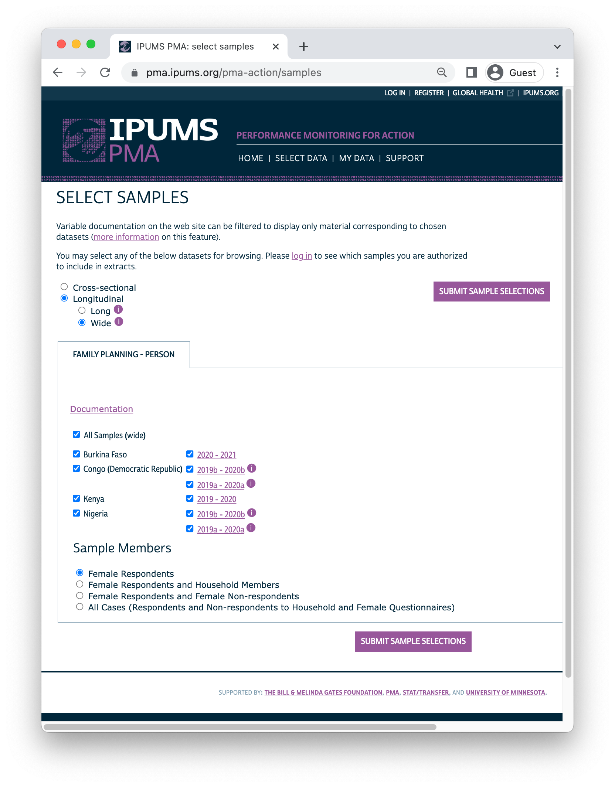

```{r, setup, echo=FALSE}
knitr::opts_chunk$set(
  echo = TRUE, 
  comment = NA, 
  message = FALSE,
  R.options = list(width = 88),
  fig.align = 'center'
)

source("utils/utilities.r")
```

# Preface {.front-matter .unnumbered}

This guide was commissioned and funded by the Family Planning Team at the Bill & Melinda Gates Foundation. The examples here are directly based on the companion [IPUMS PMA data analysis blog](https://tech.popdata.org/pma-data-hub/), with R examples developed by Matt Gunther and IPUMS PMA documentation by Devon Kristiansen under the direction of Kathryn Grace, PhD and Elizabeth Heger Boyle, PhD at IPUMS PMA, University of Minnesota. The Stata version and statistical consulting were provided by Mia Yu and Dale Rhoda at [Biostat Global Consulting](http://www.biostatglobal.com/). These authors are grateful for helpful reviews & comments from Philip Anglewicz, PhD; Linnea Zimmerman, PhD, and Aisha Siewe at Johns Hopkins University. Thanks also to Caitlin Clary, PhD, Mary Kay Trimner, Nina Brooks, PhD, and Finn Roberts for code contributions and review.

#### Suggested Citation {.unnumbered}

Matt Gunther, Mia Yu, Dale Rhoda, and Devon Kristiansen. *IPUMS PMA Longitudinal Analysis Guide for R Users* (November 2022). Minneapolis, MN: IPUMS. [pma.ipums.org](https://pma.ipums.org/pma/)

#### Source Code {.unnumbered}

The code provided in this manual is open source ([© MPL 2.0](https://www.mozilla.org/en-US/MPL/2.0/)). This manual was constructed from [R Markdown](https://rmarkdown.rstudio.com/) files with the `r funlink(pagedown)` package for R.^[`r funlink(pagedown)` © Xie, Yihui et al. (MIT)] These files are available on our [GitHub repository](https://github.com/IPUMS-Global-Health/IPUMS-PMA-Longitudinal-Guide), where you will also find `.r` and `.do` files containing the code shown in this manual. 

The IPUMS PMA data files referenced in this manual are also available at no cost, but you must register and adhere to terms of use at [pma.ipums.org/register](https://pma.ipums.org/pma/register.shtml). Dataset access is granted only for non-commercial purposes. Users must register an account with IPUMS, request access to data from particular countries, and describe their intended use for the data. Users who have been approved for access to certain countries may submit justification to expand their access to other countries. 

[La version française du formulaire d'inscription](https://pma.ipums.org/pma/formulaire_d_inscription.shtml)

#### Revision History  {.unnumbered}

Revisions to this manual are listed by date and accompanied by comments [here](https://github.com/IPUMS-Global-Health/IPUMS-PMA-Longitudinal-Guide/commits/main). **Questions and suggested changes are welcome!** Please submit requests to our [Issues](https://github.com/IPUMS-Global-Health/IPUMS-PMA-Longitudinal-Guide/issues) forum on GitHub.

\newpage 

#### Hyperlinks {.unnumbered}

Hyperlinks to IPUMS PMA variable documentation, relevant R and Stata documentation, and various other resources are highlighted [in pink](https://pma.ipums.org) throughout this manual. If the reader prefers a printed version, they are recommended to compile the manual from source files on our GitHub repository, changing the `r funlink(pagedown)` option described [here](https://pagedown.rbind.io/#links). **Warning:** this will add additional footnotes to the document, and may impact pagination. 

#### Acronyms {.unnumbered}

  - BMGF -	[Bill & Melinda Gates Foundation](https://www.gatesfoundation.org/)
  - CI	- confidence interval
  - CMC	- century month code
  - CONSORT	- [Consolidated Standards of Reporting Trials](www.consort-statement.org)
  - CRAN - [The Comprehensive R Archive Network](https://cran.r-project.org/) (statistical software)
  - CSV	- comma-separated values file format
  - DEFF -	design effect
  - DEFT	- root design effect (square root of DEFF)
  - DRC	- Democratic Republic of Congo
  - EA	- enumeration area
  - FP	- family planning
  - FP2020	- Family Planning 2020
  - FP2030	- [Family Planning 2030](https://fp2030.org/)
  - GPS	- [global positioning system](https://www.gps.gov/)
  - IPUMS	- [Integrated Public Use Microdata Series](https://www.ipums.org/)
  - ISO -	International Organization for Standardization
  - IUD	- intrauterine device
  - LAM	- lactational amenorrhea method of contraception
  - NA	- not available (R notation for a missing data element)
  - NIU	- not in universe
  - PMA	- [Performance Monitoring for Action](https://www.pmadata.org/)
  - PPS -	probability proportional to size
  - SAS	- [statistical analysis system](https://www.sas.com/) (statistical software)
  - SPSS	- [statistical package for social sciences](https://www.ibm.com/spss) (statistical software)
  

# Introduction

```{r, echo=FALSE, results='hide'}
knitr::opts_chunk$set(echo = FALSE)

widef <- read_ipums_micro(
  ddi = "data/pma_00008.xml",
  data = "data/pma_00008.dat.gz"
)
```

[Performance Monitoring for Action (PMA)](https://www.pmadata.org/) uses innovative mobile technology to support low-cost, rapid-turnaround surveys that monitor key health and development indicators.

PMA surveys collect longitudinal data throughout a country at the household and health facility levels by female data collectors, known as resident enumerators, using mobile phones. The survey collects information from the same women and households over time for regular tracking of progress and for understanding the drivers of contraceptive use dynamics. The data are rapidly validated, aggregated, and prepared into tables and graphs, making results quickly available to stakeholders. PMA surveys can be integrated into national monitoring and evaluation systems using a low-cost, rapid-turnaround survey platform that can be adapted and used for various health data needs.

The PMA project is implemented by local partner universities and research organizations who train and deploy the cadres of female resident enumerators.

<aside>
PMA has also published a guide to **cross-sectional** analysis in both [English](https://www.pmadata.org/media/1243/download?attachment) and [French](https://www.pmadata.org/media/1244/download?attachment).
</aside>

The purpose of this manual is to provide guidance on the analysis of **harmonized longitudinal data** for a panel of women age 15-49 surveyed by PMA and published in partnership with [IPUMS PMA](https://pma.ipums.org/pma/). IPUMS provides census and survey products from around the world in an integrated format, making it easy to compare data from multiple countries. IPUMS PMA data are available free of charge, subject to terms and conditions: please [register here](https://pma.ipums.org/pma/register.shtml) to request access to the data featured in this guide.^[PMA data for individual countries is also available at no cost from [pmadata.org](https://www.pmadata.org/). Please note that the variable names, value labels, numeric codes, and other metadata featured in this guide have been altered by IPUMS PMA to facilitate comparison across countries.] 

This manual provides reproducible coding examples in the statistical programming language [R](https://www.r-project.org/). Each chapter also appears as a post on the IPUMS PMA [data analysis blog](https://tech.popdata.org/pma-data-hub/index.html), where you'll find new content posted every two weeks. 

**Stata users:** a companion manual for IPUMS PMA longitudinal analysis is also available with coding examples written in Stata. 

## IPUMS PMA data in R

The first two chapters of this manual introduce new users to [PMA longitudinal data](https://www.pmadata.org/data/survey-methodology) and the [IPUMS PMA website](https://pma.ipums.org/pma/), respectively. After demonstrating how to obtain an IPUMS PMA data extract, the remaining chapters feature extensive data analysis examples written in R. 

<aside class="hex">
```{r}
hex("Rlogo")
```
</aside>

To follow along, you'll need to download the appropriate version of R for your computer's operating system at [r-project.org](https://www.r-project.org/). **R is available at no cost** and it runs on Windows, MacOS, and a wide variety of UNIX platforms. We also recommend downloading a free copy of [RStudio](https://www.rstudio.com/), an integrated development environment (IDE) designed to make your experience with R much easier. 

Individual chapters may introduce one or two **R packages** that provide helpful functions for longitudinal survey analysis, in particular. Two packages we feature in *every* chapter are `r funlink(ipumsr)` and `r funlink(tidyverse)`. You can install these and other packages featured in this guide like so: 

<aside class="hex">
```{r} 
hex("ipumsr")
```
</aside>

```{r, echo=TRUE, eval= FALSE}
install.packages("ipumsr")
install.packages("tidyverse")
```

The `r funlink(ipumsr)` package is designed to help R users import and explore data extracts downloaded from IPUMS. As we'll see, categorical variables from IPUMS require additional tools because they appear as **labelled integers** represented in R by a number and a label like this: 

```{r, echo = FALSE}
widef %>% count(COUNTRY)
```

The `r funlink(tidyverse)` is actually a collection of packages developed in-part by contributors at RStudio. These include: 

<aside class="hex">
```{r} 
hex("tidyverse")
```
</aside>

  - `r funlink(ggplot2)` for data visualization
  - `r funlink(dplyr)` for data manipulation
  - `r funlink(tidyr)` for data tidying
  - `r funlink(readr)` for data import
  - `r funlink(purrr)` for functional programming
  - `r funlink(tibble)` for tibbles, a modern re-imagining of dataframes
  - `r funlink(stringr)` for strings
  - `r funlink(forcats)` for factors
  
#### Featured Data Extracts {.unnumbered}

In subsequent chapters, we will include instructions for requesting data extracts from IPUMS PMA that are identical those used in our analysis. These data are available at no cost, but you must register and adhere to terms of use at [pma.ipums.org/register](https://pma.ipums.org/pma/register.shtml). 

Each data extract that you request from IPUMS PMA is named with a unique number. For example, your very first extract will include a pair of files named `pma_00001.dat.gz` and `pma_00001.xml`. In this guide we reference seven data extracts, but your own file names may vary depending on the number of IPUMS PMA extracts you have requested previously. 

  - `pma_00001.dat.gz` and `pma_00001.xml`
  - `pma_00002.dat.gz` and `pma_00002.xml`
  - `pma_00003.dat.gz` and `pma_00003.xml`
  - `pma_00004.dat.gz` and `pma_00004.xml`
  - `pma_00005.dat.gz` and `pma_00005.xml`
  - `pma_00006.dat.gz` and `pma_00006.xml`
  - `pma_00007.dat.gz` and `pma_00007.xml`
  
As you follow along with each chapter, save each data extract in folder called "data" within your `r funlink(base::setwd, "R working directory")`.

#### Working Directory {.unnumbered}

R users can identify their current working directory with the function `r funlink(base::getwd)` and change it with `r funlink(base::setwd)`. Files within the working directory can be found by R using the **relative path** from this location. For example, we'll load our first data extract into R *assuming* that you have placed it in a folder called "data" within your `r funlink(base::setwd, "R working directory")`. 

```{r, eval=FALSE, echo = TRUE}
dat <- read_ipums_micro(
  ddi = "data/pma_00001.xml",
  data = "data/pma_00001.dat.gz"
)
```

Rstudio users can find all of the code demonstrated in this guide in [this RStudio Project](https://github.com/IPUMS-Global-Health/IPUMS-PMA-Longitudinal-Guide).^[Lean more about RStudio Projects [here](https://support.posit.co/hc/en-us/articles/200526207-Using-RStudio-Projects).] Simply open the file `pma-longitudinal.Rproj` and navigate to the [RMarkdown](https://rmarkdown.rstudio.com/) file `r_users.Rmd` in RStudio - no need to set your own working directory!

\newpage 
#### Learning More {.unnumbered}

This manual focuses exclusively on longitudinal family planning data from IPUMS PMA, but the companion [data analysis blog](https://tech.popdata.org/pma-data-hub/) covers a wide range of topics like: 

  - A free [online course](https://tech.popdata.org/pma-data-hub/introduction.html) for beginners 
  - New data announcements 
  - Data cleaning and reformatting 
  - Data analysis and visualization
  - Spatial analysis 
  - Guides to PMA Service Delivery Point & Client Exit Interview data 
  
Beyond the blog, it's important to know where to find **instructions and examples** for the R packages featured in this guide. Nearly all of these packages have a dedicated website with a homepage, reference page (documentation for individual functions), collection of articles (for general instructions), and change-log (for news about updates). The `r funlink(ipumsr)` page is a great place to start: 

```{r, out.width='75%'}
knitr::include_graphics(here("images/ipumsr_home.png"))
```

Finally, if you're looking for a more general introduction to R, we strongly recommend the following **free resources**: 


  - [R for Data Science](https://r4ds.had.co.nz/index.html) for beginners
  - [Advanced R](https://adv-r.hadley.nz/) for a deeper dive
  - [RSpatial](https://rspatial.org/) for analysis with spatial data
  - [ggplot2](https://ggplot2-book.org/) for data visualization
  - [R Markdown: The Definitive Guide](https://bookdown.org/yihui/rmarkdown/) for producing annotated code, word documents, presentations, web pages, and more
  - [R-bloggers](https://www.r-bloggers.com/) for regular news and tutorials 
  
## PMA Background

Dating back to 2013, the original PMA survey design included high-frequency, **cross-sectional** samples of women and service delivery points collected from eleven countries participating in [Family Planning 2020](http://progress.familyplanning2020.org/) (FP2020) - a global partnership that supports the rights of women and girls to decide for themselves whether, when, and how many children they want to have. These surveys were designed to monitor annual progress towards [FP2020 goals](http://progress.familyplanning2020.org/measurement) via population-level estimates for several [core indicators](http://www.track20.org/pages/data_analysis/core_indicators/overview.php). 

Beginning in 2019, PMA surveys were redesigned under a renewed partnership called [Family Planning 2030](https://fp2030.org/) (FP2030). These new surveys have been refocused on reproductive and sexual health indicators, and they feature a **longitudinal panel** of women of childbearing age. This design will allow researchers to measure contraceptive dynamics and changes in women’s fertility intentions over a **three year period** via annual in-person interviews.^[In addition to these three in-person surveys, PMA also conducted telephone interviews with panel members focused on emerging issues related to the COVID-19 pandemic in 2020. These telephone surveys are already available for several countries - the IPUMS PMA blog series on [PMA COVID-19 surveys](https://tech.popdata.org/pma-data-hub/#category:COVID-19) covers this topic in detail.] 

Questions on the redesigned survey cover topics like:

  * awareness, perception, knowledge, and use of contraceptive methods
  * perceived quality and side effects of contraceptive methods among current users
  * birth history and fertility intentions 
  * aspects of health service provision 
  * domains of empowerment 
  
## Sampling 

PMA panel data includes a mixture of **nationally representative** and **sub-nationally representative** samples. The panel study consists of three data collection phases, each spaced one year apart. 

As of this writing, IPUMS PMA has released data from the first *two* phases for four countries where Phase 1 data collection began in 2019; IPUMS PMA has released data from only the *first* phase for three countries where Phase 1 data collection began in August or September 2020. Phase 3 data collection and processing is currently underway. 

```{r, results='hide', message=FALSE}
library(kableExtra)
options(knitr.kable.NA = '')

avail <- read_csv("utils/sample_avail.csv", show_col_types = F) 
names(avail)[2] <- paste0(
  names(avail)[2], 
  footnote_marker_symbol(1)
)

```
```{r}
avail %>%   
  arrange(Sample) %>% 
  kable(escape = FALSE, format = "html", table.attr = "style='width:100%;'") %>% 
  kable_styling() %>% 
  add_header_above(c(" " = 2, "Now Available from IPUMS PMA" = 3)) %>% 
  scroll_box(
    width = "100%", 
    box_css = paste(
      sep = "; ",
      "margin-bottom: 1em",
      "margin-top: 0em",
      "border: 0px solid #ddd",
      "padding: 5px"
    )
  ) %>%
  footnote(
    symbol = "<em>Each data collection phase is spaced one year apart</em>", 
    escape = FALSE
  )

```

<aside>
**Resident enumerators** are women over age 21 living in (or near) each EA who hold at least a high school diploma.
</aside>

PMA uses a multi-stage clustered sample design, with stratification at the urban-rural level or by sub-region. Sample clusters - called [enumeration areas](https://pma.ipums.org/pma-action/variables/EAID#description_section) (EAs) -- are provided by the national statistics agency in each country.^[[Displaced GPS coordinates](https://tech.popdata.org/pma-data-hub/posts/2021-10-15-nutrition-climate/PMA_displacement.pdf) for the centroid of each EA are available for most samples [by request](https://www.pmadata.org/data/request-access-datasets) from PMA. IPUMS PMA provides shapefiles for PMA countries [here](https://pma.ipums.org/pma/gis_boundary_files.shtml).] These EAs are sampled using a *probability proportional to size* (PPS) method relative to the population distribution in each stratum.

\newpage 

At Phase 1, 35 household dwellings were selected at random within each EA. Resident enumerators visited each dwelling and invited one household member to complete a [Household Questionnaire](https://pma.ipums.org/pma/resources/questionnaires/hhf/PMA-Household-Questionnaire-English-2019.10.09.pdf)^[Questionnaires administered in each country may vary from this **Core Household Questionnaire** - [click here](https://pma.ipums.org/pma/enum_materials.shtml) for details.] that includes a census of all household members and visitors who stayed there during the night before the interview. Female household members and visitors aged 15-49 were then invited to complete a subsequent Phase 1 [Female Questionnaire](https://pma.ipums.org/pma/resources/questionnaires/hhf/PMA-Female-Questionnaire-English-2019.10.09.pdf).^[Questionnaires administered in each country may vary from this **Core Female Questionnaire** - [click here](https://pma.ipums.org/pma/enum_materials.shtml) for details.]

<aside>
`r r_link(SAMEDWELLING)` indicates whether a Phase 2 female respondent resided in her Phase 1 dwelling or a new one. 

`r r_link(PANELWOMAN)` indicates whether a Phase 2 household member completed the Phase 1 Female Questionnaire.  
</aside>

One year later, resident enumerators visited the same dwellings and administered a Phase 2 Household Questionnaire. A panel member in Phase 2 is any woman still age 15-49 who could be reached for a second Female Questionnaire, either because:

  * she still lived there, or
  * she had moved elsewhere within the study area,^[The "study area" is area within which resident enumerators should attempt to find panel women that have moved out of their Phase 1 dwelling. This may extend beyond the woman's original EA as determined by in-country administrators - see [PMA Phase 2 and Phase 3 Survey Protocol](https://www.pmadata.org/data/survey-methodology) for details.] but at least one member of the Phase 1 household remained and could help resident enumerators locate her new dwelling.^[In cases where no Phase 1 household members remained in the dwelling at Phase 2, women from the household are considered **lost to follow-up**. Chapter 3 covers this topic in detail.]
  
Additionally, resident enumerators administered the Phase 2 Female Questionnaire to *new* women in sampled households who:

  * reached age 15 after Phase 1
  * joined the household after Phase 1
  * declined the Female Questionnaire at Phase 1, but agreed to complete it at Phase 2
  
\newpage 

When you select the new **Longitudinal** sample option from IPUMS PMA, you'll be able to include responses from every available phase of the study. These samples are available in either **Long** format (responses from each phase will be organized in separate rows) or **Wide** format (responses from each phase will be organized in columns). 

```{r}
knitr::include_graphics("images/long_radio.png")
```

\newpage 

<aside>
`r r_link(CROSS_SECTION)` indicates whether a household member in a longitudinal sample is also included in the cross-sectional sample for a given year (every person in a cross-sectional sample is included in the longitudinal sample). 
</aside>

In addition to following up with women in the panel over time, PMA also adjusted sampling so that a cross-sectional sample could be produced concurrently with each data collection phase. These samples mainly overlap with the data you'll obtain for a particular phase in the longitudinal sample, except that replacement households were drawn from each EA where more than 10% of households from the previous phase were no longer there. Conversely, panel members who were located in a new dwelling at Phase 2 will not be represented in the cross-sectional sample drawn from that EA. These adjustments ensure that population-level indicators may be derived from cross-sectional samples in a given year, even if panel members move or are lost to follow-up. 

You'll find PMA cross-sectional samples dating back to 2013 if you select the **Cross-sectional** sample option from IPUMS PMA. 

```{r}
knitr::include_graphics("images/cross_radio.png")
```

## Inclusion Criteria for Analysis 

```{r}
knitr::opts_chunk$set(echo = TRUE)
```

Several chapters in this manual feature code you can use to reproduce key indicators included in the **PMA Longitudinal Brief** for each sample. In many cases, you'll find separate reports available in English and French, and for both national and sub-national summaries. For reference, here are the highest-level population summaries available in English for each sample where Phase 2 IPUMS PMA data is currently available:

  * [Burkina Faso](https://www.pmadata.org/sites/default/files/data_product_results/Burkina%20National_Phase%202_Panel_Results%20Brief_English_Final.pdf)
  * [DRC - Kinshasa](https://www.pmadata.org/sites/default/files/data_product_results/DRC%20Kinshasa_%20Phase%202%20Panel%20Results%20Brief_English_Final.pdf)
  * [DRC - Kongo Central](https://www.pmadata.org/sites/default/files/data_product_results/DRC%20Kongo%20Central_%20Phase%202%20Panel%20Results%20Brief_English_Final.pdf)
  * [Kenya](https://www.pmadata.org/sites/default/files/data_product_results/Kenya%20National_Phase%202_Panel%20Results%20Brief_Final.pdf)
  * [Nigeria - Kano](https://www.pmadata.org/sites/default/files/data_product_results/Nigeria%20KANO_Phase%202_Panel_Results%20Brief_Final.pdf)
  * [Nigeria - Lagos](https://www.pmadata.org/sites/default/files/data_product_results/Nigeria%20LAGOS_Phase%202_Panel_Results%20Brief_Final.pdf) 

Panel data in these reports is limited to the *de facto* population of women who completed the Female Questionnaire in both Phase 1 and Phase 2. This includes women who slept in the household during the night before the interview for the Household Questionnaire. The *de jure* population includes women who are usual household members, but who slept elsewhere that night. In order to reproduce the findings from PMA reports, we'll remove *de jure* cases recorded in the variable `r r_link(RESIDENT)`. 

<aside>
We will demonstrate how to request and download an IPUMS PMA data extract in Chapter 2.
</aside>

For example, let's consider a **Wide** format data extract containing Phase 1 and Phase 2 respondents to the Female Questionnaire from Burkina Faso. We've downloaded such an extract and placed it in the "data" sub-folder of our R working directory. We'll load `r funlink(ipumsr)` and `r funlink(tidyverse)` together with our extract. 

```{r, eval = FALSE}
library(ipumsr)
library(tidyverse)

dat <- read_ipums_micro(
  ddi = "data/pma_00001.xml",
  data = "data/pma_00001.dat.gz"
)
```

```{r, echo = FALSE}
# n = 5491 (checked with flowchart)
dat <- widef %>% filter(SAMPLE_1 == 85409)
```  

In a **Wide** format data extract, a numeric suffix indicates the data collection phase associated with each variable. So, the you'll find the the number of women who slept in the household before the Household Questionnaire for each phase reported in `r r_link(RESIDENT_1)` and `r r_link(RESIDENT_2)`. 

\newpage 

This extract includes 174 women who are not members of the *de facto* population because they did not sleep in the sampled household during the night before the Phase 1 interview:
 
```{r}
dat %>% count(RESIDENT_1)
```

The extract also includes 230 women who are not members of the *de facto* population because they did not sleep in the sampled household during the night before the Phase 2 interview: 

```{r}
dat %>% count(RESIDENT_2)
```

Moreover, there are 492 `NA` values in `r r_link(RESIDENT_2)` representing women who were **lost to follow-up** after Phase 1. We will explain **loss to follow-up** in detail in Chapter 3. 

The *de facto* population is represented in codes 11 and 22 in both of these variables. We'll use `r funlink(dplyr::filter)` to include only those cases. 

```{r}
defacto <- dat %>% filter(RESIDENT_1 %in% c(11, 22) & RESIDENT_2 %in% c(11, 22)) 

defacto %>% count(RESIDENT_1, RESIDENT_2)
```

\newpage 

Additionally, PMA reports only include women who completed (or partially completed) both Female Questionnaires. This information is reported in `r r_link(RESULTFQ)`. In our **Wide** extract, this information appears in `r r_link(RESULTFQ_1)` and `r r_link(RESULTFQ_2)`: if you select the **Female Respondents** option at checkout, only women who completed (or partially completed) the Phase 1 Female Questionnaire will be included in your extract. 

```{r, echo = FALSE}
knitr::include_graphics("images/cases1.png")
```

\newpage 

We'll further restrict our sample by selecting only cases where `r r_link(RESULTFQ_2)` shows that the woman also completed the Phase 2 questionnaire. Notice that, in addition to each of the values 1 through 10, there are several **non-response codes** numbered 90 through 99. You'll see similar values repeated across all IPUMS PMA variables, except that they will be left-padded to match the maximum width of a particular variable (e.g. `9999` is used for `r r_link(INTFQYEAR)`, which represents a 4-digit year for the Female Interview). 

```{r}
dat %>% count(RESULTFQ_2)
```

Possible **non-response codes** include: 

  * `95` Not interviewed (female questionnaire)
  * `96` Not interviewed (household questionnaire)
  * `97` Don't know
  * `98` No response or missing 
  * `99` NIU (not in universe)

The value `NA` in an IPUMS PMA extract indicates that a particular variable is not provided for a selected sample. In a **Wide** extract, it may also signify that a particular person was not included in the data from a particular phase. Here, an `NA` appearing in `r r_link(RESULTFQ_2)` indicates that a Female Respondent from Phase 1 was not found in Phase 2.

\newpage 

You can drop incomplete Phase 2 female responses as follows: 

```{r}
completed <- dat %>% filter(RESULTFQ_2 == 1) 

completed %>% count(RESULTFQ_1, RESULTFQ_2)
```

Generally, we will combine both filtering steps together in a single function like so:

```{r}
dat <- dat %>% 
  filter(
    RESIDENT_1 %in% c(11, 22) & RESIDENT_2 %in% c(11, 22),
    RESULTFQ_2 == 1
  ) 
```

In subsequent analyses, we'll use the remaining cases to show how PMA generates key indicators for **contraceptive use status** and **family planning intentions and outcomes**. The summary report for each country includes measures dis-aggregated by demographic variables like:

  * `r r_link(MARSTAT)` - marital status 
  * `r r_link(EDUCATT)` and `r r_link(EDUCATTGEN)` - highest attended level of education^[Levels in `r r_link(EDUCATT)` may vary by country; `r r_link(EDUCATTGEN)` recodes country-specific levels in four general categories.] 
  * `r r_link(AGE)` - age
  * `r r_link(WEALTHQ)` and `r r_link(WEALTHT)` - household wealth quintile or tertile^[Households are divided into quintiles/tertiles relative to the distribution of an asset `r r_link(SCORE, description)` weighted for all sampled households. For sub-nationally-representative samples (DRC and Nigeria), separate wealth distributions are calculated for each sampled region.]
  * `r r_link(URBAN)` and `r r_link(SUBNATIONAL)` - geographic location^[`r r_link(SUBNATIONAL)` includes sub-national regions for all sampled countries; country-specific variables are also available on the [household - geography](https://pma.ipums.org/pma-action/variables/group?id=hh_geo) page.]

## Survey Design Elements

Throughout this guide, we'll demonstrate how to incorporate PMA sampling weights and information about its stratified cluster sampling procedure into your analysis. This section describes how to use survey weights, cluster IDs, and sample strata in R. 

Whether you intend to work with a new **Longitudinal** or **Cross-sectional** data extract, you'll find the same set of sampling weights available for all PMA Family Planning surveys dating back to 2013: 

<aside>
A fourth Family Planning survey weight, `r r_link(POPWT, description)`, is currently available only for **Cross-sectional** data extracts.^[`r r_link(POPWT)` can be used to estimate population-level *counts* - [click here](https://pma.ipums.org/pma/population_weights.shtml) or view [this video](https://www.youtube.com/watch?v=GnCq26t4zgM) for details.] 
</aside>

  * `r r_link(HQWEIGHT, description)` can be used to generate cross-sectional population estimates from questions on the Household Questionnaire.^[`r r_link(HQWEIGHT)` reflects the [calculated selection probability](https://pma.ipums.org/pma/resources/documentation/weighting_memo.pdf) for a household in an EA, normalized at the population-level. Users intending to estimate population-level indicators for *households* should restrict their sample to one person per household via `r r_link(LINENO, description)` - see [household weighting guide](https://pma.ipums.org/pma/weightguide.shtml#hh) for details.]
  * `r r_link(FQWEIGHT, description)` can be used to to generate cross-sectional population estimates from questions on the Female Questionnaire.^[`r r_link(FQWEIGHT)` adjusts `r r_link(HQWEIGHT)` for female non-response within the EA, normalized at the population-level - see [female weighting guide](https://pma.ipums.org/pma/weightguide.shtml#female) for details.]
  * `r r_link(EAWEIGHT, description)` can be used to compare the selection probability of a particular household with that of its EA. 
  
Additionally, PMA created a new weight, `r r_link(PANELWEIGHT, description)`, 
which should be used in longitudinal analyses spanning multiple phases, as it adjusts for loss to follow-up. `r r_link(PANELWEIGHT)` is available only for **Longitudinal** data extracts. 

PMA sample clusters are identified by the variable `r r_link(EAID)`, while sample strata are identified by `r r_link(STRATA)`. We'll demonstrate how to use each of these survey design elements in R below. 

### Set survey design

<aside class="hex">
```{r, echo = FALSE} 
hex("srvyr")
```
</aside>

Throughout this guide, we'll use tools from the `r funlink(srvyr)` package to incorporate survey design elements into our analyses.^[The `r funlink(srvyr)` package is a `r funlink(tidyverse)` implementation of the popular [survey](http://r-survey.r-forge.r-project.org/survey/) package for R, authored by Dr. Thomas Lumley. For thorough discussion of the types of weights available in both R and Stata, we recommend [this blog post](https://notstatschat.rbind.io/2020/08/04/weights-in-statistics/) by Dr. Lumley.] You can install or update `r funlink(srvyr)` from CRAN like so: 

```{r, eval = FALSE, echo = TRUE}
install.packages("srvyr")
```

Load `r funlink(srvyr)` for use in an R session with: 

```{r, eval=FALSE, echo=TRUE}
library(srvyr)
```

Let's return to the **Wide** data extract described in the previous section, which includes Phase 1 and Phase 2 **Female Respondents** from Burkina Faso. In the following example, we'll show how to use IPUMS PMA survey design elements to estimate the proportion of reproductive age women in Burkina Faso who were using contraception at the time of data collection for both Phase 1 and Phase 2. In a **Cross-sectional** or **Long** format longitudinal extract, you'd find this information in the variable `r r_link(CP)`. In the **Wide** extract featured here, you'll find it in `r r_link(CP_1)` for Phase 1, and in `r r_link(CP_2)` for Phase 2. 

Here is how to count the *unweighted* number of sampled women using and not using contraception in both phases. (We drop 5 cases coded 99 for "NIU (not in universe)" in Phase 1). 

```{r}
dat <- dat %>% filter(CP_1 < 90 & CP_2 < 90) 
dat %>% count(CP_1, CP_2)
```

\newpage 

To estimate a population percentage, we'll need to tell `r funlink(srvyr)` that we are working with a sample survey dataset and specify the IPUMS PMA survey design elements. This is accomplished with `r funlink(srvyr::as_survey_design)`: we use `r r_link(PANELWEIGHT)` as the sampling `weight`. We also use `r r_link(EAID_1)` to `id` the sample clusters,^[As we'll see in Chapter 3, women are considered **lost to follow-up** if they moved outside the study area after Phase 1. Therefore, `r r_link(EAID_1)` and `r r_link(EAID_2)` are identical for all panel members: you can use either one to identify sample clusters.] and `r r_link(STRATA_1)` to represent sample `strata`.^[As with `r r_link(EAID)`, you may use either `r r_link(STRATA_1)` or `r r_link(STRATA_2)` if your analysis is restricted to panel members]  

Summary functions like `r funlink(srvyr::survey_mean)` use information from `r funlink(srvyr::as_survey_design)` to derive weighted population estimates with cluster-adjusted standard errors. The argument `vartype = "ci"` reports a cluster-robust 95% confidence interval,^[The confidence level in `r funlink(srvyr::survey_mean)` can be adjusted with `level` (e.g. `level = 0.99)`] while `prop = TRUE` and `prop_method = "logit"` ensure that no estimated proportion includes values beyond 0% and 100%.^[See `r funlink(survey::svyciprop)` for a complete list of available adjustment methods.] 

<aside>
`coef` shows the estimated population proportion

`_low` and `_upp` show the lower and upper bounds of a 95% confidence interval
</aside>

```{r}
dat %>% 
  as_survey_design(
    weight = PANELWEIGHT, 
    id = EAID_1, 
    strata = STRATA_1
  ) %>% 
  summarise(
    survey_mean(
      CP_1 * CP_2,
      vartype = "ci",
      proportion = TRUE,
      prop_method = "logit"
    )
  )
```

Using the survey design information for this sample, we estimate that about 18.8% of all reproductive age women in Burkina Faso were using contraception at the time both Phase 1 and Phase 2 data were collected. We're 95% certain that this value falls between 16.4% and 21.4%. 

### Sample strata for DRC

Importantly, the variable `r r_link(STRATA)` is *not available* for samples collected from DRC - Kinshasa or DRC - Kongo Central. If your extract includes any DRC sample, you'll need to amend this variable to include one unique numeric code for each of those regions.    
 
For example, let's look at a different **Wide** extract, `dat2`, containing all of the samples included in this data release. 

```{r, echo=FALSE}
options(tibble.print_min = 30)
```

```{r, echo = TRUE, results='hide'}
dat2 <- read_ipums_micro(
  ddi = "data/pma_00002.xml",
  data = "data/pma_00002.dat.gz"
)

dat2 <- dat2 %>% 
  filter(
    RESIDENT_1 %in% c(11, 22) & RESIDENT_2 %in% c(11, 22),
    RESULTFQ_2 == 1,
    CP_1 < 90 & CP_2 < 90 
  ) 
```

Notice that `r r_link(STRATA_1)` lists the sample strata for every `r r_link(COUNTRY)` *except* for DRC, where you see the value `NA`. 

```{r}
dat2 %>% filter(is.na(STRATA_1)) %>% count(COUNTRY, STRATA_1)
```

Now let's see what happens when we try to produce population-level estimates with `r r_link(STRATA_1)`: 

```{r, error=TRUE}
dat2 %>%
  as_survey_design(weight = PANELWEIGHT, id = EAID_1, strata = STRATA_1) %>%
  group_by(COUNTRY, GEOCD, GEONG) %>%
  summarise(
    survey_mean(
      CP_1 * CP_2,
      vartype = "ci",
      proportion = TRUE,
      prop_method = "logit"
    )
  )
```

This fails because `r funlink(srvyr::as_survey_design)` encounters `NA` values in `r r_link(STRATA_1)`. Fortunately, we can replace those values with numeric codes from the variable `r r_link(GEOCD)`: 

```{r}
dat2 %>% count(GEOCD)
```

If `r r_link(GEOCD)` is not `NA`, we'll use its numeric code in place of `r r_link(STRATA_1)`. Otherwise, we'd like to leave `r r_link(STRATA_1)` unchanged. However, because both variables include *value labels*, we'll first need remove them with `r funlink(ipumsr::zap_labels)`. To avoid confusion with the original variable `r r_link(STRATA_1)`, we'll call our new variable `STRATARC` (for "strata recoded").

  * `STRATARC` - Numeric codes for PMA sample strata (recoded for DRC samples)

<aside>
Use `r funlink(ipumsr::zap_labels)` to remove all labels from an IPUMS variable.
</aside>
 
```{r}
dat2 <- dat2 %>% 
  mutate(
    STRATARC = if_else(
      is.na(GEOCD), 
      zap_labels(STRATA_1), 
      zap_labels(GEOCD)
    )
  ) 
```

\newpage 

Notice that `STRATARC` replaces the `NA` values in `r r_link(STRATA_1)`, leaving its numeric values unchanged. 

```{r}
dat2 %>% count(GEOCD, STRATA_1, STRATARC)
```

\newpage 

Finally, we can use the updated survey design information to estimate the proportion of women who were using contraception at both Phase 1 and Phase 2 in every sample (including those from Kinshasa and Kongo Central).

```{r, error=TRUE}
dat2 %>% 
  as_survey_design(weight = PANELWEIGHT, id = EAID_1, strata = STRATARC) %>% 
  group_by(COUNTRY, GEOCD, GEONG) %>%
  summarise(
    survey_mean(
      CP_1 * CP_2,
      vartype = "ci",
      proportion = TRUE,
      prop_method = "logit"
    )
  )
```

Now that we've identified variables that describe an IPUMS PMA analytic sample, let's proceed by downloading these and other variables of interest in a data extract from IPUMS PMA. In Chapter 2, we'll see that longitudinal data extracts can be requested in either **Long** or **Wide** format, depending on your needs. 

# Longitudinal Data Extracts

```{r, echo=FALSE, results='hide'}
knitr::opts_chunk$set(
  echo = FALSE, 
  eval = TRUE, 
  out.width = "85%"
)
```

Chapter 2 provides a guided tour of the [IPUMS PMA data extract system](https://pma.ipums.org/pma/), which you may use to combine survey data collected from multiple countries and multiple phases of the longitudinal study. 

IPUMS PMA also makes it easy to switch between multiple [units of analysis](https://pma.ipums.org/pma-action/variables/group) covered in PMA surveys. In addition to the longitudinal data featured in this guide, you'll find surveys representing: 

<aside>
A video tour of the longitudinal extract system is available [here](https://www.youtube.com/embed/VwjYHDvpHk0) on the IPUMS PMA Youtube channel. 
</aside> 

  - [Service Delivery Points (SDPs)](https://tech.popdata.org/pma-data-hub/#category:Service_Delivery_Points)
  - [Client Exit Interviews conducted at SDPs](https://tech.popdata.org/pma-data-hub/#category:Client_Exit_Interviews)
  - Participants in special surveys covering topics like [COVID-19](https://tech.popdata.org/pma-data-hub/#category:COVID-19), [nutrition](https://tech.popdata.org/pma-data-hub/#category:Nutrition), and maternal & newborn health 
  
To get started with a longitudinal data extract, you'll need to select the **Family Planning** topic under the **Person** unit of analysis. 

```{r, out.width="85%"}
knitr::include_graphics("images/unit.png")
```

## Sample Selection

Once you've selected the **Family Planning** option, you'll next need to choose between cross-sectional or longitudinal samples. Cross-sectional samples are selected by default; these are nationally or sub-nationally representative samples collected each year dating backward as far as 2013.

```{r}
knitr::include_graphics("images/cross-sectional.png")
```

Longitudinal samples are only available from 2019 onward, and they include all of the available phases for each sampled country (sub-nationally representative samples for DRC and Nigeria are listed separately). You'll only find longitudinal samples for countries where Phase 2 data has been made available; as of this writing, Phase 1 data for Cote d'Ivoire, India, and Uganda can only be found under the Cross-sectional sample menu.

\newpage 

Clicking the Longitudinal button reveals options for either **Long** or **Wide** format. You'll find the same samples available in either case.

**Important:** if you decide to change formats after selecting variables, your Data Cart will be emptied and you'll need to begin again from scratch.

```{r}
knitr::include_graphics("images/wide.png")
```

\newpage 

After you've selected one of the available longitudinal formats, choose one or more samples listed below. There are also several Sample Members options listed.

```{r}
knitr::include_graphics("images/cases.png")
```

<aside>
`r r_link(PANELWOMAN)` indicates whether an individual is a member of the panel study. 

`r r_link(ELIGIBLE)` indicates whether an individual was eligible for the female questionnaire.
</aside>

**Female Respondents** only includes women who completed *all or part* of a Female Questionnaire. **This option selects all members of the panel study.** In addition, it includes women who only participated in only one phase - we will demonstrate how to identify and drop these cases below.^[Women who completed all or part of the Female Questionnaire in *more than one phase* of the study are considered **panel members**. Women who completed it only at Phase 1 are included in a longitudinal extract, but they are not **panel members**. Likewise, women who completed it for the first time at Phase 2 are included, but are not **panel members** if they 1) will reach age 50 before Phase 3, or 2) declined the invitation to participate again in Phase 3.]  

**Female Respondents and Female Non-respondents** includes all women who were eligible to participate in a Female Questionnaire. Eligible women are those age 15-49 who were listed on the roster collected in a Household Questionnaire. If an eligible woman declined the Female Questionnaire or was not available, variables associated with that questionnaire will be coded "Not interviewed (female questionnaire)".

\newpage 

<aside>
`r r_link(RESULTFQ)` indicates whether an individual completed the Female Questionnaire. 

`r r_link(RESULTHQ)` indicates whether a member of the individual's household completed the Household Questionnaire. 
</aside>

**Female Respondents and Household Members** adds records for all other members of a Female Respondent's household. These household members did not complete the Female Questionnaire, but were listed on the household roster provided by the respondent to a Household Questionnaire. Basic [demographic](https://internal.pma.ipums.org/pma-action/variables/group?id=hh_roster) variables are available for each household member, as are common [wealth](https://internal.pma.ipums.org/pma-action/variables/group?id=hh_wealth), [water](https://internal.pma.ipums.org/pma-action/variables/group?id=water_watersource), [sanitation](https://internal.pma.ipums.org/pma-action/variables/group?id=water_wash), and other variables shared for all members of the same household.  

**All Cases** includes all members listed on the household roster from a Household Questionnaire. If the Household Questionnaire was declined or if no respondent was available, any panel member appearing in other phases of the study will be coded "Not interviewed (household questionnaire)" for variables associated with the missing Household Questionnaire. 

After you've selected samples and sample members for your extract, click the "Submit Sample Selections" button to return to the main data browsing menu.

## Variable Selection

You can browse IPUMS PMA variables by topic or alphabetically by name, or you can [search](https://pma.ipums.org/pma-action/variables/search) for a particular term in a variable name, label, value labels, or description. 

```{r}
knitr::include_graphics("images/topics.png")
```

\newpage 

In this example, we'll select the [Discontinuation of Family Planning](https://pma.ipums.org/pma-action/variables/group?id=fem_fpst) topic. The availability of each associated variable is shown in a table containing all of the samples we've selected. 

  * `X` indicates that the variable is available for *all phases*
  * `/` indicates that the variable is available for *one phase*
  * `-` indicates that the variable is not available for *any phase*
  
You can click the `+` button to add a variable to your cart, or click a variable name to learn more.
  
```{r}
knitr::include_graphics("images/table.png")
```

### Codes 

<aside>
"Case-count view" is not available for longitudinal samples. For cross-sectional samples, this option shows the frequency of each response.
</aside>

Let's take a look at the variable `r r_link(PREGNANT)`. You'll find the variable name and label shown at the top of the page. Below, you'll see several tabs beginning with the [CODES](https://pma.ipums.org/pma-action/variables/PREGNANT#codes_section) tab. For discrete variables, this tab shows all of the available codes and value labels associated with each response. You'll also see the same `X`, `/`, and `-` symbols in a table indicating the availability of each response in each sample.

```{r}
knitr::include_graphics("images/codes-fr.png")
```

\newpage

Above, there are no responses for "Not interviewed (female questionnaire)" and "Not interviewed (household questionnaire)"; this is because only samples members included in a "Female Respondents" extract are displayed by default. If we instead choose "All Cases", this variable will include those response options because we'll include every person listed on the household roster (even if the Household or Female Questionnaire was not completed). 

```{r}
knitr::include_graphics("images/codes-all.png")
```

\newpage

The symbol `/` again indicates that a particular response is available for some - but not all - phases of the study. For `r r_link(PREGNANT)` it indicates that one of the options was either unavailable or was not selected by any sample respondents in a particular phase. If a variable was not included in all phases of the study, all response options will be marked with this symbol. For example, consider the variable `r r_link(COVIDCONCERN)`, indicating the respondent's level of concern about becoming infected with COVID-19.  

```{r}
knitr::include_graphics("images/covidconcern.png")
```

Because Phase 1 questionnaires were administered prior to the emergence of COVID-19, this variable only appeared on Phase 2 questionnaires. The symbol `/` indicates limited availability across phases. 

### Variable Description

You'll find a detailed description for each variable on the [DESCRIPTION](https://pma.ipums.org/pma-action/variables/PREGNANT#description_section) tab. This tab also indicates whether a particular question appeared on the Household or Female Questionnaire.

```{r}
knitr::include_graphics("images/desc.png")
```

### Comparability Notes

The [COMPARABILITY](https://pma.ipums.org/pma-action/variables/PREGNANT#comparability_section) tab describes important differences between samples. Additionally, it may contain information about similar variables appearing in [DHS](https://dhsprogram.com/) samples provided by [IPUMS DHS](https://www.idhsdata.org/idhs/). 

```{r}
knitr::include_graphics("images/comp.png")
```

### Sample Universe

The [UNIVERSE](https://pma.ipums.org/pma-action/variables/PREGNANT#universe_section) tab describes selection criteria for this question. In this case, there are some differences between samples: 

  * In DRC samples, all women aged 15-49 received this question.
  * For all other samples, the question was skipped if any such woman previously indicated that she was menopausal or had a hysterectomy.
  
```{r}
knitr::include_graphics("images/universe.png")
```

### Availability Across Samples

The [AVAILABILITY](https://pma.ipums.org/pma-action/variables/PREGNANT#availability_section) tab shows all other samples (including cross-sectional samples) where this variable is available. 

```{r}
knitr::include_graphics("images/avail.png")
```

### Questionnaire Text 

Finally, you'll find the full text of each question on the [QUESTIONNAIRE TEXT](https://pma.ipums.org/pma-action/variables/PREGNANT#questionnaire_text_section) tab. Each phase of the survey is shown separately, and you may click the "view entire document: text" link to view the complete questionnaire for a particular sample in any given phase. 

```{r}
knitr::include_graphics("images/question.png")
```

### Checkout 

Use the buttons at the top of this page to add the variable to your Data Cart, or to "VIEW CART" and begin checkout. 

```{r, fig.align='center'}
# knitr::include_graphics("images/buttons.png")
htmltools::img(
  src = "images/buttons.png",
  style = 
    "margin-top: 20px; margin-bottom: 25px; max-width: 100%; width: 1033px;"
)
```

## Data for R Users

Your Data Cart shows all of the variables you've selected, plus several "preselected" variables that will be automatically included in your extract. Click the "CREATE DATA EXTRACT" button to prepare your download. 

```{r}
knitr::include_graphics("images/cart.png")
```

### Select a Fixed-width File

Before you submit an extract request, you'll have the opportunity to choose a "Data Format". **R users should select a Fixed-width text file (.dat)** - you'll notice that data formatted for Stata, SPSS, and SAS are also available. CSV files are provided, but not recommended. (If you wish to change Sample Members, you may do so again here.) 

```{r}
knitr::include_graphics("images/checkout1.png")
```

Once the Fixed-width option is selected, you may add a description and then proceed to the download page.

### Download 

After a few moments, you'll receive an email indicating that your extract has been created. You'll need to obtain two files from the download page: 

  * Click the green "Download DAT" button to download the data file. You'll receive a file with a number like `pma_00003.dat.gz`.  
  * Right click on "DDI" and click "Save link as". You'll receive a corresponding XML file like `pma_00003.xml`. 


```{r, fig.align='center'}
# knitr::include_graphics("images/download.png")
htmltools::img(
  src = "images/download.png", 
  style = "margin-top: 20px; margin-bottom: 25px;"
)
```

Place both files in a folder that R can use as its [working directory](https://r4ds.had.co.nz/workflow-projects.html?q=working%20directory#where-does-your-analysis-live). We **strongly recommend** using [RStudio projects](https://r4ds.had.co.nz/workflow-projects.html?q=working%20directory#rstudio-projects) to manage all of the files and analysis scripts used for a particular research project. We'll place our files in a sub-folder called "data" within our own RStudio project folder. 

Open RStudio (or R) and load the packages `r funlink(ipumsr)` and `r funlink(tidyverse)`. If you are not using an RStudio project, you will need to change your working directory to match the location of your downloaded files. 

```{r, eval=FALSE, echo=TRUE}
library(ipumsr)
library(tidyverse)
setwd("~/Downloads") # ONLY if not using an RStudio project (change as needed)
```

We’ll now demonstrate loading both a long and a wide extract, and we’ll take a brief look at the structure of each.

```{r}
knitr::opts_chunk$set(echo = TRUE, eval = TRUE)
options(tibble.print_min = 12)
```

## Long Data Structure

We've downloaded a **Long** data extract (**Female Respondents** only) and saved it in a folder called "data" in our working directory. We'll now load it into R as an object called `long`. 

To load an IPUMS PMA extract into R, you'll need to reference *both* the DDI file *and* the fixed-width data file in the function `r funlink(ipumsr::read_ipums_micro)` from `r funlink(ipumsr)`.

```{r, results='hide'}
long <- read_ipums_micro(
  ddi = "data/pma_00003.xml",
  data = "data/pma_00003.dat.gz"
)
```

In a **Long** extract, data from each phase will be organized in *separate rows*. Here, responses from three panel members are shown: 

```{r}
long %>% 
  filter(FQINSTID %>% str_starts("011") | FQINSTID %>% str_starts("015")) %>% 
  arrange(FQINSTID) %>% 
  select(FQINSTID, PHASE, AGE, PANELWOMAN)
```

Each panel member receives a unique ID shown in `r r_link(FQINSTID)`. The variable `r r_link(PHASE)` shows that each woman's responses to the Phase 1 Female Questionnaire appears in the first row, while her Phase 2 responses appear in the second. `r r_link(AGE)` shows each woman's age when she completed the Female Questionnaire for each phase.

`r r_link(PANELWOMAN)` indicates whether the woman completed all or part of the Female Questionnaire in a *prior* phase, and that she'd agreed to continue participating in the panel study at that time. The value `NA` appears in the rows for Phase 1, as `r r_link(PANELWOMAN)` was not included in Phase 1 surveys. 

\newpage 

We mentioned above that you'll also include responses from some non-panel members when you request an extract with **Female Respondents**. These include women who did not complete all or part the Female Questionnaire in a prior phase, as indicated by `r r_link(PANELWOMAN)`. These women are not assigned a value for `r r_link(FQINSTID)` - instead, you'll find an empty string:

```{r}
long %>% count(PHASE, PANELWOMAN, FQINSTID == "")
```

Chapter 1 describes **Inclusion Criteria for Analysis** and shows how to identify women in a **Wide** extract who did not complete the Female Questionnaire in both phases. In **Long** format, we use `r funlink(dplyr::group_by)` to ensure that there is one row for every `r r_link(FQINSTID)` where `PHASE == 1` and another row where `PHASE == 2 & RESULTFQ == 1`. 

```{r}
long <- long %>% 
  group_by(FQINSTID) %>% 
  filter(any(PHASE == 1) & any(PHASE == 2 & RESULTFQ == 1)) %>% 
  ungroup() 
```

The *de facto* population is identified where `r r_link(RESIDENT)` takes the value `11` or `22` in both rows. 

```{r}
long <- long %>% 
  group_by(FQINSTID) %>% 
  filter(all(RESIDENT %in% c(11, 22))) %>% 
  ungroup() 
```

\newpage 

Following these steps, you can check the size of each analytic sample like so. (Reminder: samples for DRC and Nigeria are sub-nationally representative, so we'll show separate frequencies for each `r r_link(GEOCD)` and `r r_link(GEONG)`). 

```{r}
long %>% count(COUNTRY, GEOCD, GEONG, PHASE)
```

## Wide Data Structure

We've also downloaded a **Wide** data extract (**Female Respondents** only) and saved it in the "data" folder in our working directory. We'll also load this extract into R as an object named `wide`. 

```{r, results='hide', eval = TRUE}
wide <- read_ipums_micro(
  ddi = "data/pma_00004.xml",
  data = "data/pma_00004.dat.gz"
)
```

In a **Wide** extract, all of the responses from one woman appear in the *same row*. The IPUMS PMA extract system appends a numeric suffix to each variable name corresponding with the phase from which it was drawn. Consider our three example panel members again: 

```{r}
wide %>% 
  filter(FQINSTID %>% str_starts("011") | FQINSTID %>% str_starts("015")) %>% 
  select(FQINSTID, AGE_1, AGE_2, PANELWOMAN_1, PANELWOMAN_2)
```

Each panel member has one unique ID shown in `r r_link(FQINSTID)`. However, `r r_link(AGE)` is parsed into two columns: `r r_link(AGE_1)` shows each woman's age at Phase 1, and `r r_link(AGE_2)` shows her age at Phase 2. 

As we've discussed, `r r_link(PANELWOMAN)` is not available for Phase 1, as it indicates whether the woman completed all or part of the Female Questionnaire in a *prior* phase. For this reason, all values in `r r_link(PANELWOMAN_1)` are `NA`. Most variables are copied once for each phase, even if they - like `r r_link(PANELWOMAN_1)` - are not available for all phases. 

\newpage 

You might expect the total length of a **Wide** extract to be half the length of a corresponding **Long** extract. This is not the case! A **Wide** extract includes one row for each woman who completed all or part of the Female Questionnaire *for any phase* - you'll find placeholder columns for phases where the interview was not conducted. 

```{r}
wide %>% 
  filter(FQINSTID == "0C8VQU6B03BXLAVVZ8SB90EKQ") %>% 
  select(RESULTFQ_1, AGE_1, RESULTFQ_2, AGE_2)
```

In a **Long** extract, rows for the missing phase are dropped. In this example, the woman was "not at home" for the Phase 2 Female Questionnaire. When we select a **Long** extract containing only Female Respondents, her Phase 2 row is excluded automatically (it will be included if you request an extract containing **Female Respondents and Female Non-respondents**). 

```{r, results='hide', echo = FALSE}
long <- read_ipums_micro(
  ddi = "data/pma_00003.xml",
  data = "data/pma_00003.dat.gz"
)
```

```{r}
long %>% 
  filter(FQINSTID == "0C8VQU6B03BXLAVVZ8SB90EKQ") %>% 
  select(PHASE, RESULTFQ, AGE)
```

The **Inclusion Criteria for Analysis** section in Chapter 1 shows how to identify members of the *de facto* population who completed the Female Questionnaire in both phases for a **Wide** extract. Those steps are repeated here: 

```{r}
wide <- wide %>% 
  filter(
    RESIDENT_1 %in% c(11, 22) & RESIDENT_2 %in% c(11, 22),
    RESULTFQ_2 == 1
  )  
```

\newpage 

Following these steps, each analytic sample contains the same number of cases shown in the final **Long** format extract above. 

```{r}
wide %>% count(COUNTRY, GEOCD, GEONG) 
```

## Which format is best for me? 

The choice between **Long** and **Wide** formats ultimately depends on your research objectives. 

Many data manipulation tasks, for example, are faster and easier to perform in the **Wide** format. In the example above, we needed to identify women who completed a Female Questionnaire and were members of the *de facto* population in both phases. In the **Long** format, we first had to group the data by `r r_link(FQINSTID)` with `r funlink(dplyr::group_by)`, thereby ensuring that a Phase 1 and Phase 2 check could be performed for each woman. In preparing for this post, this approach took about 36.5 seconds. By comparison, the same task was achieved without `r funlink(dplyr::group_by)` in **Wide** format in just 0.16 seconds. If your workflow requires multiple comparisons between phases, the **Wide** format may be the best choice! 

On the other hand, many of the longitudinal modeling packages available for R require data to be in a **Long** format - this includes both the `r funlink(survival)` package used in Chapter 6 and the `r funlink(lme4)` package for multilevel models. Users who prefer the **Wide** format for data cleaning and exploration can manually switch to **Long** format with help from `r funlink(tidyr::pivot_longer)`, for example:

```{r}
wide %>% select(FQINSTID, AGE_1, PREGNANT_1, AGE_2, PREGNANT_2)
```

\newpage 

With `r funlink(tidyr::pivot_longer)`, you can strip the suffix `1` or `2` from each variable, placing the result in a new column called `PHASE`. Then, we'll pivot each woman's age and pregnancy status from 2 **Wide** columns into a single **Long** one. 

<aside>
We will revisit  `r funlink(tidyr::pivot_longer)` when analyzing PMA Contraceptive Calendar data in Chapter 6.
</aside>

```{r}
wide %>% 
  select(FQINSTID, AGE_1, PREGNANT_1, AGE_2, PREGNANT_2) %>% 
  pivot_longer(
    !FQINSTID, 
    names_pattern = "(.*)_([1-2])",
    names_to = c(".value", "PHASE")
  )
```

Manipulating patterns in variable names with  `r funlink(tidyr::pivot_longer)` takes practice, and we imagine many users will find it easier to simply work with data in the **Long** format from the beginning.

Fortunately, the IPUMS PMA extract system makes it easy to select the samples, sample members, and variables that matter to your particular research question. Choices for **Long** and **Wide** data formats save an additional data cleaning step, allowing you to jump into longitudinal analysis as quickly as possible. 

# Panel Membership 

In Chapter 1, we mentioned that PMA uses a **multi-stage cluster sample design** for each phase of the panel study. This means you'll find data from a Household Questionnaire administered once each year, and you'll find data from a subsequent Female Questionnaire collected shortly afterward. Three years - or phases - of data will be collected in total. 

Because data are collected through two questionnaires administered in three phases, there are several places where incomplete or missing data may indicate **loss to follow-up** - dropped cases from the original panel design. At the same time, PMA uses an **open panel** design, whereby women who move into the study area or reach participation age after Phase 1 are permitted to join the panel at any subsequent phase. 

In Chapter 3, we'll cover these issues in detail. To illustrate, we'll be using a **Wide** format data extract from IPUMS PMA that includes **All cases** from both currently available phases. In other words, we'll include every member of the household roster collected in the Household Questionnaire at the start of each phase (even if no Female Questionnaire was completed by that person). 

<aside>
R code showing how to build a combined CONSORT diagram with `r funlink(ggplot2)` is available on the [IPUMS PMA data analysis blog](https://tech.popdata.org/pma-data-hub/posts/2022-04-01-phase2-members/).
</aside>

To make our explanation easier to follow, we'll make use of a data visualization tool known in clinical research settings as a [CONSORT diagram](http://www.consort-statement.org/consort-statement/flow-diagram). This type of diagram is a flowchart showing enrollment and attrition points, most typically in longitudinal studies. PMA publishes a CONSORT diagram together with the User Notes for each longitudinal sample, which you can find via the links below:

  * [Burkina Faso](https://pma.ipums.org/pma/resources/longitudinal_flowcharts/Burkina_Faso_panel_phase2.pdf)
  * [DRC - Kinshasa](https://pma.ipums.org/pma/resources/longitudinal_flowcharts/Kinshasa_panel_phase2.pdf)
  * [DRC - Kongo Central](https://pma.ipums.org/pma/resources/longitudinal_flowcharts/Kongo_Central_panel_phase2.pdf)
  * [Kenya](https://pma.ipums.org/pma/resources/longitudinal_flowcharts/Kenya_panel_phase2.pdf)
  * [Nigeria - Lagos](https://pma.ipums.org/pma/resources/longitudinal_flowcharts/Lagos_panel_phase2.pdf)
  * [Nigeria - Kano](https://pma.ipums.org/pma/resources/longitudinal_flowcharts/Kano_panel_phase2.pdf)
  
We've constructed a single diagram showing all six samples available from IPUMS PMA, and we'll demonstrate how to identify cases for each level in turn:

\newpage

```{r, echo=FALSE, out.width="100%"}
knitr::include_graphics(here("images/consort.png"))
```

## Chapter Setup

This chapter features a **Wide** longitudinal extract with all 6 of the available samples, including **All Cases** (Respondents and Non-respondents to Household and Female Questionnaires). As mentioned in Chapter 2, both phases are included with each sample when you request a longitudinal extract.

```{r, echo=FALSE, out.width="85%"}
knitr::include_graphics("images/select-samples2.png")
```

\newpage 

Variables describing sample composition are located under the "Technical" topics heading. Our extract will contain all of the variables in the [Technical Variables](https://pma.ipums.org/pma-action/variables/group?id=tech_techvar) and [Longitudinal Panel](https://pma.ipums.org/pma-action/variables/group?id=tech_panel) subheadings shown:

```{r, echo=FALSE}
knitr::include_graphics("images/technical.png")
```

Once you've finished selecting variables and downloaded an extract, you'll receive two files: an `.xml` DDI codebook, and a `.dat.gz` data file. We've saved both of these files in a folder called "data" in our R Working Directory, so we'll load them into R together with the `r funlink(tidyverse)` and `r funlink(ipumsr)` packages described in Chapter 1.

```{r, results='hide'}
library(ipumsr)
library(tidyverse)

dat <- read_ipums_micro(
  ddi = "data/pma_00005.xml",
  data = "data/pma_00005.dat.gz"
)
```

\newpage 

We mentioned in Chapter 1 that variables in a **Wide** extract include a numeric suffix corresponding with a data collection phase. For example, you'll find two versions of `r r_link(SAMPLE)`: `r r_link(SAMPLE_1)` represents the sample codes for Phase 1:

```{r}
dat %>% count(SAMPLE_1)
```

Whereas `r r_link(SAMPLE_2)` represents the sample codes for Phase 2:

```{r}
dat %>% count(SAMPLE_2)
```

\newpage 

We also mentioned in Chapter 1 that IPUMS PMA combines sub-nationally representative samples for DRC (Kinshasa and Kongo Central) and Nigeria (Kano and Lagos) with one `r r_link(SAMPLE)` code each. Here, we'll separate those samples and abbreviate country names. Let's call this variable `POP` (for "population of interest"). 

  * `pop` - Population of interest 

We'll combine the `r r_link(COUNTRY)` name for each sample together with the DRC and Nigeria regions labelled in `r r_link(GEOCD)` and `r r_link(GEONG)`, respectively. 

```{r}
dat <- dat %>% 
  mutate(POP = case_when(
    !is.na(GEOCD) ~ paste("DRC -", as_factor(GEOCD)),
    !is.na(GEONG) ~ paste("Nigeria -", as_factor(GEONG)),
    TRUE ~ as_factor(COUNTRY) %>% as.character()
  ))

dat %>% count(POP)
```

## Phase 1 

Phase 1 marks the beginning of the PMA panel study (baseline). As we've mentioned, it consists of two separate questionnaires administered in stages: first, resident enumerators visited 35 household dwellings selected at random within each sample cluster, or **enumeration area** (EA). If a qualifying respondent was available, they were invited to complete a [Household Questionnaire](https://pma.ipums.org/pma/resources/questionnaires/hhf/PMA-Household-Questionnaire-English-2019.10.09.pdf)^[Questionnaires administered in each country may vary from this **Core Household Questionnaire** - [click here](https://pma.ipums.org/pma/enum_materials.shtml) for details.] including a census of all household members and visitors who stayed there during the night before the interview. If this census included any women aged 15-49, the enumerator would later return to the household and invite each eligible woman to complete a  [Female Questionnaire](https://pma.ipums.org/pma/resources/questionnaires/hhf/PMA-Female-Questionnaire-English-2019.10.09.pdf)^[Questionnaires administered in each country may vary from this **Core Female Questionnaire** - [click here](https://pma.ipums.org/pma/enum_materials.shtml) for details.] and participate in the three-year panel study. 

We'll take a look at the inclusion criteria and missing data codes for each questionnaire, in turn. 

### Household Questionnaire

In our **Wide** data extract, each `r r_link(PANELWOMAN)` is a woman who completed all or part of the Phase 1 Female Questionnaire and agreed to participate in the longitudinal panel study: as a result, you'll find all of her Phase 1 responses and her Phase 2 responses together in *a single row*. 

This is *not* the case for household members who are not, themselves, participants in the panel study. These household members are represented by *one row per phase*. For example, if a young child was listed on the Phase 1 Household Questionnaire, you'll find details about their age in  `r r_link(AGEHQ_1)`, their sex in `r r_link(SEX_1)`, and their relationship to the head of household in `r r_link(RELATE_1)`. If you look in the same row for corresponding Phase 2 variables (`r r_link(AGEHQ_2)`, `r r_link(SEX_2)`, and `r r_link(RELATE_2)`), you'll find `NA` values even if the child still lived in the household at Phase 2: their Phase 2 data may be located in another row (with `NA` values listed for Phase 1), or it may not exist if the child was not listed on the Phase 2 household roster. It is not possible to link Phase 1 and Phase 2 responses for household members who were not participants in the panel study.

This explains why, for example, you'll see a large number of `NA` values in `r r_link(RESULTHQ_1)`, which gives the result of the Phase 1 Household Questionnaire. 

```{r}
dat %>% count(RESULTHQ_1)
```

Close to half of the values in `r r_link(RESULTHQ_1)` are `NA`: these are household members for whom no linked Phase 2 data exists. 

\newpage 

What about the other values in `r r_link(RESULTHQ_1)`? You'll notice a range of outcomes including: 

  * `1` - Completed
  * `5` - Partly completed 
  * several other codes giving the reason why no household interview occurred 
  
If no household interview occurred, PMA creates one row to represent the household in `r r_link(RESULTHQ_1)`. Otherwise, if the household roster was completed during the interview, PMA creates one row for each person on the roster. 

In order to determine the proportion of households that completed all or part of the Household Questionnaire - or any other **household-level statistics** - you must count only one row per household. Each Phase 1 household receives a unique identifier in `r r_link(HHID_1)` - this value is an empty string `""` for household members included only in Phase 2. All Phase 1 households have a unique `r r_link(HHID_1)`, regardless of the outcome recorded in `r r_link(RESULTHQ_1)`.

Therefore, you can use `r funlink(dplyr::group_by)` to find the `r r_link(RESULTHQ_1)` outcome for each household via `r r_link(HHID_1)`. To obtain the proportion of Phase 1 households that completed all or part of the questionnaire, we'll first use `r funlink(dplyr::filter)` to drop Phase 2 households with the value `""`. Then, we'll use `r funlink(dplyr::slice)` to include only the first row in each household. Finally, we'll count the number of fully (code 1) or partly (code 5) completed questionnaires in `r r_link(RESULTHQ_1)` - the base R function `r funlink(base::prop.table)` derives proportions for these counts. 

<aside>
Across samples, 96.4% of households completed all or part of the Phase 1 Household Questionnaire. 
</aside>

```{r}
dat %>% 
  filter(HHID_1 != "") %>% # drop Phase 2 households
  group_by(HHID_1) %>%     
  slice(1) %>%  # include only one row per household
  ungroup() %>%            
  count(RESULTHQ_1 %in% c(1, 5)) %>% 
  mutate(prop = prop.table(n))
```

\newpage

<aside>
Total number of Phase 1 household members, per sample
</aside>

It is also often useful to exclude non-interviewed households when calculating **person-level statistics**. In the first row of our CONSORT diagram above, we drop these households before we count the total number of sampled Phase 1 household members. 

```{r}
dat %>%
  filter(RESULTHQ_1 %in% c(1, 5)) %>% 
  count(POP)
```

### Female Questionnaire 

IPUMS PMA uses a **non-response code** labeled "Not interviewed (household questionnaire)" for variables related to questions that were only relevant if the Household Questionnaire was fully or partly completed. This includes `r r_link(ELIGIBLE_1)`, which indicates whether a particular household member was a woman aged 15-49 at Phase 1, and therefore eligible for the Phase 1 Female Questionnaire. If the household was not interviewed, eligibility for the Female Questionnaire could not be determined.

```{r, R.options = list(width = 100)}
dat %>% count(RESULTHQ_1, ELIGIBLE_1)
```

`r r_link(RESULTLFQ_1)` shows the result of the Female Questionnaire for eligible women. The **non-response code** "NIU (not in universe)" is used for household members who were not eligible. 

```{r, eval = FALSE}
dat %>% count(RESULTFQ_1)
```
```{r, echo = FALSE}
# data entry error: code 95 is invalid 
dat %>% 
  filter(RESULTFQ_1 != 95 | is.na(RESULTFQ_1)) %>% 
  count(RESULTFQ_1)
```

\newpage 

<aside>
Across samples, 96.9% of eligible women completed the Phase 1 Female Questionnaire.
</aside>

You can calculate the proportion of eligible women who completed the Phase 1 Female Questionnaire like so: 

```{r}
dat %>% 
  filter(ELIGIBLE_1 == 1) %>% # drop if ineligible 
  count(RESULTFQ_1 %in% c(1, 5)) %>% 
  mutate(prop = prop.table(n))
```

Our CONSORT diagram shows the total number of women who were eligible to participate in the panel study at Phase 1, after excluding women who:
  
<aside>
Total number of eligible women, per sample, who completed all or part of the Phase 1 Female Questionnaire 
</aside>

  * were members of a household where no Phase 1 Household Questionnaire was administered
  * were not eligible (aged 15-49)
  * did not complete at least part of the Phase 1 Female Questionnaire 

```{r}
dat %>% 
  filter(RESULTFQ_1 %in% c(1, 5)) %>% 
  count(POP)
```

\newpage 

Enumerators invited these women to participate in Phase 2 of the panel study one year later. Only women who agreed to participate at that time are considered panel members at Phase 2, as shown in `r r_link(PANELWOMAN_2)`.^[Women who completed the Phase 1 Female Questionnaire but declined to participate in the panel were given an opportunity to join the panel again at Phase 2 (if eligible). They are not panel members as shown in `r r_link(PANELWOMAN_2)`, but they may be listed as such in `r r_link(PANELWOMAN_3)` if they agree to participation in the panel going forward.] 

<aside>
Total number of women, per sample, who consented at Phase 1 to the Phase 2 follow-up
</aside>

Their responses to the panel invitation are recorded in `r r_link(SURVEYWILLING_1)`. IPUMS PMA uses the **non-response code** "Not interviewed (female questionnaire)" to indicate women who were eligible, but not interviewed for the Female Questionnaire as shown in `r r_link(RESULTLFQ_1)`. Additionally, "No response or missing" is used for women who did not respond to the panel invitation. 

```{r}
dat %>% 
  filter(SURVEYWILLING_1 == 1) %>% 
  count(POP)
```

<aside class="nudge_down">
Across samples, 95.4% of women who completed the Phase 1 Female Questionnaire agreed to participate in panel follow-ups one year later. 
</aside>

Make sure to include "No response or missing" cases in the denominator when calculating the proportion of Phase 1 female respondents who agreed to participate in the panel follow-up: 

```{r}
dat %>% 
  filter(RESULTFQ_1 %in% c(1, 5)) %>% 
  count(SURVEYWILLING_1) %>% 
  mutate(prop = prop.table(n))
```


## Phase 2 

Both questionnaires were administered again in Phase 2, approximately one year after Phase 1. Resident enumerators visited the same dwellings where Phase 1 interviews occurred; if the woman's household had moved elsewhere within the study area,^[The “study area” is area within which resident enumerators should attempt to find panel women that have moved out of their Phase 1 dwelling. This may extend beyond the woman’s original EA as determined by in-country administrators - see [PMA Phase 2 and Phase 3 Survey Protocol](https://www.pmadata.org/data/survey-methodology) for details.] enumerators used local contacts to find its new location. If found, they administered a Household Questionnaire including an updated household roster.

As we've mentioned, any woman aged 15-49 listed on the Phase 2 household roster was eligible to complete a Phase 2 Female Questionnaire. However, only women who completed all or part of a Phase 1 Female Questionnaire are considered members of the panel in `r r_link(PANELWOMAN_2)`. 

### Household Questionnaire

Several variables are available to describe the [status of households](https://pma.ipums.org/pma-action/variables/group?id=tech_panel) surveyed at Phase 2. As with Phase 1, `r r_link(RESULTHQ_2)` describes the result of the Phase 2 Household Questionnaire. 

```{r}
dat %>% count(RESULTHQ_2)
```

`r r_link(SAMEDWELLING_2)` indicates whether the Household Questionnaire was administered at the same physical dwelling from Phase 1, or whether the enumerator located the woman's household in a new dwelling. 

```{r}
dat %>% count(SAMEDWELLING_2)
```

\newpage 

Each Phase 2 sample may also include new households that were not included in Phase 1, as indicated by `r r_link(HHTYPE_2)`: these are replacement households drawn for enumeration areas where more than 10% of Phase 1 households were no longer present. They account for all of the **non-response code** shown in `r r_link(SAMEDWELLING_2)`, as no prior dwelling was sampled. 

```{r, R.options = list(width = 100)}
dat %>% count(SAMEDWELLING_2, HHTYPE_2)
```

As mentioned above, it is not possible to link Phase 1 and Phase 2 records for household members who were not women participating in the panel study. However, the variable `r r_link(HHMEMSTAT_2)` does describe whether a Phase 1 household member was listed on the household roster for Phase 2; if not, PMA creates a Phase 2 record for that person indicating whether they moved or were deceased.

```{r}
dat %>% count(HHMEMSTAT_2)
```

\newpage 

After excluding women who reached age 50 at Phase 2, our CONSORT diagram diverges to show whether panel members were found in their Phase 1 dwelling or a new one. Women whose household was not found in the study area are considered **lost to follow-up**, as are those where the Phase 2 Household Questionnaire was not completed. 

The variable `r r_link(HHPANELP2_2)` indicates whether any woman who completed the Phase 1 Female Questionnaire was living in the dwelling at Phase 2. Women who were no longer residents of the household are also considered **lost to follow-up**. 

```{r}
dat %>% count(HHPANELP2_2)
```

### Female Questionnaire 

Finally, eligible women who were found in a household at Phase 2 were invited to complete a Female Questionnaire. `r r_link(RESULTFQ_2)` indicates the result of the Phase 2 Female Questionnaire both for panel members and women who were otherwise eligible to participate. 

```{r}
dat %>% count(RESULTFQ_2)
```

<aside class="nudge_down">
Across samples, 73.4% of women completing the Phase 2 Female Questionnaire also did so at Phase 1. 

26.6% are newcomers at Phase 2.
</aside>

You can find the proportion of women who completed the Phase 2 Female Questionnaire that were also available at Phase 1 (i.e. panel members) like so:

```{r}
dat %>% 
  filter(RESULTFQ_2 == 1) %>% 
  count(PANELWOMAN_2) %>% 
  mutate(prop = prop.table(n))
```

**Wide** data extracts make it particularly easy to combine Phase 1 and Phase 2 variables for the same woman. Note that potential panel members were identified at Phase 1: they are women who agreed to participate in `r r_link(SURVEYWILLING_1)` and were under age 49 in `r r_link(AGE_1)`. In order to calculate the proportion of potential panel members who ultimately completed the Female Questionnaire at Phase 2, you must include Phase 1 female respondents for whom no Phase 2 data exists. 

\newpage 

<aside>
Across samples, 81.7% of potential panel members completed the Phase 2 Female Questionnaire. 
</aside>

These cases are marked `NA` in `r r_link(RESULTFQ_2)`, so they are easily included like so:

```{r}
dat %>% 
  filter(SURVEYWILLING_1 == 1 & AGE_1 < 49) %>% 
  count(RESULTFQ_2 == 1) %>% 
  mutate(prop = prop.table(n))
```

<aside class="nudge_down">
Total number and proportion of potential panel members, per Phase 1 sample, that ultimately completed a Phase 2 Female Questionnaire
</aside>

The final row of our CONSORT diagram shows the total number of completed Phase 2 Female Questionnaires for each sample. The totals below match the results reported in each of the PMA User Guides published for individual samples.

```{r}
dat %>% 
  group_by(POP) %>% 
  filter(SURVEYWILLING_1 == 1 & AGE_1 < 49) %>% 
  count(final = RESULTFQ_2 == 1) %>% 
  mutate(prop = prop.table(n)) %>% 
  filter(final) %>% 
  select(-final)
```

## Summary 

There are ultimately several causes of **loss to follow-up** that may occur at different time points throughout the panel study. An individual is considered **lost to follow-up** if: 

  1. The household moved out of the Phase 1 dwelling, and the new dwelling could not be located within the study area 
  2. The Phase 2 Household Questionnaire was not completed (a respondent refused, was not available, etc)
  3. A panel member from the household was no longer a resident (deceased, moved, or status unknown)
  4. A panel member did not complete a Phase 2 Household Questionnaire (she refused, was not available, etc)
  
At the same time, the **open panel design** allows new participants to complete a Female Questionnaire at any phase. These women are not panel members at Phase 2, but they may become panel members at Phase 3 if they are eligible and agree to complete a forthcoming Phase 3 Female Questionnaire. Women can join the panel at Phase 2, for example, if they:

  1. Reach age 15 only after Phase 1 interviews were completed 
  2. Move into a household sampled at Phase 2
  
For more details on sample design, check out the IPUMS PMA [sample notes](https://pma.ipums.org/pma/sample_notes.shtml#long) and User Guides published for individual samples at [pmadata.org](https://www.pmadata.org/).


# Family Planning Indicators

```{r, echo=FALSE, results='hide'}
# knitr options 
knitr::opts_chunk$set(
  echo = TRUE, 
  eval = TRUE,
  fig.width = 12,
  fig.height = 8,
  R.options = list(width = 100)
)

# tibble options 
options(tibble.print_min = 30)

# load dat 
dat <- read_ipums_micro(
  ddi = "data/pma_00006.xml",
  data = "data/pma_00006.dat.gz"
) 
```

In Chapter 4, we'll demonstrate how to calculate key family planning indicators appearing in the **PMA Longitudinal Brief** for each of the longitudinal samples currently available from IPUMS PMA. The brief for each sample is linked below.

<aside>
Chapter 5 includes code you can use to reproduce the **alluvial plots** seen in these briefs.
</aside>

  * [Burkina Faso](https://www.pmadata.org/sites/default/files/data_product_results/Burkina%20National_Phase%202_Panel_Results%20Brief_English_Final.pdf)
  * [DRC - Kinshasa](https://www.pmadata.org/sites/default/files/data_product_results/DRC%20Kinshasa_%20Phase%202%20Panel%20Results%20Brief_English_Final.pdf)
  * [DRC - Kongo Central](https://www.pmadata.org/sites/default/files/data_product_results/DRC%20Kongo%20Central_%20Phase%202%20Panel%20Results%20Brief_English_Final.pdf)
  * [Kenya](https://www.pmadata.org/sites/default/files/data_product_results/Kenya%20National_Phase%202_Panel%20Results%20Brief_Final.pdf)
  * [Nigeria - Kano](https://www.pmadata.org/sites/default/files/data_product_results/Nigeria%20KANO_Phase%202_Panel_Results%20Brief_Final.pdf)
  * [Nigeria - Lagos](https://www.pmadata.org/sites/default/files/data_product_results/Nigeria%20LAGOS_Phase%202_Panel_Results%20Brief_Final.pdf) 

Indicators calculated in this chapter cover topics like: 

  * pregnancy intentions and outcomes
  * current use of long-acting, short-acting, and traditional contraceptives
  * discontinuation of family planning 
  * intentions for future use of family planning 
  * unmet need for family planning 
  * partner's support for use of family planning 

As we demonstrate how to calculate these indicators, we will also compare population estimates between subgroups within each sample. This chapter demonstrates how to conduct a **Rao-Scott chi-square test** for significant differences between subgroups, but we will primarily rely on an informal comparison of confidence intervals plotted on **grouped bar charts**. This approach facilitates visual comparisons for several indicators repeated for multiple samples in the same IPUMS PMA data extract, but we'll see that it produces somewhat conservative estimation of statistical difference compared to the chi-square test. We include both the formal and the informal-visual comparison, as each is useful in the appropriate context. 

<aside class="hex">
```{r, echo = FALSE}
hex("ggplot2")
```
</aside>

This chapter demonstrates how to build a single function capable of producing several similar bar charts for multiple indicators. To do so, we'll use the `r funlink(ggplot2)` package loaded with the `r funlink(tidyverse)` toolkit for R. If you installed `r funlink(tidyverse)` in Chapter 1, no additional installation is necessary to use  `r funlink(ggplot2)`. If not, we recommend installing the `r funlink(tidyverse)` now: 

```{r, eval = FALSE}
install.packages("tidyverse")
```


## Chapter Setup 

Chapter 4 features a **Wide** longitudinal extract with all six of the available samples. Unlike Chapter 3, the data extract used in this chapter includes only **Female Respondents**. 

```{r, echo = FALSE, out.width="85%"}

```

\newpage 

Following the steps outlined in Chapter 2, you'll need to request a `.dat` (fixed-width) data extract with the following variables ([preselected](https://pma.ipums.org/pma-action/faq#ques28) variables are included automatically).

  * `r r_link(RESULTFQ)` - Result of female questionnaire
  * `r r_link(PANELWEIGHT)` - Phase 2 female panel weight
  * `r r_link(RESIDENT)` - Household residence / membership
  * `r r_link(AGE)` - Age in female questionnaire
  * `r r_link(PREGNANT)` - Pregnancy status
  * `r r_link(BIRTHEVENT)` - Number of birth events
  * `r r_link(EDUCATTGEN)` - Highest level of school attended (4 categories)
  * `r r_link(MARSTAT)` - Marital status 
  * `r r_link(GEOCD)` - Province, DRC
  * `r r_link(GEONG)` - State, Nigeria
  * `r r_link(CP)` - Contraceptive user
  * `r r_link(FPCURREFFMETHRC)` - Most effective current FP method 
  * `r r_link(UNMETYN)` - Total unmet need
  * `r r_link(FPPARTSUPPORT)` - Husband / partner would be supportive of FP use
  * `r r_link(FPPLANVAL)` - When will start using FP method in the future - value
  * `r r_link(FPPLANWHEN)` - When will start using FP method in the future - unit
  * `r r_link(COUNTRY)` - PMA country (preselected)
  * `r r_link(EAID)` - Enumeration area (preselected)

Download and save your extract in the "data" sub-folder of your R working directory, and then load the following packages together with your extract. 

```{r, eval = FALSE}
library(tidyverse)
library(ipumsr)
library(srvyr)

dat <- read_ipums_micro(
  ddi = "data/pma_00006.xml",
  data = "data/pma_00006.dat.gz"
)
```

Chapter 1 describes **Inclusion Criteria for Analysis**: to summarise, we'll be focusing on members of the *de facto* population who participated in both phases of the panel study (excluding a small number of women marked "NIU (not in universe)" for a key measure of current contraceptive use recorded in `r r_link(CP)`). 

```{r}
dat <- dat %>% 
  filter(
    RESIDENT_1 %in% c(11, 22) & RESIDENT_2 %in% c(11, 22),
    RESULTFQ_2 == 1,
    CP_1 < 90 & CP_2 < 90
  )
```

Recall that only the Burkina Faso and Kenya samples are **nationally representative**. Samples from DRC represent regions identified by `r r_link(GEOCD)`, while samples from Nigeria represent regions identified by `r r_link(GEONG)`. In order to distinguish each population of interest, we'll again define a custom variable `POP` that shows each sample's `r r_link(COUNTRY)` label concatenated with each of these regions where appropriate. 

  * `POP` - Population of interest 

```{r}
dat <- dat %>% 
  mutate(POP = case_when(
    !is.na(GEOCD) ~ paste("DRC -", as_factor(GEOCD)),
    !is.na(GEONG) ~ paste("Nigeria -", as_factor(GEONG)),
    TRUE ~ as_factor(COUNTRY) %>% as.character()
  ))
```

We'll be using survey design information to derive population estimates throughout this chapter, so we'll also need to use `r r_link(GEOCD)` to update `r r_link(STRATA_1)` for DRC samples. As in Chapter 1, we create `STRATARC` using unique numeric codes from `r r_link(STRATA_1)`, except that we also include unique identifiers for each sampled region in `r r_link(GEOCD)`.

  * `STRATARC` - Numeric codes for PMA sample strata (recoded for DRC samples)

```{r}
dat <- dat %>% 
  mutate(
    STRATARC = if_else(
      is.na(GEOCD), 
      zap_labels(STRATA_1), 
      zap_labels(GEOCD)
    )
  ) 
```

Finally, Chapter 1 demonstrates how to use survey design information to estimate the proportion of women in each population `POP` who were using a contraceptive method both at Phase 1 and at Phase 2. Let's revisit that example again, expect that we'll now estimate the proportion of users and non-users alike: 

```{r, message=FALSE}
cp_tbl <- dat %>% 
  group_by(POP) %>% 
  summarise(
    cur_data() %>% 
      as_survey_design(weight = PANELWEIGHT, id = EAID_1, strata = STRATARC) %>% 
      group_by(CP_1, CP_2) %>% 
      summarise(survey_mean(vartype = "ci", prop = TRUE, prop_method = "logit"))
  )
```

\newpage 

```{r}
cp_tbl
```

<aside class="nudge_down">
You may change the confidence interval to, for example, 99% by setting `level = 0.99` in `r funlink(srvyr::survey_mean)`.
</aside>

This table `cp_tbl` shows a population estimate for each row reported in the column `_coef`, while the columns `_low` and `_upp` report the limits of a 95% confidence interval. Comparing these confidence intervals gives us an informal, conservative way to test for a significant difference between outcomes for each `POP`: if the intervals for any pair of outcomes in the same sample include no common values, we'll say that a significant difference exists. 

*Formal testing may also reveal significant differences between pairs of outcomes where these intervals overlap only slightly.* This informal comparison is well suited for data visualization, but it should not replace formal testing. Fortunately, you can adapt this code to replace (or complement) the output from `r funlink(srvyr::survey_mean)` with a formal test. 

## Significance Test

Continuing with the previous example, we will now demonstrate how to calculate a Rao-Scott chi-square test for significant differences between the estimated population proportions for each `POP` and the proportions we would *expect* to observe if Phase 2 outcomes were statistically independent from Phase 1 conditions.^[The Rao-Scott second-order correction to Pearson's chi-square test is used to incorporate survey design information from `r funlink(srvyr::as_survey_design)`. Wald-type chi-square tests are also available: see `r funlink(survey::svychisq)` for details.] Because we're interested in just one summary statistic per sample, we no longer need to `r funlink(dplyr::group_by)` `r r_link(CP_1)` and `r r_link(CP_2)`; instead, we'll use the formula `~CP_1 + CP_2` in the function `r funlink(survey::svychisq)`. Elements of the chi-square test can be extracted `r funlink(dplyr::rowwise)` like so:  

```{r, message=FALSE}
dat %>% 
  group_by(POP) %>% 
  summarise(
    cur_data() %>% 
      as_survey_design(weight = PANELWEIGHT, id = EAID_1,  strata = STRATARC) %>% 
      summarise(rao = svychisq(~CP_1 + CP_2, design = .) %>% list)
  ) %>% 
  rowwise() %>% 
  mutate(`F` = rao$statistic, p.value = rao$p.value, sig95 = p.value < 0.05)
```

For each `POP`, the `p.value` associated with our test falls below 0.05 (as indicated in `sig95`). This suggests that we may be at least 95% sure that the mean Phase 2 contraceptive use status for Phase 1 contraceptive users is not identical to the mean for non-users.

## Data Visualization 

We'll use simple **grouped bar charts** to show population estimates for each proportion calculated throughout the remainder of this chapter. We'll also include **error bars** representing a 95% confidence interval for each proportion. 

For example, let's plot the estimates created in `cp_tbl` above. As a preliminary step, we'll recode `r r_link(CP_1)` and `r r_link(CP_2)` with `r funlink(forcats::as_factor)` and sort their levels with `r funlink(forcats::fct_relevel)`. This ensures that the *value labels* for each variable will be printed on our plot.

```{r}
cp_tbl <- cp_tbl %>% 
  mutate(
    across(
      c(CP_1, CP_2), 
      ~.x %>% as_factor() %>% fct_relevel("No", "Yes")
    )
  )
```

Next, we'll use `r funlink(ggplot2)` to build the plot. One of the powerful features of `r funlink(ggplot2)` is that you can use `r funlink(ggplot2::theme, "pre-built themes")` to customize this baseline layout. We'll build on `r funlink(ggplot2::theme_minimal)` to create our own `theme_pma`.^[This manual uses the proprietary font [cabrito sans](https://fonts.adobe.com/fonts/cabrito-sans), which is implemented in figures via the `r funlink(showtext)` package for R. You can purchase a license to use [cabrito sans](https://fonts.adobe.com/fonts/cabrito-sans), or substitute with a font of your choice.] 

```{r, echo = FALSE}
library(showtext)

sysfonts::font_add(
  family = "cabrito", 
  regular =  here("fonts/cabritosansnormregular-webfont.ttf")
)
showtext::showtext_auto()
```

```{r}
theme_pma <- theme_minimal() %+replace% 
  theme(
    text = element_text(family = "cabrito", size = 42),
    plot.title = element_text(size = 72, color = "#00263A", hjust = 0, 
                              margin = margin(b = 5)),
    plot.subtitle = element_text(hjust = 0, margin = margin(b = 10)),
    strip.background = element_blank(),
    strip.text.y = element_text(size = 48, angle = 0),
    axis.title.y = element_text(angle = 0, margin = margin(r = 10), lineheight = 0.3),
    panel.spacing = unit(1, "lines")
  )
```

Because we'll be constructing the same type of plot for each indicator, we'll wrap this theme together with several `r funlink(ggplot2)` functions we'll want to reuse every time we make a plot. This prevents copy/paste errors and eliminates redundant code. We'll call our custom function `pma_bars`. 

\newpage 

We'll design `pma_bars` to include all of the following `r funlink(ggplot2)` functions: 

  - `theme_pma` created above
  - `r funlink(ggplot2::labs)` for plot labels (passed from function arguments)
  - `r funlink(ggplot2::scale_x_continuous)` formatting for continuous x-axis labels 
  - `r funlink(ggplot2::scale_y_discrete)` formatting for discrete y-axis labels 
  - `r funlink(ggplot2::geom_bar)` for grouped bars 
  - `r funlink(ggplot2::geom_errorbar)` for error bars 
  - `r funlink(scales::label_percent, "scales::label_percent")` to format proportions as percentages^[`r funlink(scales)` is installed, but not loaded, with the `r funlink(tidyverse)`.]

```{r}
pma_bars <- function(
  title = NULL,     # an optional title 
  subtitle = NULL,  # an optional subtitle 
  xaxis = NULL,     # an optional label for the x-axis (displayed above)
  yaxis = NULL      # an optional label for the y-axis (displayed left)
){
  components <- list(
    theme_pma,
    labs(
      title = toupper(title),
      subtitle = subtitle,
      y = str_wrap(yaxis, 10),
      x = NULL,
      fill = NULL
    ),
    scale_x_continuous(
      position = 'bottom',
      sec.axis = sec_axis(trans = ~., name = xaxis, breaks = NULL),
      labels = scales::label_percent()
    ),
    scale_y_discrete(limits = rev),
    geom_bar(stat = "identity", fill = "#98579BB0"),
    geom_errorbar(
      aes(xmin = `_low`, xmax = `_upp`), 
      width = 0.2, 
      color = "#00263A"
    )
  )
}
```

\newpage

Going forward, we'll incorporate `pma_bars` together with a `r funlink(ggplot2::ggplot)` and `r funlink(ggplot2::facet_grid, alt_text = "facet")` function for a given set of variables like so:

```{r, eval = FALSE}
cp_tbl %>% 
  ggplot(aes(x = coef, y = CP_2)) + 
  facet_grid(rows = vars(POP), cols = vars(CP_1)) + 
  pma_bars(
    title = "Change in Contracptive Use Status",
    subtitle = "A grouped bar chart, faceted by population of interest",
    xaxis = "Phase 1",
    yaxis = "Phase 2"
  )
```

```{r, echo=FALSE, eval=FALSE}
ggsave("images/bar1.png", width = 8.5, height = 7.5, units = "in", bg = "white")
```

```{r, echo=FALSE, out.width="75%"}

```


## Contraceptive Use or Non-Use

```{r, echo=FALSE}
knitr::opts_chunk$set(fig.height = 10)
options(tibble.print_min = 12)
```

Let's continue our examination of `r r_link(CP)`. In the PMA reports for each sample linked above, you'll notice that women who were pregnant at either phase are distinguished from women who reported use or non-use in `r r_link(CP_1)` or `r r_link(CP_2)`. We'll identify these women in the variable `r r_link(PREGNANT)`, and then we'll create a combined indicator called `FPSTATUS`. 

  * `FPSTATUS` - Pregnant, using contraception, or using no contraception 

```{r}
dat <- dat %>% 
  mutate(
    FPSTATUS_1 = case_when(
      PREGNANT_1 == 1 ~ "Pregnant",
      CP_1 == 1 ~ "Using FP",
      CP_1 == 0 ~ "Not Using FP"
    ), 
    FPSTATUS_2 = case_when(
      PREGNANT_2 == 1 ~ "Pregnant",
      CP_2 == 1 ~ "Using FP",
      CP_2 == 0 ~ "Not Using FP"
    ),
    across(
      c(FPSTATUS_1, FPSTATUS_2),
      ~.x %>% fct_relevel("Pregnant", "Not Using FP", "Using FP")
    )
  )
```

We'll now revise `cp_tbl` to include information from `FPSTATUS_1` and `FPSTATUS_2`. This will help us answer key questions like: 

  * Are women who were pregnant at Phase 1 more likely to use or not use family planning at Phase 2? 
  * Are women who were using (or not using) contraception at Phase 1 likely to maintain the same status at Phase 2? 
  
```{r}
cp_tbl <- dat %>% 
  group_by(POP) %>% 
  summarise(
    cur_data() %>% 
      as_survey_design(weight = PANELWEIGHT, id = EAID_1, strata = STRATARC) %>% 
      group_by(FPSTATUS_1, FPSTATUS_2) %>% 
      summarise(survey_mean(vartype = "ci", prop = TRUE, prop_method = "logit"))
  )
```

\newpage 

This new version of `cp_tbl` includes the labels we assigned to `FPSTATUS_1` and `FPSTATUS_2`. The first dozen rows are shown below.

```{r}
cp_tbl
```

Next, we'll plot `cp_tbl` with `pma_bars`.

```{r, eval=FALSE}
cp_tbl %>% 
  ggplot(aes(x = coef, y = FPSTATUS_2)) + 
  facet_grid(cols = vars(FPSTATUS_1), rows = vars(POP)) + 
  pma_bars(
    "CHANGE IN CONTRACEPTIVE USE OR NON-USE",
    "Percent women age 15-49 who changed contraceptive use status",
    xaxis = "Phase 1",
    yaxis = "Phase 2"
  )
```

```{r, echo=FALSE, eval=FALSE}
ggsave(
  "images/bar2.png",
  width = 12,
  height = 8,
  units = "in",
  bg = "white"
)
```

```{r, echo = FALSE, out.width="100%"}
knitr::include_graphics("images/bar2.png")
```

To reiterate: comparing the error bars within each of these 18 panels gives us a informal, but conservative test for significant difference. We'll say that a significant difference occurs where two pairs of error bars **do not overlap** (but additional testing may be necessary to determine whether a significant difference occurs where error bars overlap only slightly). A few observations: 

   * For women who were pregnant at Phase 1, there is usually no apparent difference between using and not using family planning at Phase 2. Kenya and Nigeria - Kano are the exception: in Kenya, pregnant women at Phase 1 were appear more likely to be using FP at Phase 2, while the opposite is true in Kano.  
  * Overall, non-pregnant women at Phase 1 appeared more likely to maintain the same status (use or non-use) at Phase 2 than they were to switch or become pregnant. 
  

## Contraceptive Method Type 

PMA surveys also ask contraceptive users to indicate which method they are currently using at each phase of the study. If a woman reports using more than one method, `r r_link(FPCURREFFMETH)` shows her most *effective* currently used method. These responses are combined with detailed information about use of the lactational amenorrhea method (LAM), emergency contraception, or injectable type in  `r r_link(FPCURREFFMETHRC)`. PMA reports use `r r_link(FPCURREFFMETHRC)` to determine whether each woman's most effective current method is a short-acting, long-acting, or traditional method. 

Long-acting methods include:

  * intrauterine devices (IUDs)
  * implants
  * male sterilization 
  * female sterilization
  
Short-acting methods include: 

  * injectables (intramuscular and subcutaneous) 
  * the pill
  * emergency contraception 
  * male condoms
  * female condoms
  * lactation amenorrhea method (LAM)
  * diaphragm
  * foam/jelly
  * standard days method

Traditional methods include: 

   * rhythm 
   * withdrawal 
   * other traditional 

Women who were using no method are "NIU (not in universe)". 

\newpage 

```{r}
dat %>% count(FPCURREFFMETHRC_1)
```

We'll use `r funlink(dplyr::across)` to recode the Phase 1 and Phase 2 versions of `r r_link(FPCURREFFMETHRC)` simultaneously. We'll also attach the prefix `CAT` to each variable, indicating that we've created "categorized" versions of each. 

  * `CAT_FPCURREFFMETHRC` - Contraceptive method type (4 categories)

```{r}
dat <- dat %>% 
  mutate(
    across(
      c(FPCURREFFMETHRC_1, FPCURREFFMETHRC_2),
      ~case_when(
        .x < 120 ~ "long-acting",
        .x < 200 ~ "short-acting",
        .x < 900 ~ "traditional",
        TRUE ~ "none") %>% 
        fct_relevel( "long-acting", "short-acting", "traditional", "none"),
      .names = "CAT_{.col}"
    )
  ) 
```

\newpage 

Next, we'll generate population estimates for our derived variables, `CAT_FPCURREFFMETHRC_1` and `CAT_FPCURREFFMETHRC_2`. 

```{r}
meth_tbl <- dat %>% 
  group_by(POP) %>% 
  summarise(
    cur_data() %>% 
      as_survey_design(weight = PANELWEIGHT, id = EAID_1, strata = STRATARC) %>% 
      group_by(CAT_FPCURREFFMETHRC_1, CAT_FPCURREFFMETHRC_2) %>% 
      summarise(survey_mean(vartype = "ci", prop = TRUE, prop_method = "logit"))
  )

meth_tbl
```

And, we'll again use `pma_bars` to plot the results. 

```{r, eval=FALSE}
meth_tbl %>% 
  ggplot(aes(x = coef, y = CAT_FPCURREFFMETHRC_2)) + 
  facet_grid(cols = vars(CAT_FPCURREFFMETHRC_1), rows = vars(POP)) + 
  pma_bars(
    "CHANGE IN CONTRACEPTIVE METHOD TYPE",
    "Percent of women age 15-49 who changed contraceptive method or use status",
    xaxis = "Phase 1",
    yaxis = "Phase 2"
  )
```

```{r, echo=FALSE, eval=FALSE}
ggsave(
  "images/bar3.png",
  width = 12,
  height = 10,
  units = "in",
  bg = "white"
)
```

```{r, echo = FALSE, out.width="100%"}

```

What do we learn from this plot? Let's consider each column in turn:

  * Users of "long-acting" methods at Phase 1 appear more likely to have used "long-acting" methods at Phase 2 than to have changed status (except perhaps in Kano, where the intervals for "long-acting" and "none" overlap at Phase 2). 
  * Users of "short-acting" methods at Phase 1 appeared generally likely to use them again at Phase 2, but some samples show that women are equally likely to be using "none" at Phase 2. A difference between these two outcomes is visually apparent only in Kinshasa, Kenya, and Lagos (where women were more likely to be using "short-acting" methods than "none"). 
  * The status of Phase 1 "traditional" users is generally unclear at Phase 2. In Kinshasa, Kongo Central, and Lagos, these women seem most likely to remain "traditional" users at Phase 2. Elsewhere, there are no clear trends. 
  * Users of "none" at Phase 1 were clearly most likely to remain as such at Phase 2.
  
## Contraceptive Dynamics by Subgroup

We can also use `r r_link(FPCURREFFMETHRC)` to see whether women switched methods, stopped using any method, started using any method, or made no changes. Let's summarize this information as `CHG_FPCURR`:

  * `CHG_FPCURR` - Change in contraceptive use between Phase 1 and Phase 2

```{r}
dat <- dat %>% 
  mutate(
    CHG_FPCURR = case_when(
      FPCURREFFMETHRC_1 > 900 & FPCURREFFMETHRC_2 > 900 ~ "Continued non-use",
      FPCURREFFMETHRC_1 > 900 ~ "Started using",
      FPCURREFFMETHRC_2 > 900 ~ "Stopped using",
      FPCURREFFMETHRC_1 != FPCURREFFMETHRC_2 ~ "Changed methods",
      FPCURREFFMETHRC_1 == FPCURREFFMETHRC_2 ~ "Continued method"
    )
  ) 
```

PMA reports disaggregate the outcomes captured in `CHG_FPCURR` by age, marital status, education level, and parity (number of live childbirths). 

### Age

We'll use PMA's categorization of `r r_link(AGE_2)` to examine differences between women in three categories. 

  * `CAT_AGE_2` - Phase 2 age (3 categories)

```{r}
dat <- dat %>% 
  mutate(
    CAT_AGE_2 = case_when(
      AGE_2 < 20 ~ "15-19",
      AGE_2 < 25 ~ "20-24",
      TRUE ~ "25-49"
    )
  ) 
```

Plotting `CAT_AGE_2` on the y-axis allows us to compare confidence intervals across age groups. For example, notice that women aged 15-19 in every population seem more likely to continue non-use than women who are aged 20-24 or 25-49 (column 3). 

```{r, eval = FALSE}
dat %>% 
  group_by(POP) %>% 
  summarise(
    cur_data() %>% 
      as_survey_design(weight = PANELWEIGHT, id = EAID_1, strata = STRATARC) %>% 
      group_by(CAT_AGE_2, CHG_FPCURR) %>% 
      summarise(survey_mean(vartype = "ci", prop = TRUE, prop_method = "logit"))
  ) %>% 
  ggplot(aes(x = coef, y = CAT_AGE_2)) + 
  facet_grid(cols = vars(CHG_FPCURR), rows = vars(POP)) + 
  pma_bars("CHANGE IN CONTRACEPTIVEUSE STATUS, BY AGE AT PHASE 2")
```

```{r, echo=FALSE, eval=FALSE}
ggsave(
  "images/bar4.png",
  width = 13,
  height = 8,
  units = "in",
  bg = "white"
)
```

```{r, echo = FALSE, out.width="80%"}

```

### Education level

The variable `r r_link(EDUCATTGEN)` standardizes educational categories across countries (see `r r_link(EDUCATT)` for country-specific codes). To match PMA reports, we'll recode `r r_link(EDUCATTGEN)` into just three groups: 

  * `CAT_EDUCATTGEN_2` - Phase 2 education level (3 categories)
  
```{r}
dat <- dat %>% 
  mutate(
    CAT_EDUCATTGEN_2 = case_when(
      EDUCATTGEN_2 < 3 ~ "None / Primary",
      EDUCATTGEN_2 == 3 ~ "Secondary",
      EDUCATTGEN_2 == 4 ~ "Tertiary"
    )
  ) 
```

As with age, we'll plot `CAT_EDUCATTGEN_2` on the y-axis. There aren't many clear takeaways here: confidence intervals overlap in each column for almost every education level, so visual inspection reveals no clear significant differences: 

```{r, eval = FALSE}
dat %>% 
  filter(EDUCATTGEN_2 < 90) %>% # drop if missing 
  group_by(POP) %>% 
  summarise(
    cur_data() %>% 
      as_survey_design(weight = PANELWEIGHT, id = EAID_1, strata = STRATARC) %>% 
      group_by(CAT_EDUCATTGEN_2, CHG_FPCURR) %>% 
      summarise(survey_mean(vartype = "ci", prop = TRUE, prop_method = "logit"))
  ) %>% 
  ggplot(aes(x = coef, y = CAT_EDUCATTGEN_2)) + 
  facet_grid(cols = vars(CHG_FPCURR), rows = vars(POP)) + 
  pma_bars("CHANGE IN CONTRACEPTIVEUSE STATUS, BY EDUCATION LEVEL AT PHASE 2")
```

```{r, echo=FALSE, eval=FALSE}
ggsave(
  "images/bar5.png",
  width = 13,
  height = 8,
  units = "in",
  bg = "white"
)
```

```{r, echo = FALSE, out.width="80%"}

```


### Marital status

The variable `r r_link(MARSTAT)` indicates each woman's marital / partnership status. PMA considers women "in union" to be those who are currently married (code `21`) or currently living with their partner (code `22`). Otherwise, women who were never married, divorced / separated, or widowed are considered "not in union". 

  * `CAT_MARSTAT_2` - Phase 2 marital status (2 categories)

```{r}
dat <- dat %>% 
  mutate(
    CAT_MARSTAT_2 = case_when(
      MARSTAT_2 %in% 21:22 ~ "In union",
      TRUE ~ "Not in union"
    )
  ) 
```

Here, we see that women who were *not* in a union at Phase 2 were significantly more likely to continue non-use of contraception compared to married / partnered women in each population. On the other hand, women who *were* in a union mainly appeared more likely to continue using the same method, or perhaps to change methods (most clearly in Kenya). 

```{r, eval=FALSE}
dat %>% 
  group_by(POP) %>% 
  summarise(
    cur_data() %>% 
      as_survey_design(weight = PANELWEIGHT, id = EAID_1, strata = STRATARC) %>% 
      group_by(CAT_MARSTAT_2, CHG_FPCURR) %>% 
      summarise(survey_mean(vartype = "ci", prop = TRUE, prop_method = "logit"))
  ) %>% 
  ggplot(aes(x = coef, y = CAT_MARSTAT_2)) + 
  facet_grid(cols = vars(CHG_FPCURR), rows = vars(POP)) + 
  pma_bars("CHANGE IN CONTRACEPTIVE METHOD TYPE, BY MARITAL STATUS AT PHASE 2")
```

```{r, echo=FALSE, eval=FALSE}
ggsave(
  "images/bar6.png",
  width = 13,
  height = 8,
  units = "in",
  bg = "white"
)
```

```{r, echo = FALSE, out.width="80%"}

```

### Parity

Parity refers to the number of times a women has given live birth (excluding stillbirths). This information is recorded in the IPUMS variable `r r_link(BIRTHEVENT)`, in which the values `0` and `99` (not in universe) can both be interpreted as "none". 

  * `CAT_BIRTHEVENT_2` - Phase 2 number of live births (4 categories)

```{r}
dat <- dat %>% 
  mutate(
    CAT_BIRTHEVENT_2 = case_when(
      BIRTHEVENT_2 %in% c(0, 99) ~ "None",
      BIRTHEVENT_2 %in% c(1, 2) ~ "One-two",
      BIRTHEVENT_2 %in% c(3, 4) ~ "Three-four",
      BIRTHEVENT_2 >= 5 ~ "Five +") %>% 
      fct_relevel("None", "One-two", "Three-four", "Five +")
  ) 
```

There are few clear patterns related to parity, except that women who have never given birth are also more likely to continue non-use of contraception between phases. 

```{r, eval=FALSE}
dat %>% 
  filter(BIRTHEVENT_2 != 98) %>% # drops 2 missing cases (code 98)
  group_by(POP) %>% 
  summarise(
    cur_data() %>% 
      as_survey_design(weight = PANELWEIGHT, id = EAID_1, strata = STRATARC) %>% 
      group_by(CAT_BIRTHEVENT_2, CHG_FPCURR) %>% 
      summarise(survey_mean(vartype = "ci", prop = TRUE, prop_method = "logit"))) %>% 
  ggplot(aes(x = coef, y = CAT_BIRTHEVENT_2)) + 
  facet_grid(cols = vars(CHG_FPCURR), rows = vars(POP)) + 
  pma_bars("CHANGE IN CONTRACEPTIVE METHOD TYPE, BY PARITY AT PHASE 2")
```

```{r, echo=FALSE, eval=FALSE}
ggsave(
  "images/bar7.png",
  width = 13,
  height = 10,
  units = "in",
  bg = "white"
)
```

```{r, echo = FALSE, out.width="100%"}

```

## Outcomes for Phase 1 Non-users

The final page in each PMA report covers family planning dynamics related to unmet need, partner support, and plans for future use of family planning methods. In each case, we'll be focusing on women who were *not* using any method at Phase 1. We'll show how each of these dynamics impacts the likelihood that Phase 1 non-users would have adopted any family planning method at Phase 2. 

```{r}
dat <- dat %>% filter(CP_1 == 0)
```

### Unmet need 

PMA defines unmet need for family planning according to each woman's fertility preferences, current use of family planning methods, and risk factors for pregnancy. Women may have "unmet need" for birth spacing (e.g. pregnant women whose pregnancy was mistimed) or for limiting births (e.g. pregnant women whose pregnancy was unwanted), while women are considered "not at risk" if they are not sexually active or cannot become pregnant. The variable `r r_link(UNMETNEED)` provides detailed information on types of need for each woman, and on related variables that were used to calculate unmet need. 

The binary variable `r r_link(UNMETYN)` recodes `r r_link(UNMETNEED)` as either "Unmet need", or "No unmet need". We'll reword these labels only slightly to minimize the amount of repeated text on our plot: 

```{r, eval = FALSE}
dat %>% 
  mutate(UNMETYN_1 = if_else(UNMETYN_1 == 1, "Yes", "No")) %>% 
  group_by(POP) %>% 
  summarise(
    cur_data() %>% 
      as_survey_design(weight = PANELWEIGHT, id = EAID_1, strata = STRATARC) %>% 
      group_by(UNMETYN_1, CP_2) %>% 
      summarise(survey_mean(vartype = "ci", prop = TRUE, prop_method = "logit"))
  ) %>% 
  filter(CP_2 == 1) %>% 
  ggplot(aes(x = coef, y = UNMETYN_1)) + 
  facet_grid(rows = vars(POP)) + 
  pma_bars(
    "UNMET NEED FOR FAMILY PLANNING",
    "Percent of women age 15-49 who were not using a method at Phase 1",
    xaxis = "Phase 2: Adopted a method",
    yaxis = "Phase 1: Unmet Need"
  ) 
```

```{r, echo=FALSE, eval=FALSE}
ggsave(
  "images/bar8.png",
  width = 12,
  height = 8,
  units = "in",
  bg = "white"
)
```

```{r, echo = FALSE, out.width="100%"}

```

Overall, these results suggest that non-users with unmet need for family planning at Phase 1 were more likely to adopt a method at Phase 2 compared to non-users who had none (e.g. women who were not sexually active, could not become pregnant, etc.). However, formal testing is needed to determine whether these trends were statistically significant in Burkina Faso and Nigeria - Kano. 

### Partner support 

Women who were not using family planning and not pregnant at Phase 1 were asked whether they thought their husband / partner would be supportive of use of family planning in the future. These results are recorded in `r r_link(FPPARTSUPPORT)`. We'll exclude non-partnered women here, as they are "NIU (not in universe)".  

```{r, eval = FALSE }
dat %>% 
  filter(FPPARTSUPPORT_1 %in% c(0, 1, 97)) %>% 
  mutate(FPPARTSUPPORT_1 = FPPARTSUPPORT_1 %>% as_factor) %>% 
  group_by(POP) %>% 
  summarise(
    cur_data() %>% 
      as_survey_design(weight = PANELWEIGHT, id = EAID_1, strata = STRATARC) %>% 
      group_by(FPPARTSUPPORT_1, CP_2) %>% 
      summarise(survey_mean(vartype = "ci", prop = TRUE, prop_method = "logit"))
  ) %>% 
  filter(CP_2 == 1) %>% 
  ggplot(aes(x = coef, y = FPPARTSUPPORT_1)) + 
  facet_grid(rows = vars(POP)) + 
  pma_bars(
    "PARTNER SUPPORT FOR FAMILY PLANNING",
    "Percent of women age 15-49 who were not using a method at Phase 1",
    xaxis = "Phase 2: Adopted a method",
    yaxis = "Phase 1: Partner would support FP"
  )
```

```{r, echo=FALSE, eval=FALSE}
ggsave(
  "images/bar9.png",
  width = 12,
  height = 10,
  units = "in",
  bg = "white"
)
```

```{r, echo = FALSE, out.width="100%"}

```

We've included responses for women who were unsure whether their partner would or would not support future use of FP ("Don't know"), but Phase 2 outcomes for these women were usually not visually distinct from those who answered "Yes" or "No". Formal testing is needed to determine whether any significant differences exist.

Setting aside women who answered "Don't know", women with Phase 1 partner support in DRC - Kongo Central and Kenya ("Yes") were more likely to adopt a method than those without ("No"). Outcomes for women in other populations are not visibly different based on partner support, one way or the other (again, formal testing may prove otherwise). 

### Intentions

Lastly, we'll demonstrate the impact of women's plans for future family planning use at Phase 1. The variable `r r_link(FPUSPLAN)` indicates whether women had plans for future use *at any point* in the future, but here we'll consider whether women had plans to adopt a method *within the next year* to correspond with the timing of Phase 2 surveys. 

There are two variables that describe the approximate time when women said they would adopt a family planning method (if at all). `r r_link(FPPLANVAL)` contains a raw number that should be matched with a *unit* of time (months, years) or a categorical response ("soon / now", "after the birth of this child") in `r r_link(FPPLANWHEN)`:

```{r}
dat %>% count(FPPLANWHEN_1)
```

We'll create `FPPLANYR_1` to indicate whether each woman planned to use family planning within a year's time at Phase 1. 

  * `FPPLANYR_1` - Phase 1 plans to use FP within one year 

```{r}
dat <- dat %>% 
  mutate(
    FPPLANYR_1 = case_when(
      FPPLANWHEN_1 == 1 & FPPLANVAL_1 <= 12 ~ "Yes", # Within 12 months 
      FPPLANWHEN_1 == 2 & FPPLANVAL_1 == 1 ~ "Yes", # Within 1 year
      FPPLANWHEN_1 %in% c(3, 4) ~ "Yes", # Soon / now or after current pregnancy
      TRUE ~ "No" # Includes date unknown, no response, or no intention (FPUSPLAN)
    )
  )
```

Our final plot shows the difference in FP adoption between women who planned to do so within the year, compared with women with no such plans. 

\newpage 

```{r, eval = FALSE}
dat %>% 
  group_by(POP) %>% 
  summarise(
    cur_data() %>% 
      as_survey_design(weight = PANELWEIGHT, id = EAID_1, strata = STRATARC) %>% 
      group_by(FPPLANYR_1, CP_2) %>% 
      summarise(survey_mean(vartype = "ci", prop = TRUE, prop_method = "logit"))
  ) %>% 
  filter(CP_2 == 1) %>% 
  ggplot(aes(x = coef, y = FPPLANYR_1)) + 
  facet_grid(rows = vars(POP)) + 
  pma_bars(
    "INTENTION TO USE FAMIILY PLANNING WITHIN ONE YEAR",
    "Percent of women age 15-49 who were not using a method at Phase 1",
    xaxis = "Phase 2: Adopted a method",
    yaxis = "Phase 1: Plan to use FP"
  )
```

```{r, echo=FALSE, eval=FALSE}
ggsave(
  "images/bar10.png",
  width = 12,
  height = 8,
  units = "in",
  bg = "white"
)
```

```{r, echo = FALSE, out.width="90%"}

```

In every population, Phase 1 non-users who planned to adopt a method by Phase 2 were significantly more likely to do so. However, a significant *majority* of Phase 1 non-users with plans to adopt a method actually did so only in Kenya, where the 95% confidence interval for "Yes" responses includes only proportions greater than the 50% threshold.

## Limitations 

As we've seen, **grouped bar charts** give us a simple way to identify clear differences between Phase 2 outcomes for subgroups defined by baseline family planning conditions or key demographic features. Additionally, when we facet populations of interest on the same axis, we can easily compare differences between subgroups for many samples in a single figure. 

One drawback to using graphical confidence interval overlap as a substitute for hypothesis tests is that it's more conservative than formal statistical tests. We are not able to easily spot differences near the conventional 95% certainty threshold. However, we demonstrated how you can adapt our code to conduct formal hypothesis tests like the [Rao-Scott chi-square test](https://rdrr.io/cran/survey/man/svychisq.html) for proportions in a complex survey sample.

Another drawback to this approach is that we've been unable to showcase estimates for the proportion of responses at any *one* phase of the study. For example, in our last figure, we estimated that about 35% of women who *planned to use* contraception within the year at Phase 1 did so at Phase 2; our figure does not show how many women planned to use contraception within the year *as a share of the Phase 1 population*. 

To better understand the change over time relative to the size of each subgroup in our analysis, we'll turn to a slightly more complicated data visualization method. In Chapter 5, we'll show how to create **alluvial plots**, like those shown in the first two pages of each PMA report. 


# Advanced Data Visualization

```{r, echo=FALSE}
# knitr options 
knitr::opts_chunk$set(
  echo = TRUE, 
  eval = T,
  layout="l-page", 
  fig.width = 12,
  fig.height = 8,
  R.options = list(width = 100)
)

# tibble options 
options(tibble.print_min = 10)
```

In Chapter 4, we demonstrated how to calculate key family planning indicators and plot our estimates in a way that allows the reader to compare confidence intervals for each population. 

Chapter 5 digs into  some of the other data visualization tools that are commonly used for two-phase panel data: this will include color-coded crosstabs - or **heatmaps** - and **alluvial plots** resembling those shown in the PMA Longitudinal Brief for each panel survey. 

R users can build heatmaps with the same `r funlink(ggplot2)` package featured in Chapter 4, but alluvial plots are a bit more challenging. To make things easier, we'll build ours with `r funlink(ggalluvial)`, an extension package for `r funlink(ggplot2)` that includes tools designed specifically for alluvial plots.^[`r funlink(ggalluvial)` © Cory Brunson et al. (GPL-3)]  

You can install or update `r funlink(ggalluvial)` from CRAN like so: 

```{r, eval = FALSE}
install.packages("ggalluvial")
```


## Chapter Setup 

In addition to `r funlink(ggalluvial)`, we'll also load three packages featured throughout this manual: `r funlink(tidyverse)`, `r funlink(ipumsr)`, and `r funlink(srvyr)`.

```{r}
library(tidyverse)
library(ipumsr)
library(srvyr)
library(ggalluvial)
```

This chapter features the same data extract showcased in Chapter 4, which includes all six of the available samples. It is organized in **Wide** format with only **Female Respondents** selected. This chapter focuses on the following variables included in that extract:

  * `r r_link(RESULTFQ)` - Result of female questionnaire
  * `r r_link(PANELWEIGHT)` - Phase 2 female panel weight
  * `r r_link(RESIDENT)` - Household residence / membership
  * `r r_link(PREGNANT)` - Pregnancy status
  * `r r_link(GEOCD)` - Province, DRC
  * `r r_link(GEONG)` - State, Nigeria
  * `r r_link(CP)` - Contraceptive user
  * `r r_link(COUNTRY)` - PMA country (preselected)
  * `r r_link(EAID)` - Enumeration area (preselected)

Recall that our analysis in Chapter 4 concerned only *de facto* panel members who completed all or part of the Female Questionnaire in both Phase 1 and Phase 2. We also excluded women who are marked "NIU (not in universe)" for a key question concerning current contraceptive use (`r r_link(CP)`). As a reminder, you can load the extract into R and select relevant cases like so:  

```{r, results='hide'}
dat <- read_ipums_micro(
  ddi = "data/pma_00006.xml",
  data = "data/pma_00006.dat.gz"
) 

dat <- dat %>% 
  filter(
    RESULTFQ_2 == 1,  
    RESIDENT_1 %in% c(11, 22) & RESIDENT_2 %in% c(11, 22),
    CP_1 < 90 & CP_2 < 90
  ) 
```

\newpage 

Additionally, we will reference four variables created in Chapter 4:

  * `POP` - Population of interest 
  * `STRATARC` - Numeric codes for PMA sample strata (recoded for DRC samples)
  * `FPSTATUS_1` - Pregnant, using contraception, or using no contraception at Phase 1
  * `FPSTATUS_2` - Pregnant, using contraception, or using no contraception at Phase 2

These variables were created like so: 

```{r}
dat <- dat %>% 
  mutate(
    POP = case_when(
      !is.na(GEOCD) ~ paste("DRC -", as_factor(GEOCD)),
      !is.na(GEONG) ~ paste("Nigeria -", as_factor(GEONG)),
      TRUE ~ as_factor(COUNTRY) %>% as.character()
    ),
    STRATARC = if_else(
      is.na(GEOCD), 
      zap_labels(STRATA_1), 
      zap_labels(GEOCD)
    ),
    FPSTATUS_1 = case_when(
      PREGNANT_1 == 1 ~ "Pregnant",
      CP_1 == 1 ~ "Using FP",
      CP_1 == 0 ~ "Not Using FP"
    ), 
    FPSTATUS_2 = case_when(
      PREGNANT_2 == 1 ~ "Pregnant",
      CP_2 == 1 ~ "Using FP",
      CP_2 == 0 ~ "Not Using FP"
    ),
    across(
      c(FPSTATUS_1, FPSTATUS_2),
      ~.x %>% fct_relevel("Pregnant", "Not Using FP", "Using FP")
    )
  )

```

## Grouped Bar Charts

Now let's revisit the **grouped bar chart** we made to compare `FPSTATUS_1` and `FPSTATUS_2` for each population `POP` in Chapter 4. We made this chart in basically two steps. 

First, we used `r funlink(srvyr)` to build a summary table that incorporates survey weights from `r r_link(PANELWEIGHT)` and generates a 95% confidence interval for each estimate. We used `r r_link(EAID_1)` to generate the cluster-robust standard errors underlying each confidence interval, and we stratified standard error estimation by `STRATARC`.

Notice that we `r funlink(dplyr::group_by)` `FPSTATUS_1` and `FPSTATUS_2` here. When we do this, `r funlink(srvyr::survey_mean)` estimates the proportion of outcomes represented by the variable that appears *last*, which is `FPSTATUS_2`. The proportions sum to `1.0` for each combination of `POP` and `FPSTATUS_1`: in other words, we obtain the proportion of `FPSTATUS_2` *on the condition* that women from a given `POP` held a particular status represented by `FPSTATUS_1`. For this reason, this is known as a **conditional distribution**. 

```{r}
status_tbl <- dat %>% 
  group_by(POP) %>% 
  summarise(
    .groups = "keep",
    cur_data() %>% 
      as_survey_design(weight = PANELWEIGHT, id = EAID_1, strata = STRATARC) %>%
      group_by(FPSTATUS_1, FPSTATUS_2) %>% 
      summarise(survey_mean(prop = TRUE, prop_method = "logit", vartype = "ci"))
  )

status_tbl
```

\newpage 

As a second step, we aligned each Phase 1 "condition" in separate columns of a **grouped bar chart**. This invites the reader to compare bars vertically, thereby emphasizing the **conditional distribution** of Phase 2 outcomes. 

```{r, echo = FALSE, out.width="100%"}
knitr::include_graphics("images/bar2.png")
```

## Heatmaps

While our bar chart is useful for showcasing a conditional distribution, a crosstab or **heatmap** is a better choice in circumstances where the **marginal distribution** is an important concern. For example, a marginal distribution for `fpstatus_1` would indicate the likelihood that a woman began the survey period pregnant, using family planning, or not using family planning. The term "marginal distribution" refers to the practice of reporting these probabilities in the margins of a crosstab. 

Let's return to `status_tbl`, but this time we'll plot it as a **heatmap** with `color` and `alpha` (transparency) aesthetics. As in Chapter 4, we'll design a function that combines several `r funlink(ggplot2)` tools we'll recycle in each plot.^[This manual uses the proprietary font [cabrito sans](https://fonts.adobe.com/fonts/cabrito-sans), which is implemented in figures via the `r funlink(showtext)` package for R. You can purchase a license to use [cabrito sans](https://fonts.adobe.com/fonts/cabrito-sans), or substitute with a font of your choice.] 

```{r, echo = FALSE}
update_geom_defaults("text", list(family = "cabrito", size = 10))
```

```{r}
pma_heatmap <- function(
    title = NULL,     # an optional title 
    subtitle = NULL,  # an optional subtitle 
    xaxis = NULL,     # an optional label for the x-axis (displayed below)
    yaxis = NULL      # an optional label for the y-axis (displayed right)
){
  components <- list(
    theme_minimal() %+replace% theme(
      text = element_text(family = "cabrito", size = 42, lineheight = 0.3),
      plot.title = element_text(size = 64, color = "#00263A", 
                                hjust = 0, margin = margin(b = 5)),  
      plot.subtitle = element_text(hjust = 0, margin = margin(b = 10)),
      axis.text = element_text(size = 28),
      strip.text.x = element_text(margin = margin(t = 10, b = 10)),
      strip.text.y = element_text(angle = 0),
      strip.background = element_blank(),
      axis.title.y = element_text(angle = 0, margin = margin(l = 20), hjust = 1),
      axis.title.y.right = element_text(angle = 0),
      axis.title.x.bottom = element_text(margin = margin(t = 20)),
      panel.grid = element_blank(),
      panel.spacing = unit(1, "lines"),
      legend.position = "none"
    ),
    labs(title = title, subtitle = subtitle, x = xaxis, y = str_wrap(yaxis, 10)),
    scale_fill_manual(values = c("Pregnant" = "#B4B3B3", "Not Using FP" = "#4E4F71", 
                                 "Using FP" = "#EFD372")),
    scale_color_manual(values = c("black", "white")),
    scale_y_discrete(position = "right", limits = rev)
  )
}
```

A simple **heatmap** can be built with rectangles from `r funlink(ggplot2::geom_tile)` and text labels from `r funlink(ggplot2::geom_text)`. We'll also tell `r funlink(ggplot2::geom_tile)` to use one `fill` color for each type of response in `FPSTATUS_1`: this makes it easy for the reader to see that the totals in each tile sum to 100% in columns (not rows). The `alpha` aesthetic uses the value in `coef` to control the transparency of each color.

```{r, eval=FALSE}
status_tbl %>% 
  ggplot(aes(x = FPSTATUS_1, y = FPSTATUS_2)) +
  geom_tile(aes(fill = FPSTATUS_1, alpha = coef)) + 
  geom_text(aes(
    label = scales::percent(coef, 1),
    color = coef > 0.5 & FPSTATUS_1 == "Not Using FP" # white vs black text
  )) + 
  facet_wrap(~POP, nrow = 3, scales = "fixed") + 
  pma_heatmap(
    "CHANGE IN CONTRACEPTIVE USE OR NON-USE",
    "Percent women age 15-49 who changed contraceptive use status",
    xaxis = "Phase 1 Status",
    yaxis = "Phase 2 Status"
  ) 
```

```{r, echo=FALSE, eval=FALSE}
ggsave("images/heat1.png", width = 8.5, height = 7, units = "in", bg = "white")
```

```{r, echo = FALSE, out.width="85%"}

```

The nice thing about this heatmap layout is that - compared with our bar chart - it's much easier to include data from the marginal distribution of `FPSTATUS_1` and `FPSTATUS_2`. To do so, we'll first need to add them to `status_tbl`. 

<aside>
We use `r funlink(dplyr::full_join)`, but both `r funlink(dplyr::left_join)` and `r funlink(dplyr::right_join)` would work equally well in this case.
</aside>

First, we use `group_by(FPSTATUS_1)` to make the column margins and `r funlink(dplyr::join)` them to `status_tbl`. (Note that we set `vartype = NULL` because we won't be able to include confidence intervals on our heatmap.)  

```{r, message=FALSE}
status_tbl <- dat %>% 
  group_by(POP) %>% 
  summarise(
    cur_data() %>% 
      as_survey_design(weight = PANELWEIGHT, id = EAID_1, strata = STRATARC) %>%
      group_by(FPSTATUS_1) %>% 
      summarise(cols = survey_mean(prop = TRUE, prop_method = "logit", vartype = NULL))
  ) %>% 
  full_join(status_tbl, ., by = c("POP", "FPSTATUS_1"))
```

Next, we use `group_by(FPSTATUS_2)` to add row margins to `status_tbl`. 

```{r, message=FALSE}
status_tbl <- dat %>% 
  group_by(POP) %>% 
  summarise(
    cur_data() %>% 
      as_survey_design(weight = PANELWEIGHT, id = EAID_1, strata = STRATARC) %>%
      group_by(FPSTATUS_2) %>% 
      summarise(rows = survey_mean(prop = TRUE, prop_method = "logit", vartype = NULL))
  ) %>% 
  full_join(status_tbl, ., by = c("POP", "FPSTATUS_2"))
```

\newpage 

The column margins now appear in `cols`, while the row margins appear in `rows`.

```{r}
status_tbl
```

Now, we can simply `r funlink(base::paste)` these values together with the original labels from `FPSTATUS_1` and `FPSTATUS_2`.

```{r, eval = FALSE}
status_tbl %>% 
  ggplot(aes(
    x = paste0(scales::percent(cols, 1), "\n", FPSTATUS_1) %>% as_factor, 
    y = paste0(scales::percent(rows, 1), "\n", FPSTATUS_2) %>% as_factor
  )) +
  geom_tile(aes(fill = FPSTATUS_1, alpha = coef)) + 
  geom_text(aes(
    label = scales::percent(coef, 1),
    color = coef > 0.5 & FPSTATUS_1 == "Not Using FP"
  )) + 
  facet_wrap(~POP, nrow = 3, scales = "free") + 
  pma_heatmap(
    "CHANGE IN CONTRACEPTIVE USE OR NON-USE",
    "Percent women age 15-49 who changed contraceptive use status",
    xaxis = "Phase 1 Status",
    yaxis = "Phase 2 Status"
  )
```

```{r, echo=FALSE, eval=FALSE}
ggsave("images/heat2.png", width = 10.5, height = 8.5, units = "in", bg = "white")
```

\newpage 

```{r, echo = FALSE, out.width="90%"}

```

The information contained in our heatmap is similar to what we saw in our bar chart, except for two things:

  1. There are no error bars on our heatmap. If we wanted to include information about the confidence interval for each estimation, we would have to include `r funlink(gtools::stars.pval, "text symbols")`.
  2. While both plots show information about the conditional distribution of `FPSTATUS_2` given a starting point in `FPSTATUS_1`, only the heatmap includes the marginal distribution of each variable in its row and column margins. 
  
The marginal distribution may provide crucial information about the conditional distribution that we would otherwise miss. Consider Burkina Faso, where both users and non-users of family planning at Phase 1 were generally most likely to maintain their status at Phase 2. The marginal distribution adds additional information: non-users comprise a larger share of the overall population at Phase 1.    

In certain contexts, you may want to combine information from the Phase 1 marginal distribution together with the conditional distribution of outcomes at Phase 2. To continue with our example from Burkina Faso, you might report that - because
non-users represent about 62% of the population, only about 11% of the population adopted family planning at Phase 2 following non-use at Phase 1. That is: 18% of 62% is 11%. 

In contrast with the conditional distribution, this type of distribution describes the share of the population that experiences some combination of Phase 1 and Phase 2 outcomes *without* assuming a particular starting point at Phase 1. It's known as a **joint distribution** because it gives the probability that two events will happen together in sequence. Let's return to our summary table, `status_tbl`: to find the estimated joint distribution for each combination of `FPSTATUS_1` and `FPSTATUS_2`, you could simply multiply each value in `cols` by the value in `coef`: 

```{r, R.options = list(width = 100)}
status_tbl %>% mutate(joint = cols * coef)
```

In practice, you'll usually want to let `r funlink(srvyr)` calculate a confidence interval for each joint probability. To do so, we'll add an `r funlink(srvyr::interact)` function listing the variables in `r funlink(dplyr::group_by)` that we want to model jointly. 

```{r, R.options = list(width = 100)}
joint_tbl <- dat %>% 
  group_by(POP) %>% 
  summarise(
    .groups = "keep",
    cur_data() %>% 
      as_survey_design(weight = PANELWEIGHT, id = EAID_1, strata = STRATARC) %>%
      group_by(interact(FPSTATUS_1, FPSTATUS_2)) %>% 
      summarise(joint = survey_mean(prop = TRUE, prop_method = "logit", vartype = "ci"))
  )
```

\newpage 

```{r, R.options = list(width = 100)}
joint_tbl
```

Now, the values in `joint` sum to `1.0` for each `POP`. Returning to our heatmap, we'll want to use the same color for all columns, indicating that the percentages sum for 100% for each population. 

```{r, eval=FALSE}
joint_tbl %>% 
  ggplot(aes(x = FPSTATUS_1, y = FPSTATUS_2)) +
  geom_tile(aes(alpha = joint), fill = "#98579B") + 
  geom_text(aes(
    label = scales::percent(joint, 1),
    color = joint > 0.5 & FPSTATUS_1 == "Not Using FP"
  )) + 
  facet_wrap(~POP, nrow = 3, scales = "fixed") + 
  pma_heatmap(
    "CHANGE IN CONTRACEPTIVE USE OR NON-USE",
    "Percent women age 15-49 who changed contraceptive use status",
    xaxis = "Phase 1 Status",
    yaxis = "Phase 2 Status"
  ) 
```

```{r, echo=FALSE, eval=FALSE}
ggsave("images/heat3.png", width = 8.5, height = 7, units = "in", bg = "white")
```

```{r, echo = FALSE, out.width="85%"}

```

Information provided by the joint distribution nuances our story a bit further. To continue with our examination of Burkina Faso: we knew that family planning users and non-users at Phase 1 were each most likely to maintain, rather than switch their status at Phase 2. However, it's now clear that *continuous non-users* (non-users at both Phase 1 and Phase 2) represent a near-majority of the population.

## Alluvial plots 

**Alluvial plots** are an especially popular way to visualize longitudinal data, in part, because they combine information from each of the three distributions we've discussed. They also make it possible to show data from more than two variables (we'll use them again when Phase 3 data become available). You'll find alluvial plots on the first two pages of the PMA report for each sample. 

In an alluvial plot, the marginal distribution of responses for each variable are usually plotted in vertical stacks. The `r funlink(ggalluvial)` package authors refer to these stacks as "strata", and they may be layered onto a `r funlink(ggplot2::ggplot)` with `r funlink(ggalluvial::geom_stratum)`. In our case, the strata will show the marginal distribution of women in `FPSTATUS_1` and `FPSTATUS_2`. 

The **joint distribution** for any pair of variables is plotted in horizontal splines called "alluvia", which bridge the space between any given pair of strata. Alluvia are plotted with `r funlink(ggalluvial::geom_flow)`. 

Finally, we'll use color to map each alluvium with an originating stratum from `FPSTATUS_1`. This will help the reader visualize the conditional distribution of `FPSTATUS_2` responses given a starting point in `FPSTATUS_1`. 

To begin, let's revisit `joint_tbl`, which only contains the joint distribution for `FPSTATUS_1` and `FPSTATUS_2`. In fact, `r funlink(ggalluvial)` will calculate the marginal distribution for both variables automatically if we reshape `joint_tbl` with `r funlink(tidyr::pivot_longer)` like so: 

```{r}
joint_tbl <- joint_tbl %>% 
  rowid_to_column("alluvium") %>% 
  pivot_longer(c(FPSTATUS_1, FPSTATUS_2), names_to = "x", values_to = "stratum") %>% 
  mutate(x = ifelse(x == "FPSTATUS_1", "Phase 1", "Phase 2")) %>% 
  arrange(x, alluvium)

joint_tbl
```

Here, we create the column `alluvium` to hold the original row number for each of the 56 combinations of `POP`, `FPSTATUS_1`, and `FPSTATUS_2`. When we `r funlink(tidyr::pivot_longer)`, we repeat the value in `joint` once for each end of the same `alluvium`. The values in `stratum` describe the strata to to which each alluvium is attached, and `x` indicates whether the stratum is located in the Phase 1 or Phase 2 stack. 

As with our heatmap, we'll want to define some custom layout options in a function we'll call `pma_alluvial`: 

```{r, echo = FALSE}
update_geom_defaults("text", list(family = "cabrito", size = 10))
```

```{r}
pma_alluvial <- function(
    title = NULL,     # an optional title 
    subtitle = NULL,  # an optional subtitle 
    xaxis = NULL,     # an optional label for the x-axis (displayed below)
    yaxis = NULL      # an optional label for the y-axis (displayed left)
){
  components <- list(
    theme_minimal() %+replace% theme(
      text = element_text(family = "cabrito", size = 42, lineheight = 0.3),
      plot.title = element_text(size = 64, color = "#541E5A", 
                                hjust = 0.5, mar = margin(b = 5)),
      plot.subtitle = element_text(hjust = 0.5, margin = margin(b = 20)),
      strip.background = element_blank(),
      strip.text.x = element_text(margin = margin(b = 5)),
      axis.text.x = element_text(color = "#541E5A", margin = margin(t = 5, b = 10)),
      axis.text.y = element_blank(),
      panel.spacing = unit(1, "lines"),
      plot.margin = margin(0, 100, 0, 100),
      legend.position = "bottom",
      legend.title = element_blank(),
      legend.spacing.x = unit(10, "pt"),
      panel.grid = element_blank()
    ),
    labs(
      title = title,
      subtitle = subtitle,
      x = xaxis,
      y = str_wrap(yaxis, 10),
    ),
    scale_fill_manual(values = c(
      "Pregnant" = "#B4B3B3", 
      "Not Using FP" = "#4E4F71", 
      "Using FP" = "#EFD372"
    )),
    scale_y_continuous(expand = c(0, 0))
  )
}
```

\newpage 

We'll start by mapping common aesthetics in a `r funlink(ggplot2::ggplot)` function. We'll map the values in `x` onto our x-axis, and we'll map the values in `joint` onto the y-axis. The remaining aesthetics are specific to the functions from `r funlink(ggalluvial)`: we'll use `stratum` to build vertical strata and to define colors mapped with "fill". We also use the identifying numbers in `alluvium` to organize responses into alluvia.

The remaining functions are straightforward, since they mainly use information passed from `r funlink(ggplot2::ggplot)`. We make only one small modification to `r funlink(ggalluvial::geom_stratum)`: setting `size = 0` removes border lines that appear around each stratum, by default. 

```{r, eval=FALSE}
status_alluvial <- joint_tbl %>% 
  ggplot(aes(
    x = x, 
    y = joint,
    fill = stratum,
    stratum = stratum,
     alluvium = alluvium
  )) + 
  geom_flow() + 
  geom_stratum(size = 0) + 
  facet_wrap(~POP, scales = "free_x", nrow = 1) + 
  pma_alluvial(
    "CHANGE IN CONTRACEPTIVE USE OR NON-USE",
    "Percent women age 15-49 who changed contraceptive use status",
  ) 

status_alluvial
```

```{r, echo=FALSE, eval=FALSE}
ggsave("images/alluvial1.png", width = 14, height = 7, units = "in", bg = "white")
```

```{r, echo = FALSE, out.width="85%"}

```

Of course, you should always include either y-axis gridlines or text labels for the probabilities shown on a plot like this one. We find it clearer to include the latter, which we'll build with `r funlink(ggplot2::geom_text)`. 

<aside>
Values may not add to 100% due to rounding (values rounded to 0% are not labelled).
</aside>

These labels are a bit tricky, but the basic idea is that you use `stat = "stratum"` to label strata, and `stat = "flow"` to label alluvia. Then, you use `r funlink(ggplot2::after_stat)` to build labels from statistics that `r funlink(ggalluvial)` uses to construct the plot - check out [this list](https://corybrunson.github.io/ggalluvial/reference/stat_stratum.html#computed-variables) of available statistics for details. We'll use the `prop` statistic to obtain *both* the marginal and joint probabilities.

```{r, eval = FALSE}
status_alluvial +
  geom_text(
    stat = "stratum",   # label strata
    aes(label = ifelse( 
      x == 1, # labels the strata for Phase 1, otherwise blank ""           
      scales::percent(after_stat(prop), 1), 
      ""
    )),
    nudge_x = -0.2,  # nudge a bit to the left 
    hjust = "right", # right-justify
  ) + 
  geom_text(
    stat = "stratum", # label strata
    aes(label = ifelse(
      x == 2, # labels the strata for Phase 2, otherwise blank ""    
      scales::percent(after_stat(prop), 1), 
      ""
    )),
    nudge_x = 0.2,  # nudge a bit to the right 
    hjust = "left", # left-justify
  ) +
  geom_text(
    stat = "flow",   # label alluvia 
    aes(label = ifelse( 
      after_stat(flow) == "to" &  # only label the destination (right-side)
        after_stat(prop) >= 0.01, # hide if 0%
      scales::percent(after_stat(prop), 1), 
      "" 
    )),
    nudge_x = -0.2,  # nudge a bit to the left
    hjust = "right", # right-justify
    size = 8         # use a slightly smaller font 
  ) 
```

Now, it's easy to identify the proportion of women at each phase *and* the proportion who switched or maintained their status between phases. 

```{r, echo=FALSE, eval=FALSE}
ggsave("images/alluvial2.png", width = 14, height = 7, units = "in", bg = "white")
```

```{r, echo=FALSE, out.width="80%"}

```


# Contraceptive Calendar

```{r, echo=FALSE}
# knitr options 
knitr::opts_chunk$set(
  echo = TRUE, 
  eval = TRUE,
  fig.width = 12,
  fig.height = 8,
  R.options = list(width = 80)
)
```

As we've seen, PMA panel surveys represent annual interviews that will ultimately include three phases of data collection. Most questions will be repeated for a total of three observations each spaced one year apart. However, some data in PMA panel surveys are reported *monthly* up to three years prior to the interview in each phase. These data are provided as a comma-delimited character string known as the **Contraceptive Calendar**. 

Chapter 6 includes code you can use to parse and analyze data from the **Contraceptive Calendar**. These data are particularly exciting because they offer researchers an opportunity to explore longitudinal analysis techniques like [survival analysis](https://www.emilyzabor.com/tutorials/survival_analysis_in_r_tutorial.html) to model the duration of events like: 

  - continuous use (or non-use) of a contraceptive method
  - birth spacing 
  - pregnancies leading to birth or termination 
  
<aside class="hex">
```{r, echo = FALSE} 
hex("survival")
```
</aside>

To demonstrate, we'll test whether women with [unmet need](https://pma.ipums.org/pma-action/variables/UNMETYN#codes_section) or [plans to adopt](https://pma.ipums.org/pma-action/variables/FPPLANWHEN#codes_section) a family planning method at Phase 1 were quicker to begin using one in the months between Phase 1 and Phase 2. In R, this type of analysis is facilitated by the `r funlink(survival)` package, which can be installed from CRAN like so: 

```{r, eval = FALSE}
install.packages("survival")
```

The term "survival analysis" refers to the probability that a person "survives" a particular condition for a given period of time, most commonly in clinical research settings. In the social sciences, this type of analysis is also known as "event history", "time-to-event", or "duration" analysis. We use the term "survival" in order to match the terminology used in the R package featured in this chapter. 

There are many additional R packages available for plotting Kaplan Meier / Time-to-Event curves showing the probability of survival over time.^[For example, see `r funlink(ggsurvfit)`.] Here, we will show how to construct these figures with the same `r funlink(ggplot2)` toolkit featured in previous chapters.  

## Chapter Setup

Two calendar variables are available for each country in the PMA panel study. The main calendar - which we refer to as the **Contraceptive Calendar** - is named as follows: 

  - `r r_link(CALENDARBF)`
  - `r r_link(CALENDARCD)`
  - `r r_link(CALENDARKE)`
  - `r r_link(CALENDARNG)`
  
This calendar represents contraceptive use, pregnancy, pregnancy termination, and birth information for each month preceding the interview for the Female Questionnaire in a particular phase of the panel study. Women are asked to recall their status for each month in the calendar period, and their responses are recorded in a single comma-delimited string with the following codes: 

  * `B` - Birth
  * `P` - Pregnant
  * `T` - Pregnancy ended
  * `0` - No family planning method used
  * `1` - Female Sterilization
  * `2` - Male Sterilization
  * `3` - Implant
  * `4` - IUD
  * `5` - Injectables
  * `7` - Pill
  * `8` - Emergency Contraception
  * `9` - Male Condom
  * `10` - Female Condom
  * `11` - Diaphragm
  * `12` - Foam / Jelly
  * `13` - Standard Days / Cycle beads
  * `14` - LAM
  * `30` - Rhythm method
  * `31` - Withdrawal
  * `39` - Other traditional methods

For example, consider a woman sampled in Kenya who gave birth during the month of the interview following 8 prior months of pregnancy. If she had used the pill every month until the month she became pregnant, her string in `r r_link(CALENDARKE)` would look like this:

`B,P,P,P,P,P,P,P,P,7,7,7,7,7,7,7,7,7,7,7,7,7,7,7,7,7,7,7,7,7,7,7,7,7,7,7`

\newpage 

The second calendar is the **Discontinuation Calendar**, and it gives the *reason why* a woman stopped using a contraceptive method for each month following an episode of continuous use. This calendar is represented by the following variables: 

  * `r r_link(CALENDARBFWHY)`
  * `r r_link(CALENDARCDWHY)`
  * `r r_link(CALENDARKEWHY)`
  * `r r_link(CALENDARNGWHY)`

Like the **Contraceptive Calendar**, the **Discontinuation Calendar** is a single comma-delimited string. It contains the following codes for months when a method was discontinued (and is blank otherwise): 

  * `1` - Infrequent sex / husband away
  * `2` - Became pregnant while using
  * `3` - Wanted to become pregnant
  * `4` - Husband / partner disapproved
  * `5` - Wanted more effective method
  * `6` - Side effects / health concerns
  * `7` - Lack of access / too far
  * `8` - Costs too much
  * `9` - Inconvenient to use
  * `10` - Up to God / fatalistic
  * `11` - Difficult to get pregnant / menopausal
  * `12` - Marital dissolution / separation
  * `96` - Other
  
Returning to our example, if the same woman reported that she stopped using the pill because she wanted to become pregnant, her string in `r_link(CALENDARKEWHY)` would look like this:
  
`,,,,,,,,,3,,,,,,,,,,,,,,,,,,,,,,,,,,`

Note that the length of the string is padded by blank values before and after the only month in which this woman stopped using the pill. This ensures that *all calendars in the same sample contain the same number of values* including blanks. Women who were interviewed one month before the final interviews were collected, for example, will always have a blank value for the left-most space on their calendar. 

<aside class="hex">
```{r, echo = FALSE} 
hex("tidyr")
```
</aside>

However, calendars from *different samples may be different lengths*. In this chapter, we'll demonstrate how to work with a data extract containing multiple samples. We will use tools from the `r funlink(tidyr)` package to `r funlink(tidyr::separate)` the comma-delimited string into multiple columns, and then `r funlink(tidyr::pivot_longer, "pivot")` those columns into a long format. `r funlink(tidyr)` is loaded with the `r funlink(tidyverse)` toolkit for R. Following these steps, you'll be able to merge and analyze data from calendars collected in multiple countries covering a range of different dates. 

\newpage 

All six of the currently available longitudinal samples are included in the data extract featured in this chapter (**Female Respondents** only). We've selected a **Wide** format extract, so that the variables from each phase appear together in the same row. For example, the Kenya contraceptive calendar from Phase 1 is named `r r_link(CALENDARKE_1)`, while the Kenya contraceptive calendar from Phase 2 is named `r r_link(CALENDARKE_2)`. 

We've selected all of the calendar variables listed above, plus these additional variables that we'll need for our analysis: 

  * `r r_link(RESULTFQ)` - Result of female questionnaire
  * `r r_link(FQINSTID)` - Unique ID for female questionnaire 
  * `r r_link(RESIDENT)` - Household residence / membership
  * `r r_link(COUNTRYSTR)` - Country two-letter ISO code 
  * `r r_link(INTFQMON)` & `r r_link(INTFQYEAR)` - Date of Female Questionnaire interview 
  * `r r_link(FPCURREFFMETHRC)` - Most effective current family planning method (recoded^[The related variable `r r_link(FPCURREFFMETH)` reports the most effective method reported by each woman. In `r r_link(FPCURREFFMETHRC)`, these responses are combined with detailed information about her use of the lactational amenorrhea method (LAM), emergency contraception, or specific types of injectable methods.]) 
  * `r r_link(PREGNANT)` - Current pregnancy status
  * `r r_link(UNMETYN)` - Total unmet need
  * `r r_link(FPPLANVAL)` - When will start using FP method in the future - value
  * `r r_link(FPPLANWHEN)` - When will start using FP method in the future - unit 
  * `r r_link(KID1STBIRTHMO)` & `r r_link(KID1STBIRTHYR)` - Date of first childbirth
  * `r r_link(LASTBIRTHMO)` & `r r_link(LASTBIRTHYR)` - Date of most recent childbirth
  * `r r_link(PANELBIRTHMO)` & `r r_link(PANELBIRTHYR)` - Date of childbirth during the panel study
  * `r r_link(OTHERBIRTHMO)` & `r r_link(OTHERBIRTHYR)` - Date of any other childbirth during the calendar period 
  * `r r_link(PREGENDMO)` & `r r_link(PREGENDYR)` - Date of most recent pregnancy termination (miscarriage, abortion, or stillbirth)
  * `r r_link(PANELPREGENDMO)` & `r r_link(PANELPREGENDYR)` - Date of pregnancy termination during the panel study (miscarriage, abortion, or stillbirth)
  * `r r_link(FPBEGINUSEMO)` & `r r_link(FPBEGINUSEYR)` - Date of adoption for currently used family planning method

We'll load the data extract into R together with each of the packages we'll feature in this post. Then, following the **Inclusion Criteria for Analysis** described in Chapter 1, we'll drop cases for women who did not complete the Female Questionnaire or were not members of the *de facto* population in both phases. 

```{r, results='hide'}
library(ipumsr)
library(tidyverse)
library(survival)

dat <- read_ipums_micro(
  ddi = "data/pma_00007.xml",
  data = "data/pma_00007.dat.gz")  

dat <- dat %>% 
  filter(
    RESULTFQ_2 == 1, 
    RESIDENT_1 %in% c(11, 22) & RESIDENT_2 %in% c(11, 22)
  )
```

In order to make this chapter a bit easier to follow, we're going to omit survey design information - weights and identifiers for samples clusters and strata - featured in previous chapters. R users can find several functions adapted from the `r funlink(survival)` package in the `r funlink(survey)` package, but we recommend that beginners start with the basics before confronting complex survey design.^[The `survival` function `r funlink(survival::survfit)` used to fit a Time-to-Event curve in the Analysis section of this chapter is analogous to the `survey` function `r funlink(survey::svykm)`, except that the latter incorporates complex survey information. For simplicity, the confidence intervals shown in this chapter do not account for cluster sampling, and may be narrower as a result.] 

<aside>
Use `r funlink(ipumsr::zap_labels)` to remove all labels from an IPUMS variable.
</aside>

We'll instead organize results by country (combining sub-national samples for Nigeria and the DRC, which use the same calendar variables). Two-letter ISO codes for each country are available in the variable `r r_link(COUNTRYSTR_1)`; we'll extract these codes with `r funlink(ipumsr::zap_labels)` to make a new variable called `CNTRY`.^[The same ISO codes are also available in `r r_link(COUNTRYSTR_2)`.] In graphics, we'll switch these ISO codes for readable country names extracted from the value labels in `r r_link(COUNTRY)`.

  *  `CNTRY` - Country two-letter ISO code 

```{r}
dat <- dat %>% 
  mutate(
    CNTRY = COUNTRYSTR_1 %>% zap_labels,
    COUNTRY = COUNTRY %>% 
      as_factor %>% 
      fct_recode("DRC" = "Congo, Democratic Republic")
  )
```

\newpage 

```{r}
dat %>% count(CNTRY, COUNTRY)
```

Finally, we'll also create a short ID number for each woman, making it easier for the reader to follow the same individual's responses throughout several reformatting steps. **This is for display purposes only** - in practice, the 41-character variable `r r_link(FQINSTID)` should be used as a unique identifier for each panel member.  

  *  `ID` - Short ID for each panel member (for display only)
  
```{r, results='hide'}
dat <- dat %>% rowid_to_column("ID")
```

```{r, echo = FALSE}
# drop FPSTOPUSECMC
# unfortunately, this variable is not helpful for missing calendar data: 
# its universe only includes women who used a method in the past 12 months, which
# is shorter than the length of any calendar period 
dat <- dat %>% select(-starts_with("FPSTOPUS"))

# drop LASTDOBCMC: we'll make our own below (with a consistent naming pattern)
dat <- dat %>% select(-starts_with("LASTDOB"))
```


## Century Month Codes (CMC)

As shown above, we'll be referencing several variables representing **dates** in this chapter Generally, IPUMS PMA publishes every date with two variables: one representing the month (e.g. `r r_link(INTFQMON)`) and one representing the year (e.g. `r r_link(INTFQYEAR)`). Sometimes, you'll notice a third variable representing dates with a **century month code (CMC)**: each CMC represents the number of months that have passed between a given date and January 1900. CMC dates are particularly useful for calculating the time between events because they replace two variables (with different units) with one simple integer. 

Some CMC variables are available directly from IPUMS PMA (e.g. `r r_link(INTFQCMC)`), but we'll create our own CMC variables for all of the dates we'll reference in this post. CMC dates are simply calculated as follows: 

$$CMC = Month + 12*(Year – 1900)$$

Because all or part of a date may be **missing** (the month or year), and because certain dates may be "NIU (not in universe)" (e.g. "date of most recent childbirth" for women who have never given birth), we'll need to consider specific circumstances where we should use the value `NA` in a CMC variable. 

In the contraceptive calendar, we'll be measuring the time between events in *months*. Therefore, it would be insufficient to include cases where a woman only reported the *year* in which an event occurred. We'll create a function that generates `NA` values if the numeric code representing a month is `90` or higher (all valid months are coded 1 through 12), and if a year is `9000` or higher (all valid years are in the 1900s or 2000s). Otherwise, we'll use the CMC formula to calculate the appropriate CMC value for each date. 

<aside>
With `r funlink(dplyr::case_when)`, any "case" not explicitly covered by `mo < 90 & yr < 9000` is assigned the value `NA`. 
</aside>

Let's call this function `make_cmc`:

```{r}
make_cmc <- function(mo, yr){
  case_when(mo < 90 & yr < 9000 ~ mo + 12*(yr - 1900))
}
```

\newpage 

You can apply `make_cmc` to any combination of variables representing the month and year for a date. We'll create one `CMC` for each date in our data extract. 

```{r}
dat <- dat %>% 
  mutate(
    INTFQCMC_1 = make_cmc(INTFQMON_1, INTFQYEAR_1),
    INTFQCMC_2 = make_cmc(INTFQMON_2, INTFQYEAR_2),
    KID1STBIRTHCMC_1 = make_cmc(KID1STBIRTHMO_1, KID1STBIRTHYR_1),
    KID1STBIRTHCMC_2 = make_cmc(KID1STBIRTHMO_2, KID1STBIRTHYR_2),
    LASTBIRTHCMC_1 = make_cmc(LASTBIRTHMO_1, LASTBIRTHYR_1),
    LASTBIRTHCMC_2 = make_cmc(LASTBIRTHMO_2, LASTBIRTHYR_2),
    OTHERBIRTHCMC_1 = make_cmc(OTHERBIRTHMO_1, OTHERBIRTHYR_1),
    OTHERBIRTHCMC_2 = make_cmc(OTHERBIRTHMO_2, OTHERBIRTHYR_2),
    PANELBIRTHCMC_1 = make_cmc(PANELBIRTHMO_1, PANELBIRTHYR_1),
    PANELBIRTHCMC_2 = make_cmc(PANELBIRTHMO_2, PANELBIRTHYR_2),
    PREGENDCMC_1 = make_cmc(PREGENDMO_1, PREGENDYR_1),
    PREGENDCMC_2 = make_cmc(PREGENDMO_2, PREGENDYR_2),
    PANELPREGENDCMC_1 = make_cmc(PANELPREGENDMO_1, PANELPREGENDYR_1),
    PANELPREGENDCMC_2 = make_cmc(PANELPREGENDMO_2, PANELPREGENDYR_2),
    FPBEGINUSECMC_1 = make_cmc(FPBEGINUSEMO_1, FPBEGINUSEYR_1),
    FPBEGINUSECMC_2 = make_cmc(FPBEGINUSEMO_2, FPBEGINUSEYR_2)
  ) 
```

Let's check our work. For example, consider how we've handled `r r_link(PANELBIRTHCMC_2)` - the date of a woman's childbirth that happened during the panel study. If we count the dates by `r r_link(PANELBIRTHMO_2)` and use `r funlink(utils::tail)` to examine the last few rows, we see that one woman reported code `97` indicating that she did not know the precise month of birth. Meanwhile, there were 15,064 cases coded `99` indicating that they were "NIU (not in universe)" (no birth occurred during the panel study). We've coded both of these case types with the value `NA`; all other values follow the CMC formula to count the number of months between January 1900 and the month of birth. 

```{r}
dat %>% 
  count(PANELBIRTHMO_2, PANELBIRTHYR_2, PANELBIRTHCMC_2) %>% 
  tail()
```

## Calendar Length

You may be wondering: why does IPUMS PMA publish a separate calendar variable for *each country*? 

This is because the width of each calendar variable differs according to the number of months women were asked to recall in a particular sample. This, in turn, depends on the range of dates in which women were interviewed for the Female Questionnaire in a particular phase. 

You can find the precise range of dates included in each calendar on the [DESCRIPTION](https://pma.ipums.org/pma-action/variables/CALENDARKE#universe_section) tab for each country's calendar variable. Here, for example, we see that the Kenya Phase 1 sample includes dates from January 2017 to the month of the interview, and that its Phase 2 sample includes dates from January 2018 to the month of the interview. Note: the two calendars overlap between January 2018 and the Phase 1 interview. 

```{r, echo = FALSE}
knitr::include_graphics("images/startmo.png")
```

\newpage 

The first month in each country's calendar is listed below: 

```{r, echo=FALSE}
library(kableExtra)
options(knitr.kable.NA = '')

calstart <- read_csv("utils/calstart.csv", show_col_types = F) 

calstart %>%   
  kable(escape = FALSE, format = "html", table.attr = "style='width:70%;'") %>% 
  kable_styling() %>% 
  add_header_above(c("Start Contraceptive Calendar" = 3)) %>% 
  scroll_box(
    width = "100%", 
    box_css = paste(
      sep = "; ",
      "margin-bottom: 1em",
      "margin-top: 0em",
      "border: 0px solid #ddd",
      "padding: 5px"
    )
  ) 
```

All women in the same sample were asked to recall events dating backward to a common start date (always in January, as shown above). However, the length of each woman's calendar will vary depending on the date of her interview. Interviews were collected over a period of months shown in the table below.

```{r, echo=FALSE}
calstop <- read_csv("utils/calstop.csv", show_col_types = F) 

calstop %>%   
  kable(escape = FALSE, format = "html", table.attr = "style='width:70%;'") %>% 
  kable_styling() %>% 
  add_header_above(c("Stop Contraceptive Calendar" = 3)) %>% 
  scroll_box(
    width = "100%", 
    box_css = paste(
      sep = "; ",
      "margin-bottom: 1em",
      "margin-top: 0em",
      "border: 0px solid #ddd",
      "padding: 5px"
    )
  ) 
```

To determine the precise length of each woman's calendar, we'll need to create variables for the CMC date of its first month in `CALSTART_1` and `CALSTART_2`, and also for the CMC date of its last month in `CALSTOP_1` and `CALSTOP_2`. 

  * `CALSTART_1` - CMC for a woman's first calendar month in Phase 1
  * `CALSTOP_1` - CMC for a woman's last calendar month in Phase 1
  * `CALSTART_2` - CMC for a woman's first calendar month in Phase 2
  * `CALSTOP_2` - CMC for a woman's last calendar month in Phase 2

We'll manually set `CALSTART_1` and `CALSTART_2` like so: 

```{r}
dat <- dat %>% 
  mutate(
    CALSTART_1 = if_else(CNTRY == "BF", 2018, 2017),
    CALSTART_2 = 2018,
    across(c(CALSTART_1, CALSTART_2), ~12*(.x - 1900) + 1)
  ) 
```

\newpage 

`CALSTOP_1` and `CALSTOP_2` can be copied directly from the dates we made above for `INTFQCMC_1` and `INTFQCMC_2`.

```{r}
dat <- dat %>% 
  mutate(
    CALSTOP_1 = INTFQCMC_1,
    CALSTOP_2 = INTFQCMC_2
  )
```

## Formatting Calendar Strings 

Now that we know the appropriate dates for each value in all calendar variables, we'll begin separating each string into columns. As a first step, we'll want to use `r funlink(tidyr::pivot_longer)` to align all of the calendars assigned to different countries. Let's call our reformatted data frame `cals`. For now, it will only include `ID`, `CNTRY`, and all variables that start with `CAL`. 

```{r}
cals <- dat %>% select(ID, CNTRY, starts_with("CAL"))
```

Notice that the first few rows of our dataset represent women from Burkina Faso. Their values for variables like `r r_link(CALENDARKE_1)` are blank; only the variables for Burkina Faso contain comma-delimited values. 

```{r}
cals %>% select(ID, CNTRY, CALENDARKE_1, CALENDARBF_1)
```

Our goal is to reduce the number of variables in `cals` so that we only need to work with one calendar for *all* countries. We'll "pivot" `cals` in two steps. First, we'll merge data from each Phase one column per country. Second, we'll merge data from each country into a final unified column. 

### Merge Phases 

We'll use `r funlink(tidyr::pivot_longer)` to reorganize our **Wide** data into long format, with one row per Phase of the panel study. This procedure strips the numeric suffix from each calendar variable: we'll store this information in a new column called `PHASE`. Notice that the argument `cols` selects every column that `r funlink(dplyr::starts_with)` the prefix "CAL".

  * `PHASE` - Data Collection Phase (1 or 2)

```{r}
cals <- cals %>% 
  pivot_longer(
    cols = starts_with("CAL"),
    names_pattern = "(.*)_(.*)",
    names_to = c(".value", "PHASE")
  )
```

For example, let's return to those first few rows of data representing women from Burkina Faso. The variables `r r_link(CALENDARKE_1)` and `r r_link(CALENDARBE_1)` we previewed above are replaced with a new variable `PHASE` and a pair of variables named `CALENDARKE` and `CALENDARBF`. 

```{r}
cals %>% select(ID, CNTRY, PHASE, CALENDARKE, CALENDARBF)
```

\newpage 

We've applied similar changes to variables for the **Discontinuation Calendar**. 

```{r}
cals %>% select(ID, CNTRY, PHASE, CALENDARKEWHY, CALENDARBFWHY)
```

And, because our `CALSTART` and `CALSTOP` variables were also named with the prefix "CAL", they have been pivoted as well. 

```{r}
cals %>% select(ID, CNTRY, PHASE, CALSTART, CALSTOP)
```

### Merge Countries

We'll now pivot a second time, leaving only two columns representing data collected from all four countries: we'll call the **Contraceptive Calendar** `FPSTATUS`, and we'll call the **Discontinuation Calendar** `WHYSTOP`. The suffix labeling the country for each variable will be stripped and placed in a new column, `CNTRY_CAL`.

  * `FPSTATUS` - Calendar string derived from the main **Contraceptive Calendar**
  * `WHYSTOP` - Calendar string derived from the **Discontinuation Calendar** 
  
```{r}
cals <- cals %>% 
  rename_with(
    ~paste0(.x, "FPSTATUS"),
    .cols = starts_with("CALENDAR") & !ends_with("WHY")
  ) %>% 
  rename_with(
    ~paste0(.x, "STOP"),
    .cols = starts_with("CALENDAR") & ends_with("WHY")
  ) %>% 
  pivot_longer(
    cols = starts_with("CALENDAR"),
    names_pattern = "CALENDAR(..)(.*)",
    names_to = c("CNTRY_CAL", ".value"),
    values_to = "CALENDAR_STRING"
  )
```

Notice that each woman now occupies *eight rows*: that's four country calendars per phase. 

```{r}
cals 
```

\newpage 

We'll remove extra rows where the two-letter ISO code in `CNTRY` does not match the value in our new variable `CNTRY_CAL`. Finally, leaves all women with only two rows each.

```{r}
cals <- cals %>% 
  filter(CNTRY_CAL == CNTRY) %>% 
  select(-CNTRY_CAL)

cals 
```

We're nearly ready to split each string into more usable variables for our analysis. But, before we do so: you might notice that there are still some calendars represented by empty character strings `""` (see `FPSTATUS` in rows 6 and 10 above). These are cases where calendar data are not available. 

### Blank Strings

There are two reasons why a woman's calendar might be unavailable. 

<aside>
The **universe tab** explains why some cases are "NIU (not in universe)".
</aside>

First, these women might be "NIU (not in universe)", as described on the IPUMS PMA [UNIVERSE](https://pma.ipums.org/pma-action/variables/CALENDARKE#universe_section) tab for each country's contraceptive calendar. Generally, NIU cases are women who reported no qualifying event during the calendar period: a blank string could indicate that she was never pregnant and never adopted or discontinued a family planning method in any month during that period. 

```{r, echo = FALSE}
knitr::include_graphics("images/universe2.png")
```

Second, a blank might reflect **missing** data, like the duration of a pregnancy or an episode of continuous contraceptive use. Contraceptive calendars **do not contain missing values for individual months**, so you'll find the complete calendar missing if data from any one month was missing. 

\newpage 

About 1 in every 5 calendars in our dataset `cals` is blank `""` for one of the two reasons mentioned above.

```{r}
cals %>% count(FPSTATUS == "") %>% mutate(prop = prop.table(n))
```

In some research applications, you might want to complete the empty calendars for women who were NIU. 

For example: if a woman used the contraceptive pill from the beginning of the calendar period continuously through the day of the interview, her calendar is currently blank because she neither started nor stopped using the pill in that time span. You might want to fill her calendar with the value `7` repeated once for every month between `CALSTART` and `CALSTOP`. 

Similarly, we can complete all calendars for women who never used a family planning method and were never pregnant during the calendar period: in this case, we'll repeat the value `0`. 

Note, however, that it is *not* possible to complete calendars for women who experienced birth or pregnancy termination during the calendar period. If these calendars are blank, we cannot determine the duration of the pregnancy or whether any family planning method was used prior to the pregnancy. We'll flag these cases with a new variable we'll call `CALMISSING`. 

  * `CALMISSING` - Indicates whether a blank calendar cannot be completed from other variables 

We'll begin by attaching all of the `CMC` variables we created above (except `INTFQCMC`) along with the variables `r r_link(PREGNANT)` and `r r_link(FPCURREFFMETHRC)`. In order to match the format of `cals`, we'll again use `r funlink(tidyr::pivot_longer)` to create separate rows for the dates collected from each `PHASE`. 

```{r}
cals <- dat %>% 
  select(
    ID, matches("CMC") & !matches("INTFQ"),
    starts_with("PREGNANT"), starts_with("FPCURREFFMETHRC"),
  ) %>% 
  pivot_longer(
    !ID,
    names_pattern = "(.*)_(.*)",
    names_to = c(".value", "PHASE")
  ) %>% 
  full_join(cals, by = c("ID", "PHASE"))
```


\newpage 

Now, we'll create `CALMISSING` to indicate whether women with an empty value `""` in `FPSTATUS` were *actually* pregnant or adopted a family planning method at some point during the calendar period. In other words: we'll test whether any one of our `CMC` variables shows an event that occurred after `CALSTART`, but is not recorded in `FPSTATUS`. Likewise, this check will determine whether any such women are *currently* pregnant. 

```{r}
cals <- cals %>% 
  mutate(
    CALMISSING = FPSTATUS == "" & WHYSTOP == "" & {
      PREGNANT == 1 | if_any(ends_with("CMC"), ~!is.na(.x) & .x >= CALSTART)
    }
  )
```

Let's use `r funlink(dplyr::glimpse)` to take a closer look at the data collected 
for the woman row 6, whose Phase 2 `FPSTATUS` calendar is an empty string. 

```{r}
cals %>% slice(6) %>% glimpse()
```

We know that this woman has never given birth because all of the `CMC` variables related to birth are `NA`; moreover, `PREGNANT == 0` indicates that she is not currently pregnant. She also has not used contraception, as indicated by `r r_link(FPCURREFFMETHRC)` and `FPBEGINUSECMC`. So, we have marked `CALMISSING = FALSE` because it's safe to auto-complete her calendar with the value `0` for every month between `CALSTART` and `CALSTOP`.

\newpage 

On the other hand, consider the woman in row 10, whose Phase 2 `FPSTATUS` calendar is also an empty string.

```{r}
cals %>% slice(10) %>% glimpse()
```

You can see in `LASTBIRTHCMC` that she gave birth in month `1422`, 5 months after 
we'd hope to see reported events beginning in `CALSTART == 1417`. We have flagged this row with `CALMISSING == TRUE` because we won't be able to reconstruct her `FPSTATUS` calendar without knowing exactly when she became pregnant for this birth, or whether she was using a family planning method in any month prior. 

Counting the number of women flagged by `CALMISSING` we see that we'll now be able to reduce the number of missing calendars from 1 in 5 cases to less than 1 in 20.  

```{r}
cals %>% count(CALMISSING, FPSTATUS == "") %>% mutate(prop = prop.table(n))
```

\newpage 

We'll now complete the blank calendars for women who were not flagged by `CALMISSING`. First, we'll recode `r r_link(FPCURREFFMETHRC)` to match the values used in the calendar:

```{r}
cals <- cals %>% 
  mutate(
    FPCURREFFMETHRC = FPCURREFFMETHRC %>% 
      zap_labels() %>% 
      # NA if "No response or missing" (1 case)
      na_if(998) %>%
      # Note: 5 is used twice, and 6 is not used 
      recode(
        "999" = 0, "101" = 1, "102" = 2, "111" = 3, "112" = 4, "121" = 5,
        "123" = 5, "131" = 7, "132" = 8, "141" = 9, "142" = 10, "151" = 11, 
        "152" = 12, "160" = 13, "170" = 14, "210" = 30, "220" = 31, "240" = 39
      )
  ) 
```

Then, we'll create `CALDUR` to calculate the duration (in months) of each woman's calendar. 
  
  * `CALDUR` - Duration of a woman's calendar (in months)

```{r}
cals <- cals %>% mutate(CALDUR = CALSTOP - CALSTART + 1)
```

Finally, we'll complete each empty string in `FPSTATUS` for women not flagged by `CALMISSING` (leaving it the same otherwise). To clean-up, we'll also drop any variables that are no longer needed.

```{r}
cals <- cals %>% 
  mutate(FPSTATUS = if_else(
    # If `FPSTATUS` is blank and `CALMISSING` is FALSE...
    FPSTATUS == "" & !CALMISSING,
    # Repeat "," and the value in `FPCURREFFMETHRC` as many times as `CALDUR`:
    str_c(",", FPCURREFFMETHRC) %>% str_dup(CALDUR), 
    # Otherwise, recycle `FPSTATUS` as a character string:
    as.character(FPSTATUS)
  )) %>% 
  select(-c(
    ends_with("CMC"), CALDUR, CALSTOP, 
    CALMISSING, PREGNANT, FPCURREFFMETHRC
  ))
```

\newpage 

Returning to our example, row 6 is now completed with the value `0`, excluding the first month (we leave this blank because this woman's interview was one month before the final month of Phase 2 data collection in Burkina Faso). Row 10 is left unchanged.

```{r}
cals 
```

### Split Months into Columns   

We've now completed as many of the blank calendars as we can, so it's time to transform each calendar string into variables that will be usable in survival analysis. 

We'll begin with another `r funlink(tidyr::pivot_longer)` function to position `FPSTATUS` and `WHYSTOP` together in a single column. Notice the temporary column `name` describes the type of calendar that appears in the temporary column `value`. 

```{r}
cals <- cals %>% pivot_longer(c("FPSTATUS", "WHYSTOP"))

cals 
```

Now, we'll use `r funlink(tidyr::separate)` to split each string into several columns. You can manually specify the maximum number of columns you'll need to hold all of the calendars in your data extract, or you can let R determine the `r funlink(base::max)` length of each string.^[Here, we're counting the number of commas in each string, so we add `+1` (e.g. `0,0,0` has two commas, but three responses).] We'll call this number `ncols`.

```{r}
# How many columns would be needed for the single longest calendar? 
ncols <- max(str_count(cals$value, ","), na.rm = TRUE) + 1
ncols 
```

\newpage 

In  `r funlink(tidyr::separate)`, we tell R to split each string `into` 48 columns: if any given calendar has fewer than 48 values, we `fill` the left-most columns with the value `NA` as needed. 

```{r}
# Create one column for every month in the longest calendar
cals <- cals %>% 
  separate(value, into = paste0("cal", ncols:1), sep = ",", fill = "left", )

cals 
```

As you can see, this produced 48 columns named `cal48` to `cal1`, where `cal1` is the earliest month in chronological time. You'll notice some blank strings for women whose calendar included empty placeholders (e.g. `,,,,,,,3,3,3...`). We'll use `r funlink(dplyr::across)` to convert blank values `""` to `NA` as well. 

```{r}
cals <- cals %>% 
  mutate(across(
    starts_with("cal", ignore.case = FALSE),
    ~na_if(.x, "")
  ))
```

### One Row per Month

Finally, we'll want to use `r funlink(tidyr::pivot_longer)` one more time, reorganizing the data for each month into a separate row. This will allow us to label each month with the correct CMC value, and to align overlapping calendars collected in Phase 1 and Phase 2. 

Here, we place each month into a single column temporarily called `value`. The label shown in `name` describes whether a particular `value` originated in the `FPSTATUS` or `WHYSTOP` calendar. We strip the numeric suffix from each column to create `MONTH`, which indicates the sequential month associated with each `value`. 

```{r}
cals <- cals  %>% 
  pivot_longer(
    starts_with("cal", ignore.case = FALSE), 
    names_to = "MONTH", 
    names_prefix = "cal"
  )

cals 
```

From `MONTH` and `CALSTART`, we'll derive `CALCMC` to mark the CMC for each `value`. 

  * `CALCMC` - CMC for each month in the contraceptive / discontinuation calendar 

```{r}
cals <- cals %>% mutate(CALCMC = CALSTART + as.integer(MONTH) - 1)
```

\newpage 

```{r}
cals 
```

Finally, we'll use `r funlink(tidyr::pivot_wider)` to align the months for each available calendar, and then arrange each woman's calendar by `CALCMC`. If any month includes no value from either Phase 1 or Phase 2, we'll use `r funlink(dplyr::filter)` to remove it from our data frame (these are placeholder values for future months). 

In its final format, `cals` contains one row for every month covered by the contraceptive calendar from either Phase 1 or Phase 2. You'll notice that the two calendars contain overlapping months, as with the dates between `CALCMC` 1417 and 1442 for the first woman shown below. 

```{r}
cals <- cals %>% 
  select(ID, PHASE, CALCMC, name, value) %>% 
  pivot_wider(
    names_from = c(name, PHASE), 
    values_from = value
  ) %>% 
  filter(!(is.na(FPSTATUS_1) & FPSTATUS_2 == "")) %>% 
  arrange(ID, desc(CALCMC)) 
```

\newpage 

```{r}
cals %>% print(n = 40)
```

## Analysis  

```{r, echo = FALSE}
options(tibble.print_min = 15)
```

There are many ways to work with the contraceptive calendar data once you've formatted it this way. For example, we just saw that the `FPSTATUS_1` and `FPSTATUS_2` columns are a *nearly* perfect match for the woman marked `ID == 1`: she reports that she used no method of contraception between month `1417` until month `1421`. Then, in Phase 1 she recalled that she became pregnant in month `1422`; in Phase 2, she instead recalled that she became pregnant in month `1423`. In both phases, she reports that she gave birth in month `1430`, and then returned to using no family planning method. 

We encourage researchers to explore sources of **recall bias** that may account for discrepancies between the Phase 1 and Phase 2 calendars. Generally, we assume that individuals remember events more reliably when they are in recent memory, but this may not always be true! For more on the reliability of responses in contraceptive calendars across PMA samples, we strongly recommend checking out work by [Anglewicz et al.](https://paa.confex.com/paa/2022/meetingapp.cgi/Paper/26280).

Here, we'd like to highlight just one way that the PMA panel design might help researchers understand patterns in the calendar data. In previous chapters, we saw that IPUMS PMA includes variables indicating whether women had [unmet need](https://pma.ipums.org/pma-action/variables/UNMETYN#codes_section) or [plans to adopt](https://pma.ipums.org/pma-action/variables/FPPLANWHEN#codes_section) a contraceptive method in each phase. We'll now examine these variables at Phase 1, and use the **Contraceptive Calendar** data from Phase 2 to test whether either factor influences the adoption rate of contraceptive methods reported one year later. 

First, we'll need to identify women who were not using any family planning method at Phase 1. These are cases where `r r_link(FPCURREFFMETHRC_1)` is coded `999` for "NIU (not in universe)". We'll drop any other cases from our original data frame `dat`, and we'll call this new data frame `nonusers`. 

```{r}
nonusers <- dat %>% filter(FPCURREFFMETHRC_1 == 999)
```

We'll follow steps in Chapter 4 to identify women who meet the PMA criteria for "unmet need" in `r r_link(UNMETYN_1)`, and also those who planned to adopt a family planning method within one year at Phase 1 as shown in `r r_link(FPPLANVAL_1)` and `r r_link(FPPLANWHEN_1)`.

```{r}
nonusers <- nonusers %>% 
  mutate(
    UNMETYN_1 = UNMETYN_1 == 1,
    FPPLANYR_1 = case_when(
      FPPLANWHEN_1 == 1 & FPPLANVAL_1 <= 12 ~ TRUE, # Within 12 months 
      FPPLANWHEN_1 == 2 & FPPLANVAL_1 == 1 ~ TRUE, # Within 1 year
      FPPLANWHEN_1 %in% c(3, 4) ~ TRUE, # Soon / now, after current pregnancy
      TRUE ~ FALSE # Includes date unknown, no response, or no intention (FPUSPLAN)
    )
  ) 
```

\newpage 

Also in Chapter 4, we demonstrated how to create a `r funlink(ggplot2::theme)` for graphics built with `r funlink(ggplot2)`. We'll do so again here, creating `theme_pma`. 

```{r, echo = FALSE}
library(showtext)

sysfonts::font_add(
  family = "cabrito", 
  regular = "../../fonts/cabritosansnormregular-webfont.ttf"
)
showtext::showtext_auto()
update_geom_defaults("text", list(family = "cabrito", size = 18))
```

```{r}
theme_pma <- theme_minimal() %+replace% 
  theme(
    text = element_text(family = "cabrito", size = 42),
    plot.title = element_text(size = 72, color = "#00263A", 
                              hjust = 0, margin = margin(b = 5)),
    plot.subtitle = element_text(hjust = 0, margin = margin(b = 10)),
    strip.background = element_blank(),
    strip.text.y = element_text(angle = 0),
    panel.spacing = unit(1, "lines"),
    axis.title.y = element_blank(),
    axis.title.x = element_text(margin = margin(t = 10)),
    legend.title = element_blank()
  )
```

Before we begin our analysis, let's check the proportion of `nonusers` in each country who had unmet need or plans to adopt a family planning method within one year at Phase 1.

```{r, eval = FALSE}
nonusers %>% 
  group_by(COUNTRY) %>% 
  count(UNMETYN_1, FPPLANYR_1) %>% 
  mutate(
    prop = prop.table(n),
    UNMETYN_1 = UNMETYN_1 %>% if_else("Unmet Need", "No Unmet Need"),
    FPPLANYR_1 = FPPLANYR_1 %>% if_else("Plans", "No Plans"),
  ) %>% 
  ggplot(aes(x = UNMETYN_1, y = FPPLANYR_1)) + 
  geom_tile(fill = "#98579BB0", aes(alpha = prop)) + 
  geom_text(aes(label = scales::percent(prop, 0.1))) + 
  facet_wrap(vars(COUNTRY), scales = "free") + 
  labs(
    title = "Non-users: Unmet Need and Plans to Adopt a Method within 1 Year",
    subtitle = "Percentage among sampled women not using a method at Phase 1",
    x = NULL
  ) + 
  theme_pma %+replace% 
  theme(panel.grid = element_blank(), legend.position = "none")
```

\newpage

```{r, echo = FALSE, out.width="75%"}
# ggsave("images/ch6heat.png", width = 11, height = 8.5, units = "in", bg = "white")

```

As you can see, a majority of Phase 1 `nonusers` in each country had no unmet need and no plans to adopt a method within the next year. We might expect these women to be *least likely* to adopt a method within the subsequent months covered by the Phase 2 contraceptive calendar. 

Conversely, we might expect women who planned to adopt a method would be *most likely* to adopt one within the year, but also that this might be mitigated by factors related to unmet need. 

Let's now attach the contraceptive calendar data from Phase 2 to `nonusers`. We'll exclude months before `INTFQCMC_1` and women we identified with `CALMISSING` (where all values in `FPSTATUS_2` are now `NA`). Finally, we'll exclude women for whom either `r r_link(UNMETYN_1)` or `r r_link(FPPLANYR_1)` is missing, NIU, or otherwise coded `NA`.

```{r}
nonusers <- nonusers %>% 
  select(ID, COUNTRY, INTFQCMC_1, UNMETYN_1, FPPLANYR_1) %>% 
  full_join(cals %>% select(ID, FPSTATUS_2, CALCMC), by = "ID") %>% 
  filter(
    CALCMC >= INTFQCMC_1, 
    !if_any(c(FPSTATUS_2, UNMETYN_1, FPPLANYR_1), is.na)
  )
```

### Right-censoring 

A key concept in survival analysis is the idea of **right-censoring**, which refers to cases where the event of interest happens after the last observation point (or no at all). It's important that we identify these cases now so that we don't mistake them for women who first adopted a method during the month of the Phase 2 interview. 

First, we'll want to identify the earliest month in which each woman reported using a method, if she did so at all. To do this, we'll begin by identifying months of contraceptive `USE` as those where `FPSTATUS_2` contains any value other than `0`, `B`, `P`, or `T`. 

  * `USE` - Indicates a month of contraceptive use 

```{r}
nonusers <- nonusers %>% mutate(USE = !FPSTATUS_2 %in% c("0", "B", "P", "T"))
nonusers
```

Above, we can see that 6 months pass before the woman with `ID == 1` adopts a a method (code `3` for implant). However, some women *never* adopt a method before the Phase 2 interview. These cases are right-censored. 

Ultimately, we'll want to include only one row for each woman in our analysis. For those who adopted a method, we'll need to find the earliest month of `USE`. For right-censored cases, we'll include only the month of the Phase 2 interview. 

We begin by numbering each month in a variable call `MO`, counting upward from `0` for the Phase 1 interview. We'll then create an exact copy of `MO` called `USEMO` that is `NA` for months of non-`USE`. 

  * `MO` - Sequentially numbered month
  * `USEMO` - Sequentially numbered month (labeled only for months of use)

```{r}
nonusers <- nonusers %>% 
  mutate(
    MO = CALCMC - INTFQCMC_1,
    USEMO = case_when(USE ~ MO)
  ) %>% 
  select(-c(CALCMC, INTFQCMC_1))

nonusers 
```

The minimum value in `USEMO` is the month of adoption, and we'll flag this month with a variable called `EVENT`. However, if *no method was adopted* we'll need to flag the maximum value in `MO` with both `EVENT` *and* an additional variable indicating that the event is right-censored. This final variable, which we'll call `RC`, helps functions in the `r funlink(survival)` package distinguish women who never adopted a method before Phase 2.

  * `EVENT` - Date of method adoption or Phase 2 interview, whichever is first
  * `RC` - Indicates whether the `EVENT` is right-censored

\newpage

Finally, we'll now drop every row except for those matching `EVENT`. This leaves one row for each woman in `nonusers`. 

```{r}
nonusers <- nonusers %>% 
  group_by(ID) %>% 
  mutate(
    EVENT = ifelse(any(USE), min(USEMO, na.rm = T), max(MO)),
    RC = case_when(EVENT == MO ~ !USE)
  ) %>% 
  filter(EVENT == MO)

nonusers 
```

Above, only the women with IDs 1, 2, 13, and 16 ultimately adopted a method before Phase 2. All other visible cases are right-censored. 

### Survival Models

We'll now fit three survival models predicting the duration of continuous non-use for the women in `nonusers`: one model for `r r_link(UNMETYN_1)`, one for `r r_link(FPPLANYR_1)`, and one for their interaction effect, which we'll call `INTERACT_1`. For each model, the function `r funlink(survival::survfit)` reports the likelihood that a baseline non-user would have adopted any family planning method at each month in the calendar period.

We'll run each model separately for each country, and we'll use `r funlink(broom::tidy, "broom::tidy")` to create a tidy summary table for each model.^[`r funlink(broom)` is installed, but not loaded, with the `r funlink(tidyverse)`.] Notice the function `r funlink(survival::Surv, "Surv(EVENT, !RC)")`: this indicates that the `EVENT` occurs, but only if the case is not right-censored `!RC`. 

```{r}
adopt_models <- nonusers %>% 
  # Create a variable capturing the interaction between intentions and unmet need
  mutate(INTERACT_1 = case_when(
    UNMETYN_1 & FPPLANYR_1 ~ "Unmet Need, Plan",
    UNMETYN_1 & !FPPLANYR_1 ~ "Unmet Need, No Plan",
    !UNMETYN_1 & FPPLANYR_1 ~ "No Unmet Need, Plan",
    !UNMETYN_1 & !FPPLANYR_1 ~ "No Unmet Need, No Plan"
  )) %>% 
  # Separate survival models for each country 
  group_by(COUNTRY) %>% 
  summarise(
    unmet = survfit(Surv(EVENT, !RC) ~ UNMETYN_1, data = cur_group()) %>% list, 
    plan = survfit(Surv(EVENT, !RC) ~ FPPLANYR_1, data = cur_group()) %>% list, 
    interact = survfit(Surv(EVENT, !RC) ~ INTERACT_1, data = cur_group()) %>% list
  ) %>% 
  # Tidy the output and relabel `CNTRY` for the figure
  mutate(across(where(is.list), ~map(.x, broom::tidy)))
```

Let's start with the model featuring `r r_link(UNMETYN_1)`. If you `r funlink(tidyr::unnest)` the `unmet` model output, you'll see a separate row for each month reported for women with `UNMETYN_1=FALSE` and `UNMETYN_1=TRUE` in the column labelled `strata`. 

```{r}
adopt_models %>% 
  select(COUNTRY, unmet) %>% 
  unnest(unmet) %>% 
  filter(strata == "UNMETYN_1=FALSE") %>% 
  select(-strata) 
```

Among non-users who had no unmet need at Phase 1, the column `n.risk` shows the total number of women remaining after the number of months passed in `time`. The column `estimate` shows the estimated probability that a randomly selected woman would remain in `n.risk` by that month (`conf.high` and `conf.low` report a 95% confidence interval by default).

For example, row 1 shows that there were 2249 women in the Phase 1 Burkina Faso sample who were not using family planning and had no unmet need. Among these, `n.event` shows that 158 adopted a family planning method less than one month after the interview: this leaves 93.0% of the group remaining before one full month had passed. 

Note that column `n.censor` shows the number of right-censored cases at each month in `time`. For example, 97 cases in Burkina Faso are right-censored after 10 months: these are the women interviewed in the earliest month of Phase 2 data collection (December 2020). 23 cases in Burkina Faso are right-censored after 14 months: these are women interviewed in the last month (April 2020). 

Let's look at non-users who *did* have unmet need at Phase 1. 

```{r}
adopt_models %>% 
  select(COUNTRY, unmet) %>% 
  unnest(unmet) %>% 
  filter(strata == "UNMETYN_1=TRUE") %>% 
  select(-strata) 
```

Here, we begin with 632 non-users who had unmet need at Phase 1. Among these, `n.event` shows that 86 adopted a family planning method less than one month after the interview: this leaves 86.4% of the group remaining before one month had passed. 

### Data Visualization 

We'll produce a Time-to-Event plot by inverting the probabilities reported in `estimate` and its accompanying confidence interval.^[The so-called "Time-to-Event" plot is an inverted case the **Kaplan Meier** curve, depicting increased risk over time rather than decreased survival. The same `r funlink(survival)` function can be used to produce either plot.] This plot uses `r funlink(ggplot2::geom_step)` to draw a step-wise function, and `r funlink(ggplot2::geom_rect)` to create a shaded confidence interval for each step. 

In general, we see evidence that non-users with unmet need at Phase 1 were significantly quicker to adopt a method compared to women with no unmet need in each country. 

```{r, eval=FALSE}
adopt_models %>% 
  unnest(unmet) %>% 
  group_by(COUNTRY, strata) %>% 
  mutate(
    strata = if_else(strata %>% str_detect("TRUE"), "Unmet Need", "No Unmet Need"),
    across(where(is.double) & !time, ~1-.x),
    xmax = if_else(time == max(time), time, time + 1) # horizontal ci shading
  ) %>% 
  ggplot(aes(x = time, y = estimate, fill = strata)) + 
  geom_step() + 
  geom_rect(
    aes(xmin = time, xmax = xmax, ymin = conf.low, ymax = conf.high),
    alpha = 0.5, color = 0
  ) + 
  facet_wrap(~COUNTRY) + 
  scale_y_continuous(labels = scales::label_percent()) + 
  scale_fill_manual(values = c("Unmet Need" = "#F2300E", "No Unmet Need" = "#352749")) + 
  labs(
    title = "Predicted Time to FP Adoption by Phase 1 Unmet Need Status",
    x = "Consecutive Months after Phase 1 FQ Interview"
  ) +  
  theme_pma 
```

```{r, out.width="100%", echo=FALSE}
# ggsave("images/km1.png", width = 11, height = 8.5, units = "in", bg = "white")
knitr::include_graphics("images/km1.png")
```

\newpage 

Let's now consider how the adoption rate might be influenced to by `r r_link(FPPLANYR_1)`. 

Here, we see that women who planned to adopt a method within 1 year following the Phase 1 interview were significantly quicker to begin using one compared to women who had no such plans (except within the first few months for women in Nigeria, where this difference was not statistically significant). 

```{r, eval = FALSE}
adopt_models %>% 
  unnest(plan) %>% 
  group_by(COUNTRY, strata) %>% 
  mutate(
    strata = if_else(strata %>% str_detect("TRUE"),  "Plan", "No Plan"),
    across(where(is.double) & !time, ~1-.x),
    xmax = if_else(time == max(time), time, time + 1) # horizontal ci shading
  ) %>% 
  ggplot(aes(x = time, y = estimate, fill = strata)) + 
  geom_step() + 
  geom_rect(
    aes(xmin = time, xmax = xmax, ymin = conf.low, ymax = conf.high),
    alpha = 0.5, color = 0
  ) + 
  facet_wrap(~COUNTRY) + 
  scale_y_continuous(labels = scales::label_percent()) + 
  scale_fill_manual(values = c("Plan" = "#EBCC2A", "No Plan" = "#899DA4")) +  
  labs(
    title = "Predicted Time to FP Adoption by Intentions Within 1 Year of Phase 1",
    x = "Consecutive Months after Phase 1 FQ Interview"
  ) + 
  theme_pma 
```

```{r, out.width="100%", echo=FALSE}
# ggsave("images/km2.png", width = 11, height = 8.5, units = "in", bg = "white")

```

\newpage 

Finally, let's consider the interaction reported in `INTERACT_1`. 

The interaction between `r r_link(UNMETYN_1)` and `r r_link(FPPLANYR_1)` seems to confirm at least one of our hypotheses: non-users who had no unmet need and no plans to adopt a method within the year were significantly slower to do so (again, except for the first few months shown in Nigeria). Women without plans to adopt a method were also somewhat slower to adopt a method if they experienced unmet need, but there are considerable differences in the strength of this finding across countries and over the length of the calendar period. Overall, women who planned to adopt a method were significantly quicker to do so, but the mitigating effects of unmet need are generally unclear. 

```{r, eval=FALSE}
adopt_models %>% 
  unnest(interact) %>% 
  group_by(COUNTRY, strata) %>% 
  mutate(
    strata = str_remove(strata, ".*="),
    across(where(is.double) & !time, ~1-.x),
    xmax = if_else(time == max(time), time, time + 1)  # horizontal ci shading
  ) %>% 
  ggplot(aes(x = time, y = estimate, fill = strata)) + 
  geom_step() + 
  geom_rect(
    aes(xmin = time, xmax = xmax, ymin = conf.low, ymax = conf.high),
    alpha = 0.5, 
    color = 0
  ) + 
  facet_wrap(~COUNTRY) + 
  scale_y_continuous(labels = scales::label_percent()) + 
  scale_fill_manual(values = c(
    "Unmet Need, Plan" = "#98579B",
    "Unmet Need, No Plan" = "#00263A", 
    "No Unmet Need, Plan" = "#CCBA72",
    "No Unmet Need, No Plan" = "#81A88D"
  ))  +  
  labs(
    title = "Predicted Time to FP Adoption by Phase 1 Intentions and Unmet Need",
    x = "Consecutive Months after Phase 1 FQ Interview"
  ) + 
  theme_pma 
```

```{r, out.width="100%", echo=FALSE}
# ggsave("images/km3.png", width = 11, height = 8.5, units = "in", bg = "white")

```
