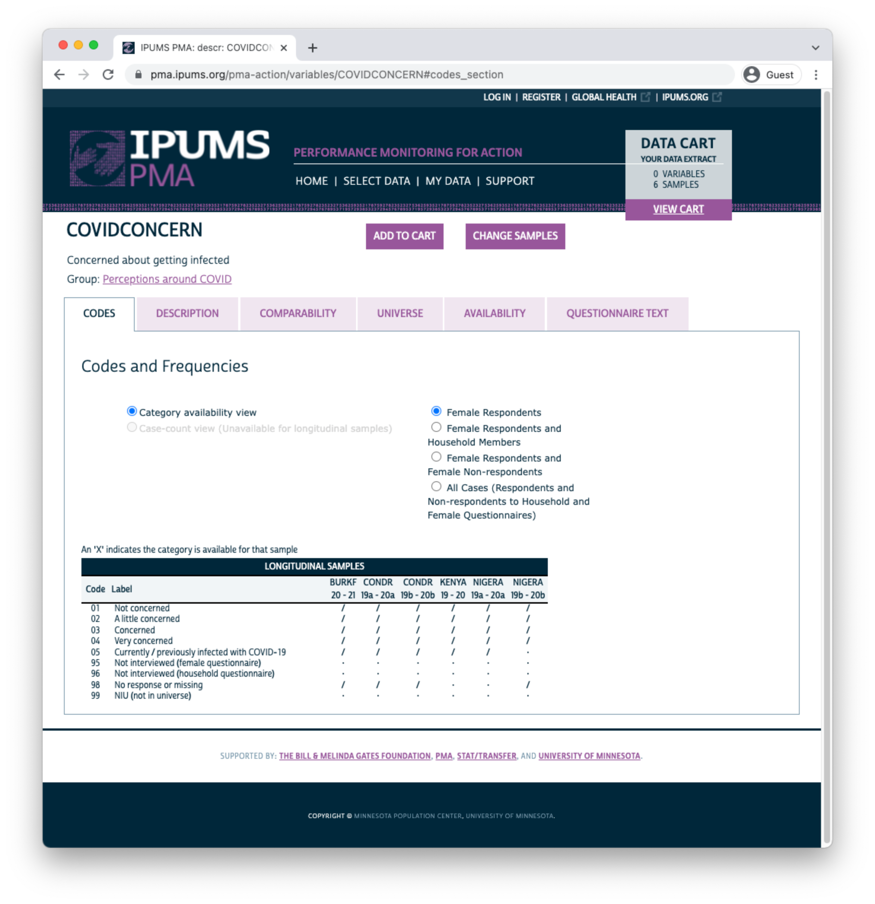
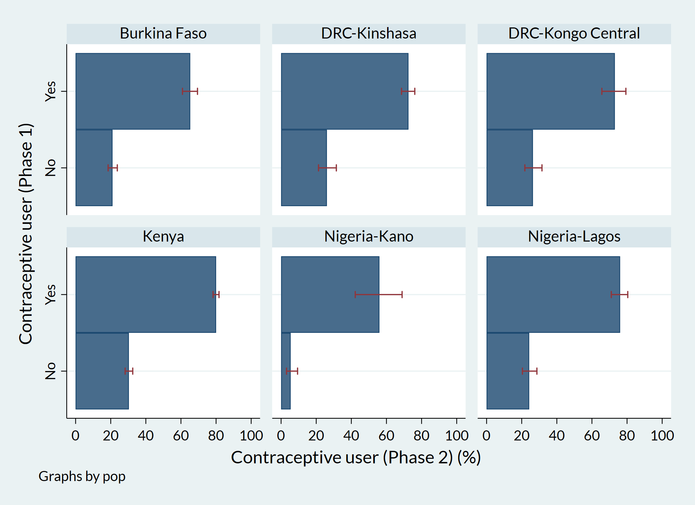
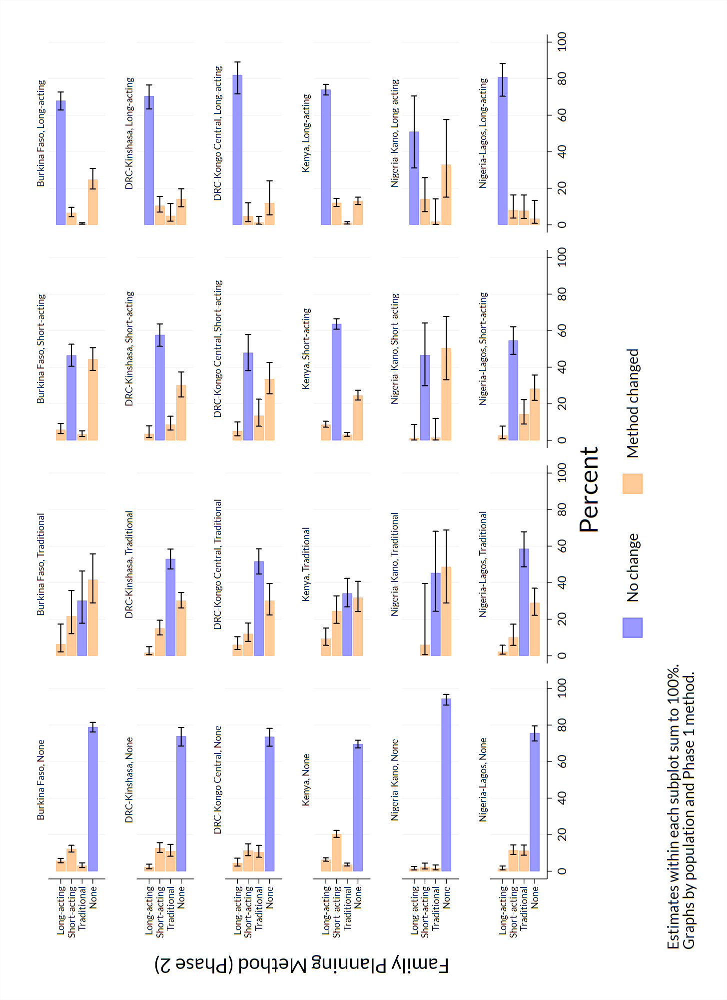
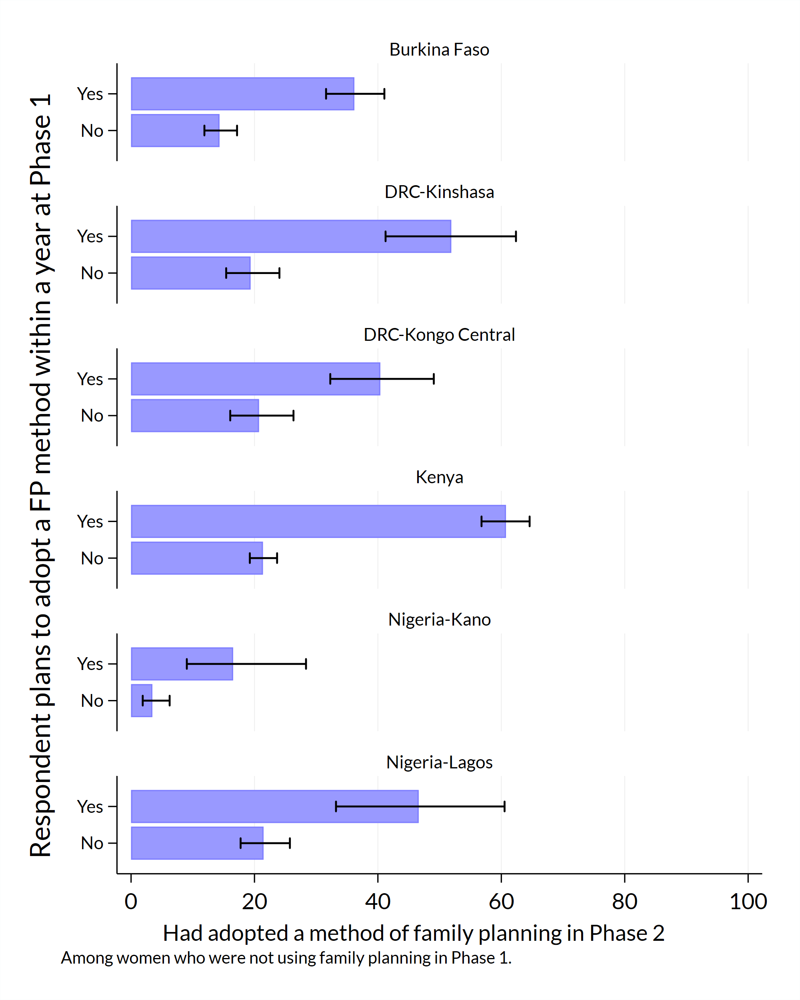
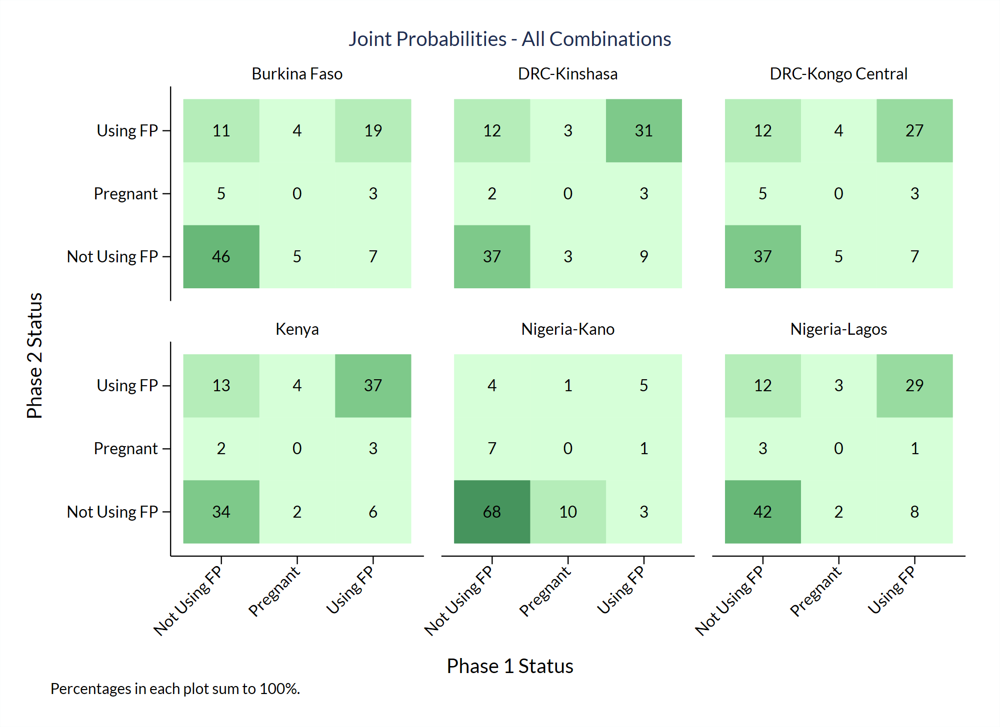
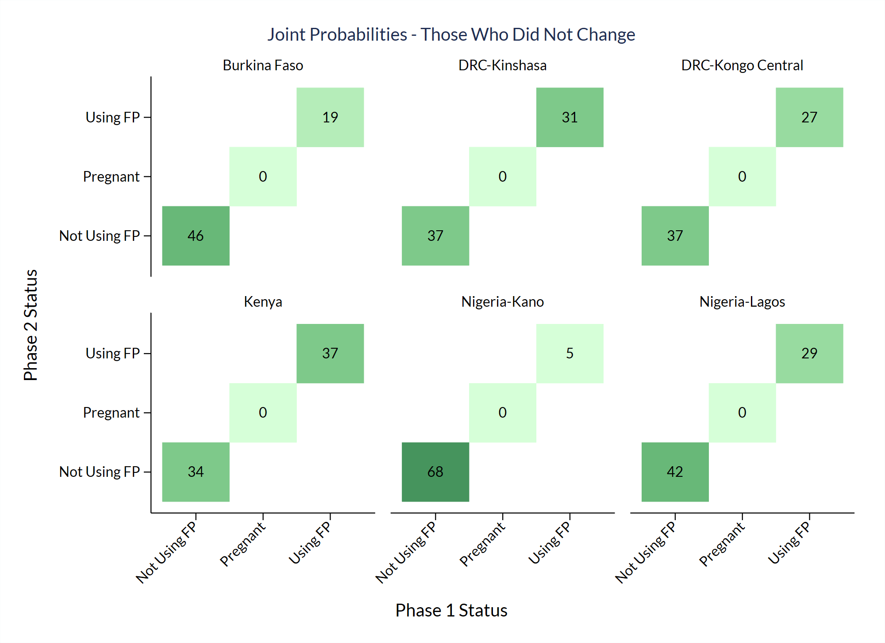
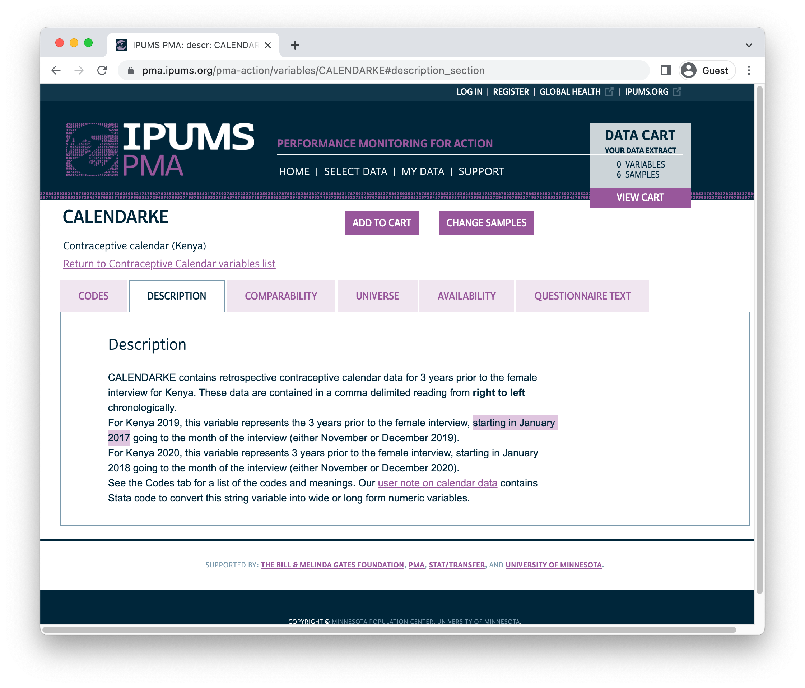
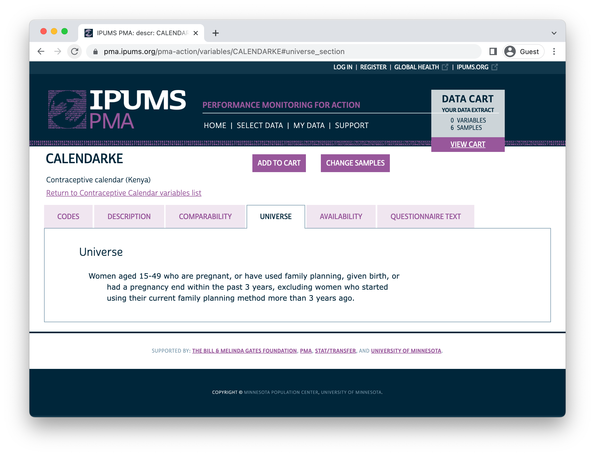
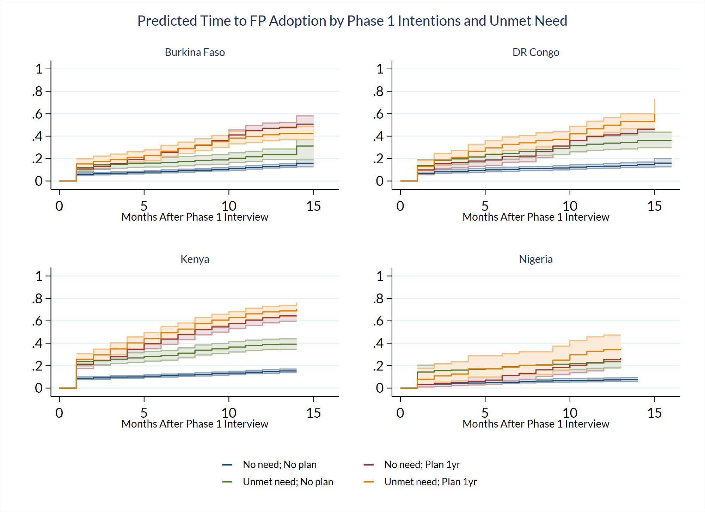

```{r, eval=TRUE, echo=FALSE}
knitr::opts_chunk$set(
  eval = FALSE, # Stata chunks not evaluated; manually change R chunks 
  comment = NA, 
  message = FALSE,
  R.options = list(width = 88),
  fig.align = 'center',
  highlight = FALSE
)

source(here::here("r/utilities.r"))
```

# Introduction

[Performance Monitoring for Action (PMA)](https://www.pmadata.org/) uses innovative mobile technology to support low-cost, rapid-turnaround surveys that monitor key health and development indicators.

PMA surveys collect longitudinal data throughout a country at the household and health facility levels by female data collectors, known as resident enumerators, using mobile phones. The survey collects information from the same women and households over time for regular tracking of progress and for understanding the drivers of contraceptive use dynamics. The data are rapidly validated, aggregated, and prepared into tables and graphs, making results quickly available to stakeholders. PMA surveys can be integrated into national monitoring and evaluation systems using a low-cost, rapid-turnaround survey platform that can be adapted and used for various health data needs.

The PMA project is implemented by local partner universities and research organizations who train and deploy the cadres of female resident enumerators.

<aside>
PMA has also published a guide to **cross-sectional** analysis in both [English](https://www.pmadata.org/media/1243/download?attachment) and [French](https://www.pmadata.org/media/1244/download?attachment).
</aside>

The purpose of this manual is to provide guidance on the analysis of **harmonized longitudinal data** for a panel of women age 15-49 surveyed by PMA and published in partnership with [IPUMS PMA](https://pma.ipums.org/pma/). IPUMS provides census and survey products from around the world in an integrated format, making it easy to compare data from multiple countries. IPUMS PMA data are available free of charge, subject to terms and conditions: please [register here](https://pma.ipums.org/pma/register.shtml) to request access to the data featured in this guide. 

This manual provides reproducible coding examples in the statistical software program [Stata](https://www.stata.com/). You can download `.do` files containing all of the code needed to reproduce these examples on our [GitHub page](). 

**R users:** a companion manual for IPUMS PMA longitudinal analysis is also available with coding examples written in R. Additionally, the [IPUMS PMA data analysis blog](https://tech.popdata.org/pma-data-hub/) includes an online version of each chapter and posts on a range of other topics updated every two weeks.  

## IPUMS PMA data in Stata

The first two chapters of this manual introduce new users to [PMA longitudinal data](https://www.pmadata.org/data/survey-methodology) and the [IPUMS PMA website](https://pma.ipums.org/pma/), respectively. After demonstrating how to obtain an IPUMS PMA data extract, the remaining chapters feature extensive data analysis examples written in Stata. 

<aside class="hex">
```{r, eval=TRUE, echo=FALSE}
hex("stata")
```
</aside>

To follow along, you'll need to purchase and download the appropriate version of Stata for your computer's operating system at [stata.com](https://www.r-project.org/). Discounted licences are available for students and for faculty and staff at participating institutions: learn more [here](https://www.stata.com/order/).

For a general introduction to analysis of IPUMS PMA data in Stata, visit the [IPUMS PMA Support](https://pma.ipums.org/pma/support.shtml) page, where you'll find links to video tutorials and data exercises written for Stata users. Similar resources are available for users of R, SPSS, and SAS. 

<div style="color: red;">
Questions for Dale: 

  - Did you find that you needed a particular *version* to complete all of our exercises
  - Are any supplementary packages needed? 
  - In the R version, I list some ways to get help with R. Do you have any favorite resources for getting help with Stata? 
</div>
  
## PMA Background

Dating back to 2013, the original PMA survey design included high-frequency, **cross-sectional** samples of women and service delivery points collected from eleven countries participating in [Family Planning 2020](http://progress.familyplanning2020.org/) (FP2020) - a global partnership that supports the rights of women and girls to decide for themselves whether, when, and how many children they want to have. These surveys were designed to monitor annual progress towards [FP2020 goals](http://progress.familyplanning2020.org/measurement) via population-level estimates for several [core indicators](http://www.track20.org/pages/data_analysis/core_indicators/overview.php). 

Beginning in 2019, PMA surveys were redesigned under a renewed partnership called [Family Planning 2030](https://fp2030.org/) (FP2030). These new surveys have been refocused on reproductive and sexual health indicators, and they feature a **longitudinal panel** of women of childbearing age. This design will allow researchers to measure contraceptive dynamics and changes in women’s fertility intentions over a **three year period** via annual in-person interviews.^[In addition to these three in-person surveys, PMA also conducted telephone interviews with panel members focused on emerging issues related to the COVID-19 pandemic in 2020. These telephone surveys are already available for several countries - the IPUMS PMA blog series on [PMA COVID-19 surveys](../../index.html#category:COVID-19) covers this topic in detail.] 

Questions on the redesigned survey cover topics like:

  * awareness, perception, knowledge, and use of contraceptive methods
  * perceived quality and side effects of contraceptive methods among current users
  * birth history and fertility intentions 
  * aspects of health service provision 
  * domains of empowerment 
  
## Sampling 

PMA panel data includes a mixture of **nationally representative** and **sub-nationally representative** samples. The panel study consists of three data collection phases, each spaced one year apart. 

As of this writing, IPUMS PMA has released data from the first *two* phases for four countries where Phase 1 data collection began in 2019; IPUMS PMA has released data from only the *first* phase for three countries where Phase 1 data collection began in August or September 2020. Phase 3 data collection and processing is currently underway. 

```{r, eval=TRUE, echo=FALSE, results='hide', message=FALSE}
library(kableExtra)
options(knitr.kable.NA = '')

avail <- read_csv("data/sample_avail.csv", show_col_types = F) 
names(avail)[2] <- paste0(
  names(avail)[2], 
  footnote_marker_symbol(1)
)

```
```{r, eval=TRUE, echo=FALSE}
avail %>%   
  arrange(Sample) %>% 
  kable(escape = FALSE, format = "html", table.attr = "style='width:100%;'") %>% 
  kable_styling() %>% 
  add_header_above(c(" " = 2, "Now Available from IPUMS PMA" = 3)) %>% 
  scroll_box(
    width = "100%", 
    box_css = paste(
      sep = "; ",
      "margin-bottom: 1em",
      "margin-top: 0em",
      "border: 0px solid #ddd",
      "padding: 5px"
    )
  ) %>%
  footnote(
    symbol = "<em>Each data collection phase is spaced one year apart</em>", 
    escape = FALSE
  )

```

<aside>
**Resident enumerators** are women over age 21 living in (or near) each EA who hold at least a high school diploma.
</aside>

PMA uses a multi-stage clustered sample design, with stratification at the urban-rural level or by sub-region. Sample clusters - called [enumeration areas](https://pma.ipums.org/pma-action/variables/EAID#description_section) (EAs) -- are provided by the national statistics agency in each country.^[[Displaced GPS coordinates](https://tech.popdata.org/pma-data-hub/posts/2021-10-15-nutrition-climate/PMA_displacement.pdf) for the centroid of each EA are available for most samples [by request](https://www.pmadata.org/data/request-access-datasets) from PMA. IPUMS PMA provides shapefiles for PMA countries [here](https://pma.ipums.org/pma/gis_boundary_files.shtml).] These EAs are sampled using a *probability proportional to size* (PPS) method relative to the population distribution in each stratum.

\newpage 

At Phase 1, 35 household dwellings were selected at random within each EA. Resident enumerators visited each dwelling and invited one household member to complete a [Household Questionnaire](https://pma.ipums.org/pma/resources/questionnaires/hhf/PMA-Household-Questionnaire-English-2019.10.09.pdf)^[Questionnaires administered in each country may vary from this **Core Household Questionnaire** - [click here](https://pma.ipums.org/pma/enum_materials.shtml) for details.] that includes a census of all household members and visitors who stayed there during the night before the interview. Female household members and visitors aged 15-49 were then invited to complete a subsequent Phase 1 [Female Questionnaire](https://pma.ipums.org/pma/resources/questionnaires/hhf/PMA-Female-Questionnaire-English-2019.10.09.pdf).^[Questionnaires administered in each country may vary from this **Core Female Questionnaire** - [click here](https://pma.ipums.org/pma/enum_materials.shtml) for details.]

<aside>
`r slink(SAMEDWELLING)` indicates whether a Phase 2 female respondent resided in her Phase 1 dwelling or a new one. 

`r slink(PANELWOMAN)` indicates whether a Phase 2 household member completed the Phase 1 Female Questionnaire.  
</aside>

One year later, resident enumerators visited the same dwellings and administered a Phase 2 Household Questionnaire. A panel member in Phase 2 is any woman still age 15-49 who could be reached for a second Female Questionnaire, either because:

  * she still lived there, or
  * she had moved elsewhere within the study area,^[The "study area" is area within which resident enumerators should attempt to find panel women that have moved out of their Phase 1 dwelling. This may extend beyond the woman's original EA as determined by in-country administrators - see [PMA Phase 2 and Phase 3 Survey Protocol](https://www.pmadata.org/data/survey-methodology) for details.] but at least one member of the Phase 1 household remained and could help resident enumerators locate her new dwelling.^[In cases where no Phase 1 household members remained in the dwelling at Phase 2, women from the household are considered **lost to follow-up**. Chapter 3 covers this topic in detail.]
  
Additionally, resident enumerators administered the Phase 2 Female Questionnaire to *new* women in sampled households who:

  * reached age 15 after Phase 1
  * joined the household after Phase 1
  * declined the Female Questionnaire at Phase 1, but agreed to complete it at Phase 2
  
\newpage 

When you select the new **Longitudinal** sample option from IPUMS PMA, you'll be able to include responses from every available phase of the study. These samples are available in either "long" format (responses from each phase will be organized in separate rows) or "wide" format (responses from each phase will be organized in columns). 

```{r, eval=TRUE, echo=FALSE}
knitr::include_graphics("images/long_radio.png")
```

\newpage 

<aside>
`r slink(CROSS_SECTION)` indicates whether a household member in a longitudinal sample is also included in the cross-sectional sample for a given year (every person in a cross-sectional sample is included in the longitudinal sample). 
</aside>

In addition to following up with women in the panel over time, PMA also adjusted sampling so that a cross-sectional sample could be produced concurrently with each data collection phase. These samples mainly overlap with the data you'll obtain for a particular phase in the longitudinal sample, except that replacement households were drawn from each EA where more than 10% of households from the previous phase were no longer there. Conversely, panel members who were located in a new dwelling at Phase 2 will not be represented in the cross-sectional sample drawn from that EA. These adjustments ensure that population-level indicators may be derived from cross-sectional samples in a given year, even if panel members move or are lost to follow-up. 

You'll find PMA cross-sectional samples dating back to 2013 if you select the **Cross-sectional** sample option from IPUMS PMA. 

```{r, eval=TRUE, echo=FALSE}
knitr::include_graphics("images/cross_radio.png")
knitr::opts_chunk$set(echo = TRUE)
```

## Inclusion Criteria for Analysis

Several chapters in this manual feature code you can use to reproduce key indicators included in the **PMA Longitudinal Brief** for each sample. In many cases, you'll find separate reports available in English and French, and for both national and sub-national summaries. For reference, here are the highest-level population summaries available in English for each sample where Phase 2 IPUMS PMA data is currently available:

  * [Burkina Faso](https://www.pmadata.org/sites/default/files/data_product_results/Burkina%20National_Phase%202_Panel_Results%20Brief_English_Final.pdf)
  * [DRC - Kinshasa](https://www.pmadata.org/sites/default/files/data_product_results/DRC%20Kinshasa_%20Phase%202%20Panel%20Results%20Brief_English_Final.pdf)
  * [DRC - Kongo Central](https://www.pmadata.org/sites/default/files/data_product_results/DRC%20Kongo%20Central_%20Phase%202%20Panel%20Results%20Brief_English_Final.pdf)
  * [Kenya](https://www.pmadata.org/sites/default/files/data_product_results/Kenya%20National_Phase%202_Panel%20Results%20Brief_Final.pdf)
  * [Nigeria - Kano](https://www.pmadata.org/sites/default/files/data_product_results/Nigeria%20KANO_Phase%202_Panel_Results%20Brief_Final.pdf)
  * [Nigeria - Lagos](https://www.pmadata.org/sites/default/files/data_product_results/Nigeria%20LAGOS_Phase%202_Panel_Results%20Brief_Final.pdf) 

<aside>
We will demonstrate how to request and download an IPUMS PMA data extract in Chapter 2.
</aside>

Panel data in these reports is limited to the *de facto* population of women who completed the Female Questionnaire in both Phase 1 and Phase 2. This includes women who slept in the household during the night before the interview for the Household Questionnaire. The *de jure* population includes women who are usual household members, but who slept elsewhere that night. In order to reproduce the findings from PMA reports, we'll remove *de jure* cases recorded in the variable `r slink(RESIDENT)`. 

<aside>
Variable names in a "wide" extract have a numeric suffix for their data collection phase. `r slink(resident_1)` is the Phase 1 version of `r slink(resident)`, while `r slink(resident_2)` comes from Phase 2. 
</aside>

For example, let's consider a **Wide** format data extract containing Phase 1 and Phase 2 respondents to the Female Questionnaire from Burkina Faso. You'll find the number of women who slept in the household before the Household Questionnaire for each phase reported in `r slink(resident_1)` and `r slink(resident_2)`:

```{stata}
use "pma_00126.dta", clear

table ( resident_1 ) () (), nototals missing zerocounts
```
```

-----------------------------------------------------------
                                               |  Frequency
-----------------------------------------------+-----------
usual member of household                      |           
  visitor, slept in hh last night              |        106
  usual member, did not sleep in hh last night |        174
  usual member, slept in hh last night         |      6,510
-----------------------------------------------------------
```

This extract includes 174 women who are not members of the *de facto* population because they did not sleep in the sampled household during the night before the Phase 1 interview. 

Let's turn to Phase 2: 

```{stata}
table ( resident_2 ) () (), nototals missing zerocounts
```
```
-------------------------------------------------------------------------
                                                             |  Frequency
-------------------------------------------------------------+-----------
usual member of household                                    |           
  visitor, slept in hh last night                            |         74
  usual member, did not sleep in hh last night               |        230
  usual member, slept in hh last night                       |      5,993
  slept in hh last night, no response if usually lives in hh |          1
  .                                                          |        492
-------------------------------------------------------------------------
```

The extract also includes 230 women who are not members of the *de facto* population because they did not sleep in the sampled household during the night before the Phase 2 interview. Moreover, there are 492 missing values (`.`) in `r slink(resident_2)` representing women who were **lost to follow-up** after Phase 1. We will explain **loss to follow-up** in detail in Chapter 3. 

The *de facto* population is represented in both variables by codes 11 and 22. We will use an `if` statement or `keep` statement to include only those cases.


```{stata}
keep if inlist(resident_1,11,22) & inlist(resident_2,11,22)
label variable resident_1 "Resident type - Phase 1"
label variable resident_2 "Resident type - Phase 2"
label define RESIDENT_1 11 "Visitor" 22 "Usual", modify
label define RESIDENT_2 11 "Visitor" 22 "Usual", modify
table ( resident_1 ) ( resident_2 ) (), nototals missing zerocounts
```
```
----------------------------------------------------
                        |   Resident type - Phase 2 
                        |       Visitor        Usual
------------------------+---------------------------
Resident type - Phase 1 |                           
  Visitor               |            56           39
  Usual                 |            17        5,855
----------------------------------------------------
```

\newpage 

Additionally, PMA reports only include women who completed (or partially completed) both Female Questionnaires. This information is reported in `r slink(resultfq)`. In our **Wide** extract, this information appears in `r slink(resultfq_1)` and `r slink(resultfq_2)`: if you select the **Female Respondents** option at checkout, only women who completed (or partially completed) the Phase 1 Female Questionnaire will be included in your extract.

```{r, eval=TRUE, echo=FALSE}
knitr::include_graphics("images/cases1.png")
```

\newpage 

We'll further restrict our sample by selecting only cases where `r slink(resultfq_2)` shows that the woman also completed the Phase 2 questionnaire. Notice that, in addition to each of the value 1 through 10, there are several **non-response codes** numbered 90 through 99. You'll see similar values repeated across all IPUMS PMA variables, except that they will be left-padded to match the maximum width of a particular variable (e.g. `9999` is used for `r slink(INTFQYEAR)`, which represents a 4-digit year for the Female Interview). 

```{stata}
use "pma_00126.dta", clear

tab resultfq_2, m
```
```
         result of female questionnaire |      Freq.     Percent        Cum.
----------------------------------------+-----------------------------------
                              completed |      5,491       80.87       80.87
                            not at home |         78        1.15       82.02
                              postponed |         22        0.32       82.34
                                refused |         66        0.97       83.31
                       partly completed |         12        0.18       83.49
                       respondent moved |         15        0.22       83.71
                          incapacitated |         19        0.28       83.99
 not interviewed (female questionnaire) |          4        0.06       84.05
not interviewed (household questionnair |        192        2.83       86.88
                  niu (not in universe) |        399        5.88       92.75
                                      . |        492        7.25      100.00
----------------------------------------+-----------------------------------
                                  Total |      6,790      100.00
```

The numeric codes associated with non-response include:

  * `95` Not interviewed (female questionnaire)
  * `96` Not interviewed (household questionnaire)
  * `97` Don't know
  * `98` No response or missing 
  * `99` NIU (not in universe)

A missing value (`.`) in an IPUMS extract indicates that a particular variable is not provided for a selected sample. In a **Wide** extract, it may also signify that a particular person was not included in the data from a particular phase. Here, a missing value (`.`) appearing in `r slink(resultfq_2)` indicates that a Female Respondent from Phase 1 was not found in Phase 2.

\newpage

You can drop incomplete Phase 2 female responses as follows:

```{stata}
use "pma_00126.dta", clear
keep if resultfq_2 == 1
tab resultfq_1 resultfq_2,m
```
```
                      | result of
                      |   female
                      | questionna
     result of female |    ire
        questionnaire | completed |     Total
----------------------+-----------+----------
            completed |     5,487 |     5,487 
     partly completed |         4 |         4 
----------------------+-----------+----------
                Total |     5,491 |     5,491 
```

Generally, we will combine both filtering steps together in a single function like so:

```{stata}
use "pma_00126.dta", clear
keep if inlist(resident_1,11,22) & inlist(resident_2,11,22) & resultfq_2  == 1
```

In subsequent analyses, we'll use each analytic sample to show how PMA generates key indicators for **contraceptive use status** and **family planning intentions and outcomes**. The summary report for each country includes measures disaggregated by demographic variables like:

  * `r slink(MARSTAT)` - marital status 
  * `r slink(EDUCATT)` and `r slink(EDUCATTGEN)` - highest attended level of education^[Levels in `r slink(EDUCATT)` may vary by country; `r slink(EDUCATTGEN)` recodes country-specific levels in four general categories.] 
  * `r slink(AGE)` - age
  * `r slink(WEALTHQ)` and `r slink(WEALTHT)` - household wealth quintile or tertile^[Households are divided into quintiles/tertiles relative to the distribution of an asset `r slink(SCORE, description)` weighted for all sampled households. For subnationally-representative samples (DRC and Nigeria), separate wealth distributions are calculated for each sampled region.]
  * `r slink(URBAN)` and `r slink(SUBNATIONAL)` - geographic location^[`r slink(SUBNATIONAL)` includes subnational regions for all sampled countries; country-specific variables are also available on the [household - geography](https://pma.ipums.org/pma-action/variables/group?id=hh_geo) page.]
  
## Survey Design Elements

Throughout this guide, we'll demonstrate how to incorporate PMA sampling weights and information about its stratified cluster sampling procedure into your analysis. This section describes how to use survey weights, cluster IDs, and sample strata in Stata. 

Let's return to the **Wide** data extract described in the previous section, which includes Phase 1 and Phase 2 **Female Respondents** from Burkina Faso. As a reminder: we'll drop women who are non members of the *de facto* population and those who did not complete all or part the Female Questionnaire in both phases. 

```{stata}
use "pma_00126.dta", clear
keep if inlist(resident_1,11,22) & inlist(resident_2,11,22) & resultfq_2  == 1
```

Whether you intend to work with a new **Longitudinal** or **Cross-sectional** data extract, you'll find the same set of sampling weights available for all PMA Family Planning surveys dating back to 2013: 

<aside>
A fourth Family Planning survey weight, `r slink(POPWT, description)`, is currently available only for **Cross-sectional** data extracts.^[`r slink(POPWT)` can be used to estimate population-level *counts* - [click here](https://pma.ipums.org/pma/population_weights.shtml) or view [this video](https://www.youtube.com/watch?v=GnCq26t4zgM) for details.] 
</aside>

  * `r slink(HQWEIGHT, description)` can be used to generate cross-sectional population estimates from questions on the Household Questionnaire.^[`r slink(HQWEIGHT)` reflects the [calculated selection probability](https://pma.ipums.org/pma/resources/documentation/weighting_memo.pdf) for a household in an EA, normalized at the population-level. Users intending to estimate population-level indicators for *households* should restrict their sample to one person per household via `r slink(LINENO, description)` - see [household weighting guide](https://pma.ipums.org/pma/weightguide.shtml#hh) for details.]
  * `r slink(FQWEIGHT, description)` can be used to to generate cross-sectional population estimates from questions on the Female Questionnaire.^[`r slink(FQWEIGHT)` adjusts `r slink(HQWEIGHT)` for female non-response within the EA, normalized at the population-level - see [female weighting guide](https://pma.ipums.org/pma/weightguide.shtml#female) for details.]
  * `r slink(EAWEIGHT, description)` can be used to compare the selection probability of a particular household with that of its EA. 
  
Additionally, PMA created a new weight, `r slink(PANELWEIGHT, description)`, 
which should be used in longitudinal analyses spanning multiple phases, as it adjusts for loss to follow-up. `r slink(PANELWEIGHT, description)` is available only for **Longitudinal** data extracts. 

PMA sample clusters are identified by the variable `r slink(EAID)`, while sample strata are identified by `r slink(STRATA)`. We'll demonstrate how to use each of these survey design elements in Stata below. 

### Set survey design

In the following example, we'll show how to use survey design information to estimate the proportion of reproductive age women in Burkina Faso who were using contraception at the time of data collection for both Phase 1 and Phase 2. In a **Cross-sectional** or **Long** format longitudinal extract, you'd find this information in the variable `r slink(CP)`. In the **Wide** extract featured here, you'll find it in `r slink(cp_1)` for Phase 1, and in `r slink(cp_2)` for Phase 2.

```{stata}
table ( cp_1 ) ( cp_2 ) (), nototals missing zerocounts
```

```
--------------------------------------------------------------
                             |   Contraceptive user (Phase 2) 
                             |              no             yes
-----------------------------+--------------------------------
Contraceptive user (Phase 1) |                                
  no                         |           2,589             821
  yes                        |             556           1,241
  no response or missing     |               5               0
--------------------------------------------------------------
```

To estimate a population percentage, we'll need to tell Stata that we are working with a sample survey dataset and specify the IPUMS PMA survey design elements. This is accomplished with the [svyset](https://www.stata.com/manuals/svysvyset.pdf) command.

<aside>
This is a lean `svyset` call. We recall that the default `vce` option is `vce(linearized)` and the default singleunit option is `(missing)`. Read the `svyset` documentation if you want to consider using other settings.
</aside>

We use `r slink(eaid_1)` as the cluster ID^[Because women are considered "lost to follow-up" if they moved outside the study area, `r slink(eaid_1)` and `r slink(eaid_2)` are identical for all panel members: you can use either one to identify sample clusters.] and `r slink(strata_1)` as the stratum ID.^[As with `r slink(EAID)`, you may use either `r slink(STRATA_1)` or `r slink(STRATA_2)` if your analysis is restricted to panel members] `r slink(panelweight)` represents the survey weight. We also make a binary variable indicating which women were using contraception in both phases.

```{stata}
gen cp_both = cp_1 == 1 & cp_2 == 1 if cp_1 < 90
label variable cp_both "Contraceptive user (Phases 1 & 2)"
label define cp_both 1 "Yes" 0 "No", replace
label values cp_both cp_both

svyset eaid_1, strata(strata_1) weight(panelweight) 
```

Now, we can use this survey design information to obtain a population estimate for the proportion of women who used family planning in both phases.

\newpage 

```{stata}
svy: proportion cp_both
```

```
(running proportion on estimation sample)

Survey: Proportion estimation

Number of strata =   2            Number of obs   =      5,207
Number of PSUs   = 167            Population size = 5,215.6413
                                  Design df       =        165

--------------------------------------------------------------
             |             Linearized            Logit
             | Proportion   std. err.     [95% conf. interval]
-------------+------------------------------------------------
     cp_both |
         No  |   .8122041    .012815      .7855839    .8362084
        Yes  |   .1877959    .012815      .1637916    .2144161
--------------------------------------------------------------
```

This is our first look at Stata’s output for estimating proportions. The top of the output table lists the number of strata and PSUs (enumeration areas) in the dataset, along with the number of respondents in the sample and the sum of their weights (under the heading: Population size). The number of design degrees of freedom (df) is the number of PSUs minus the number of strata.^[Some survey materials guide analysts to only report results for estimates or tests where the relative standard error (100 x standard error of the estimate / the estimate itself) is no greater than 30% or where there are at least twelve degrees of freedom. See the Centers for Disease Control and Prevention's [NHANES CMS tutorial](https://www.cdc.gov/nchs/tutorials/nhanes-cms/variance/variance.htm).︎]

The lower portion of the table lists the values of the outcome variable, or in this case their value labels: No and Yes. It lists the proportion of the population that are estimated to have each outcome, that proportion’s standard error, and a two-sided survey-adjusted confidence interval for the proportion. Stata’s default confidence interval is the so-called "logit interval" which is one of several possibilities.^[For now we will simply say that the default logit interval is a fine choice for most circumstances (see Dean & Pagano [-@Dean-Pagano] for discussion). To request a different kind of confidence interval, read about the options and specify what you want using the `citype()` option to the `svy: proportion` command (e.g., `citype(wilson)` or `citype(exact)`). If you estimate a proportion where the sample have either 0% or 100% of respondents with the outcome, then as of the time of this writing, neither Stata nor R's `r funlink(survey)` package will report a confidence interval. Here at Biostat Global Consulting, we have written programs in both Stata and R that yield meaningful confidence intervals for any proportion. Those programs are made freely available as part of software we have written for the World Health Organization. If you want to learn more about them, write to us at [Dale.Rhoda@biostatglobal.com](mailto:Dale.Rhoda@biostatglobal.com) or [Caitlin.Clary@biostatglobal.com](mailto:Caitlin.Clary@biostatglobal.com).] 

Describing this output, we might say that "based on this survey sample of 5,207 women from Burkina Faso, we estimate that if the surveys were free from bias then about 18.8% women who were eligible to be sampled in the PMA surveys would be self-reported users of contraception in both Phases 1 and 2 (95% CI: 16.4-21.4%)."

### Design Effect

With survey data collected from using a complex sample design that employs strata and/or clusters, we sometimes like to report the **design effect**, which is an index of the statistical precision penalty that we pay for using that sample design. In Stata, we can see the design effect by issuing the following post-estimation command [estat effects](https://www.stata.com/manuals/svysvypostestimation.pdf).

```{stata}
estat effects
```

```
----------------------------------------------------------
             |             Linearized
             | Proportion   std. err.       DEFF      DEFT
-------------+--------------------------------------------
     cp_both |
         No  |   .8122041    .012815      5.6052   2.36753
        Yes  |   .1877959    .012815      5.6052   2.36753
----------------------------------------------------------
```

We see that the design effect `DEFF` is 5.6, which we might interpret by saying "The confidence interval for this estimation is as wide as we would expect from a simple random sample of this sample size (5,207) divided by 5.6 or about 929 respondents."

The `DEFT` is the square root of `DEFF` and we might use it in a sentence thus: "Because of the complex sample design and heterogeneity of survey weights, the confidence interval for this estimation is 2.4 times wider than we would expect from a simple random sample of size 5,207 respondents."

The figure 929 is sometimes called the **effective sample size**.

Let’s take a moment and estimate proportions from two simple random samples where 18.8% of the respondents have the outcome: one where the sample size is 5,207 and one where the sample size is 929. We can do this by generating an empty dataset with the appropriate number of respondents and a binary variable named `y`.

Here we create `y` for the larger, complex sample: 

```{stata}
clear
set obs 5207

gen y = 0
replace y = 1 if _n < 0.188 * 5207
```

\newpage

```{stata}
tab y
```

```
          y |      Freq.     Percent        Cum.
------------+-----------------------------------
          0 |      4,229       81.22       81.22
          1 |        978       18.78      100.00
------------+-----------------------------------
      Total |      5,207      100.00
```

```{stata}
svyset _n
svy: proportion y
```
```
Survey: Proportion estimation

Number of strata =     1               Number of obs   = 5,207
Number of PSUs   = 5,207               Population size = 5,207
                                       Design df       = 5,206

--------------------------------------------------------------
             |             Linearized            Logit
             | Proportion   std. err.     [95% conf. interval]
-------------+------------------------------------------------
           y |
          0  |   .8121759   .0054131      .8013328    .8225583
          1  |   .1878241   .0054131      .1774417    .1986672
--------------------------------------------------------------
```

And here we create `y` for the smaller, simple sample: 

```{stata}
clear
set obs 929

gen y = 0
replace y = 1 if _n < 0.188 * 929
tab y
```

```
          y |      Freq.     Percent        Cum.
------------+-----------------------------------
          0 |        755       81.27       81.27
          1 |        174       18.73      100.00
------------+-----------------------------------
      Total |        929      100.00
```

```{stata}
svyset _n
svy: proportion y
```

```
Survey: Proportion estimation

Number of strata =   1                   Number of obs   = 929
Number of PSUs   = 929                   Population size = 929
                                         Design df       = 928

--------------------------------------------------------------
             |             Linearized            Logit
             | Proportion   std. err.     [95% conf. interval]
-------------+------------------------------------------------
           y |
          0  |   .8127018   .0128073       .786262    .8365509
          1  |   .1872982   .0128073      .1634491     .213738
--------------------------------------------------------------
```

Now let’s compare the CI width from the simple random sample with N=929 with that from the complex sample with N=5,207. That is: we'll divide the difference between the upper and lower limits of our 95% confidence interval from the complex data by that of the simple random sample. We'll see that it is approximately equal to `DEFT`.

```{stata}
di (.2144-.1638) / (.1987-.1774)
```
```
2.3755869
```

It can be disheartening to know that the teams did all the work to interview 5,207 respondents and yet for this estimation that sample only has the statistical precision of a simple random sample of 929 respondents. The statistical penalty is because of both a clustering effect – spatial heterogeneity in the outcome across PSUs – and because of heterogeneity in the survey weights. In some survey reporting contexts you will be expected to report either `DEFF` or `DEFT`, or both. Be clear about which one you are reporting. The design effect will vary across outcomes, across strata, and across PMA Phases, so if it is of interest, estimate it anew for each analysis. You can learn more about the survey design effect in [materials on survey sampling statistics](). 

### Sample strata for DRC

This syntax and `svyset` command worked well for Burkina Faso, but take note: the variable `r slink(strata)` is not available for samples collected from DRC - Kinshasa or DRC - Kongo Central. If your extract includes any DRC sample, you’ll need to amend this variable to include a unique numeric code for each of those regions.

For example, let’s look at a different wide extract, containing all of the samples included in this data release. Here, we again include only panel members who completed all or part of the female questionnaire in both phases, and who slept in the household during the night before the interview: 

```{stata}
use "pma_00153.dta", clear
keep if inlist(resident_1,11,22) & inlist(resident_2,11,22) & resultfq_2  == 1
```

Notice that `r slink(strata_1)` lists the sample strata for all values of `r slink(country)` except for DRC, where the variable is missing.

```{stata}
table ( strata_1 ) if country == 2, nototals missing zerocounts
```

```
-------------------
       |  Frequency
-------+-----------
strata |           
  .    |      3,487
-------------------
```

We can replace those values with numeric codes from the variable `r slink(geocd)`. These codes are distinct from all other values in `r slink(strata_1)`. 

```{stata}
tab geocd, nolabel
```
```
  province, |
   congo dr |      Freq.     Percent        Cum.
------------+-----------------------------------
          1 |      1,973       56.58       56.58
          2 |      1,514       43.42      100.00
------------+-----------------------------------
      Total |      3,487      100.00
```

\newpage 

Because these codes are distinct from all other values in `r slink(strata_1)`, we can create a new variable `strata_recode` that copies `r slink(strata_1)` except where `r slink(geocd)` is non-missing. In that case, we'll use the numeric code from `r slink(geocd)`. 

```{stata}
clonevar strata_recode = strata_1 
replace  strata_recode = geocd if country == 2
label copy STRATA_1 strata_recode, replace
label define strata_recode 1 "Kinshasa, DRC" 2 "Kongo Central, DRC", modify
label values strata_recode strata_recode
tab strata_recode, m
```

```
                                 strata |      Freq.     Percent        Cum.
----------------------------------------+-----------------------------------
                          Kinshasa, DRC |      1,973       11.13       11.13
                     Kongo Central, DRC |      1,514        8.54       19.67
                 bungoma - urban, kenya |        153        0.86       20.54
                 bungoma - rural, kenya |        489        2.76       23.30
                kakamega - urban, kenya |        133        0.75       24.05
                kakamega - rural, kenya |        438        2.47       26.52
                 kericho - urban, kenya |        249        1.40       27.92
                 kericho - rural, kenya |        453        2.56       30.48
                  kiambu - urban, kenya |        214        1.21       31.69
                  kiambu - rural, kenya |        311        1.75       33.44
                  kilifi - urban, kenya |        170        0.96       34.40
                  kilifi - rural, kenya |        455        2.57       36.97
                   kitui - urban, kenya |        153        0.86       37.83
                   kitui - rural, kenya |        586        3.31       41.14
                 nairobi - urban, kenya |        494        2.79       43.92
                   nandi - urban, kenya |        260        1.47       45.39
                   nandi - rural, kenya |        711        4.01       49.40
                 nyamira - urban, kenya |        143        0.81       50.21
                 nyamira - rural, kenya |        382        2.16       52.36
                   siaya - urban, kenya |        130        0.73       53.10
                   siaya - rural, kenya |        437        2.47       55.56
              west pokot - urban, kenya |        104        0.59       56.15
              west pokot - rural, kenya |        474        2.67       58.82
                         lagos, nigeria |      1,088        6.14       64.96
                           kano - urban |        437        2.47       67.43
                           kano - rural |        561        3.17       70.59
                    urban, burkina faso |      3,058       17.25       87.85
                    rural, burkina faso |      2,154       12.15      100.00
----------------------------------------+-----------------------------------
                                  Total |     17,724      100.00
```

\newpage 

Now, we can use `strata_recode` with the `svyset` command to obtain population estimates for each nationally representative or sub-nationally representative sample.

First, we'll create `cp_both`  again for this wide dataset.

```{stata}
gen cp_both = cp_1 == 1 & cp_2 == 1 if cp_1 < 90

label variable cp_both "Contraceptive user (Phases 1 & 2)"
label define cp_both 1 "Yes" 0 "No", replace
label values cp_both cp_both

svyset eaid_1, strata(strata_recode) weight(panelweight) 
```

For Stata to estimate the proportion for each population, we will use the `over(varname)` option where `varname` needs to be an integer variable - preferably with a value label. 

So, we construct a new variable named `pop` and give it a unique value for each PMA population.

```{stata}
gen pop = .

replace pop = 1 if country == 1              // Burkina Faso
replace pop = 2 if country == 2 & geocd == 1 // Kinshasa
replace pop = 3 if country == 2 & geocd == 2 // Kongo Central
replace pop = 4 if country == 7              // Kenya
replace pop = 5 if country == 9 & geong == 4 // Kano
replace pop = 6 if country == 9 & geong == 2 // Lagos

label define pop ///
           1 "Burkina Faso" ///
           2 "DRC-Kinshasa" ///
           3 "DRC-Kongo Central" ///
           4 "Kenya" ///
           5 "Nigeria-Kano" ///
           6 "Nigeria-Lagos", replace

label values pop pop
```

\newpage 

Finally, we can use the updated survey design information to estimate the proportion of women who were using contraception at both Phase 1 and Phase 2 in every sample (including those from Kinshasa and Kongo Central). 

```{stata}
svy : proportion cp_both , over(pop) 
```
```
Survey: Proportion estimation

Number of strata =  28                       Number of obs   =    17,705
Number of PSUs   = 665                       Population size = 17,691.26
                                             Design df       =       637

------------------------------------------------------------------------
                       |             Linearized            Logit
                       | Proportion   std. err.     [95% conf. interval]
-----------------------+------------------------------------------------
   cp_both@pop         |
      No Burkina Faso  |   .8122041    .012815       .785736    .8360846
      No DRC-Kinshasa  |   .6802513   .0163794       .647268     .711525
 No DRC-Kongo Central  |   .7318119   .0287314      .6718062    .7843679
             No Kenya  |   .6342298   .0083126      .6177575    .6503939
      No Nigeria-Kano  |   .9463423   .0130503      .9141428    .9669031
     No Nigeria-Lagos  |   .7065456   .0176703      .6706908    .7400099
     Yes Burkina Faso  |   .1877959    .012815      .1639154     .214264
     Yes DRC-Kinshasa  |   .3197487   .0163794       .288475     .352732
Yes DRC-Kongo Central  |   .2681881   .0287314      .2156321    .3281938
            Yes Kenya  |   .3657702   .0083126      .3496061    .3822425
     Yes Nigeria-Kano  |   .0536577   .0130503      .0330969    .0858572
    Yes Nigeria-Lagos  |   .2934544   .0176703      .2599901    .3293092
------------------------------------------------------------------------
```


# Longitudinal Data Extracts

```{r, eval=TRUE, echo=FALSE}
knitr::opts_chunk$set(
  out.width = "85%"
)
```

This chapter provides a guided tour of the [IPUMS PMA data extract system](https://pma.ipums.org/pma/). While you may also access the original data directly from our partners at [PMA](https://www.pmadata.org/), harmonized data from IPUMS have a few additional features. For instance, you can request an extract that: 

<aside>
[Register here](https://pma.ipums.org/pma/register.shtml) to access IPUMS PMA data **at no cost.** See our [user guide](https://pma.ipums.org/pma/userguide.shtml) for details.
</aside>

  - includes samples from multiple countries  
  - includes samples from multiple rounds of data collection 
  - are formatted in either **Long** or **Wide** format 

IPUMS PMA also makes it easy to switch between multiple [units of analysis](https://pma.ipums.org/pma-action/variables/group) covered in PMA surveys. In addition to the data featured in this guide, you'll find surveys representing: 

<aside>
A video tour of the longitudinal extract system is available [here](https://www.youtube.com/embed/VwjYHDvpHk0) on the IPUMS PMA Youtube channel. 
</aside> 

  - [Service Delivery Points (SDPs)](https://tech.popdata.org/pma-data-hub/#category:Service_Delivery_Points)
  - [Client Exit Interviews conducted at SDPs](https://tech.popdata.org/pma-data-hub/#category:Client_Exit_Interviews)
  - Participants in special surveys covering topics like [COVID-19](https://tech.popdata.org/pma-data-hub/#category:COVID-19), [nutrition](https://tech.popdata.org/pma-data-hub/#category:Nutrition), and maternal & newborn health 
  
To get started with a longitudinal data extract, you'll need to select the **Family Planning** topic under the **Person** unit of analysis. 

```{r, eval=TRUE, echo=FALSE, out.width="85%"}
knitr::include_graphics("images/unit.png")
```

## Sample Selection

Once you've selected the **Family Planning** option, you'll next need to choose between cross-sectional or longitudinal samples. Cross-sectional samples are selected by default; these are nationally or sub-nationally representative samples collected each year dating backward as far as 2013.

```{r, eval=TRUE, echo=FALSE}
knitr::include_graphics("images/cross-sectional.png")
```

Longitudinal samples are only available from 2019 onward, and they include all of the available phases for each sampled country (sub-nationally representative samples for DRC and Nigeria are listed separately). You'll only find longitudinal samples for countries where Phase 2 data has been made available; Phase 1 data for Cote d'Ivoire, India, and Uganda can currently be found under the Cross-sectional sample menu (Phase 2 data will be released soon!). 

\newpage 

Clicking the Longitudinal button reveals options for either **Long** or **Wide** format. You'll find the same samples available in either case.

**Important:** if you decide to change formats after selecting variables, your Data Cart will be emptied and you'll need to begin again from scratch.

```{r, eval=TRUE, echo=FALSE}
knitr::include_graphics("images/wide.png")
```

\newpage 

After you've selected one of the available longitudinal formats, choose one or more samples listed below. There are also several Sample Members options listed.

```{r, eval=TRUE, echo=FALSE}
knitr::include_graphics("images/cases.png")
```

<aside>
`r slink(PANELWOMAN)` indicates whether an individual is a member of the panel study. 

`r slink(ELIGIBLE)` indicates whether an individual was eligible for the female questionnaire.
</aside>

**Female Respondents** only includes women who completed *all or part* of a Female Questionnaire. **This option selects all members of the panel study.** In addition, it includes women who only participated in only one phase - we will demonstrate how to identify and drop these cases below.^[Women who completed all or part of the Female Questionnaire in *more than one phase* of the study are considered **panel members**. Women who completed it only at Phase 1 are included in a longitudinal extract, but they are not **panel members**. Likewise, women who completed it for the first time at Phase 2 are included, but are not **panel members** if they 1) will reach age 50 before Phase 3, or 2) declined the invitation to participate again in Phase 3.]  

**Female Respondents and Female Non-respondents** includes all women who were eligible to participate in a Female Questionnaire. Eligible women are those age 15-49 who were listed on the roster collected in a Household Questionnaire. If an eligible woman declined the Female Questionnaire or was not available, variables associated with that questionnaire will be coded "Not interviewed (female questionnaire)".

\newpage 

<aside>
`r slink(RESULTFQ)` indicates whether an individual completed the Female Questionnaire. 

`r slink(RESULTHQ)` indicates whether a member of the individual's household completed the Household Questionnaire. 
</aside>

**Female Respondents and Household Members** adds records for all other members of a Female Respondent's household. These household members did not complete the Female Questionnaire, but were listed on the household roster provided by the respondent to a Household Questionnaire. Basic [demographic](https://internal.pma.ipums.org/pma-action/variables/group?id=hh_roster) variables are available for each household member, as are common [wealth](https://internal.pma.ipums.org/pma-action/variables/group?id=hh_wealth), [water](https://internal.pma.ipums.org/pma-action/variables/group?id=water_watersource), [sanitation](https://internal.pma.ipums.org/pma-action/variables/group?id=water_wash), and other variables shared for all members of the same household.  

**All Cases** includes all members listed on the household roster from a Household Questionnaire. If the Household Questionnaire was declined or if no respondent was available, any panel member appearing in other phases of the study will be coded "Not interviewed (household questionnaire)" for variables associated with the missing Household Questionnaire. 

After you've selected samples and sample members for your extract, click the "Submit Sample Selections" button to return to the main data browsing menu.

## Variable Selection

You can browse IPUMS PMA variables by topic or alphabetically by name, or you can [search](https://pma.ipums.org/pma-action/variables/search) for a particular term in a variable name, label, value labels, or description. 

```{r, eval=TRUE, echo=FALSE}
knitr::include_graphics("images/topics.png")
```

\newpage 

In this example, we'll select the [Discontinuation of Family Planning](https://pma.ipums.org/pma-action/variables/group?id=fem_fpst) topic. The availability of each associated variable is shown in a table containing all of the samples we've selected. 

  * `X` indicates that the variable is available for *all phases*
  * `/` indicates that the variable is available for *one phase*
  * `-` indicates that the variable is not available for *any phase*
  
You can click the `+` button to add a variable to your cart, or click a variable name to learn more.
  
```{r, eval=TRUE, echo=FALSE}
knitr::include_graphics("images/table.png")
```

### Codes 

<aside>
"Case-count view" is not available for longitudinal samples. For cross-sectional samples, this option shows the frequency of each response.
</aside>

Let's take a look at the variable `r slink(PREGNANT)`. You'll find the variable name and label shown at the top of the page. Below, you'll see several tabs beginning with the [CODES](https://pma.ipums.org/pma-action/variables/PREGNANT#codes_section) tab. For discrete variables, this tab shows all of the available codes and value labels associated with each response. You'll also see the same `X`, `/`, and `-` symbols in a table indicating the availability of each response in each sample.

```{r, eval=TRUE, echo=FALSE}
knitr::include_graphics("images/codes-fr.png")
```

\newpage

Above, there are no responses for "Not interviewed (female questionnaire)" and "Not interviewed (household questionnaire)"; this is because only samples members included in a "Female Respondents" extract are displayed by default. If we instead choose "All Cases", this variable will include those response options because we'll include every person listed on the household roster (even if the Household or Female Questionnaire was not completed). 

```{r, eval=TRUE, echo=FALSE}
knitr::include_graphics("images/codes-all.png")
```

\newpage

The symbol `/` again indicates that a particular response is available for some - but not all - phases of the study. For `r slink(PREGNANT)` it indicates that one of the options was either unavailable or was not selected by any sample respondents in a particular phase. If a variable was not included in all phases of the study, all response options will be marked with this symbol. For example, consider the variable `r slink(COVIDCONCERN)`, indicating the respondent's level of concern about becoming infected with COVID-19.  

```{r, eval=TRUE, echo=FALSE}

```

Because Phase 1 questionnaires were administered prior to the emergence of COVID-19, this variable only appeared on Phase 2 questionnaires. The symbol `/` indicates limited availability across phases. 

### Variable Description

You'll find a detailed description for each variable on the [DESCRIPTION](https://pma.ipums.org/pma-action/variables/PREGNANT#description_section) tab. This tab also indicates whether a particular question appeared on the Household or Female Questionnaire.

```{r, eval=TRUE, echo=FALSE}
knitr::include_graphics("images/desc.png")
```

### Comparability Notes

The [COMPARABILITY](https://pma.ipums.org/pma-action/variables/PREGNANT#comparability_section) tab describes important differences between samples. Additionally, it may contain information about similar variables appearing in [DHS](https://dhsprogram.com/) samples provided by [IPUMS DHS](https://www.idhsdata.org/idhs/). 

```{r, eval=TRUE, echo=FALSE}
knitr::include_graphics("images/comp.png")
```

### Sample Universe

The [UNIVERSE](https://pma.ipums.org/pma-action/variables/PREGNANT#universe_section) tab describes selection criteria for this question. In this case, there are some differences between samples: 

  * In DRC samples, all women aged 15-49 received this question.
  * For all other samples, the question was skipped if any such woman previously indicated that she was menopausal or had a hysterectomy.
  
```{r, eval=TRUE, echo=FALSE}
knitr::include_graphics("images/universe.png")
```

### Availability Across Samples

The [AVAILABILITY](https://pma.ipums.org/pma-action/variables/PREGNANT#availability_section) tab shows all other samples (including cross-sectional samples) where this variable is available. 

```{r, eval=TRUE, echo=FALSE}
knitr::include_graphics("images/avail.png")
```

### Questionnaire Text 

Finally, you'll find the full text of each question on the [QUESTIONNAIRE TEXT](https://pma.ipums.org/pma-action/variables/PREGNANT#questionnaire_text_section) tab. Each phase of the survey is shown separately, and you may click the "view entire document: text" link to view the complete questionnaire for a particular sample in any given phase. 

```{r, eval=TRUE, echo=FALSE}
knitr::include_graphics("images/question.png")
```

### Checkout 

Use the buttons at the top of this page to add the variable to your Data Cart, or to "VIEW CART" and begin checkout. 

```{r, eval=TRUE, echo=FALSE}
# knitr::include_graphics("images/buttons.png")
htmltools::img(
  src = "images/buttons.png",
  style = 
    "margin-top: 20px; margin-bottom: 25px; max-width: 100%; width: 1033px;"
)
```

## Data for Stata Users 

Your Data Cart shows all of the variables you've selected, plus several "preselected" variables that will be automatically included in your extract. Click the "CREATE DATA EXTRACT" button to prepare your download. 

```{r, eval=TRUE, echo=FALSE}
knitr::include_graphics("images/cart.png")
```

\newpage

Before you submit an extract request, you'll have the opportunity to choose a "Data Format". **Stata users should select a Stata file (.dta)** - you'll notice that data formatted for R, SPSS, and SAS are also available. CSV files are provided, but not recommended. (If you wish to change Sample Members, you may do so again here.) 

```{r, eval=TRUE, echo=FALSE}
knitr::include_graphics("images/stata_request.png")
```

Once the Stata option is selected, you may add a description and then proceed to the download page. After a few moments, you'll receive an email indicating that your extract has been created. Click the green "Download Stata" button to download your extract.

```{r, eval=TRUE, echo=FALSE}
# knitr::include_graphics("images/download.png")
htmltools::img(
  src = "images/download_stata.png", 
  style = "margin-top: 20px; margin-bottom: 25px;"
)
```

## Long Data Structure

We've downloaded a **Long** data extract (**Female Respondents** only), which we'll now load into Stata as follows:

```{stata}
use "pma_00119.dta", clear
```

In a **Long** extract, data from each phase will be organized in *separate rows*. Here, responses from three panel members are shown: 

```{stata}
sort fqinstid phase

list fqinstid phase age panelwoman ///
     if strmatch(fqinstid, "011*") | ///
        strmatch(fqinstid, "015*"), separator(8) noobs
```

```
  +---------------------------------------------------------------+
  |                  fqinstid      phase         age   panelwoman |
  |---------------------------------------------------------------|
  | 011W5S0HN91I4H4I3T9JCMBHB   baseline          29            . |
  | 011W5S0HN91I4H4I3T9JCMBHB   first follow up   30          yes |
  | 015NP6FJTIA98FYCBBBS1FOF7   baseline          47            . |
  | 015NP6FJTIA98FYCBBBS1FOF7   first follow up   48          yes |
  | 015WYNNO2WXHH6JA4HA9PL1MR   baseline          20            . |
  | 015WYNNO2WXHH6JA4HA9PL1MR   first follow up   21          yes |
  +---------------------------------------------------------------+
```

Each panel member receives a unique ID shown in `r slink(FQINSTID)`. The variable `r slink(phase)` shows that each woman's responses to the Phase 1 Female Questionnaire appears in the first row, while her Phase 2 responses appear in the second. `r slink(AGE)` shows each woman's age when she completed the Female Questionnaire for each phase.

`r slink(PANELWOMAN)` indicates whether the woman completed all or part of the Female Questionnaire in a *prior* phase, and that she'd agreed to continue participating in the panel study at that time. A missing value (`.`) appears in the rows for Phase 1, as `r slink(PANELWOMAN)` was not included in Phase 1 surveys. 

\newpage 

We mentioned above that you'll also include responses from some non-panel members when you request an extract with **Female Respondents**. These include women who did not complete all or part the Female Questionnaire in a prior phase, as indicated by `r slink(PANELWOMAN)`. These women are not assigned a value for `r slink(FQINSTID)` - instead, you'll find an empty string:

```{stata}
gen non_panel = fqinstid == ""
label define fqinstid_blank 0 "fqinstid is not blank" 1 "fqinstid is blank"
label values non_panel fqinstid_blank
label variable panelwoman "Woman in the panel"
table (phase panelwoman) (non_panel), nototals missing
```

```
----------------------------------------------------------------------
                          |                  non_panel                
                          |  fqinstid is not blank   fqinstid is blank
--------------------------+-------------------------------------------
longitudinal survey phase |                                           
  baseline                |                                           
    Woman in the panel    |                                           
      .                   |                 23,591                    
  first follow up         |                                           
    Woman in the panel    |                                           
      no                  |                                      6,586
      yes                 |                 18,194                    
----------------------------------------------------------------------
```

Chapter 1 describes **Inclusion Criteria for Analysis** and shows how to identify women in a **Wide** extract who did not complete the Female Questionnaire in both phases. In **Long** format, we use a combination of `bysort` and `egen` to ensure that there is one row for every `r slink(FQINSTID)` where `phase == 1` and another row where `phase == 2 & resultfq == 1`.

```{stata}
gen keep = 1 if phase == 1
replace keep = 1 if phase == 2 & resultfq == 1
bysort fqinstid : egen keep_both = sum(keep)
keep if keep_both == 2
drop keep keep_both
```

The *de facto* population is identified where `r slink(RESIDENT)` takes the value `11` or `22` in both rows.

```{stata}
gen keep = 1 if phase == 1 & (resident == 11 | resident == 22)
replace keep = 2 if phase == 2 & (resident == 11 | resident == 22)
bysort fqinstid : egen keep_both = sum(keep)
keep if keep_both == 3
drop keep keep_both
```

Following these steps, you can check the size of each analytic sample like so: 

```{stata}
gen pop = .
replace pop = 1 if country == 1 // Burkina Faso
replace pop = 2 if country == 2 & geocd == 1 // Kinshasa
replace pop = 3 if country == 2 & geocd == 2 // Kongo Central
replace pop = 4 if country == 7 // Kenya
replace pop = 5 if country == 9 & geong == 4 // Kano
replace pop = 6 if country == 9 & geong == 2 // Lagos

label define pop ///
           1 "Burkina Faso" ///
           2 "DRC-Kinshasa" ///
           3 "DRC-Kongo Central" ///
           4 "Kenya" ///
           5 "Nigeria-Kano" ///
           6 "Nigeria-Lagos", replace

label values pop pop
           
table ( pop ) ( phase) ( ), nototals missing
```

```
--------------------------------------------------
                    |   longitudinal survey phase 
                    |   baseline   first follow up
--------------------+-----------------------------
pop         |                             
  Burkina Faso      |      5,212             5,212
  DRC-Kinshasa      |      1,973             1,973
  DRC-Kongo Central |      1,514             1,514
  Kenya             |      6,939             6,939
  Nigeria-Kano      |        998               998
  Nigeria-Lagos     |      1,089             1,089
--------------------------------------------------
```

## Wide Data Structure

We've also downloaded a **Wide** data extract (**Female Respondents** only), which we'll load into Stata like so: 

```{stata}
use "pma_00116.dta", clear

```

In a **Wide** extract, all of the responses from one woman appear in the *same row*. The IPUMS PMA extract system appends a numeric suffix to each variable name corresponding with the phase from which it was drawn. Consider our three example panel members again: 

```{stata}
sort fqinstid

list fqinstid age_1 age_2 panelwoman_1 panelwoman_2 ///
     if strmatch(fqinstid, "011*") | ///
        strmatch(fqinstid, "015*"), separator(8) noobs
```

```
  +-------------------------------------------------------------------------+
  |                  fqinstid   age_1   age_2   panelwoman_1   panelwoman_2 |
  |-------------------------------------------------------------------------|
  | 011W5S0HN91I4H4I3T9JCMBHB      29      30              .            yes |
  | 015NP6FJTIA98FYCBBBS1FOF7      47      48              .            yes |
  | 015WYNNO2WXHH6JA4HA9PL1MR      20      21              .            yes |
  +-------------------------------------------------------------------------+
```

Each panel member has one unique ID shown in `r slink(FQINSTID)`. However, `r slink(AGE)` is parsed into two columns: `r slink(AGE_1)` shows each woman's age at Phase 1, and `r slink(AGE_2)` shows her age at Phase 2. 

As we've discussed, `r slink(PANELWOMAN)` is not available for Phase 1, as it indicates whether the woman completed all or part of the Female Questionnaire in a *prior* phase. For this reason, all values in `r slink(PANELWOMAN_1)` are missing (`.`). Most variables are copied once for each phase, even if they - like `r slink(PANELWOMAN_1)` - are not available for all phases. 

\newpage 

You might expect the total length of a **Wide** extract to be half the length of a corresponding **Long** extract. This is not the case! A **Wide** extract includes one row for each woman who completed all or part of the Female Questionnaire *for any phase* - you'll find placeholder columns for phases where the interview was not conducted. 

```{stata}
list resultfq_1 age_1 resultfq_2 age_2 ///
     if fqinstid == "0C8VQU6B03BXLAVVZ8SB90EKQ", noobs
```

```
  +---------------------------------------------------------------------------+
  | resultfq_1   age_1    resultfq_2                                    age_2 |
  |---------------------------------------------------------------------------|
  | completed       31   not at home   not interviewed (female questionnaire) |
  +---------------------------------------------------------------------------+
```

In a **Long** extract, rows for the missing phase are dropped. In this example, the woman was "not at home" for the Phase 2 Female Questionnaire. When we select a **Long** extract containing only Female Respondents, her Phase 2 row is excluded automatically (it will be included if you request an extract containing Female Respondents and Female Non-respondents). 

```{stata}
use "pma_00119.dta", clear
list phase age resultfq ///
     if fqinstid == "0C8VQU6B03BXLAVVZ8SB90EKQ", noobs
```

```
  +----------------------------+
  |    phase   age    resultfq |
  |----------------------------|
  | baseline    31   completed |
  +----------------------------+
```

The **Inclusion Criteria for Analysis** section in Chapter 1 shows how to identify members of the *de facto* population who completed the Female Questionnaire in both phases for a **Wide** extract. Those steps are repeated here: 

```{stata}
use "pma_00116.dta", clear
keep if inlist(resident_1,11,22) & inlist(resident_2,11,22) & resultfq_2  == 1
```

Following these steps, each analytic sample contains the same number of cases shown in the final **Long** format extract above. 

```{stata}
gen pop = .
replace pop = 1 if country == 1 // Burkina Faso
replace pop = 2 if country == 2 & geocd == 1 // Kinshasa
replace pop = 3 if country == 2 & geocd == 2 // Kongo Central
replace pop = 4 if country == 7 // Kenya
replace pop = 5 if country == 9 & geong == 4 // Kano
replace pop = 6 if country == 9 & geong == 2 // Lagos

label define pop ///
  1 "Burkina Faso" ///
  2 "DRC-Kinshasa" ///
  3 "DRC-Kongo Central" ///
  4 "Kenya" ///
  5 "Nigeria-Kano" ///
  6 "Nigeria-Lagos", replace

label values pop pop
           
table ( pop ) ( ), nototals missing
```

```
--------------------------------
                    |  Frequency
--------------------+-----------
pop         |           
  Burkina Faso      |      5,212
  DRC-Kinshasa      |      1,973
  DRC-Kongo Central |      1,514
  Kenya             |      6,939
  Nigeria-Kano      |        998
  Nigeria-Lagos     |      1,089
--------------------------------
```

## Which format is best for me? 

The choice between **Long** and **Wide** formats ultimately depends on your research objectives. 

Many data manipulation tasks, for example, are faster and easier to perform in the **Wide** format. In the example above, we needed to identify women who completed a Female Questionnaire and were members of the *de facto* population in both phases. In the long format, we first had to use `bysort` and `egen` and `keep` to pare the dataset down to women with good data for both phases.

On the other hand, some of the longitudinal analysis commands require data to be in a **Long** format - this includes both the suite of so-called `st` [commands for time-to-event or survival analysis](https://www.stata.com/manuals/st.pdf) and the suite of so-called `xt` commands for [analyzing panel data](https://www.stata.com/manuals/xt.pdf). Users who prefer the **Wide** format for data cleaning and exploration can manually switch to **Long** format with help from Stata's `reshape` command, for example:

<aside>
We will revisit `reshape` when analyzing PMA Contraceptive Calendar data in Chapter 6.
</aside>

```{stata}
use "pma_00116.dta", clear
keep if resultfq_2 == 1 & resultfq_1 != .

keep if inlist(resident_1, 11, 22)
keep if inlist(resident_2, 11, 22)

keep fqinstid age_1 pregnant_1 age_2 pregnant_2

reshape long age_ pregnant_ , i(fqinstid) j(phase)
```

```
(j = 1 2)

Data                               Wide   ->   Long
-----------------------------------------------------------------------------
Number of observations           17,725   ->   35,450      
Number of variables                   5   ->   4           
j variable (2 values)                     ->   phase
xij variables:
                            age_1 age_2   ->   age_
                  pregnant_1 pregnant_2   ->   pregnant_
-----------------------------------------------------------------------------
```

```{stata}
rename age_ age
rename pregnant_ pregnant
```

\newpage 

Executing the `reshape` command with more variables takes practice, and we imagine many users will find it easier to simply work with data in the long format from the beginning.  If you want to become adept at converting between long and wide formats, consult the [Stata documentation](https://www.stata.com/manuals/dreshape.pdf) or watch some of the numerous tutorials on the `reshape` command available on YouTube.

Fortunately, the updated IPUMS PMA extract system makes it easy to select the samples, sample members, and variables that matter to your particular research question. New choices for **Long** and **Wide** data formats save an additional data cleaning step, allowing you to jump into longitudinal analysis as quickly as possible. 


# Panel Membership 

In Chapter 1, we mentioned that PMA uses a **multi-stage cluster sample design** for each phase of the panel study. This means you'll find data from a Household Questionnaire administered once each year, and you'll find data from a subsequent Female Questionnaire collected shortly afterward. Three years - or phases - of data will be collected in total. 

Because data are collected through two questionnaires administered in three phases, there are several places where incomplete or missing data may indicate **loss to follow-up** - dropped cases from the original panel design. At the same time, PMA uses an **open panel** design, whereby women who move into the study area or reach participation age after Phase 1 are permitted to join the panel at any subsequent phase. 

In Chapter 3, we'll cover these issues in detail. To illustrate, we'll be using a **Wide** format data extract from IPUMS PMA that includes **All cases** from both currently available phases. In other words, we'll include every member of the household roster collected in the Household Questionnaire at the start of each phase (even if no Female Questionnaire was completed by that person). 

<aside>
R code showing how to build a combined CONSORT diagram with `r funlink(ggplot2)` is available on the [IPUMS PMA data analysis blog](https://tech.popdata.org/pma-data-hub/posts/2022-04-01-phase2-members/).
</aside>

To make our explanation easier to follow, we'll make use of a data visualization tool known in clinical research settings as a [CONSORT diagram](http://www.consort-statement.org/consort-statement/flow-diagram). This type of diagram is a flowchart showing enrollment and attrition points, most typically in longitudinal studies. PMA publishes a CONSORT diagram together with the User Notes for each longitudinal sample, which you can find via the links below:

  * [Burkina Faso](https://pma.ipums.org/pma/resources/longitudinal_flowcharts/Burkina_Faso_panel_phase2.pdf)
  * [DRC - Kinshasa](https://pma.ipums.org/pma/resources/longitudinal_flowcharts/Kinshasa_panel_phase2.pdf)
  * [DRC - Kongo Central](https://pma.ipums.org/pma/resources/longitudinal_flowcharts/Kongo_Central_panel_phase2.pdf)
  * [Kenya](https://pma.ipums.org/pma/resources/longitudinal_flowcharts/Kenya_panel_phase2.pdf)
  * [Nigeria - Lagos](https://pma.ipums.org/pma/resources/longitudinal_flowcharts/Lagos_panel_phase2.pdf)
  * [Nigeria - Kano](https://pma.ipums.org/pma/resources/longitudinal_flowcharts/Kano_panel_phase2.pdf)
  
We've constructed a single diagram showing all six samples available from IPUMS PMA, and we'll demonstrate how to identify cases for each level in turn:

\newpage

```{r, eval=TRUE, echo=FALSE, out.width="100%"}
knitr::include_graphics(here("images/consort.png"))
```

## Chapter Setup

This chapter features a **Wide** longitudinal extract with all 6 of the available samples, including "All Cases (Respondents and Non-respondents to Household and Female Questionnaires)". As mentioned in Chapter 2, both phases are included with each sample when you request a longitudinal extract.

```{r, eval=TRUE, echo=FALSE}
knitr::include_graphics("images/select-samples2.png")
```

\newpage 

Variables describing sample composition are located under the "Technical" topics heading. Our extract will contain all of the variables in the [Technical Variables](https://pma.ipums.org/pma-action/variables/group?id=tech_techvar) and [Longitudinal Panel](https://pma.ipums.org/pma-action/variables/group?id=tech_panel) subheadings shown:

```{r, eval=TRUE, echo=FALSE}
knitr::include_graphics("images/technical.png")
```

Once you've finished selecting variables and downloaded an extract, load it into Stata like so:

```{stata}
use pma_00120, clear
```

We mentioned in Chapter 1 that variables in a **Wide** extract include a numeric suffix corresponding with a data collection phase. For example, you'll find two versions of `r slink(SAMPLE)`: `r slink(sample_1)` contains a numeric code for each Phase 1 sample, while `r slink(sample_2)` contains a numeric code for each Phase 2 sample.

We also mentioned in Chapter 1 that IPUMS PMA combines sub-nationally representative samples for DRC (Kinshasa and Kongo Central) and Nigeria (Kano and Lagos) with one `r slink(SAMPLE)` code each. Here, we'll separate those samples and abbreviate country names. Let's call this variable `pop`.

  * `pop` - Population of interest 

\newpage 

We'll combine the `r slink(COUNTRY)` name for each sample together with the DRC and Nigeria regions shown in `r slink(GEOCD)` and `r slink(GEONG)`, respectively. 

```{stata}
gen pop = .
replace pop = 1 if country == 1 // Burkina Faso
replace pop = 2 if country == 2 & geocd == 1 // Kinshasa
replace pop = 3 if country == 2 & geocd == 2 // Kongo Central
replace pop = 4 if country == 7 // Kenya
replace pop = 5 if country == 9 & geong == 4 // Kano
replace pop = 6 if country == 9 & geong == 2 // Lagos

label define pop ///
  1 "Burkina Faso" ///
  2 "DRC-Kinshasa" ///
  3 "DRC-Kongo Central" ///
  4 "Kenya" ///
  5 "Nigeria-Kano" ///
  6 "Nigeria-Lagos", replace

label values pop pop

table ( pop ) ( ) ( ), nototals missing
```

```
--------------------------------
                    |  Frequency
--------------------+-----------
pop                 |           
  Burkina Faso      |     57,990
  DRC-Kinshasa      |     20,831
  DRC-Kongo Central |     17,625
  Kenya             |     83,645
  Nigeria-Kano      |     10,970
  Nigeria-Lagos     |     11,936
--------------------------------
```


## Phase 1 

Phase 1 marks the beginning of the PMA panel study (baseline). As we've mentioned, it consists of two separate questionnaires administered in stages: first, resident enumerators visited 35 household dwellings selected at random within each sample cluster, or **enumeration area**. If a qualifying respondent was available, they were invited to complete a [Household Questionnaire](https://pma.ipums.org/pma/resources/questionnaires/hhf/PMA-Household-Questionnaire-English-2019.10.09.pdf)^[Questionnaires administered in each country may vary from this **Core Household Questionnaire** - [click here](https://pma.ipums.org/pma/enum_materials.shtml) for details.] including a census of all household members and visitors who stayed there during the night before the interview. If this census included any women aged 15-49, the enumerator would later return to the household and invite each eligible woman to complete a  [Female Questionnaire](https://pma.ipums.org/pma/resources/questionnaires/hhf/PMA-Female-Questionnaire-English-2019.10.09.pdf)^[Questionnaires administered in each country may vary from this **Core Female Questionnaire** - [click here](https://pma.ipums.org/pma/enum_materials.shtml) for details.] and participate in the three-year panel study. 

We'll take a look at the inclusion criteria and missing data codes for each questionnaire, in turn. 

### Household Questionnaire

In our **Wide** data extract, each `r slink(PANELWOMAN)` is a woman who completed all or part of the Phase 1 Female Questionnaire and agreed to participate in the longitudinal panel study: as a result, you'll find all of her Phase 1 responses and her Phase 2 responses together in *a single row*. 
 
This is *not* the case for household members who are not, themselves, participants in the panel study. These household members are represented by *one row per phase*. For example, if a young child was listed on the Phase 1 Household Questionnaire, you'll find details about their age in  `r slink(AGEHQ_1)`, their sex in `r slink(SEX_1)`, and their relationship to the head of household in `r slink(RELATE_1)`. If you look in the same row for corresponding Phase 2 variables (`r slink(AGEHQ_2)`, `r slink(SEX_2)`, and `r slink(RELATE_2)`), you'll find missing values (`.`) even if the child still lived in the household at Phase 2: their Phase 2 data may be located in another row with missing values (`.`) listed for Phase 1, or it may not exist if the child was not listed on the Phase 2 household roster. It is not possible to link Phase 1 and Phase 2 responses for household members who were not participants in the panel study.

This explains why, for example, you'll see a large number of missing values (`.`) in `r slink(RESULTHQ_1)`, which gives the result of the Phase 1 Household Questionnaire. 

```{stata}
table ( resulthq_1 ) () (), nototals missing
```
```
----------------------------------------------
                                  |  Frequency
----------------------------------+-----------
result of household questionnaire |           
  completed                       |    103,411
  not at home                     |        210
  postponed                       |          8
  refused                         |        230
  partly completed                |         47
  vacant or not a dwelling        |         95
  destroyed                       |         10
  not found                       |          3
  absent extended period          |        296
  .                               |     98,687
----------------------------------------------
```

Close to half of the values in `r slink(RESULTHQ_1)` are missing (`.`): these are household members for whom no linked Phase 2 data exists.

\newpage 

What about the other values in `r slink(RESULTHQ_1)`? You'll notice a range of outcomes including: 

  * `1` - Completed
  * `5` - Partly completed 
  * several other codes giving the reason why no household interview occurred 
  
If no household interview occurred, PMA creates one row to represent the household in `r slink(RESULTHQ_1)`. Otherwise, if the household roster was completed during the interview, PMA creates one row for each person on the roster. 

In order to determine the proportion of households that completed all or part of the Household Questionnaire - or any other **household-level statistics** - you must count only one row per household. Each Phase 1 household receives a unique identifier in `r slink(HHID_1)` - this value is an empty string `""` for household members included only in Phase 2. All Phase 1 households have a unique `r slink(HHID_1)`, regardless of the outcome recorded in `r slink(RESULTHQ_1)`.

Therefore, you can use [`bysort`](https://www.stata.com/manuals/dby.pdf) to find the `r slink(RESULTHQ_1)` outcome for each household via `r slink(HHID_1)`. To obtain the proportion of Phase 1 households that completed all or part of the questionnaire, we'll first use `drop` to drop Phase 2 households with the value `""`. Then, we'll use `bysort` to include only one row in each household. Finally, we'll count the number of fully (code 1) or partly (code 5) completed questionnaires in `r slink(RESULTHQ_1)` - the basic [`tabulate oneway` commane](https://www.stata.com/manuals/rtableoneway.pdf) derives proportions for these counts. 

<aside>
Across samples, 96.35% of households completed all or part of the Phase 1 Household Questionnaire. 
</aside>

```{stata}
preserve
use pma_00120, clear

drop if missing(hhid_1) // focus on Phase 1
bysort hhid_1: keep if _n == 1 // keep one row per household
gen completed = inlist(resulthq_1,1,5) // all or part of Phase I HH q

tab completed
```
```
  completed |      Freq.     Percent        Cum.
------------+-----------------------------------
          0 |        852        3.65        3.65
          1 |     22,494       96.35      100.00
------------+-----------------------------------
      Total |     23,346      100.00
```

\newpage


<aside>
Total number of Phase 1 household members, per sample
</aside>

It is also often useful to exclude non-interviewed households when calculating **person-level statistics**. In the first row of our CONSORT diagram above, we drop these households before we count the total number of sampled Phase 1 household members. 

```{stata}
table (pop) if inlist(resulthq_1,1,5), nototals missing
```
```
--------------------------------
                    |  Frequency
--------------------+-----------
pop                 |           
  Burkina Faso      |     30,210
  DRC-Kinshasa      |     10,309
  DRC-Kongo Central |      8,847
  Kenya             |     42,308
  Nigeria-Kano      |      5,722
  Nigeria-Lagos     |      6,062
--------------------------------
```

### Female Questionnaire 

IPUMS PMA uses a **non-response code** labeled "Not interviewed (household questionnaire)" for variables related to questions that were only relevant if the Household Questionnaire was fully or partly completed. This includes  `r slink(ELIGIBLE_1)`, which indicates whether a particular household member was a woman aged 15-49 at Phase 1, and therefore eligible for the Phase 1 Female Questionnaire. If the household was not interviewed, eligibility for the Female Questionnaire could not be determined.

```{stata}
table ( resulthq_1 eligible_1) () (), nototals missing
```
```
--------------------------------------------------
                                      |  Frequency
--------------------------------------+-----------
result of household questionnaire     |         
  completed                           |    
    eligible female respondent        |     79,091   
      no                              |     24,320 
      yes, eligible female respondent |
  not at home                         |
    eligible female respondent        |
      not interviewed                 |        210
  postponed                           |
    eligible female respondent        |
      not interviewed                 |          8
  refused                             |
    eligible female respondent        |
      not interviewed                 |        230
  partly completed                    |
    eligible female respondent        |
      no                              |         31
      yes, eligible female respondent |         16
  vacant or not a dwelling            |
    eligible female respondent        |
      not interviewed                 |         95
  destroyed                           |
    eligible female respondent        |
      not interviewed                 |         10
  not found                           |
    eligible female respondent        |
      not interviewed                 |          3
  absent extended period              |
    eligible female respondent        |
      not interviewed                 |        296
--------------------------------------+-----------  
```

`r slink(RESULTLFQ_1)` shows the result of the Female Questionnaire for eligible women. The **non-response code** "NIU (not in universe)" is used for household members who were not eligible. 

```{stata}
table (resultfq_1), nototals missing
```
```
-------------------------------------------------------
                                           |  Frequency
-------------------------------------------+-----------
result of female questionnaire 
  completed                                |     23,542
  not at home                              |        427
  postponed                                |         20
  refused                                  |        150
  partly completed                         |         49
  incapacitated                            |        145
  not interviewed (female questionnaire)   |          1
  not interviewed (household questionnaire |        852
  niu (not in universe)                    |     79,124
  .                                        |     98,687
-------------------------------------------------------
```

<aside class="nudge_down">
Across samples, 96.94% of eligible women completed the Phase 1 Female Questionnaire.
</aside>

You can calculate the proportion of eligible women who completed the Phase 1 Female Questionnaire like so: 

```{stata}
gen completed_fq1 = inlist(resultfq_1,1,5)
tab completed_fq1 if eligible_1 == 1
```
```
completed_fq1 |      Freq.     Percent        Cum.
--------------+-----------------------------------
            0 |        745        3.06        3.06
            1 |     23,591       96.94      100.00
--------------+-----------------------------------
        Total |     24,336      100.00
```

\newpage 

Our CONSORT diagram shows the total number of women who were eligible to participate in the panel study at Phase 1, after excluding women who:
  
<aside>
Total number of eligible women, per sample, who completed all or part of the Phase 1 Female Questionnaire 
</aside>

  * were members of a household where no Phase 1 Household Questionnaire was administered
  * were not eligible (aged 15-49)
  * did not complete at least part of the Phase 1 Female Questionnaire 

```{stata}

table (pop) if completed_fq1 == 1, nototals missing
```
```
--------------------------------
                    |  Frequency
--------------------+-----------
pop                 |           
  Burkina Faso      |      6,790
  DRC-Kinshasa      |      2,639
  DRC-Kongo Central |      1,970
  Kenya             |      9,558
  Nigeria-Kano      |      1,127
  Nigeria-Lagos     |      1,507
--------------------------------
```

Enumerators invited these women to participate in Phase 2 of the panel study one year later. Only women who agreed to participate at that time are considered panel members at Phase 2, as shown in `r slink(PANELWOMAN_2)`.^[Women who completed the Phase 1 Female Questionnaire but declined to participate in the panel were given an opportunity to join the panel again at Phase 2 (if eligible). They are not panel members as shown in `r slink(PANELWOMAN_2)`, but they may be listed as such in `r slink(PANELWOMAN_3)` if they agree to participation in the panel going forward.] 

<aside>
Total number of women, per sample, who consented at Phase 1 to the Phase 2 follow-up
</aside>

\newpage 

Their responses to the panel invitation are recorded in `r slink(SURVEYWILLING_1)`. IPUMS PMA uses the **non-response code** "Not interviewed (female questionnaire)" to indicate women who were eligible, but not interviewed for the Female Questionnaire as shown in `r slink(RESULTLFQ_1)`. Additionally, "No response or missing" is used for women who did not respond to the panel invitation. 

```{stata}
table ( pop ) if surveywilling_1 == 1, nototals missing
```
```
--------------------------------
                    |  Frequency
--------------------+-----------
pop                 |           
  Burkina Faso      |      6,597
  DRC-Kinshasa      |      2,578
  DRC-Kongo Central |      1,920
  Kenya             |      8,897
  Nigeria-Kano      |      1,098
  Nigeria-Lagos     |      1,425
--------------------------------
```

<aside class="nudge_down">
Across samples, 95.44% of women who completed the Phase 1 Female Questionnaire agreed to follow-up. 
</aside>

Make sure to include "No response or missing" cases in the denominator when calculating the proportion of Phase 1 female respondents who agreed to participate in the panel follow-up: 

```{stata}

tab surveywilling_1 if completed_fq1 == 1
```
```
willing to participate in another survey |      Freq.     Percent        Cum.
-----------------------------------------+-----------------------------------
                                      no |      1,023        4.34        4.34
                                     yes |     22,515       95.44       99.78
                  no response or missing |         53        0.22      100.00
-----------------------------------------+-----------------------------------
                                   Total |     23,591      100.00
```


## Phase 2 

Both questionnaires were administered again in Phase 2, approximately one year after Phase 1. Resident enumerators visited the same dwellings where Phase 1 interviews occurred; if the woman's household had moved elsewhere within the study area,^[The “study area” is area within which resident enumerators should attempt to find panel women that have moved out of their Phase 1 dwelling. This may extend beyond the woman’s original EA as determined by in-country administrators - see [PMA Phase 2 and Phase 3 Survey Protocol](https://www.pmadata.org/data/survey-methodology) for details.] enumerators used local contacts to find its new location. If found, they administered a Household Questionnaire including an updated household roster.

As we've mentioned, any woman aged 15-49 listed on the Phase 2 household roster was eligible to complete a Phase 2 Female Questionnaire. However, only women who completed all or part of a Phase 1 Female Questionnaire are considered members of the panel in `r slink(PANELWOMAN_2)`. 

### Household Questionnaire

Several variables are available to describe the [status of households](https://pma.ipums.org/pma-action/variables/group?id=tech_panel) surveyed at Phase 2. As with Phase 1, `r slink(RESULTHQ_2)` describes the result of the Phase 2 Household Questionnaire. 

```{stata}
table ( resulthq_2 ) () (), nototals missing
```
```
----------------------------------------------
                                  |  Frequency
----------------------------------+-----------
result of household questionnaire |           
  completed                       |    116,955
  not at home                     |        298
  postponed                       |         15
  refused                         |        425
  partly completed                |         16
  vacant or not a dwelling        |        861
  destroyed                       |        227
  not found                       |        209
  absent extended period          |        313
  .                               |     83,678
----------------------------------------------
```

`r slink(SAMEDWELLING_2)` indicates whether the Household Questionnaire was administered at the same physical dwelling from Phase 1, or whether the enumerator located the woman's household in a new dwelling. 

```{stata}
table ( samedwelling_2 ) () (), nototals missing
```
```
--------------------------------------------------------
                                            |  Frequency
--------------------------------------------+-----------
living in same dwelling unit as phase 1     |           
  no                                        |      7,255
  yes                                       |    110,973
  not interviewed (female questionnaire)    |         15
  not interviewed (household questionnaire) |         19
  niu (not in universe)                     |      1,057
  .                                         |     83,678
--------------------------------------------------------
```

\newpage 

Each Phase 2 sample may also include new households that were not included in Phase 1, as indicated by `r slink(HHTYPE_2)`: these are replacement households drawn for enumeration areas where more than 10% of Phase 1 households were no longer present. They account for all of the **non-response code** shown in `r slink(SAMEDWELLING_2)`, as no prior dwelling was sampled. 

```{stata}
table ( samedwelling_2 hhtype_2) () (), nototals missing
```
```
--------------------------------------------------------
                                            |  Frequency
--------------------------------------------+-----------
living in same dwelling unit as phase 1     |           
  no                                        |           
    panel household type                    |           
      panel woman followup                  |      7,255
  yes                                       |           
    panel household type                    |           
      phase 1 dwelling                      |    110,973
  not interviewed (female questionnaire)    |           
    panel household type                    |           
      replacement cross-section             |         15
  not interviewed (household questionnaire) |           
    panel household type                    |           
      replacement cross-section             |         19
  niu (not in universe)                     |           
    panel household type                    |           
      replacement cross-section             |      1,057
  .                                         |           
    panel household type                    |           
      .                                     |     83,678
--------------------------------------------------------
```

As mentioned above, it is not possible to link Phase 1 and Phase 2 records for household members who were not women participating in the panel study. However, the variable `r slink(HHMEMSTAT_2)` does describe whether a Phase 1 household member was listed on the household roster for Phase 2; if not, PMA creates a Phase 2 record for that person indicating whether they moved or were deceased.

\newpage 

```{stata}
table ( hhmemstat_2 ) () (), nototals missing
```
```
------------------------------------------------------------
                                                |  Frequency
------------------------------------------------+-----------
status of household member from baseline survey |           
  still a resident in household                 |     84,402
  moved within ea                               |      1,155
  moved outside of ea                           |      4,815
  moved out of household for school             |      1,117
  deceased                                      |        437
  not interviewed (female questionnaire)        |        213
  not interviewed (household questionnaire)     |      2,337
  don't know                                    |         30
  niu (not in universe)                         |     24,813
  .                                             |     83,678
------------------------------------------------------------
```
After excluding women who reached age 50 at Phase 2, our CONSORT diagram diverges to show whether panel members were found in their Phase 1 dwelling or a new one. Women whose household was not found in the study area are considered **lost to follow-up**, as are those where the Phase 2 Household Questionnaire was not completed. 

The variable `r slink(HHPANELP2_2)` indicates whether any woman who completed the Phase 1 Female Questionnaire was living in the dwelling at Phase 2. Women who were no longer residents of the household are also considered **lost to follow-up**. 

```{stata}
table ( hhpanelp2_2 ) () (), nototals missing
```
```
-----------------------------------------------------------------------
                                                           |  Frequency
-----------------------------------------------------------+-----------
panel woman from phase 1 lives in this dwelling in phase 2 |           
  no                                                       |     29,587
  yes                                                      |     89,732
  .                                                        |     83,678
-----------------------------------------------------------------------
```

### Female Questionnaire 

Finally, eligible women who were found in a household at Phase 2 were invited to complete a Female Questionnaire. `r slink(RESULTFQ_2)` indicates the result of the Phase 2 Female Questionnaire both for panel members and women who were otherwise eligible to participate. 

```{stata}
table ( resultfq_2 ) () (), nototals missing
```
```
--------------------------------------------------------
                                            |  Frequency
--------------------------------------------+-----------
result of female questionnaire              |           
  completed                                 |     24,756
  not at home                               |        343
  postponed                                 |         40
  refused                                   |        278
  partly completed                          |         24
  respondent moved                          |         57
  incapacitated                             |        241
  not interviewed (female questionnaire)    |          9
  not interviewed (household questionnaire) |      2,337
  niu (not in universe)                     |     91,234
  .                                         |     83,678
--------------------------------------------------------
```

<aside class="nudge_down">
Across samples, 73.44% of women completing the Phase 2 Female Questionnaire also did so at Phase 1. 
</aside>

You can find the proportion of women who completed the Phase 2 Female Questionnaire that were also available at Phase 1 (i.e. panel members) like so:

```{stata}

tab panelwoman_2 if resultfq_2 == 1
```
```
panel woman |
interviewed |
 in phase 1 |      Freq.     Percent        Cum.
------------+-----------------------------------
         no |      6,576       26.56       26.56
        yes |     18,180       73.44      100.00
------------+-----------------------------------
      Total |     24,756      100.00

```

**Wide** data extracts make it particularly easy to combine Phase 1 and Phase 2 variables for the same woman. Note that potential panel members were identified at Phase 1: they are women who agreed to participate in `r slink(SURVEYWILLING_1)` and were under age 49 in `r slink(AGE_1)`. In order to calculate the proportion of potential panel members who ultimately completed the Female Questionnaire at Phase 2, you must include Phase 1 female respondents for whom no Phase 2 data exists. 

<aside>
Across samples, 81.66% of potential panel members completed the Phase 2 Female Questionnaire. 
</aside>

These cases are missing (`.`) in `r slink(RESULTFQ_2)`, so they are easily included like so:

```{stata}

gen check = resultfq_2 == 1 if /// 
  surveywilling_1 == 1 & age_1< 49 & !missing(resultfq_2)

tab check if surveywilling_1 == 1 & age_1< 49, missing 
```
```
      check |      Freq.     Percent        Cum.
------------+-----------------------------------
          0 |      2,452       11.01       11.01
          1 |     18,180       81.66       92.67
          . |      1,632        7.33      100.00
------------+-----------------------------------
      Total |     22,264      100.00
```

<aside class="nudge_down">
Total number potential panel members, per Phase 1 sample, that ultimately completed a Phase 2 Female Questionnaire
</aside>

The final row of our CONSORT diagram shows the total number of completed Phase 2 Female Questionnaires for each sample. The totals below match the results reported in each of the PMA User Guides published for individual samples.

```{stata}
keep if surveywilling_1 == 1 & age_1 < 49
table ( pop ) if resultfq_2 == 1, nototals missing
```
```
------------------------------
              pop |      Freq.
------------------+-----------
     Burkina Faso |      5,491
     DRC-Kinshasa |      2,006
DRC-Kongo Central |      1,534
            Kenya |      7,018
     Nigeria-Kano |      1,001
    Nigeria-Lagos |      1,130
------------------------------
```

## Summary 

There are ultimately several causes of **loss to follow-up** that may occur at different time points throughout the panel study. An individual is considered **lost to follow-up** if: 

  1. The household moved out of the Phase 1 dwelling, and the new dwelling could not be located within the study area 
  2. The Phase 2 Household Questionnaire was not completed (a respondent refused, was not available, etc)
  3. A panel member from the household was no longer a resident (deceased, moved, or status unknown)
  4. A panel member did not complete a Phase 2 Household Questionnaire (she refused, was not available, etc)
  
At the same time, the **open panel design** allows new participants to complete a Female Questionnaire at any phase. These women are not panel members at Phase 2, but they may become panel members at Phase 3 if they are eligible and agree to complete a forthcoming Phase 3 Female Questionnaire. Women can join the panel at Phase 2, for example, if they:

  1. Reach age 15 only after Phase 1 interviews were completed 
  2. Move into a household sampled at Phase 2
  
For more details on sample design, check out the IPUMS PMA [sample notes](https://pma.ipums.org/pma/sample_notes.shtml#long) and User Guides published for individual samples at [pmadata.org](https://www.pmadata.org/).


# Family Planning Indicators

```{r, eval=TRUE, echo=FALSE}
knitr::opts_chunk$set(
  fig.width = 12,
  fig.height = 10
)

```

In Chapter 4, we'll demonstrate how to calculate key family planning indicators appearing in the **PMA Longitudinal Brief** for each of the longitudinal samples currently available from IPUMS PMA. The brief for each sample is linked below.

<aside>
Chapter 5 includes code you can use to reproduce the **alluvial plots** seen in these briefs.
</aside>

  * [Burkina Faso](https://www.pmadata.org/sites/default/files/data_product_results/Burkina%20National_Phase%202_Panel_Results%20Brief_English_Final.pdf)
  * [DRC - Kinshasa](https://www.pmadata.org/sites/default/files/data_product_results/DRC%20Kinshasa_%20Phase%202%20Panel%20Results%20Brief_English_Final.pdf)
  * [DRC - Kongo Central](https://www.pmadata.org/sites/default/files/data_product_results/DRC%20Kongo%20Central_%20Phase%202%20Panel%20Results%20Brief_English_Final.pdf)
  * [Kenya](https://www.pmadata.org/sites/default/files/data_product_results/Kenya%20National_Phase%202_Panel%20Results%20Brief_Final.pdf)
  * [Nigeria - Kano](https://www.pmadata.org/sites/default/files/data_product_results/Nigeria%20KANO_Phase%202_Panel_Results%20Brief_Final.pdf)
  * [Nigeria - Lagos](https://www.pmadata.org/sites/default/files/data_product_results/Nigeria%20LAGOS_Phase%202_Panel_Results%20Brief_Final.pdf) 

Indicators calculated in this chapter cover topics like: 

  * pregnancy intentions and outcomes
  * current use of long-acting, short-acting, and traditional contraceptives
  * discontinuation of family planning 
  * intentions for future use of family planning 
  * unmet need for family planning 
  * partner's support for use of family planning 

As we demonstrate how to calculate these indicators, we will also compare population estimates between subgroups within each sample. This chapter demonstrates how to conduct a **Rao-Scott chi-square test** for significant differences between subgroups, but we will primarily rely on an informal comparison of confidence intervals plotted on **grouped bar charts**. This approach facilitates visual comparisons for several indicators repeated for multiple samples in the same IPUMS PMA data extract, but we'll see that it produces somewhat conservative estimation of statistical difference compared to the chi-square test. We include both the formal and the informal-visual comparison, as each is useful in the appropriate context. 

## Chapter Setup 

Chapter 4 features a **Wide** longitudinal extract with all 6 of the available samples. Unlike Chapter 3, the data extract used in this chapter includes only **Female Respondents**. 

```{r, echo = FALSE, eval=TRUE, out.width="85%"}
knitr::include_graphics("images/samples.png")
```

\newpage 

Following the steps outlined in Chapter 2, you'll need to request a `.dta` (Stata format) data extract with the following variables ([preselected](https://pma.ipums.org/pma-action/faq#ques28) variables are included automatically).

  * `r slink(RESULTFQ)` - Result of female questionnaire
  * `r slink(PANELWEIGHT)` - Phase 2 female panel weight
  * `r slink(RESIDENT)` - Household residence / membership
  * `r slink(AGE)` - Age in female questionnaire
  * `r slink(PREGNANT)` - Pregnancy status
  * `r slink(BIRTHEVENT)` - Number of birth events
  * `r slink(EDUCATTGEN)` - Highest level of school attended (4 categories)
  * `r slink(MARSTAT)` - Marital status 
  * `r slink(GEOCD)` - Province, DRC
  * `r slink(GEONG)` - State, Nigeria
  * `r slink(CP)` - Contraceptive user
  * `r slink(FPCURREFFMETHRC)` - Most effective current FP method 
  * `r slink(UNMETYN)` - Total unmet need
  * `r slink(FPPARTSUPPORT)` - Husband / partner would be supportive of FP use
  * `r slink(FPPLANVAL)` - When will start using FP method in the future - value
  * `r slink(FPPLANWHEN)` - When will start using FP method in the future - unit
  * `r slink(COUNTRY)` - PMA country (preselected)
  * `r slink(EAID)` - Enumeration area (preselected)

Download your data extract and load it into Stata:

```{stata}
use "pma_00121.dta", clear
```

Chapter 1 describes **Inclusion Criteria for Analysis**: to summarise, we'll be focusing on members of the *de facto* population who participated in both phases of the panel study (excluding a small number of women marked "NIU (not in universe)" for a key measure of current contraceptive use recorded in `r slink(CP)`). 

```{stata}
keep if inlist(resident_1,11,22) & inlist(resident_2,11,22)
keep if resultfq_2 == 1
keep if cp_1 < 90 & cp_2 <90
```

Recall that only the Burkina Faso and Kenya samples are **nationally representative**. Samples from DRC represent regions identified by `r slink(GEOCD)`, while samples from Nigeria represent regions identified by `r slink(GEONG)`. In order to distinguish each population of interest, we'll again define a custom variable `pop` that shows each sample's `r slink(COUNTRY)` label concatenated with each of these regions where appropriate. 

  * `pop` - Population of interest 

```{stata}
gen pop = .
replace pop = 1 if country == 1 // Burkina Faso
replace pop = 2 if country == 2 & geocd == 1 // Kinshasa
replace pop = 3 if country == 2 & geocd == 2 // Kongo Central
replace pop = 4 if country == 7 // Kenya
replace pop = 5 if country == 9 & geong == 4 // Kano
replace pop = 6 if country == 9 & geong == 2 // Lagos
label define pop ///
  1 "Burkina Faso" ///
  2 "DRC-Kinshasa" ///
  3 "DRC-Kongo Central" ///
  4 "Kenya" ///
  5 "Nigeria-Kano" ///
  6 "Nigeria-Lagos", replace

label values pop pop
```

We'll be using survey design information to derive population estimates throughout this chapter, so we'll also need to use `r slink(GEOCD)` to update `r slink(STRATA_1)` for DRC samples. As in Chapter 1, we create `STRATARC` using unique numeric codes from `r slink(STRATA_1)`, except that we also include unique identifiers for each sampled region in `r slink(GEOCD)`.

  * `strata_recode` - Numeric codes for PMA sample strata (recoded for DRC samples)
  
```{stata}
clonevar strata_recode = strata_1 
replace  strata_recode = geocd if country == 2
label copy STRATA_1 strata_recode, replace
label define strata_recode 1 "Kinshasa, DRC" 2 "Kongo Central, DRC", modify
label values strata_recode strata_recode
```

Finally, Chapter 1 demonstrates how to use survey design information to estimate the proportion of women in each population `pop` who were using a contraceptive method both at Phase 1 and at Phase 2. Let's revisit that example again, expect that we'll now estimate the proportion of users and non-users alike. 

```{stata}
svyset eaid_1, strata(strata_recode) weight(panelweight) 
```

<aside>
You may change the confidence interval to, for example, 99% by setting the option `level(99)` in `svy: proportion`.
</aside>

We'll use the `over(pop)` option to divide the data extract into individual samples defined by `pop`. We'll then use `svy: proportion` to generate population estimates obtained from the combined data extract that are identical to those you would obtain if you downloaded one extract for each sample and analyzed them separately. 

\newpage 

```{stata}
// Phase 2 status among women not using contraceptives in Phase 1
svy: proportion cp_2 if cp_1 == 0 , over(pop) 
```

```
Survey: Proportion estimation

Number of strata =   6                      Number of obs   =     10,573
Number of PSUs   = 664                      Population size = 11,093.988
                                            Design df       =        658

------------------------------------------------------------------------
                       |             Linearized            Logit
                       | Proportion   std. err.     [95% conf. interval]
-----------------------+------------------------------------------------
              cp_2@pop |
      no Burkina Faso  |   .7898736   .0132519      .7626719    .8147149
      no DRC-Kinshasa  |   .7392914    .025396      .6864473    .7860059
 no DRC-Kongo Central  |   .7361748   .0243823      .6856104     .781202
             no Kenya  |   .6966579   .0109966      .6746419    .7178072
      no Nigeria-Kano  |   .9456453   .0146418      .9086278     .968191
     no Nigeria-Lagos  |   .7570627   .0205668      .7144437    .7951447
     yes Burkina Faso  |   .2101264   .0132519      .1852851    .2373281
     yes DRC-Kinshasa  |   .2607086    .025396      .2139941    .3135527
yes DRC-Kongo Central  |   .2638252   .0243823       .218798    .3143896
            yes Kenya  |   .3033421   .0109966      .2821928    .3253581
     yes Nigeria-Kano  |   .0543547   .0146418       .031809    .0913722
    yes Nigeria-Lagos  |   .2429373   .0205668      .2048553    .2855563
------------------------------------------------------------------------
```
\newpage 

```{stata}
// Phase 2 status among women using contraceptives in Phase 1
svy: proportion cp_2 if cp_1 == 1 , over(pop)
```

```
Survey: Proportion estimation

Number of strata =   6                      Number of obs   =      7,132
Number of PSUs   = 654                      Population size = 6,597.2713
                                            Design df       =        648

------------------------------------------------------------------------
                       |             Linearized            Logit
                       | Proportion   std. err.     [95% conf. interval]
-----------------------+------------------------------------------------
              cp_2@pop |
      no Burkina Faso  |   .3473058   .0217125      .3059791     .391069
      no DRC-Kinshasa  |   .2747554   .0188858      .2392609    .3133467
 no DRC-Kongo Central  |   .2696023   .0342418      .2078232    .3418219
             no Kenya  |   .1996438   .0086007      .1832896    .2170694
      no Nigeria-Kano  |   .4399902   .0665671      .3161123     .571823
     no Nigeria-Lagos  |   .2397128   .0233586      .1968771    .2885204
     yes Burkina Faso  |   .6526942   .0217125       .608931    .6940209
     yes DRC-Kinshasa  |   .7252446   .0188858      .6866533    .7607391
yes DRC-Kongo Central  |   .7303977   .0342418      .6581781    .7921768
            yes Kenya  |   .8003562   .0086007      .7829306    .8167104
     yes Nigeria-Kano  |   .5600098   .0665671       .428177    .6838877
    yes Nigeria-Lagos  |   .7602872   .0233586      .7114796    .8031229
------------------------------------------------------------------------
```

The population estimate for each row appears in the column `Proportion`. Looking at row 1 in the first table, we would estimate that 79% of women aged 15-49 in Burkina Faso used *no method* both at Phase 1 and again at Phase 2. The columns below `[95% conf. interval]` list the limits of a two-sided 95% Logit confidence interval: 76.3% and 81.5%.

Comparing confidence intervals line-by-line between these two table would gives us an informal, conservative way to test for a significant difference in outcomes between Phase 1 users and non-users in each `pop`: if the intervals for any pair of outcomes in the same sample include no common values, we'll say that a significant difference exists. 

*Formal testing may also reveal significant differences between pairs of outcomes where these intervals overlap only slightly.* This informal approach is well suited for data visualization, but it should not replace formal testing, which we will demonstrate next. 

## Significance Test 

Continuing with the previous example, we will now demonstrate how to calculate a Rao-Scott chi-square test for significant differences between the estimated population proportions for Burkina Faso and the proportions we would *expect* to observe if Phase 2 outcomes were statistically independent from Phase 1 conditions.^[See Stata help for [`svy: tab`](https://www.stata.com/manuals/svysvytabulatetwoway.pdf) and the references there for more information.] 

```{stata}
svy, subpop(if pop == 1): tab cp_1 cp_2 , row ci nomarginals pearson null
```

```
Number of strata =   1                            Number of obs   =      5,207
Number of PSUs   = 167                            Population size = 5,215.6413
                                                  Subpop. no. obs =      5,207
                                                  Subpop. size    = 5,215.6413
                                                  Design df       =        166

----------------------------------------
Contracep |
tive user | Contraceptive user (Phase 2)
(Phase 1) |            no            yes
----------+-----------------------------
       no |         .7899          .2101
          | [.7625,.8148]  [.1852,.2375]
          | 
      yes |         .3473          .6527
          | [.3058,.3913]  [.6087,.6942]
----------------------------------------
Key: Row proportion
     [95% confidence interval for row proportion]

  Pearson:
    Uncorrected   chi2(1)         =  934.8348
    D-B (null)    F(1, 166)       =  305.9783     P = 0.0000
    Design-based  F(1, 166)       =  472.5643     P = 0.0000

Note: 5 strata omitted because they contain no subpopulation members.
```

The p-value for the Rao-Scott test is in the row of output labeled `D-B (null)` (where the null hypothesis is that the proportions are equal to the product of the marginal probabilities). We see a p-value of `0.0000`, so we reject the null hypothesis that the proportion of Phase 2 contraceptive users might be the same regardless of contraceptive use at Phase 1. 

You can perform a separate test for each `pop` by constructing a [for-loop](https://www.stata.com/manuals/pforvalues.pdf) like the one shown below. This will generate one table for each population in `pop` (results omitted for space constraints). 

```{stata}
forvalues i = 1/6 {
	di "Study Population: `: label pop `i''"
	svy, subpop(if pop == `i'): tab cp_1 cp_2 , row ci nomarginals pearson null
}
```

Suppose instead that we wanted to know whether a significant difference exists between Phase 1 users in Burkina Faso compared with those from DRC-Kongo. It's hard to tell from our bar chart whether the confidence intervals overlap in this case, but we can easily adapt our Rao-Scott test to check for a difference between populations. 

```{stata}
svy: tab cp_2 pop if inlist(pop,1,3) & cp_1 == 1, null pearson col
```

```
Number of strata =   2                            Number of obs   =      2,412
Number of PSUs   = 223                            Population size = 2,054.7818
                                                  Design df       =        221

----------------------------------------
Contracep |
tive user |             pop             
(Phase 2) |  Burkina  DRC-Kong     Total
----------+-----------------------------
       no |    .3473     .2696     .3264
      yes |    .6527     .7304     .6736
          | 
    Total |        1         1         1
----------------------------------------
Key: Column proportion

  Pearson:
    Uncorrected   chi2(1)         =   13.0465
    D-B (null)    F(1, 221)       =    3.3293     P = 0.0694
    Design-based  F(1, 221)       =    3.4134     P = 0.0660
```

This time, the value in `D-B (null)` is `0.0694`, so we fail to reject the null hypothesis. The likelihood that a difference exists between Phase 1 users in Burkina Faso and DRC-Kongo is less than 95%. 


## Data Visualization 

We'll use simple **grouped bar charts** to show population estimates for each proportion calculated throughout the remainder of this chapter. We'll also include **error bars** representing a 95% confidence interval for each proportion. 

For example, let's consider how to visualize the two tables produced by `svy: proportion` in the previous section. It is possible to make a barchart in Stata starting with what we might call *raw data* in memory using the [`graph bar`](https://www.stata.com/manuals/g-2graphbar.pdf) command. It may be combined with `aweight` and `by` and `over` options to include a weighted sub-graph for each country and each level of Phase 1 contraception use. But it will not show confidence intervals, so in this chapter we take a different approach and use the more versatile [`graph twoway`](https://www.stata.com/manuals/g-2graphtwoway.pdf) family of commands to build up the figure that we want. Specifically, we use [`twoway bar`](https://www.stata.com/manuals/g-2graphtwowaybar.pdf) [`twoway rcap`](https://www.stata.com/manuals/g-2graphtwowayrcap.pdf) to plot bars and confidence intervals, respectively.

But for `graph twoway` we cannot plot directly from the raw data.  We need to construct a new dataset with one row per bar in the bar chart that stores the survey estimated proportions and confidence interval limits or bounds. There are two ways to construct that dataset: a) using stored output from commands like those shown in the previous section,^[In addition to display in the Stata log window, the table of results obtained above is stored by Stata for optional downstream use. The .do-file that accompanies this book includes code to access the results and wrangle them into a dataset to use for plotting.  (The results are stored as a matrix that may be brought into memory, but needs to be transposed and needs to have several ID variables re-instated before it is ready for plotting, so there are several data management steps involved.) ] or b) by writing a short program to construct the dataset row-by-row. 

<aside>
A full tutorial on the family of post commands is beyond the scope of this chapter -- they are quite useful and worth taking some time to understand -- the Stata documentation for them is [here](https://www.stata.com/manuals/ppostfile.pdf).
</aside>

Throughout this chapter, we use the second approach as shown below. Here we construct the plotting dataset, one country at a time, one dataset row at a time, and focusing only on the proportion of women who were using contraception in Phase 2.  We accomplish this with a program that uses nested [for-loops](https://www.stata.com/manuals/pforvalues.pdf)  and the `svy: proportion` command to calculate the estimate and confidence interval for each bar in our chart and, while those coordinates are in memory, uses the [`post`](https://www.stata.com/support/faqs/programming/post-command/) command to write them to a new dataset.  

First, we prepare to capture the summary dataset as `postout`.

```{stata}
capture postclose toplot
tempfile postout
postfile toplot cp_1 cp_2 pop estimate lcb ucb using `postout', replace
```

\newpage 

Then, we loop through each value of `r slink(cp_1)` (`i`) for each `pop` (`j`). Within each loop, we extract the estimates from column 2 of `r(table)` because we are summarizing the proportion who were using contraception in Phase 2, which means we want to know the proportion of "yes" responses (`1`) in `r slink(cp_2)`.

```{stata}
forvalues i = 0/1 {
    forvalues j = 1/6 {
        svy, subpop(if cp_1 == `i' & pop == `j') : proportion cp_2 
        post toplot (`i') (1) (`j') ///
                    (`=100*r(table)[1,2]') /// // the estimate
                    (`=100*r(table)[5,2]') /// // the LCB
                    (`=100*r(table)[6,2]')     // the UCB
    }
}
capture postclose toplot
use `postout', clear

label define yesno 0 "No" 1 "Yes", replace
label define pop 1 "Burkina Faso" 2 "DRC-Kinshasa" 3 "DRC-Kongo Central" ///
  4 "Kenya" 5 "Nigeria-Kano" 6 "Nigeria-Lagos", replace
label values cp_1 yesno
label values cp_2 yesno
label values pop pop
label variable cp_1 "Contraceptive user (Phase 1)"
label variable cp_2 "Contraceptive user (Phase 2)"
```

\newpage 

Next we use Stata's `twoway` command to make a grouped bar chart, with mostly default aesthetic options. 

```{stata}
* Basic graph 
twoway (bar estimate cp_1, horizontal  ///
        ylabel(0(1)1, valuelabel ) ///
        xlabel(0(20)100)) ///
        (rcap lcb ucb cp_1 , horizontal ) ///
        ,  by(pop, legend(off) ) ///
           xtitle(Contraceptive user (Phase 2) (%))
```

```{r, eval = TRUE, echo = FALSE}

```

\newpage 

And finally, we incorporate some additional syntax to bring more aspects of the aesthetics under our control:

```{stata}
* Additional aesthetic options           
twoway (bar estimate cp_1 if cp_1 == 1 & cp_2 == 1, ///
          color(blue*.5) horizontal ylabel(0(1)1,valuelabel angle(0) nogrid) ///
          xlabel(0(20)100)) ///
       (bar estimate cp_1 if cp_1 == 0 & cp_2 == 1, ///
          color(orange*.5) horizontal) ///
       (rcap lcb ucb cp_1 if cp_2 == 1, horizontal lcolor(black)) ///
       ,  by(pop, graphregion(color(white)) legend(off) note("")) ///
          subtitle(,lcolor(white) fcolor(white)) ///
          xtitle(Contraceptive user (Phase 2) (%)) ///
          xline(20 40 60 80 100, lcolor(gs15) lwidth(vthin)) ///
          name(nicer1, replace)
```

```{r, eval = TRUE, echo = FALSE}
knitr::include_graphics("images/f4_02.png")
```


## Contraceptive Use or Non-Use

```{r, eval=TRUE, echo=FALSE}
knitr::opts_chunk$set(fig.height = 10)
```

Let's continue our examination of `r slink(CP)`. In the PMA reports for each sample linked above, you'll notice that women who were pregnant at either phase are distinguished from women who reported use or non-use in `r slink(CP_1)` or `r slink(CP_2)`. We'll identify these women in the variable `r slink(PREGNANT)`, and then we'll create a combined indicator called `fpstatus`. 

  * `fpstatus` - Pregnant, using contraception, or using no contraception 

```{stata}
gen fpstatus_1 = 1 if pregnant_1 == 1
replace fpstatus_1 = 3 if pregnant_1 != 1 & cp_1 == 1
replace fpstatus_1 = 2 if pregnant_1 != 1 & cp_1 == 0

gen fpstatus_2 = 1 if pregnant_2 == 1
replace fpstatus_2 = 3 if pregnant_2 != 1 & cp_2 == 1
replace fpstatus_2 = 2 if pregnant_2 != 1 & cp_2 == 0

label define status 1 "Pregnant" 3 "Using FP" 2 "Not Using FP"
label values fpstatus_1 status
label values fpstatus_2 status
```

Examining the first dozen rows of the dataset below, we see that `fpstatus` is "Pregnant" for pregnant women, and indicates contraceptive use otherwise. 

```{stata}
list pregnant_1 cp_1 fpstatus_1 pregnant_2 cp_2 fpstatus_2 in 1/12, noobs sep(12)
```
```
  +-----------------------------------------------------------------+
  | pregna~1   cp_1     fpstatus_1   pregna~2   cp_2     fpstatus_2 |
  |-----------------------------------------------------------------|
  |       no     no   Not Using FP         no    yes       Using FP |
  |      yes     no       Pregnant         no    yes       Using FP |
  |       no     no   Not Using FP         no     no   Not Using FP |
  |       no    yes       Using FP         no     no   Not Using FP |
  |       no     no   Not Using FP         no     no   Not Using FP |
  |       no     no   Not Using FP         no     no   Not Using FP |
  |       no     no   Not Using FP         no     no   Not Using FP |
  |       no     no   Not Using FP         no     no   Not Using FP |
  |       no    yes       Using FP         no    yes       Using FP |
  |       no     no   Not Using FP         no    yes       Using FP |
  |       no    yes       Using FP         no    yes       Using FP |
  |       no    yes       Using FP         no     no   Not Using FP |
  +-----------------------------------------------------------------+

```

\newpage 

We'll now use these new variables to address questions like:

  * Are women who were pregnant at Phase 1 more likely to use or not use family planning at Phase 2? 
  * Are women who were using (or not using) contraception at Phase 1 likely to maintain the same status at Phase 2? 

We can modify the earlier approach to building a dataset for making a grouped bar chart. First, we prepare a new dataset `postout`. 

```{stata}
capture postclose toplot
tempfile postout
postfile toplot fpstatus_1 fpstatus_2 pop estimate lcb ucb using `postout', replace

forvalues i = 1/3 {
    forvalues k = 1/3 {
        forvalues j = 1/6 {
            capture drop y
            gen y = fpstatus_2 == `k'
            svy, subpop(if fpstatus_1 == `i' & pop == `j'): proportion y 
            post toplot (`i') (`k') (`j') ///
                        (`=100*r(table)[1,2]') /// // the estimate
                        (`=100*r(table)[5,2]') /// // the LCB
                        (`=100*r(table)[6,2]')     // the UCB
        }
    }
}
capture postclose toplot
use `postout', clear

label define status 1 "Pregnant" 3 "Using FP" 2 "Not Using FP"
label values fpstatus_1 status
label values fpstatus_2 status
label define pop 1 "Burkina Faso" 2 "DRC-Kinshasa" 3 "DRC-Kongo Central" ///
  4 "Kenya" 5 "Nigeria-Kano" 6 "Nigeria-Lagos", replace
label values pop pop

label variable fpstatus_1 "Family Planning Status (Phase 1)"
label variable fpstatus_2 "Family Planning Status (Phase 2)"
```
 
\newpage 

And next, we build a bar chart with customized aesthetic options. 

```{stata}
label define status2 1 "Pregnant in Phase 1" 3 "Using FP in Phase 1" 2 "Not Using FP in Phase 1", replace
label values fpstatus_1 status2
twoway (bar estimate fpstatus_2 if fpstatus_2 == fpstatus_1, ///
        color(blue*.5) horizontal ///
        ylabel(1(1)3,valuelabel angle(0) nogrid) ///
        xlabel(0(20)100)) ///
        (bar estimate fpstatus_2 if fpstatus_2 != fpstatus_1, ///
        color(orange*.5) horizontal) ///
        (rcap lcb ucb fpstatus_2 , horizontal lcolor(black)) ///
        ,  by(pop fpstatus_1, graphregion(color(white)) ///
              note("") col(3)  ) ///
           subtitle(,lcolor(white) fcolor(white)) ///
           xtitle(Family Planning Status (Phase 2)) ///
           xline(20 40 60 80 100, lcolor(gs15) lwidth(vthin)) ///
           legend(order(1 "No change" 2 "Status changed") size(vsmall) ///
                  region(lcolor(white)) symxsize(small) symysize(small)) ///
           ytitle("") 
```

To reiterate: comparing the error bars within each of these 18 panels gives us a informal, but conservative test for significant difference. We'll say that a significant difference occurs where two pairs of error bars **do not overlap** (but additional testing may be necessary to determine whether a significant difference occurs where error bars overlap only slightly). A few observations: 

   * For women who were pregnant at Phase 1, there is usually no apparent difference between using and not using family planning at Phase 2. Kenya and Nigeria - Kano are the exception: in Kenya, pregnant women at Phase 1 were appear more likely to be using FP at Phase 2, while the opposite is true in Kano.  
  * Overall, non-pregnant women at Phase 1 appeared more likely to maintain the same status (use or non-use) at Phase 2 than they were to switch or become pregnant. 
  
\newpage 

```{r, eval = TRUE, echo = FALSE, out.width="90%"}
knitr::include_graphics("images/f4_04.png")
```

## Contraceptive Method Type 

PMA surveys also ask contraceptive users to indicate which method they are currently using at each phase of the study. If a woman reports using more than one method, `r slink(FPCURREFFMETH)` shows her most *effective* currently used method. These responses are combined with detailed information about use of the lactational amenorrhea method (LAM), emergency contraception, or injectable type in  `r slink(FPCURREFFMETHRC)`. PMA reports use `r slink(FPCURREFFMETHRC)` to determine whether each woman's most effective current method is a short-acting, long-acting, or traditional method. 

Long-acting methods include:

  * IUDs
  * implants
  * male sterilization 
  * female sterilization
  
Short-acting methods include: 

  * injectables (intramuscular and subcutaneous) 
  * the pill
  * emergency contraception 
  * male condoms
  * female condoms
  * LAM
  * diaphragm
  * foam/jelly
  * standard days method

Traditional methods include: 

   * rhythm 
   * withdrawal 
   * other traditional 

Women who were using no method are "NIU (not in universe)". 

\newpage 

```{stata}
table ( fpcurreffmethrc_1 ) ( ) ( ), nototals missing
```
```
----------------------------------------------------------------
                                                    |  Frequency
----------------------------------------------------+-----------
most effective current fp method (numeric, recoded) |           
  female sterilization                              |        198
  male sterilization                                |          1
  implants                                          |      2,248
  iud                                               |        226
  injectables (3 months)                            |      1,412
  injectables (sayana press)                        |        296
  pill                                              |        547
  emergency contraception                           |        243
  male condom                                       |        791
  female condom                                     |          1
  diaphragm                                         |          1
  foam                                              |          1
  standard days/cycle beads method                  |         70
  lactational amenorrhea method (lam)               |         24
  rhythm                                            |        569
  withdrawal                                        |        351
  other traditional                                 |        153
  no response or missing                            |          1
  niu (not in universe)                             |     10,572
----------------------------------------------------------------
```

We'll recode the Phase 1 and Phase 2 versions of `r slink(FPCURREFFMETHRC)` into four groups of methods: short-acting, long-acting, traditional, and none.

```{stata}
* Generate new variables to recode the methods to 3 categories 
label define fpmethod 4 "Long-acting" 3 "Short-acting" 2 "Traditional" 1 "None", replace

foreach v in fpcurreffmethrc_1 fpcurreffmethrc_2 {
    gen cat_`v' = 4 if `v' < 120
    replace cat_`v' = 3 if `v' >= 120 & `v' < 200
    replace cat_`v' = 2 if `v' >= 200 & `v' < 900
    replace cat_`v' = 1 if cat_`v' == .
    
    label values cat_`v' fpmethod
}
```

\newpage 

Next, we'll generate population estimates for our recoded variables. 

```{stata}
capture postclose toplot
tempfile postout
postfile toplot methcat_1 methcat_2 pop estimate lcb ucb using `postout', replace

forvalues i = 1/4 {
    forvalues k = 1/4 {
        forvalues j = 1/6 {
            capture drop y
            gen y = cat_fpcurreffmethrc_2 == `k'
            svy, subpop(if cat_fpcurreffmethrc_1 == `i' & pop == `j'): proportion y 
            svy: proportion y if cat_fpcurreffmethrc_1 == `i' & pop == `j'
            post toplot (`i') (`k') (`j') ///
                        (`=100*r(table)[1,2]') /// // the estimate
                        (`=100*r(table)[5,2]') /// // the LCB
                        (`=100*r(table)[6,2]')     // the UCB
        }
    }
}
capture postclose toplot
use `postout', clear

label define fpmethod 4 "Long-acting" 3 "Short-acting" 2 "Traditional" 1 "None", replace
label values methcat_1 fpmethod
label values methcat_2 fpmethod

label define pop 1 "Burkina Faso" 2 "DRC-Kinshasa" 3 "DRC-Kongo Central" ///
  4 "Kenya" 5 "Nigeria-Kano" 6 "Nigeria-Lagos", replace
label values pop pop

label variable methcat_1 "Family Planning Method (Phase 1)"
label variable methcat_2 "Family Planning Method (Phase 2)"
```

\newpage 

And finally, we plot the results. 

```{stata}
twoway (bar estimate methcat_2 if methcat_1 == methcat_2, ///
           color(blue*.5) horizontal ///
           ylabel(1(1)4,valuelabel angle(0) nogrid labsize(small)) ///
           xlabel(0(20)100)) ///
        (bar estimate methcat_2 if methcat_1 != methcat_2, ///
           color(orange*.5) horizontal) ///
        (rcap lcb ucb methcat_2 , horizontal lcolor(black)) ///
        ,  by(pop (methcat_1), graphregion(color(white)) ///
              note(Graphs by population and Phase 1 method, size(vsmall)) col(4)) ///
           subtitle(,size(small) lcolor(white) fcolor(white)) ///
           xtitle(Family Planning Method (Phase 2), size(small)) ///
           xline(20 40 60 80 100, lcolor(gs15) lwidth(vthin)) ///
           legend(order(1 "No change" 2 "Method changed") size(vsmall) ///
                  region(lcolor(white)) symxsize(small) symysize(small)) ///
           ytitle("")
```


What do we learn from this bar chart? Let's consider each column in turn:

  * Users of "long-acting" methods at Phase 1 appear more likely to have used "long-acting" methods at Phase 2 than to have changed status (except perhaps in Kano, where the intervals for "long-acting" and "none" overlap at Phase 2). 
  * Users of "short-acting" methods at Phase 1 appeared generally likely to use them again at Phase 2, but some samples show that women are equally likely to be using "none" at Phase 2. A difference between these two outcomes is visually apparent only in Kinshasa, Kenya, and Lagos (where women were more likely to be using "short-acting" methods than "none"). 
  * The status of Phase 1 "traditional" users is generally unclear at Phase 2. In Kinshasa, Kongo Central, and Lagos, these women seem most likely to remain "traditional" users at Phase 2. Elsewhere, there are no clear trends. 
  * Users of "none" at Phase 1 were clearly most likely to remain as such at Phase 2.
  
\newpage 

```{r, eval = TRUE, echo = FALSE, out.width="90%"}

```

## Contraceptive Dynamics by Subgroup

We can also use `r slink(FPCURREFFMETHRC)` to see whether women switched methods, stopped using any method, started using any method, or made no changes. Let's summarize this information as `chg_fpcurr`:

  * `chg_fpcurr` - Change in contraceptive use between Phase 1 and Phase 2

```{stata}
gen chg_fpcurr = .
replace chg_fpcurr = 1 if fpcurreffmethrc_1 < 900 & ///
  fpcurreffmethrc_2 < 900 & ///
  fpcurreffmethrc_1 != fpcurreffmethrc_2
replace chg_fpcurr = 2 if fpcurreffmethrc_1 < 900 & ///
  fpcurreffmethrc_2 < 900 & ///
  fpcurreffmethrc_1 == fpcurreffmethrc_2
replace chg_fpcurr = 3 if fpcurreffmethrc_1 > 900 & fpcurreffmethrc_2 > 900
replace chg_fpcurr = 4 if fpcurreffmethrc_1 > 900 & fpcurreffmethrc_2 < 900
replace chg_fpcurr = 5 if fpcurreffmethrc_1 < 900 & fpcurreffmethrc_2 > 900

label define chg_fpcurr 1 "Changed methods" 2 "Continued method" ///
  3 "Continued non-use" 4 "Started using" 5 "Stopped using", replace
label values chg_fpcurr chg_fpcurr
label var chg_fpcurr = "Phase 1 to 2 Family Planning Change Status"
```

PMA reports disaggregate the outcomes captured in `chg_fpcurr` by age, marital status, education level, and parity (number of live childbirths). 

### Age

We'll use PMA's categorization of `r slink(age_2)` to examine differences between women in three categories in `cat_age_2`. 

  * `cat_age_2` - Phase 2 age (3 categories)

```{stata}
gen cat_age_2 = .
replace cat_age_2 = 1 if age_2 < 20
replace cat_age_2 = 2 if age_2 >= 20 & age_2 < 25
replace cat_age_2 = 3 if age_2 >= 25 
label define cat_age_2 1 "15-19" 2 "20-24" 3 "25-49", replace
label values cat_age_2 cat_age_2
label var cat_age_2 "Age category at Phase 2"

capture postclose toplot
tempfile postout
postfile toplot cat_age_2 chg_fpcurr pop estimate lcb ucb using `postout', replace

forvalues i = 1/3 {
    forvalues k = 1/5 {
        forvalues j = 1/6 {
            capture drop y
            gen y = chg_fpcurr == `k'
            svy, subpop(if cat_age_2 == `i' & pop == `j'): proportion y 
            post toplot (`i') (`k') (`j') ///
                        (`=100*r(table)[1,2]') /// // the estimate
                        (`=100*r(table)[5,2]') /// // the LCB
                        (`=100*r(table)[6,2]')     // the UCB
        }
    }
}
capture postclose toplot
use `postout', clear

label define cat_age_2 1 "15-19" 2 "20-24" 3 "25-49", replace
label define chg_fpcurr 1 "Changed methods" 2 "Continued method" ///
  3 "Continued non-use" 4 "Started using" 5 "Stopped using", replace

label values cat_age_2 cat_age_2
label values chg_fpcurr chg_fpcurr

label define pop 1 "Burkina Faso" 2 "DRC-Kinshasa" 3 "DRC-Kongo Central" ///
  4 "Kenya" 5 "Nigeria-Kano" 6 "Nigeria-Lagos", replace
label values pop pop

label var chg_fpcurr = "Phase 1 to 2 Family Planning Change Status"
```

\newpage 

Plotting `cat_age_2` on the y-axis allows us to compare confidence intervals across age groups. For example, notice that women aged 15-19 in every population seem more likely to continue non-use than women who are aged 20-24 or 25-49 (column 3). 

```{stata}
twoway ///
  (bar estimate cat_age_2 , ///
     color(blue*.5) horizontal barwidth(0.9) ///
     ylabel(1(1)3,valuelabel angle(0) nogrid labsize(small)) ///
     xlabel(0(20)100)) ///
  (rcap lcb ucb cat_age_2 , horizontal lcolor(black)) ///
  , by(pop chg_fpcurr, graphregion(color(white)) ///
         note("") col(5) legend(off) ) ///
  subtitle(,size(small) lcolor(white) fcolor(white)) ///
  xtitle("Changes in Family Planning Status, Phase 1 to Phase 2", size(small)) ///
  xline(20 40 60 80 100, lcolor(gs15) lwidth(vthin)) ///
  ytitle("")
```

```{r, eval = TRUE, echo = FALSE, out.width="90%"}
knitr::include_graphics("images/f4_06.png")
```

### Education level

The variable `r slink(EDUCATTGEN)` standardizes educational categories across countries.^[See `r slink(EDUCATT)` for country-specific codes.] To match PMA reports, we'll recode `r slink(EDUCATTGEN)` into just three groups in `cat_educattgen_2`.
  
   * `cat_educattgen_2` - Phase 2 education level (3 categories)
   
```{stata}
gen cat_educattgen_2 = .
replace cat_educattgen_2 = 1 if educattgen_2 < 3
replace cat_educattgen_2 = 2 if educattgen_2 == 3
replace cat_educattgen_2 = 3 if educattgen_2 == 4
label define cat_educattgen_2 1 "None/Primary" 2 "Secondary" 3 "Tertiary", replace
label values cat_educattgen_2 cat_educattgen_2
label var cat_educattgen_2 "Education Category at Phase 2"

capture postclose toplot
tempfile postout
postfile toplot cat_educattgen_2 chg_fpcurr pop estimate lcb ucb using `postout', replace

forvalues i = 1/3 {
    forvalues k = 1/5 {
        forvalues j = 1/6 {
            capture drop y
            gen y = chg_fpcurr == `k'
            svy, subpop(if cat_educattgen_2 == `i' & pop == `j'): proportion y 
            post toplot (`i') (`k') (`j') ///
                        (`=100*r(table)[1,2]') /// // the estimate
                        (`=100*r(table)[5,2]') /// // the LCB
                        (`=100*r(table)[6,2]')     // the UCB
        }
    }
}
capture postclose toplot
use `postout', clear

label define cat_educattgen_2 1 "None/Primary" 2 "Secondary" 3 "Tertiary", replace
label define chg_fpcurr 1 "Changed methods" 2 "Continued method" ///
  3 "Continued non-use" 4 "Started using" 5 "Stopped using", replace

label values cat_educattgen_2 cat_educattgen_2
label values chg_fpcurr chg_fpcurr

label define pop 1 "Burkina Faso" 2 "DRC-Kinshasa" 3 "DRC-Kongo Central" ///
  4 "Kenya" 5 "Nigeria-Kano" 6 "Nigeria-Lagos", replace
label values pop pop

label var chg_fpcurr = "Phase 1 to 2 Family Planning Change Status"
```

\newpage 

As with age, we'll plot `cat_educattgen_2` on the y-axis. There aren't many clear takeaways here: confidence intervals overlap in each column for almost every education level, so visual inspection reveals no clear significant differences.  

```{stata}
twoway (bar estimate cat_educattgen_2 , ///
           color(blue*.5) horizontal barwidth(0.9) ///
           ylabel(1(1)3,valuelabel angle(0) nogrid labsize(small)) ///
           xlabel(0(20)100)) ///
        (rcap lcb ucb cat_educattgen_2 , horizontal lcolor(black)) ///
        ,  by(pop chg_fpcurr, graphregion(color(white)) ///
              note("") col(5) legend(off) ) ///
           subtitle(,size(small) lcolor(white) fcolor(white)) ///
           xtitle("Changes in Family Planning Status, Phase 1 to Phase 2", size(small)) ///
           xline(20 40 60 80 100, lcolor(gs15) lwidth(vthin)) ///
           ytitle("")
```

```{r, eval = TRUE, echo = FALSE, out.width="90%"}
knitr::include_graphics("images/f4_07.png")
```

\newpage 

In Nigeria-Lagos, the confidence intervals for Secondary and Tertiary overlap, but not by much, so it may be interesting to examine the outcome of a formal Rao-Scott chi-square test.

```{stata}
capture drop y
gen y = chg_fpcurr == 3
svy, subpop(if inlist(cat_educattgen_2,2,3) & pop == 6): ///
     tab cat_educattgen_2 y if cat_educattgen_2 > 1 , row pearson null ci
```

```
(running tabulate on estimation sample)

Number of strata =  1                             Number of obs   =        970
Number of PSUs   = 51                             Population size = 957.828852
                                                  Subpop. no. obs =        970
                                                  Subpop. size    = 957.828852
                                                  Design df       =         50

-------------------------------------------------------
Education |
Category  |
at Phase  |                      y                     
2         |             0              1          Total
----------+--------------------------------------------
 Secondar |         .5088          .4912              1
          | [.4601,.5573]  [.4427,.5399]               
          | 
 Tertiary |         .5892          .4108              1
          | [.5331,.6431]  [.3569,.4669]               
          | 
    Total |         .5434          .4566              1
          | [.5058,.5805]  [.4195,.4942]               
-------------------------------------------------------
Key: Row proportion
     [95% confidence interval for row proportion]

  Pearson:
    Uncorrected   chi2(1)         =    6.1953
    D-B (null)    F(1, 50)        =    5.3040     P = 0.0255
    Design-based  F(1, 50)        =    5.3259     P = 0.0252

Note: 5 strata omitted because they contain no subpopulation members.
```

This is an example where even though the confidence intervals overlap, the chi-square test rejects the null hypothesis that the proportion of respondents who continued non-use is equal in the secondary versus tertiary category in Lagos, with a p-value of 0.0255.

### Marital status

The variable `r slink(MARSTAT)` indicates each woman's marital / partnership status. PMA considers women "in union" to be those who are currently married (code `21`) or currently living with their partner (code `22`). Otherwise, women who were never married, divorced / separated, or widowed are considered "not in union". We'll assign these values to `cat_marstat_2`. 

  * `cat_marstat_2` - Phase 2 marital status (2 categories)

```{stata}
gen cat_marstat_2 = .
replace cat_marstat_2 = 1 if marstat_2 == 21 | marstat_2 == 22
replace cat_marstat_2 = 2 if cat_marstat_2 != 1
label define cat_marstat_2 1 "In union" 2 "Not in union", replace
label values cat_marstat_2 cat_marstat_2
label variable cat_marstat_2 "Marital status at Phase 2"

capture postclose toplot
tempfile postout
postfile toplot cat_marstat_2 chg_fpcurr pop estimate lcb ucb using `postout', replace

forvalues i = 1/2 {
    forvalues k = 1/5 {
        forvalues j = 1/6 {
            capture drop y
            gen y = chg_fpcurr == `k'
            svy, subpop(if cat_marstat_2 == `i' & pop == `j'): proportion y 
            post toplot (`i') (`k') (`j') ///
                        (`=100*r(table)[1,2]') /// // the estimate
                        (`=100*r(table)[5,2]') /// // the LCB
                        (`=100*r(table)[6,2]')     // the UCB
        }
    }
}
capture postclose toplot
use `postout', clear

label define cat_marstat_2 1 "In union" 2 "Not in union", replace
label define chg_fpcurr 1 "Changed methods" 2 "Continued method" ///
  3 "Continued non-use" 4 "Started using" 5 "Stopped using", replace

label values cat_marstat_2 cat_marstat_2
label values chg_fpcurr chg_fpcurr

label define pop 1 "Burkina Faso" 2 "DRC-Kinshasa" 3 "DRC-Kongo Central" ///
  4 "Kenya" 5 "Nigeria-Kano" 6 "Nigeria-Lagos", replace
label values pop pop

label var chg_fpcurr "Phase 1 to 2 Family Planning Change Status"
```

\newpage 

Here, we see that women who were *not* in a union at Phase 2 were significantly more likely to continue non-use of contraception compared to married / partnered women in each population. On the other hand, women who *were* in a union mainly appeared more likely to continue using the same method, or perhaps to change methods (most clearly in Kenya). 

```{stata}
twoway (bar estimate cat_marstat_2 , ///
           color(blue*.5) horizontal barwidth(0.9) ///
           ylabel(1(1)2,valuelabel angle(0) nogrid labsize(small)) ///
           xlabel(0(20)100)) ///
        (rcap lcb ucb cat_marstat_2 , horizontal lcolor(black)) ///
        ,  by(pop chg_fpcurr, graphregion(color(white)) ///
              note("Estimates across each row of the figure sum to 100%.", ///
                     size(vsmall)) col(5) legend(off)) ///
           subtitle(,size(small) lcolor(white) fcolor(white)) ///
           xtitle("Changes in Family Planning Status, Phase 1 to Phase 2", size(small)) ///
           xline(20 40 60 80 100, lcolor(gs15) lwidth(vthin)) ///
           ytitle("")
```

```{r, eval = TRUE, echo = FALSE, out.width="90%"}
knitr::include_graphics("images/f4_08.png")
```

### Parity

Parity refers to the number of times a women has given live birth (excluding stillbirths). This information is recorded in the IPUMS variable `r slink(BIRTHEVENT)`, in which the values `0` and `99` (not in universe) can both be interpreted as "none". We'll create `cat_birthevent_2` for Phase 2 parity in four groups.

  * `cat_birthevent_2` - Phase 2 number of live births (4 categories)
  
```{stata}
gen cat_birthevent_2 = .
replace cat_birthevent_2 = 1 if inlist(birthevent_2,0,99)
replace cat_birthevent_2 = 2 if inlist(birthevent_2,1,2)
replace cat_birthevent_2 = 3 if inlist(birthevent_2,3,4)
replace cat_birthevent_2 = 4 if birthevent_2 >= 5 & birthevent_2 < 90
label define cat_birthevent_2 1 "None" 2 "One-two" 3 "Three-four" 4 "Five +", replace
label values cat_birthevent_2 cat_birthevent_2
label var cat_birthevent_2 "Parity (number of live births) at Phase 2"

capture postclose toplot
tempfile postout
postfile toplot cat_birthevent_2 chg_fpcurr pop estimate lcb ucb using `postout', replace

forvalues i = 1/4 {
    forvalues k = 1/5 {
        forvalues j = 1/6 {
            capture drop y
            gen y = chg_fpcurr == `k'
            svy, subpop(if cat_birthevent_2 == `i' & pop == `j'): proportion y 
            post toplot (`i') (`k') (`j') ///
                        (`=100*r(table)[1,2]') /// // the estimate
                        (`=100*r(table)[5,2]') /// // the LCB
                        (`=100*r(table)[6,2]')     // the UCB
        }
    }
}
capture postclose toplot
use `postout', clear

label define cat_birthevent_2 1 "None" 2 "One-two" 3 "Three-four" 4 "Five +", replace
label define chg_fpcurr 1 "Changed methods" 2 "Continued method" ///
  3 "Continued non-use" 4 "Started using" 5 "Stopped using", replace

label values cat_birthevent_2 cat_birthevent_2
label values chg_fpcurr chg_fpcurr

label define pop 1 "Burkina Faso" 2 "DRC-Kinshasa" 3 "DRC-Kongo Central" ///
  4 "Kenya" 5 "Nigeria-Kano" 6 "Nigeria-Lagos", replace
label values pop pop

label var chg_fpcurr "Phase 1 to 2 Family Planning Change Status"
```

\newpage 

There are few clear patterns related to parity, except that women who have never given birth are also more likely to continue non-use of contraception between phases. 

```{stata}
twoway (bar estimate cat_birthevent_2 , ///
           color(blue*.5) horizontal barwidth(0.9) ///
           ylabel(1(1)4,valuelabel angle(0) nogrid labsize(small)) ///
           xlabel(0(20)100)) ///
        (rcap lcb ucb cat_birthevent_2 , horizontal lcolor(black)) ///
        ,  by(pop chg_fpcurr, graphregion(color(white)) ///
              note("Estimates across each row of the figure sum to 100%.", ///
                     size(vsmall)) col(5) legend(off) ) ///
           subtitle(,size(small) lcolor(white) fcolor(white)) ///
           xtitle("Changes in Family Planning Status, Phase 1 to Phase 2", size(small)) ///
           xline(20 40 60 80 100, lcolor(gs15) lwidth(vthin)) ///
           ytitle("")
```

```{r, eval = TRUE, echo = FALSE, out.width="90%"}
knitr::include_graphics("images/f4_09.png")
```

## Outcomes for Phase 1 Non-users

The final page in each PMA report covers family planning dynamics related to unmet need, partner support, and plans for future use of family planning methods. In each case, we'll be focusing on women who were *not* using any method at Phase 1. We'll show how each of these dynamics impacts the likelihood that Phase 1 non-users would have adopted any family planning method at Phase 2. 

### Unmet need 

PMA defines unmet need for family planning according to each woman's fertility preferences, current use of family planning methods, and risk factors for pregnancy. Women may have "unmet need" for birth spacing (e.g. pregnant women whose pregnancy was mistimed) or for limiting births (e.g. pregnant women whose pregnancy was unwanted), while women are considered "not at risk" if they are not sexually active or cannot become pregnant. 

The variable `r slink(UNMETNEED)` provides detailed information on types of need for each woman, and on related variables that were used to calculate unmet need. The binary variable `r slink(UNMETYN)` recodes `r slink(UNMETNEED)` as either "Unmet need", or "No unmet need". 

```{stata}
keep if cp_1 == 0

capture postclose toplot
tempfile postout
postfile toplot unmetyn_1 pop estimate lcb ucb using `postout', replace

forvalues i = 0/1 {
    forvalues j = 1/6 {
        capture drop y
        gen y = cp_2 == 1
        svy, subpop(if unmetyn_1 == `i' & pop == `j'): proportion y 
        post toplot (`i') (`j') ///
                    (`=100*r(table)[1,2]') /// // the estimate
                    (`=100*r(table)[5,2]') /// // the LCB
                    (`=100*r(table)[6,2]')     // the UCB
    }
}
capture postclose toplot
use `postout', clear

label define unmetyn_1 0 "No" 1 "Yes", replace
label values unmetyn_1 unmetyn_1

label define pop 1 "Burkina Faso" 2 "DRC-Kinshasa" 3 "DRC-Kongo Central" ///
  4 "Kenya" 5 "Nigeria-Kano" 6 "Nigeria-Lagos", replace
label values pop pop
```

\newpage 

Overall, our bar chart suggests that non-users with unmet need for family planning at Phase 1 were more likely to adopt a method at Phase 2 compared to non-users who had none (e.g. women who were not sexually active, could not become pregnant, etc.). However, formal testing is needed to determine whether these trends were statistically significant in Burkina Faso and Nigeria - Kano.   

```{stata}
twoway (bar estimate unmetyn_1 , ///
           color(blue*.5) horizontal barwidth(0.9) ///
           ylabel(0(1)1,valuelabel angle(0) nogrid labsize(small)) ///
           xlabel(0(20)100)) ///
        (rcap lcb ucb unmetyn_1 , horizontal lcolor(black)) ///
        ,  by(pop , graphregion(color(white)) ///
              note("Among women who were not using family planning in Phase 1.", ///
                   size(vsmall)) col(1) legend(off) ) ///
           subtitle(,size(small) lcolor(white) fcolor(white)) ///
           xtitle("Had adopted a method of family planning in Phase 2", size(small)) ///
           xline(20 40 60 80 100, lcolor(gs15) lwidth(vthin)) ///
           ytitle("Had unmet need in Phase 1") ///
           ysize(10) xsize(8)
```

```{r, eval = TRUE, echo = FALSE, out.width="60%"}
knitr::include_graphics("images/f4_10.png")
```

\newpage 

Here, we conduct a Rao-Scott chi-square test for Burkina Faso:

```{stata}
* Women who didn't use any method at Phase 1
keep if cp_1 == 0 

* Outcome is women using contraception in Phase 2
gen y = cp_2 == 1
label variable y "Using contraception in Phase 2"
label variable unmetyn_1 "Unmet Need in Phase 1"

* Test for difference in Burkina Faso
svy, subpop(if pop == 1 ): tab unmetyn_1 y, row pearson null ci
```
```
(running tabulate on estimation sample)

Number of strata =   1                            Number of obs   =      3,410
Number of PSUs   = 167                            Population size = 3,714.9751
                                                  Subpop. no. obs =      3,410
                                                  Subpop. size    = 3,714.9751
                                                  Design df       =        166

-------------------------------------------------------
Unmet     |
Need in   |       Using contraception in Phase 2       
Phase 1   |             0              1          Total
----------+--------------------------------------------
 no unmet |         .8056          .1944              1
          | [.7743,.8334]  [.1666,.2257]               
          | 
 unmet ne |          .752           .248              1
          | [.7125,.7878]  [.2122,.2875]               
          | 
    Total |         .7899          .2101              1
          | [.7625,.8148]  [.1852,.2375]               
-------------------------------------------------------
Key: Row proportion
     [95% confidence interval for row proportion]

  Pearson:
    Uncorrected   chi2(1)         =   12.2006
    D-B (null)    F(1, 166)       =    7.0687     P = 0.0086
    Design-based  F(1, 166)       =    7.4473     P = 0.0070

Note: 5 strata omitted because they contain no subpopulation members.
```
\newpage 

And here, we conduct a Rao-Scott chi-square test for Nigeria-Kano:

```{stata}
* Test for difference in Nigeria-Kano
svy, subpop(if pop == 5 ): tab unmetyn_1 y, row pearson null ci
```
```
(running tabulate on estimation sample)

Number of strata =  1                                Number of obs   =     881
Number of PSUs   = 25                                Population size = 901.912
                                                     Subpop. no. obs =     881
                                                     Subpop. size    = 901.912
                                                     Design df       =      24

-------------------------------------------------------
Unmet     |
Need in   |       Using contraception in Phase 2       
Phase 1   |             0              1          Total
----------+--------------------------------------------
 no unmet |         .9613          .0387              1
          | [.9294,.9791]  [.0209,.0706]               
          | 
 unmet ne |          .894           .106              1
          | [.7569,.9581]  [.0419,.2431]               
          | 
    Total |         .9456          .0544              1
          | [.9062,.9691]  [.0309,.0938]               
-------------------------------------------------------
Key: Row proportion
     [95% confidence interval for row proportion]

  Pearson:
    Uncorrected   chi2(1)         =   13.8741
    D-B (null)    F(1, 24)        =    2.8789     P = 0.1027
    Design-based  F(1, 24)        =    5.8252     P = 0.0238

Note: 5 strata omitted because they contain no subpopulation members.
```
The output indicates that the difference **is** statistically significant in Burkina Faso (p=0.0086) and **is not** significant in Kano (p=0.1027).

### Partner support 

Women who were not using family planning and not pregnant at Phase 1 were asked whether they thought their husband / partner would be supportive of use of family planning in the future. These results are recorded in `r slink(FPPARTSUPPORT)`. In addition to women who were already using a method at Phase 1, we'll also exclude non-partnered women here, as they are "NIU (not in universe)".  

```{stata}
keep if cp_1 == 0 & inlist(fppartsupport_1,0,1,97)
```

We'll recode the value 97 ("Do not know") in `r slink(fppartsupport_1)` to the unused value of 2 because the value will also serve as the y-coordinate when we make the figure, and values of 0, 1, and 2 will be spaced in a more eye-pleasing manner than 0, 1, and 97.

```{stata}
replace fppartsupport_1 = 2 if fppartsupport_1 == 97 

capture postclose toplot
tempfile postout
postfile toplot fppartsupport_1 pop estimate lcb ucb using `postout', replace

forvalues i = 0/2 {
    forvalues j = 1/6 {
        capture drop y
        gen y = cp_2 == 1
        svy, subpop(if fppartsupport_1 == `i' & pop == `j'): proportion y 
        post toplot (`i') (`j') ///
                    (`=100*r(table)[1,2]') /// // the estimate
                    (`=100*r(table)[5,2]') /// // the LCB
                    (`=100*r(table)[6,2]')     // the UCB
    }
}
capture postclose toplot
use `postout', clear

label define fppartsupport_1 0 "No" 1 "Yes" 2 `"Do not know"', replace
label values fppartsupport_1 fppartsupport_1

label define pop 1 "Burkina Faso" 2 "DRC-Kinshasa" 3 "DRC-Kongo Central" ///
  4 "Kenya" 5 "Nigeria-Kano" 6 "Nigeria-Lagos", replace
label values pop pop
```

\newpage 

In our bar chart, Phase 2 adoption outcomes for women who answered "Do not know" are not visually distinct from those who answered "Yes" or "No". Formal testing is needed to determine whether any significant differences exist.

Setting aside women who answered "Do not know", women with Phase 1 partner support in DRC - Kongo Central and Kenya ("Yes") were more likely to adopt a method than those without ("No"). Outcomes for women in other populations are not visibly different based on partner support, one way or the other (again, formal testing may prove otherwise). 

```{stata}
twoway (bar estimate fppartsupport_1 , ///
           color(blue*.5) horizontal barwidth(0.9) ///
           ylabel(0(1)2,valuelabel angle(0) nogrid labsize(small)) ///
           xlabel(0(20)100)) ///
        (rcap lcb ucb fppartsupport_1 , horizontal lcolor(black)) ///
        ,  by(pop , graphregion(color(white)) ///
              note("Among women who were not using family planning in Phase 1.", ///
                   size(vsmall)) col(1) legend(off) ) ///
           subtitle(,size(small) lcolor(white) fcolor(white)) ///
           xtitle("Had adopted a method of family planning in Phase 2", size(small)) ///
           xline(20 40 60 80 100, lcolor(gs15) lwidth(vthin)) ///
           ytitle("Partner supportive of family planning in Phase 1") ///
           ysize(10) xsize(8)
```

```{r, eval = TRUE, echo = FALSE, out.width="55%"}
knitr::include_graphics("images/f4_11.png")
```

### Intentions

Lastly, we'll demonstrate the impact of women's plans for future family planning use at Phase 1. The variable `r slink(FPUSPLAN)` indicates whether women had plans for future use *at any point* in the future, but here we'll consider whether women had plans to adopt a method *within the next year* to correspond with the timing of Phase 2 surveys. 

There are two variables that describe the approximate time when women said they would adopt a family planning method (if at all). `r slink(FPPLANVAL)` contains a raw number that should be matched with a *unit* of time (months, years) or a categorical response ("soon / now", "after the birth of this child") in `r slink(FPPLANWHEN)`. We'll create `fpplanyr_1` to indicate whether each woman planned to use family planning within a year's time at Phase 1. 

  * `fpplanyr_1` - Phase 1 plans to use FP within one year 

```{stata}
keep if cp_1 == 0
gen fpplanyr_1 =  (fpplanval_1  <= 12 & fpplanwhen_1 == 1) | ///
                  (fpplanval_1 == 1   & fpplanwhen_1 == 2) | ///
                  inlist(fpplanwhen_1,3,4)
label define fpplanyr_1 0 "No" 1 "Yes", replace
label values fpplanyr_1 fpplanyr_1
label var fpplanyr_1 "Plan to start using family planning within 1 year at Phase 1"

capture postclose toplot
tempfile postout
postfile toplot fpplanyr_1 pop estimate lcb ucb using `postout', replace

forvalues i = 0/1 {
    forvalues j = 1/6 {
        capture drop y
        gen y = cp_2 == 1
        svy, subpop(if fpplanyr_1 == `i' & pop == `j'): proportion y 
        post toplot (`i') (`j') ///
                    (`=100*r(table)[1,2]') /// // the estimate
                    (`=100*r(table)[5,2]') /// // the LCB
                    (`=100*r(table)[6,2]')     // the UCB
    }
}
capture postclose toplot
use `postout', clear

label define fpplanyr_1 0 "No" 1 "Yes", replace
label values fpplanyr_1 fpplanyr_1

label define pop 1 "Burkina Faso" 2 "DRC-Kinshasa" 3 "DRC-Kongo Central" ///
  4 "Kenya" 5 "Nigeria-Kano" 6 "Nigeria-Lagos", replace
label values pop pop
```

\newpage 

In every population, Phase 1 non-users who planned to adopt a method by Phase 2 were significantly more likely to do so. However, only in Kenya do we see a significant *majority* of Phase 1 non-users with plans to adopt a method actually doing so, where the 95% confidence interval for "Yes" responses includes **only** proportions greater than the 50% threshold. In fact, women who adopted a method at Phase 2 represent a significant *minority* of Phase 1 non-users who planned to do so in Burkina Faso, DRC - Kongo Central, and Nigeria - Kano; in those populations, the entire 95% confidence interval falls below the 50% mark. 

```{stata}
twoway (bar estimate fpplanyr_1 , ///
           color(blue*.5) horizontal barwidth(0.9) ///
           ylabel(0(1)1,valuelabel angle(0) nogrid labsize(small)) ///
           xlabel(0(20)100)) ///
        (rcap lcb ucb fpplanyr_1 , horizontal lcolor(black)) ///
        ,  by(pop , graphregion(color(white)) ///
              note("Among women who were not using family planning in Phase 1.", ///
                   size(vsmall)) col(1) legend(off) ) ///
           subtitle(,size(small) lcolor(white) fcolor(white)) ///
           xtitle("Had adopted a method of family planning in Phase 2", size(small)) ///
           xline(20 40 60 80 100, lcolor(gs15) lwidth(vthin)) ///
           ytitle("Respondent plans to adopt a FP method within a year at Phase 1") ///
           ysize(10) xsize(8)
```

```{r, eval = TRUE, echo = FALSE, out.width="55%"}

```

## Limitations 

As we've seen, **grouped bar charts** give us a simple way to identify clear differences between Phase 2 outcomes for subgroups defined by baseline family planning conditions or key demographic features. Additionally, when we **facet** populations of interest on the same axis, we can easily compare differences between subgroups for many samples in a single figure. 

One drawback to this approach is that it's more conservative than formal statistical tests. We are not able to easily spot differences near the conventional 95% certainty threshold. However, we demonstrated how you can adapt our code to conduct formal hypothesis tests like the Rao-Scott chi-square test for proportions in a complex survey sample.

Another drawback to this approach is that we've been unable to showcase estimates for the proportion of responses at any *one* phase of the study. For example, in our last figure, we estimated that about 35% of women who *planned to use* contraception within the year at Phase 1 did so at Phase 2; our figure does not show how many women planned to use contraception within the year *as a share of the Phase 1 population*. 

To better understand the change over time relative to the size of each subgroup in our analysis, we'll turn to a slightly more complicated data visualization method. In Chapter 5, we'll show how to create **alluvial plots**, like those shown in the first two pages of each PMA report. 


# Advanced Data Visualization

In Chapter 4, we demonstrated how to calculate key family planning indicators and plot our estimates in a way that allows the reader to compare confidence intervals for each population. 

Chapter 5 digs into  some of the other data visualization tools that are commonly used for two-phase panel data: this will include color-coded crosstabs - or **heatmaps** - and **alluvial plots** resembling those shown in the PMA Longitudinal Brief for each panel survey. We'll be using the same data extract showcased in Chapter 4, which includes all six of the available samples. It is organized in **Wide** format with only **Female Respondents** selected. This chapter focuses on the following variables included in that extract:

  * `r slink(RESULTFQ)` - Result of female questionnaire
  * `r slink(PANELWEIGHT)` - Phase 2 female panel weight
  * `r slink(RESIDENT)` - Household residence / membership
  * `r slink(PREGNANT)` - Pregnancy status
  * `r slink(GEOCD)` - Province, DRC
  * `r slink(GEONG)` - State, Nigeria
  * `r slink(CP)` - Contraceptive user
  * `r slink(COUNTRY)` - PMA country (preselected)
  * `r slink(EAID)` - Enumeration area (preselected)

## Chapter Setup 

Recall that our analysis in Chapter 4 concerned only *de facto* panel members who completed all or part of the Female Questionnaire in both Phase 1 and Phase 2. We also excluded women who are marked "NIU (not in universe)" for a key measure concerning current contraceptive use (`r slink(CP)`). As a reminder, you can load the extract into Stata and select relevant cases like so:  

```{stata}
use pma_00121, clear

* Filter data
keep if resultfq_2 == 1
keep if inlist(resident_1,11,22) & inlist(resident_2,11,22)
keep if cp_1 < 90 & cp_2 < 90
```

This chapter's analysis will focus on three **recoded** variables we derived in our Chapter 4: 

  * `pop` - Population of interest 
  * `stratra_recode` - Numeric codes for PMA sample strata (recoded for DRC samples)
  * `fpstatus_1` - Pregnant, using contraception, or using no contraception at Phase 1
  * `fpstatus_2` - Pregnant, using contraception, or using no contraception at Phase 2
  
```{stata}
gen pop = .
replace pop = 1 if country == 1 // Burkina Faso
replace pop = 2 if country == 2 & geocd == 1 // Kinshasa
replace pop = 3 if country == 2 & geocd == 2 // Kongo Central
replace pop = 4 if country == 7 // Kenya
replace pop = 5 if country == 9 & geong == 4 // Kano
replace pop = 6 if country == 9 & geong == 2 // Lagos

label define pop ///
  1 "Burkina Faso" ///
  2 "DRC-Kinshasa" ///
  3 "DRC-Kongo Central" ///
  4 "Kenya" ///
  5 "Nigeria-Kano" ///
  6 "Nigeria-Lagos", replace

label values pop pop

******************************

clonevar strata_recode = strata_1 
replace  strata_recode = geocd if country == 2
label copy STRATA_1 strata_recode, replace
label define strata_recode 1 "Kinshasa, DRC" 2 "Kongo Central, DRC", modify
label values strata_recode strata_recode

******************************

gen fpstatus_1 = 1 if pregnant_1 == 1
replace fpstatus_1 = 3 if pregnant_1 != 1 & cp_1 == 1
replace fpstatus_1 = 2 if pregnant_1 != 1 & cp_1 == 0

gen fpstatus_2 = 1 if pregnant_2 == 1
replace fpstatus_2 = 3 if pregnant_2 != 1 & cp_2 == 1
replace fpstatus_2 = 2 if pregnant_2 != 1 & cp_2 == 0

label define status 1 "Pregnant" 3 "Using FP" 2 "Not Using FP"
label values fpstatus_1 status
label values fpstatus_2 status

label variable fpstatus_1 "Family planning status at Phase 1"
label variable fpstatus_2 "Family planning status at Phase 2"
```

Finally, we'll again use `svyset` to incorporate survey design elements into our analysis. 

```{stata}
svyset eaid_1, strata(strata_recode) weight(panelweight) 
save post5_prepped, replace
```

## Grouped Bar Charts

Now let's revisit the **grouped bar chart** we made to compare `fpstatus_1` and `fpstatus_2` for each population `pop` in Chapter 4. Recall that we organized women according to their Phase 1 status in each column: this allows us to compare Phase 2 outcomes for women *on the condition* that they held a certain baseline status at Phase 1. For this reason, this is known as a **conditional distribution**. 

```{r, echo=FALSE, eval=TRUE, out.width="100%"}
knitr::include_graphics("images/f5_01.png")
```

In Stata, you can obtain the weighted **conditional distribution** in a crosstab by adding the option `row` or `column` to `svy: tab`. For example, here we use `column` to find the weighted proportion of Phase 2 outcomes for women in Burkina Faso, *conditioned* on a particular Phase 1 status in each column. These values are reflected in the length of each bar in the figure above: 

\newpage 

```{stata}
svy: tab fpstatus_2 fpstatus_1 if pop == 1, column 
```
```
Family    |
planning  |
status at |   Family planning status at Phase 1   
Phase 2   | Pregnant  Not Usin  Using FP     Total
----------+---------------------------------------
 Pregnant |    .0302     .0779     .0993     .0799
 Not Usin |    .5683     .7389      .248     .5827
 Using FP |    .4015     .1832     .6527     .3375
          | 
    Total |        1         1         1         1
--------------------------------------------------
  Key:  column proportion
```

For example, notice the top cell in the first row: only about 3% of women who were pregnant at Phase 1 were pregnant again at Phase 2. A majority of these women (56.83%) were not using a method at Phase 2, while a slight minority (40.15%) had adopted one. 

## Heatmaps

While our bar chart is useful for showcasing a conditional distribution, a **heatmap** is a better choice in circumstances where the **marginal distribution** is an important concern. For example, a marginal distribution for `fpstatus_1` would indicate the likelihood that a woman began the survey period pregnant, using family planning, or not using family planning. The term "marginal distribution" refers to the practice of reporting these probabilities in the margins of a crosstab. 

Likewise, the bar chart does not show the likelihood that two events will happen together in sequence. This is known as a **joint distribution**, and can be obtained by adding the option `cell` to `svy: tab`. Let's return to our example data from Burkina Faso:

```{stata}
svy: tab fpstatus_2 fpstatus_1 if pop == 1, cell  
```
```
Family    |
planning  |
status at |   Family planning status at Phase 1   
Phase 2   | Pregnant  Not Usin  Using FP     Total
----------+---------------------------------------
 Pregnant |    .0027     .0486     .0286     .0799
 Not Usin |    .0499     .4614     .0713     .5827
 Using FP |    .0353     .1144     .1878     .3375
          | 
    Total |    .0879     .6244     .2877         1
--------------------------------------------------
  Key:  cell proportion
```

In the previous section, we pointed out that only 3% of women of women who were pregnant at Phase 1 were pregnant again at Phase 2. In the marginal row marked `Total`, we now see that pregnant women comprised only about 8.79% of the population in Phase 1. The joint probability that a woman would be pregnant both times is just 3% of 8.79%, or 0.27%, as shown in the first cell in the top row. 

Let's consider how to plot this information in a heatmap. We will use Ben Jann's user-written command named [`heatplot`](https://github.com/benjann/heatplot), which you can install with these three commands (if you haven't done so previously):

```{stata}
ssc install heatplot, replace
ssc install palettes, replace
ssc install colrspace, replace
```

We'll begin be plotting the same conditional distribution shown in our bar chart. 

```{stata}
label define status2 1 "Pregnant" 3 "Using FP" 2 "Not Using", replace
decode fpstatus_1, gen(fpstring_1)
decode fpstatus_2, gen(fpstring_2)

heatplot estimate fpstring_2 fpstring_1 , ///
	by(pop, legend(off) graphregion(color(white)) ///
	  note("Percentages in each column of each plot sum to 100%.", size(vsmall)) ///
      title("Change in Contraceptive Use or Non-use", size(medium)) ///
      subtitle("Percent women aged 15-49 who changed contraceptive use status", ///
	  size(small))) ///
	values(format(%4.0f)) ///
	color(spmap greens, intensity(.80)) ///
	cuts(10 20 30 40 50 60 70 80 90) ///
	discrete ///
	xlabel(, labsize(small) angle(45)) ///
	ylabel(,labsize(small)) ///
	subtitle(,lcolor(white) fcolor(white) size(small)) ///
	xtitle("Phase 1 Status", size(small)) ///
	ytitle("Phase 2 Status", size(small))
	
save post5_heatplot, replace
```

```{r, echo=FALSE, eval=TRUE, out.width="100%"}
knitr::include_graphics("images/f5_02.png")
```

Because the heatmap layout closely resembles a crosstab, we can easily show the marginal distribution of `fpstatus_1` and `fpstatus_2`, as well. To do so, we'll first use the `post` command to make a dataset that holds the conditional probability along with marginal probabilities.  We will store the marginal probabilities in string variables that we can use as the labels along the x- and y-axes of the heatmap.

```{stata}
use post5_prepped, clear

* Prepare to post data to a new dataset
capture postclose toplot
tempfile postout
postfile toplot fpstatus_1 fpstatus_2 pop margin_1 margin_2 using `postout', replace

forvalues i = 1/3 {
	forvalues k = 1/3 {
		forvalues j = 1/6 {
			capture drop y
			gen y = fpstatus_1 == `i'
			quietly svy, subpop(if pop == `j'): proportion y 
			local postit (`i') (`k') (`j')	(`=100*r(table)[1,2]') // the estimate
			capture drop y
			gen y = fpstatus_2 == `k'
			quietly svy, subpop(if pop == `j'): proportion y 
			local postit `postit' (`=100*r(table)[1,2]') // the estimate
			post toplot `postit'
		}
	}
}
capture postclose toplot
use `postout', clear
merge 1:1 fpstatus_1 fpstatus_2 pop using post5_heatplot,

label define status 1 "Pregnant" 3 "Using FP" 2 "Not Using FP"
label values fpstatus_1 status
label values fpstatus_2 status

********************************************************************************
capture drop fpstring_1 
capture drop fpstring_2

decode  fpstatus_1, gen(fpstring_1)
decode  fpstatus_2, gen(fpstring_2)
replace fpstring_1 = fpstring_1 + " " + string(margin_1, "%4.0f") + "%"
replace fpstring_2 = fpstring_2 + " " + string(margin_2, "%4.0f") + "%"
```

\newpage 

Because those titles will vary from plot to plot, we can no longer use the `by` option to make all size subplots with a single command.  Instead we construct each subplot with a separate `twoway` command and then use [`graph combine`](https://www.stata.com/manuals/g-2graphcombine.pdf) to put them into a single figure.
 
```{stata}
* Make each of the six population sub-plots
forvalues i = 1/6 {

	heatplot estimate fpstring_2 fpstring_1 if pop == `i', ///
		legend(off) graphregion(color(white))  ///
		values(format(%4.0f)) ///
		color(spmap greens, intensity(.80)) ///
		discrete ///
		xlabel(,  labsize(small) angle(45)) ///
		ylabel(,  labsize(small)) ///
		subtitle("`: label pop `i''", size(small)) ///
		xtitle("") ytitle("") ///
		name(hm`i', replace)
		
}

graph combine hm1 hm2 hm3 hm4 hm5 hm6, ///
	rows(2) ///
	b1title(Phase 1 Status, size(small)) ///
	l1title(Phase 2 Status, size(small)) ///
	note("Percentages in each column of each plot sum to 100%.", size(vsmall)) ///
    title("Change in Contraceptive Use or Non-use", size(medium)) ///
    subtitle("Percent women aged 15-49 who changed contraceptive use status", ///
	  size(small)) ///
	graphregion(color(white))
```

```{r, echo=FALSE, eval=TRUE, out.width="100%"}
knitr::include_graphics("images/f5_03.png")
```

The information contained in our heatmap is similar to what we saw in our bar chart, except for two things:

  1. There are no error bars on our heatmap. If we wanted to include information about the confidence interval for each estimation, we would have to include text symbols.
  2. While both plots show information about the conditional distribution of `fpstatus_2` given a starting point in `fpstatus_1`, only the heatmap includes the marginal distribution of each variable in its row and column margins. 
  
\newpage 

We'll use a similar workflow to construct a heatmap showing the joint distribution for `fpstatus_1` and `fpstatus_2`. We'll first use `svy: proportion` calculate a confidence interval for each joint probability. 

```{stata}
use post5_prepped, clear

* Prepare to post data to a new dataset
capture postclose toplot
tempfile postout
postfile toplot fpstatus_1 fpstatus_2 pop estimate lcb ucb using `postout', replace

forvalues i = 1/3 {
	forvalues k = 1/3 {
		forvalues j = 1/6 {
			capture drop y
			gen y = fpstatus_1 == `i' & fpstatus_2 == `k'
			quietly svy, subpop(if pop == `j'): proportion y 
			post toplot (`i') (`k') (`j') ///
						(`=100*r(table)[1,2]') /// // the estimate
						(`=100*r(table)[5,2]') /// // the LCB
						(`=100*r(table)[6,2]')     // the UCB
		}
	}
}
capture postclose toplot
use `postout', clear

label define status 1 "Pregnant" 3 "Using FP" 2 "Not Using FP"
label values fpstatus_1 status
label values fpstatus_2 status
label define pop ///
           1 "Burkina Faso" ///
           2 "DRC-Kinshasa" ///
           3 "DRC-Kongo Central" ///
           4 "Kenya" ///
           5 "Nigeria-Kano" ///
           6 "Nigeria-Lagos", replace
label values pop pop

label variable estimate "Joint probability of Phase 1 and Phase 2"

decode fpstatus_1, gen(fpstring_1)
decode fpstatus_2, gen(fpstring_2)
```

\newpage 

Here, we again use the `by` option of `heatplot` to generate six plots at once.  

```{stata}
heatplot estimate fpstring_2 fpstring_1 , ///
	by(pop, legend(off) graphregion(color(white)) ///
	  note("Percentages in each plot sum to 100%.", size(vsmall)) ///
	  title("Joint Probabilities - All Combinations", size(small))) ///
	values(format(%4.0f)) ///
	color(spmap greens, intensity(.80)) ///
	cuts(10 20 30 40 50 60 70 80 90) ///
	discrete ///
	xlabel(, labsize(small) angle(45)) ///
	ylabel(, labsize(small) nogrid) ///
	subtitle(,lcolor(white) fcolor(white) size(small)) ///
	xtitle("Phase 1 Status", size(small)) ///
	ytitle("Phase 2 Status", size(small))
```

```{r, echo=FALSE, eval=TRUE, out.width="100%"}

```

\newpage 

This plot can be modified to show only the joint probabilities for women who changed status between Phase 1 and Phase 2, or those who did not. 

```{stata}
heatplot estimate fpstring_2 fpstring_1 if fpstring_2 != fpstring_1, ///
	by(pop, legend(off) graphregion(color(white)) ///
	  note("", size(vsmall)) ///
	  title("Joint Probabilities - Those Who Changed", size(small))) ///
	values(format(%4.0f)) ///
	color(spmap greens, intensity(.80)) ///
	cuts(10 20 30 40 50 60 70 80 90) ///
	discrete ///
	xlabel(, labsize(small) angle(45)) ///
	ylabel(, labsize(small) nogrid) ///
	subtitle(,lcolor(white) fcolor(white) size(small)) ///
	xtitle("Phase 1 Status", size(small)) ///
	ytitle("Phase 2 Status", size(small)) 
```

```{r, echo=FALSE, eval=TRUE, out.width="100%"}
knitr::include_graphics("images/f5_05.png")
```

```{stata}
heatplot estimate fpstring_2 fpstring_1 if fpstring_2 == fpstring_1, ///
	by(pop, legend(off) graphregion(color(white)) ///
	  note("", size(vsmall)) ///
	  title("Joint Probabilities - Those Who Did Not Change", size(small))) ///
	values(format(%4.0f)) ///
	color(spmap greens, intensity(.80)) ///
	cuts(10 20 30 40 50 60 70 80 90) ///
	discrete ///
	xlabel(, labsize(small) angle(45)) ///
	ylabel(, labsize(small) nogrid) ///
	subtitle(,lcolor(white) fcolor(white) size(small)) ///
	xtitle("Phase 1 Status", size(small)) ///
	ytitle("Phase 2 Status", size(small)) 
```


```{r, echo=FALSE, eval=TRUE, out.width="100%"}

```

## Alluvial plots 

**Alluvial plots** are an especially popular way to visualize longitudinal data, in part, because they combine information from each of the three distributions we've discussed. They also make it possible to show data from more than two variables (we'll use them again when Phase 3 data become available). You'll find alluvial plots on the first two pages of the PMA report for each sample. 

In an alluvial plot, the marginal distribution of responses for each variable are usually plotted in vertical stacks. In our case, the strata will show the marginal distribution of women in `fpstatus_1` and `fpstatus_2`. 

<aside>
The series is hosted on medium.com which involves a paywall after you have visited ~3 articles in a month. 
</aside>

Stata does not have a native command for making these plots, but several users have shared approaches and code to do so. Asjad Naqvi has furnished a step-by-step [tutorial](https://medium.com/the-stata-guide/stata-graphs-sankey-diagram-ecddd112aca1) as part of his excellent blog series entitled [The Stata Guide](https://medium.com/the-stata-guide).  

And Fernando Rios-Avila was inspired by Asjad to write a command named [sankey_plot](https://econpapers.repec.org/software/bocbocode/s459067.htm). To make the figures in this chapter, we started with version 1.3.2 of Fernando's user-written command and made one modification to it.  The command that we downloaded always turned off the plot's legend, so we modified one line of code to allow the user to show a legend if they wish.  Our very slightly modified version of the command is available on our GitHub site and provided with the .do-files that accompany this manual.  It is named `sankey_plot_with_legend.ado`.  

We'll use color to map each alluvium with an originating stratum from `fpstatus_1`. This will help the reader visualize the conditional distribution of `fpstatus_2` responses given a starting point in `fpstatus_1`. 

The code below makes six figures: one for each `pop`.  Each figure is based on a dataset that holds 21 rows.  The first nine rows specify the width of each alluvium using the joint probability and specify the marginal probability to be used in the left-most column of labels.  The second nine rows specify the values for the labels that show the joint probabilities, and specify which alluvia are destined for each of the three Phase 2 categories.  The final three rows hold the labels for the right-most marginal probabilities and specify the colors to use for the Phase 2 status bars.

<aside>
We will also use Mead Over's user-written command `grc1leg2` which allows us to `graph combine` several figures that have legends and only include a single legend in the resulting combined graph.
</aside>

Our code uses `post` to generate a dataset with six sets of 21 rows of joint probabilities and marginal probability labels.  Then the code loops over each `pop`, loads a template dataset, and used `merge` to bring in the variables that hold the relevant stream widths and labels.  Each of the six pop-specific plots is made using the `sankey_plot_with_legend` command and the six plots are combined with the user-written `grc1leg2.ado` command.

```{stata}
use post5_prepped, clear

capture postclose toplot
tempfile postout
postfile toplot row pop width str25 label0 using `postout', replace

forvalues j = 1/6 {
    local row 1
    forvalues m = 1/3 {
        forvalues i = 1/3 {
            forvalues k = 1/3 {
                local postit (`row') (`j')
                capture drop y
                gen y = fpstatus_1 == `i' & fpstatus_2 == `k'
                quietly svy, subpop(if pop == `j'): proportion y
                local postit `postit' (`=100*r(table)[1,2]') 
                if `row' <= 9 {
                    capture drop y
                    gen y = fpstatus_1 == `i'
                    quietly svy, subpop(if pop == `j'): proportion y
                    post toplot `postit' ("`=round(100*r(table)[1,2],1)'%")
                }
                else if `row' <= 18 {
                    post toplot `postit' ("`=round(100*r(table)[1,2],1)'%")
                }
                else if `row' <= 21 {
                    capture drop y 
                    gen y = fpstatus_2 == `k'
                    quietly svy, subpop(if pop == `j'): proportion y
                    post toplot (`row') (`j') (0) ("`=round(100*r(table)[1,2])'%")
                }
                local ++row
            }
        }
    }
}

capture postclose toplot
use `postout', clear
label define pop ///
           1 "Burkina Faso" ///
           2 "DRC-Kinshasa" ///
           3 "DRC-Kongo Central" ///
           4 "Kenya" ///
           5 "Nigeria-Kano" ///
           6 "Nigeria-Lagos", replace
label values pop pop

save post5_sankey, replace
```

Here, we make each of the six sub-plots: 

```{stata}
forvalues i = 1/6 {
    
    use pma_sankey_template4, clear
    capture drop width
    capture drop label0
    capture drop pop
    gen pop = `i'
    merge 1:1 pop row using post5_sankey
    keep if _merge == 3
    drop _merge
    local country = "`:label pop `i''"
    gen country = "`country'"
    save post5_sankey_`i', replace  // Save the dataset for review

    replace label0 = "<1%" if label0 == "0%"
    sankey_plot_with_legend x1 y00 x2 y11, ///
        width0(width) adjust extra color(color) label0(label0) ///
        xsize(10) ysize(6) labcolor(edkblue*2) labsize(small) ///
        legend( on order(1 "Pregnant" 4 "Not Using FP" 7 "Using FP") cols(1) ///
          pos(3) region(lcolor(white)) size(small) symxsize(small) symysize(medium) ) ///
        xlabel(none) ///
        title("`country'", size(medium)) ///
        graphregion(color(white)) yscale(lstyle(none)) xscale(lstyle(none)) ///
        name(sub_`i', replace)
}
```

And finally, we combine them into a single figure. 

```{stata}
grc1leg2 sub_1 sub_2 sub_3 sub_4 sub_5 sub_6, row(2) legend(f5_07) lrow(1) ///
        title("Changes in Contraceptive Use or Non-Use", size(medium)) ///
        subtitle("Women aged 15-49: PMA Phase 1 to Phase 2", size(medsmall)) ///
        graphregion(color(white))
```

```{r, echo=FALSE, eval=TRUE, out.width="100%"}
knitr::include_graphics("images/f5_07.png")
```

<aside class="nudge_down">
Values may not add to 100% due to rounding (values rounded to 0% are not labelled).
</aside>

Now, it's very easy to identify the proportion of women at each phase *and* the proportion who switched or maintained their status between phases. If possible, we recommend aligning alluvial plots for every sample in a single row as shown: this allows the readers to visually compare the relative size of strata and alluvia across samples. 


# Contraceptive Calendar

As we've seen, PMA panel surveys represent annual interviews that will ultimately include three phases of data collection. Most questions will be repeated for a total of three observations each spaced one year apart. However, some data in PMA panel surveys are reported *monthly* up to three years prior to the interview in each phase. These data are provided as a comma-delimited character string known as the **Contraceptive Calendar**. 

Chapter 6 includes code you can use to parse and analyze data from the **Contraceptive Calendar**. These data are particularly exciting because they offer researchers an opportunity to explore longitudinal analysis techniques like [survival analysis](https://www.stata.com/manuals/st.pdf) to model the duration of events like: 

  - continuous use (or non-use) of a contraceptive method
  - birth spacing 
  - pregnancies leading to birth or termination 
  
To demonstrate, we'll test whether women with [unmet need](https://pma.ipums.org/pma-action/variables/UNMETYN#codes_section) or [plans to adopt](https://pma.ipums.org/pma-action/variables/FPPLANWHEN#codes_section) a family planning method at Phase 1 were quicker to begin using one in the months between Phase 1 and Phase 2. 
  
The term "survival analysis" refers to the probability that a person "survives" a particular condition for a given period of time, most commonly in clinical research settings. In the social sciences, this type of analysis is also known as "event history", "time-to-event", or "duration" analysis. We use the term "survival" in order to match the terminology used in Stata's [survival time](https://www.stata.com/manuals/st.pdf) commands featured in this chapter. 

## Chapter Setup

Two calendar variables are available for each country in the PMA panel study. The main calendar - which we refer to as the **Contraceptive Calendar** - is named as follows: 

  * `r slink(CALENDARBF)`
  * `r slink(CALENDARCD)`
  * `r slink(CALENDARKE)`
  * `r slink(CALENDARNG)`
  
This calendar represents contraceptive use, pregnancy, pregnancy termination, and birth information for each month preceding the interview for the Female Questionnaire in a particular phase of the panel study. Women are asked to recall their status for each month in the calendar period, and their responses are recorded in a single comma-delimited string with the following codes: 

  * `B` - Birth
  * `P` - Pregnant
  * `T` - Pregnancy ended
  * `0` - No family planning method used
  * `1` - Female Sterilization
  * `2` - Male Sterilization
  * `3` - Implant
  * `4` - IUD
  * `5` - Injectables
  * `7` - Pill
  * `8` - Emergency Contraception
  * `9` - Male Condom
  * `10` - Female Condom
  * `11` - Diaphragm
  * `12` - Foam / Jelly
  * `13` - Standard Days / Cycle beads
  * `14` - LAM
  * `30` - Rhythm method
  * `31` - Withdrawal
  * `39` - Other traditional methods

For example, consider a woman sampled in Kenya who gave birth during the month of the interview following 8 prior months of pregnancy. If she had used the pill every month up until the month she became pregnant, her string in `r slink(CALENDARKE)` would look like this:

`B,P,P,P,P,P,P,P,P,7,7,7,7,7,7,7,7,7,7,7,7,7,7,7,7,7,7,7,7,7,7,7,7,7,7,7`

\newpage 

The second calendar is the **Discontinuation Calendar**, and it gives the *reason why* a woman stopped using a contraceptive method for each month following an episode of continuous use. This calendar is represented by the following variables: 

  * `r slink(CALENDARBFWHY)`
  * `r slink(CALENDARCDWHY)`
  * `r slink(CALENDARKEWHY)`
  * `r slink(CALENDARNGWHY)`


Like the **Contraceptive Calendar**, the **Discontinuation Calendar** is a single comma-delimited string. It contains the following codes for months when a method was discontinued (and is blank otherwise): 

  * `1` - Infrequent sex / husband away
  * `2` - Became pregnant while using
  * `3` - Wanted to become pregnant
  * `4` - Husband / partner disapproved
  * `5` - Wanted more effective method
  * `6` - Side effects / health concerns
  * `7` - Lack of access / too far
  * `8` - Costs too much
  * `9` - Inconvenient to use
  * `10` - Up to God / fatalistic
  * `11` - Difficult to get pregnant / menopausal
  * `12` - Marital dissolution / separation
  * `96` - Other
  
Returning to our example, if the same woman reported that she stopped using the pill because she wanted to become pregnant, her string in `slink(CALENDARKEWHY)` would look like this:
  
`,,,,,,,,,3,,,,,,,,,,,,,,,,,,,,,,,,,,`

Note that the length of the string is padded by blank values before and after the only month in which this woman stopped using the pill. This ensures that *all calendars in the same sample contain the same number of values* including blanks. Women who were interviewed one month before the final interviews were collected, for example, will always have a blank value for the left-most space on their calendar. 

However, calendars from *different samples may be different lengths*. In this chapter, we'll demonstrate how to work with a data extract containing multiple samples. To do so, 
we will parse the comma-delimited string from each country into multiple columns, and then reshape the data so that one response for each month occupies a single row. Following these steps, you'll be able to merge and analyze data from calendars collected in multiple countries covering a range of different dates. 

\newpage 

All six of the currently available longitudinal samples are included in the data extract featured in this chapter (**Female Respondents** only). We've selected a **wide** format extract, so that the variables from each phase appear together in the same row. For example, the Kenya contraceptive calendar from Phase 1 is named `r slink(CALENDARKE_1)`, while the Kenya contraceptive calendar from Phase 2 is named `r slink(CALENDARKE_2)`. 

We've selected all of the calendar variables listed above, plus these additional variables that we'll need for our analysis: 

  * `r slink(RESULTFQ)` - Result of female questionnaire
  * `r slink(FQINSTID)` - Unique ID for female questionnaire 
  * `r slink(RESIDENT)` - Household residence / membership
  * `r slink(INTFQMON)` & `r slink(INTFQYEAR)` - Date of Female Questionnaire interview 
  * `r slink(FPCURREFFMETHRC)` - Most effective current family planning method (recoded^[The related variable `r slink(FPCURREFFMETH)` reports the most effective method reported by each woman. In `r slink(FPCURREFFMETHRC)`, these responses are combined with detailed information about her use of the lactational amenorrhea method (LAM), emergency contraception, or specific types of injectable methods.]) 
  * `r slink(PREGNANT)` - Current pregnancy status
  * `r slink(UNMETYN)` - Total unmet need
  * `r slink(FPPLANVAL)` - When will start using FP method in the future - value
  * `r slink(FPPLANWHEN)` - When will start using FP method in the future - unit 
  * `r slink(KID1STBIRTHMO)` & `r slink(KID1STBIRTHYR)` - Date of first childbirth
  * `r slink(LASTBIRTHMO)` & `r slink(LASTBIRTHYR)` - Date of most recent childbirth
  * `r slink(PANELBIRTHMO)` & `r slink(PANELBIRTHYR)` - Date of childbirth during the panel study
  * `r slink(OTHERBIRTHMO)` & `r slink(OTHERBIRTHYR)` - Date of any other childbirth during the calendar period 
  * `r slink(PREGENDMO)` & `r slink(PREGENDYR)` - Date of most recent pregnancy termination (miscarriage, abortion, or stillbirth)
  * `r slink(PANELPREGENDMO)` & `r slink(PANELPREGENDYR)` - Date of pregnancy termination during the panel study (miscarriage, abortion, or stillbirth)
  * `r slink(FPBEGINUSEMO)` & `r slink(FPBEGINUSEYR)` - Date of adoption for currently used family planning method

We'll load the data extract into Stata and, following the **Inclusion Criteria for Analysis** described in Chapter 1, we'll drop cases for women who did not complete the Female Questionnaire or were not members of the *de facto* population in both phases. 

```{stata}
use pma_00122, clear
keep if resultfq_1 == 1 & resultfq_2 == 1
keep if resident_1 == 11 | resident_1 == 22
keep if resident_2 == 11 | resident_2 == 22
```

We'll also create a two-letter ISO code for each county called `country_cal`. 

  *  `country_cal` - Country two-letter ISO code 

```{stata}

decode country, gen(country_cal)
replace country_cal = "BF" if country_cal == "burkina faso"
replace country_cal = "CD" if country_cal == "congo, democratic republic"
replace country_cal = "KE" if country_cal == "kenya"
replace country_cal = "NG" if country_cal == "nigeria"
```

Finally, we'll also create a short ID number for each woman, making it easier for the reader to follow the same individual's responses throughout several reformatting steps. **This is for display purposes only** - in practice, the 41-character variable `r slink(FQINSTID)` should be used as a unique identifier for each panel member. 

  *  `id` - Short ID for each panel member (for display only)

```{stata}
gen id = _n, before(sample_1)
```

In order to make this chapter a bit easier to follow, we're going to omit survey design information - weights and identifiers for samples clusters and strata - featured in previous chapters. It is possible to use Stata `svy` functions for Cox regression and for parametric survival regression, but we recommend that beginners start with the basics before confronting complex survey design. Confidence intervals shown in this chapter may be narrower as a result. 

## Century Month Codes (CMC)

As shown above, we'll be referencing several variables representing **dates** in this post. Generally, IPUMS PMA publishes every date with two variables: one representing the month (e.g. `r slink(INTFQMON)`) and one representing the year (e.g. `r slink(INTFQYEAR)`). Sometimes, you'll notice a third variable representing dates with a **century month code (CMC)**: each CMC represents the number of months that have passed between a given date and January 1900. CMC dates are particularly useful for calculating the time between events because they replace two variables (with different units) with one simple integer. 

Some CMC variables are available directly from IPUMS PMA (e.g. `r slink(INTFQCMC)`), but we'll create our own CMC variables for all of the dates we'll reference in this post. CMC dates are simply calculated as follows: 

$$CMC = Month + 12*(Year – 1900)$$

Because all or part of a date may be **missing** (the month or year), and because certain dates may be "NIU (not in universe)" (e.g. "date of most recent childbirth" for women who have never given birth), we'll need to consider specific circumstances where we should use a missing value (`.`) in a CMC variable. 

In the contraceptive calendar, we'll be measuring the time between events in *months*. Therefore, it would be insufficient to include cases where a woman only reported the *year* in which an event occurred. We'll create a function that generates missing values (`.`) if the numeric code representing a month is `90` or higher (all valid months are coded 1 through 12), and if a year is `9000` or higher (all valid years are in the 1900s or 2000s). Otherwise, we'll use the CMC formula to calculate the appropriate CMC value for each date. 

We'll create one `cmc` for each date in our data extract: 

```{stata}
* Generate CMC variables
gen intfqcmc_1 = intfqmon_1 +12*(intfqyear_1 - 1900) if ///
                 intfqmon_1 < 90 & intfqyear_1 < 9000
gen intfqcmc_2 = intfqmon_2 +12*(intfqyear_2 - 1900) if ///
                 intfqmon_2 < 90 & intfqyear_2 < 9000

foreach s in kid1stbirth lastbirth otherbirth panelbirth ///
             pregend panelpregend fpbeginuse {
    gen `s'cmc_1 = `s'mo_1 + 12*(`s'yr_1 - 1900) if ///
                   `s'mo_1 < 90 & `s'yr_1 < 9000
    gen `s'cmc_2 = `s'mo_2 + 12*(`s'yr_2 - 1900) if ///
                   `s'mo_2 < 90 & `s'yr_2 < 9000                   
}
```

\newpage 

Let's check our work. For example, consider how we've handled `r slink(PANELBIRTHCMC_2)` - the date of a woman's childbirth that happened during the panel study. If we count the dates by `r slink(PANELBIRTHMO_2)` and examine a few rows, we see that one woman reported code `97` indicating that she did not know the precise month of birth. Meanwhile, there were 15,064 cases coded `99` indicating that they were "NIU (not in universe)" (no birth occurred during the panel study). We've coded both of these case types with missing values (`.`); all other values follow the CMC formula to count the number of months between January 1900 and the month of birth. 

```{stata}
* List six examples
preserve
contract panelbirthmo_2 panelbirthyr_2 panelbirthcmc_2, freq(freq)
list in -6/-1, nolabel noobs sep(6)
restore
```
<div style="font-size: 0.8em">
```
  +----------------------------------------+
  | pane~o_2   pane~r_2   pane~c_2    freq |
  |----------------------------------------|
  |       12       2017       1416       1 |
  |       12       2018       1428      13 |
  |       12       2019       1440      99 |
  |       12       2020       1452      90 |
  |       97       2017          .       1 |
  |       99       9999          .   15064 |
  +----------------------------------------+
```
</div>


## Calendar Length

You may be wondering: why does IPUMS PMA publish a separate calendar variable for *each country*? 

This is because the width of each calendar variable differs according to the number of months women were asked to recall in a particular sample. This, in turn, depends on the range of dates in which women were interviewed for the Female Questionnaire in a particular phase. 

You can find the precise range of dates included in each calendar on the [description tab](https://pma.ipums.org/pma-action/variables/CALENDARKE#universe_section) for each country's calendar variable. Here, for example, we see that the Kenya Phase 1 sample includes dates from January 2017 to the month of the interview, and that its Phase 2 sample includes dates from January 2018 to the month of the interview. Note: the two calendars overlap between January 2018 and the Phase 1 interview. 

```{r, echo=FALSE, eval=TRUE}

```

\newpage 

The first month in each country's calendar is listed below: 

```{r, echo=FALSE, eval=TRUE}
library(kableExtra)
options(knitr.kable.NA = '')

calstart <- read_csv("data/calstart.csv", show_col_types = F) 

calstart %>%   
  kable(escape = FALSE, format = "html", table.attr = "style='width:70%;'") %>% 
  kable_styling() %>% 
  add_header_above(c("Start Contraceptive Calendar" = 3)) %>% 
  scroll_box(
    width = "100%", 
    box_css = paste(
      sep = "; ",
      "margin-bottom: 1em",
      "margin-top: 0em",
      "border: 0px solid #ddd",
      "padding: 5px"
    )
  ) 
```


All women in the same sample were asked to recall events dating backward to a common start date (always in January, as shown above). However, the length of each woman's calendar will vary depending on the date of her interview. Interviews were collected over a period of months shown in the table below.

```{r, echo=FALSE, eval=TRUE}
calstop <- read_csv("data/calstop.csv", show_col_types = F) 

calstop %>%   
  kable(escape = FALSE, format = "html", table.attr = "style='width:70%;'") %>% 
  kable_styling() %>% 
  add_header_above(c("Stop Contraceptive Calendar" = 3)) %>% 
  scroll_box(
    width = "100%", 
    box_css = paste(
      sep = "; ",
      "margin-bottom: 1em",
      "margin-top: 0em",
      "border: 0px solid #ddd",
      "padding: 5px"
    )
  ) 
```

To determine the precise length of each woman's calendar, we'll need to create variables for the CMC date of its first month in `calstart_1` and `calstart_2`, and also for the CMC date of its last month in `calstop_1` and `calstop_2`. 

  * `calstart_1` - CMC for a woman's first calendar month in Phase 1
  * `calstop_1` - CMC for a woman's last calendar month in Phase 1
  * `calstart_2` - CMC for a woman's first calendar month in Phase 2
  * `calstop_2` - CMC for a woman's last calendar month in Phase 2
  
We'll manually set `calstart_1` and `calstart_2` like so: 

```{stata}
* Gen the cmc date for the first month of each country's survey
gen calstart_1 = 2017
replace calstart_1 = 2018 if country_cat == "BF"
gen calstart_2 = 2018
replace calstart_1 = 12*(calstart_1 -1900) + 1
replace calstart_2 = 12*(calstart_2 -1900) + 1
```

\newpage 

`calstop_1` and `calstop_2` can be copied directly from the dates we made above for `intfqcmc_1` and `intfqcmc_2`.

```{stata}
* Gen vars that cover a range of months in each sample
gen calstop_1 = intfqcmc_1
gen calstop_2 = intfqcmc_2
```

## Formatting Calendar Strings 

Now that we know the appropriate dates for each value in all calendar variables, we'll begin separating each string into columns. We'll first want to use [`reshape`](https://www.stata.com/manuals/dreshape.pdf) to reformat the dataset so that *each calendar variable appears in a separate row*, including calendars collected in different phases of the panel study. Let's save a reformatted dataset named `post6_cal1`. For now, it will only include `id`, `r slink(COUNTRY)`, and all variables that start with `cal`. 

```{stata}
keep id country_cat cal*

save post6_cal1, replace
```

We'll reshape the data in two steps. First, we'll merge data from each Phase one column per country. Second, we'll merge data from each country into a finally, unified column. 

### Merge Phases 

Here, we'll strip the numeric suffix from each calendar variable: we'll store this information in a new column called `phase`. All of the calendar variables from the same phase will then be stored in a separate row (resulting in two rows per woman). 

```{stata}
reshape long calendarke_ calendarkewhy_ calendarng_ calendarngwhy_ calendarbf_ calendarbfwhy_ calendarcd_ calendarcdwhy_ calstart_ calstop_ , i(id) j(phase)
rename calendarbfwhy_ calendarbfwhy
rename calendarbf_ calendarbf
rename calendarcdwhy_ calendarcdwhy
rename calendarcd_ calendarcd
rename calendarkewhy_ calendarkewhy
rename calendarke_ calendarke
rename calendarng_ calendarng
rename calendarngwhy_ calendarngwhy
rename calstart_ calstart
rename calstop_ calstop
```

For example, the first three rows are shown: the first row is for the woman with `id == 1` in `phase == 1`, while the second row is her `phase == 2` record. The data for the woman with `id == 2` begins in row three, as so on. 

```{stata}
list in 1/3
```
<div style="font-size: 0.8em">
```
     +---------------------------------------------------------------------------------+
  1. |   id   |   phase   |   calend~e   |   cal~ewhy   |   calend~g   |   cal~gwhy    |
     |    1   |       1   |              |              |              |               |
     |---------------------------------------------------------------------------------|
     | calendarbf                                                                      |
     |                                   ,,,,,,,,,,0,0,0,0,0,0,0,0,0,0,0,0,B,P,P,P,P.. |
     |---------------------------------------------------------------------------------|
     |                                            calendarbfwhy | calend~d | cal~dwhy  |
     |                      ,,,,,,,,,,,,,,,,,,,,,,,,,,,,,,,,,,, |          |           |
     |---------------------------------------------------------------------------------|
     |         countr~l         |         calstart          |         calstop          |
     |               BF         |             1417          |            1442          |
     +---------------------------------------------------------------------------------+

     +---------------------------------------------------------------------------------+
  2. |   id   |   phase   |   calend~e   |   cal~ewhy   |   calend~g   |   cal~gwhy    |
     |    1   |       2   |              |              |              |               |
     |---------------------------------------------------------------------------------|
     | calendarbf                                                                      |
     | ,,,,,,,,,,,3,3,3,3,3,3,0,0,0,0,0,0,0,0,0,0,0,0,0,0,0,0,0,B,P,P,P,P,P,P,P,0,0,.. |
     |---------------------------------------------------------------------------------|
     |                                            calendarbfwhy | calend~d | cal~dwhy  |
     |          ,,,,,,,,,,,,,,,,,,,,,,,,,,,,,,,,,,,,,,,,,,,,,,, |          |           |
     |---------------------------------------------------------------------------------|
     |         countr~l         |         calstart          |         calstop          |
     |               BF         |             1417          |            1453          |
     +---------------------------------------------------------------------------------+

     +---------------------------------------------------------------------------------+
  3. |   id   |   phase   |   calend~e   |   cal~ewhy   |   calend~g   |   cal~gwhy    |
     |    2   |       1   |              |              |              |               |
     |---------------------------------------------------------------------------------|
     | calendarbf                                                                      |
     |                                   ,,,,,,,,,,,P,P,P,P,P,P,P,0,0,0,0,0,0,0,3,3,.. |
     |---------------------------------------------------------------------------------|
     |                                            calendarbfwhy | calend~d | cal~dwhy  |
     |                     ,,,,,,,,,,,,,,,,,,,,,,,,,6,,,,,,,,,, |          |           |
     |---------------------------------------------------------------------------------|
     |         countr~l         |         calstart          |         calstop          |
     |               BF         |             1417          |            1441          |
     +---------------------------------------------------------------------------------+
```
</div>

### Merge Countries

Before we reshape a second time, we'll want to identify suffixes that we can again strip and use as new column names (just as we did with `_1` and `_2` when we created `phase`). Let's use `fpstatus` for the main contraceptive calendar, and `whystop` for the discontinuation calendar. When we `reshape long` again, these suffixes will appear as two new columns containing each type of calendar. 

  * `fpstatus` - Calendar string derived from the main **Contraceptive Calendar**
  * `whystop` - Calendar string derived from the **Discontinuation Calendar** 
  
```{stata}
* relocate calendarbfwhy calendarbf
order calendarbf* , before(calendarke)

* rename variables
foreach i in calendarbf calendarcd calendarke calendarng {
	rename `i' `i'fpstatus
}

foreach v in calendar*why {
	rename `v' `v'stop
}

* reshape again to long
reshape long calendar@fpstatus calendar@whystop, i(id phase) j(country_cal) string
rename calendarfpstatus fpstatus
rename calendarwhystop whystop
```

Notice that each woman now occupies *eight rows*: that's four country calendars per phase. We've also stripped the 2-letter country code from each calendar name to create `country_cal`: this indicates the country associated with each calendar. 

```{stata}
list in 1/8
```
<div style="font-size: 0.8em">
```
     +----------------------------------------------------------------------------------+
  1. |           id           |           phase           |           country           |
     |            1           |               1           |                bf           |
     |----------------------------------------------------------------------------------|
     | fpstatus                                                                         |
     |                                   ,,,,,,,,,,0,0,0,0,0,0,0,0,0,0,0,0,B,P,P,P,P,.. |
     |----------------------------------------------------------------------------------|
     |                                                 whystop  | countr~l  | calstart  |
     |                     ,,,,,,,,,,,,,,,,,,,,,,,,,,,,,,,,,,,  |       BF  |     1417  |
     |----------------------------------------------------------------------------------|
     |                                     calstop                                      |
     |                                        1442                                      |
     +----------------------------------------------------------------------------------+
```
\newpage
```
     +----------------------------------------------------------------------------------+
  2. |           id           |           phase           |           country           |
     |            1           |               1           |                cd           |
     |----------------------------------------------------------------------------------|
     | fpstatus                                                                         |
     |                                                                                  |
     |----------------------------------------------------------------------------------|
     |                                                 whystop  | countr~l  | calstart  |
     |                                                          |       BF  |     1417  |
     |----------------------------------------------------------------------------------|
     |                                     calstop                                      |
     |                                        1442                                      |
     +----------------------------------------------------------------------------------+

     +----------------------------------------------------------------------------------+
  3. |           id           |           phase           |           country           |
     |            1           |               1           |                ke           |
     |----------------------------------------------------------------------------------|
     | fpstatus                                                                         |
     |                                                                                  |
     |----------------------------------------------------------------------------------|
     |                                                 whystop  | countr~l  | calstart  |
     |                                                          |       BF  |     1417  |
     |----------------------------------------------------------------------------------|
     |                                     calstop                                      |
     |                                        1442                                      |
     +----------------------------------------------------------------------------------+

     +----------------------------------------------------------------------------------+
  4. |           id           |           phase           |           country           |
     |            1           |               1           |                ng           |
     |----------------------------------------------------------------------------------|
     | fpstatus                                                                         |
     |                                                                                  |
     |----------------------------------------------------------------------------------|
     |                                                 whystop  | countr~l  | calstart  |
     |                                                          |       BF  |     1417  |
     |----------------------------------------------------------------------------------|
     |                                     calstop                                      |
     |                                        1442                                      |
     +----------------------------------------------------------------------------------+
     +----------------------------------------------------------------------------------+
  5. |           id           |           phase           |           country           |
     |            1           |               2           |                bf           |
     |----------------------------------------------------------------------------------|
     | fpstatus                                                                         |
     | ,,,,,,,,,,,3,3,3,3,3,3,0,0,0,0,0,0,0,0,0,0,0,0,0,0,0,0,0,B,P,P,P,P,P,P,P,0,0,0.. |
     |----------------------------------------------------------------------------------|
     |                                                 whystop  | countr~l  | calstart  |
     |         ,,,,,,,,,,,,,,,,,,,,,,,,,,,,,,,,,,,,,,,,,,,,,,,  |       BF  |     1417  |
     |----------------------------------------------------------------------------------|
     |                                     calstop                                      |
     |                                        1453                                      |
     +----------------------------------------------------------------------------------+
```
\newpage
```
     +----------------------------------------------------------------------------------+
  6. |           id           |           phase           |           country           |
     |            1           |               2           |                cd           |
     |----------------------------------------------------------------------------------|
     | fpstatus                                                                         |
     |                                                                                  |
     |----------------------------------------------------------------------------------|
     |                                                 whystop  | countr~l  | calstart  |
     |                                                          |       BF  |     1417  |
     |----------------------------------------------------------------------------------|
     |                                     calstop                                      |
     |                                        1453                                      |
     +----------------------------------------------------------------------------------+

     +----------------------------------------------------------------------------------+
  7. |           id           |           phase           |           country           |
     |            1           |               2           |                ke           |
     |----------------------------------------------------------------------------------|
     | fpstatus                                                                         |
     |                                                                                  |
     |----------------------------------------------------------------------------------|
     |                                                 whystop  | countr~l  | calstart  |
     |                                                          |       BF  |     1417  |
     |----------------------------------------------------------------------------------|
     |                                     calstop                                      |
     |                                        1453                                      |
     +----------------------------------------------------------------------------------+

     +----------------------------------------------------------------------------------+
  8. |           id           |           phase           |           country           |
     |            1           |               2           |                ng           |
     |----------------------------------------------------------------------------------|
     | fpstatus                                                                         |
     |                                                                                  |
     |----------------------------------------------------------------------------------|
     |                                                 whystop  | countr~l  | calstart  |
     |                                                          |       BF  |     1417  |
     |----------------------------------------------------------------------------------|
     |                                     calstop                                      |
     |                                        1453                                      |
     +----------------------------------------------------------------------------------+

```
</div>

\newpage 

Lastly, we can drop any row where `country` does not match the value in `country_cal`. The first few rows show that each woman now occupies only two rows apiece. 

```{stata}
keep if upper(country) == country_cat
list in 1/6
```
<div style="font-size: 0.8em">
```
     +----------------------------------------------------------------------------------+
  1. |           id           |           phase           |           country           |
     |            1           |               1           |                bf           |
     |----------------------------------------------------------------------------------|
     | fpstatus                                                                         |
     |                                   ,,,,,,,,,,0,0,0,0,0,0,0,0,0,0,0,0,B,P,P,P,P,.. |
     |----------------------------------------------------------------------------------|
     |                                                  whystop | countr~l  | calstart  |
     |                      ,,,,,,,,,,,,,,,,,,,,,,,,,,,,,,,,,,, |       BF  |     1417  |
     |----------------------------------------------------------------------------------|
     |                                     calstop                                      |
     |                                        1442                                      |
     +----------------------------------------------------------------------------------+

     +----------------------------------------------------------------------------------+
  2. |           id           |           phase           |           country           |
     |            1           |               2           |                bf           |
     |----------------------------------------------------------------------------------|
     | fpstatus                                                                         |
     | ,,,,,,,,,,,3,3,3,3,3,3,0,0,0,0,0,0,0,0,0,0,0,0,0,0,0,0,0,B,P,P,P,P,P,P,P,0,0,0.. |
     |----------------------------------------------------------------------------------|
     |                                                  whystop | countr~l  | calstart  |
     |          ,,,,,,,,,,,,,,,,,,,,,,,,,,,,,,,,,,,,,,,,,,,,,,, |       BF  |     1417  |
     |----------------------------------------------------------------------------------|
     |                                     calstop                                      |
     |                                        1453                                      |
     +----------------------------------------------------------------------------------+

     +----------------------------------------------------------------------------------+
  3. |           id           |           phase           |           country           |
     |            2           |               1           |                bf           |
     |----------------------------------------------------------------------------------|
     | fpstatus                                                                         |
     |                                   ,,,,,,,,,,,P,P,P,P,P,P,P,0,0,0,0,0,0,0,3,3,3.. |
     |----------------------------------------------------------------------------------|
     |                                                  whystop | countr~l  | calstart  |
     |                     ,,,,,,,,,,,,,,,,,,,,,,,,,6,,,,,,,,,, |       BF  |     1417  |
     |----------------------------------------------------------------------------------|
     |                                     calstop                                      |
     |                                        1441                                      |
     +----------------------------------------------------------------------------------+
```
\newpage
```
     +----------------------------------------------------------------------------------+
  4. |           id           |           phase           |           country           |
     |            2           |               2           |                bf           |
     |----------------------------------------------------------------------------------|
     | fpstatus                                                                         |
     | ,,,,,,,,,,,,5,5,5,5,5,5,5,5,5,B,P,P,P,P,P,P,P,P,0,0,0,0,0,0,3,3,3,3,3,3,3,3,3,.. |
     |----------------------------------------------------------------------------------|
     |                                                  whystop | countr~l  | calstart  |
     |         ,,,,,,,,,,,,,,,,,,,,,,,,,,,,,,,,,,,,6,,,,,,,,,,, |       BF  |     1417  |
     |----------------------------------------------------------------------------------|
     |                                     calstop                                      |
     |                                        1453                                      |
     +----------------------------------------------------------------------------------+

     +----------------------------------------------------------------------------------+
  5. |           id           |           phase           |           country           |
     |            3           |               1           |                bf           |
     |----------------------------------------------------------------------------------|
     | fpstatus                                                                         |
     |                                   ,,,,,,,,,,,0,0,0,0,0,0,0,0,0,0,0,0,0,0,0,0,0.. |
     |----------------------------------------------------------------------------------|
     |                                                  whystop | countr~l  | calstart  |
     |                                                          |       BF  |     1417  |
     |----------------------------------------------------------------------------------|
     |                                     calstop                                      |
     |                                        1441                                      |
     +----------------------------------------------------------------------------------+

     +----------------------------------------------------------------------------------+
  6. |           id           |           phase           |           country           |
     |            3           |               2           |                bf           |
     |----------------------------------------------------------------------------------|
     | fpstatus                                                                         |
     |                                                                                  |
     |----------------------------------------------------------------------------------|
     |                                                  whystop | countr~l  | calstart  |
     |                                                          |       BF  |     1417  |
     |----------------------------------------------------------------------------------|
     |                                     calstop                                      |
     |                                        1453                                      |
     +----------------------------------------------------------------------------------+
```
</div>


We're nearly ready to split each string into more usable variables for our analysis. But, before we do so: you might notice that there are still some calendars represented by empty character strings `""` (see `fpstatus` in row 6 above). These are cases where calendar data are not available. 

### Blank Strings

There are two reasons why a woman's calendar might be unavailable. 

<aside>
The **universe tab** explains why some cases are "NIU (not in universe)".
</aside>

First, these women might be "NIU (not in universe)", as described on the IPUMS PMA [universe tab](https://pma.ipums.org/pma-action/variables/CALENDARKE#universe_section) for each country's contraceptive calendar. Generally, NIU cases are women who reported no qualifying event during the calendar period: a blank string could indicate that she was never pregnant and never adopted or discontinued a family planning method in any month during that period.

```{r, eval=TRUE, echo=FALSE}

```

Second, a blank might reflect **missing** data, like the duration of a pregnancy or an episode of continuous contraceptive use. Contraceptive calendars **do not contain missing values for individual months**, so you'll find the complete calendar missing if data from any one month was missing. 

\newpage 

About 1 in every 5 calendars in our dataset `cals` is blank `""` for one of the two reasons mentioned above.

```{stata}
* gen a var to indicate if fpstatus == "" and proportion table of this variable
gen empty_fpstatu = fpstatus == ""

table ( empty_fpstatu ) () (), nototals statistic(frequency) statistic(proportion) missing
```
<div style="font-size: 0.8em">
```
---------------------------------------
              |  Frequency   Proportion
--------------+------------------------
empty_fpstatu |                        
  0           |     28,153        .7947
  1           |      7,271        .2053
---------------------------------------
```
</div>


In some research applications, you might want to complete the empty calendars for women who were NIU. 

For example: if a woman used the contraceptive pill from the beginning of the calendar period continuously through the day of the interview, her calendar is currently blank because she neither started nor stopped using the pill in that time span. You might want to fill her calendar with the value `7` repeated once for every month between `calstart` and `calstop`. 

Similarly, we can complete all calendars for women who never used a family planning method and were never pregnant during the calendar period: in this case, we'll repeat the value `0`. 

Note, however, that it is *not* possible to complete calendars for women who experienced birth or pregnancy termination during the calendar period. If these calendars are blank, we cannot determine the duration of the pregnancy or whether any family planning method was used prior to the pregnancy. We'll flag these cases with a new variable we'll call `calmissing`. 

  * `calmissing` - Indicates whether a blank calendar cannot be completed from other variables 

We'll begin by attaching all of the `cmc` variables we created above (except `intfqcmc`) along with the variables `r slink(PREGNANT)` and `r slink(FPCURREFFMETHRC)`. In order to match the format of `cals`, we'll again use `reshape long` to create separate rows for the dates collected from each `phase`. 

```{stata}
 post6_filtered_dataset, clear
keep id *cmc* pregnant* fpcurreffmethrc*
drop intfq*
* reshape to long
unab vars : *_1
local vars " `vars'" 
local vars : subinstr local vars "_1" " ", all

reshape long pregnant_ fpcurreffmethrc_ kid1stbirthcmc_ lastbirthcmc_ ///
             otherbirthcmc_ panelbirthcmc_ pregendcmc_ panelpregendcmc_ ///
             fpbeginusecmc_ , i(id) j(phase)

rename pregnant_ pregnant
rename fpcurreffmethrc_ fpcurreffmethrc
rename kid1stbirthcmc_ kid1stbirthcmc
rename lastbirthcmc_ lastbirthcmc
rename otherbirthcmc_ otherbirthcmc
rename panelbirthcmc_ panelbirthcmc
rename pregendcmc_ pregendcmc
rename panelpregendcmc_ panelpregendcmc
rename fpbeginusecmc_ fpbeginusecmc

* merge this dataset with the dataset we saved as post6_cal1 by id and phase
merge 1:1 id phase using post6_cal1,  nogenerate 
```

Now, we'll create `calmissing` to indicate whether women with an empty value `""` in `fpstatus` were *actually* pregnant or adopted a family planning method at some point during the calendar period. In other words: we'll test whether any one of our `cmc` variables shows an event that occurred after `calstart`, but is not recorded in `fpstatus`. Likewise, this check will determine whether any such women are *currently* pregnant. 

```{stata}
* generate calmissing var
gen criteria = 0
foreach v of varlist *cmc {
	replace criteria  = 1 if `v'!= . & `v' >= calstart
}
gen calmissing = 0, after(phase)
replace calmissing = 1 if fpstatus == "" & whystop == "" & (pregnant == 1 | criteria == 1)
drop criteria
* relocate calstart
order calstart , after(calmissing)
```

Let's take a look at the woman in row 6, where we previously saw a blank string. 

```{stata}
list in 6
```
<div style="font-size: 0.8em">
```
     +----------------------------------------------------------------------------------+
  6. | id | phase | calmis~g | calstart | pregnant  | fpcurr~c  | kid1st~c  | lastbi~c  |
     |  3 |     2 |        0 |     1417 |       no  | niu (not  |        .  |        .  |
     |----------------------------------------------------------------------------------|
     |  otherb~c   |  panelb~c   |  pregen~c   |  panelp~c   |  fpbegi~c   |  country   |
     |         .   |         .   |         .   |         .   |         .   |       bf   |
     |----------------------------------------------------------------------------------|
     | fpstatus                                                                         |
     |                                                                                  |
     |----------------------------------------------------------------------------------|
     |                                                     whystop     |    calstop     |
     |                                                                 |       1453     |
     +----------------------------------------------------------------------------------+
```
</div>


We know that this woman has never given birth because all of the `cmc` variables related to birth are missing (`.`); moreover, `pregnant == no` indicates that she is not currently pregnant. She also has not used contraception, as indicated by `r slink(FPCURREFFMETHRC)` and `fpbeginusecmc`. So, we have marked `calmissing = 0` because it's safe to auto-complete her calendar with the value `0` for every month between `calstart` and `calstop`.

On the other hand, consider the woman in row 10, whose Phase 2 `fpstatus` calendar is also an empty string.

```{stata}
list in 10
```
<div style="font-size: 0.8em">
```
+----------------------------------------------------------------------------------+
 10. | id | phase | calmis~g | calstart | pregnant  | fpcurr~c  | kid1st~c  | lastbi~c  |
     |  5 |     2 |        1 |     1417 |       no  | niu (not  |     1366  |     1422  |
     |----------------------------------------------------------------------------------|
     |  otherb~c   |  panelb~c   |  pregen~c   |  panelp~c   |  fpbegi~c   |  country   |
     |         .   |         .   |         .   |         .   |         .   |       bf   |
     |----------------------------------------------------------------------------------|
     | fpstatus                                                                         |
     |                                                                                  |
     |----------------------------------------------------------------------------------|
     |                                                     whystop     |    calstop     |
     |                                                                 |       1453     |
     +----------------------------------------------------------------------------------+
```
</div>


You can see in `lastbirthcmc` that she gave birth in month `1422`, 5 months after 
we'd hope to see reported events beginning in `calstart == 1417`. We have flagged this row with `calmissing == 1` because we won't be able to reconstruct her `fpstatus` calendar without knowing exactly when she became pregnant for this birth, or whether she was using a family planning method in any month prior. 

Counting the number of women flagged by `calmissing` we see that we'll now be able to reduce the number of missing calendars from 1 in 5 cases to less than 1 in 20.  

Prior to this procedure, 1 in 5 rows in `cals` contained an empty `fpstatus` calendar. With help from `calmissing`, we'll now be able to reduce the proportion of empty calendars to less than 1 in 20.  

```{stata}
* create another prop table to compare with simply using fpstatus as criteria
gen empty_fpstatu = fpstatus == ""

table ( empty_fpstatu ) ( calmissing ) (), nototals statistic(frequency) statistic(proportion) 
```
<div style="font-size: 0.8em">

```
---------------------------------
               |     calmissing  
               |       0        1
---------------+-----------------
empty_fpstatu  |                 
  0            |                 
    Frequency  |  28,153         
    Proportion |   .7947         
  1            |                 
    Frequency  |   5,811    1,460
    Proportion |    .164   .04121
---------------------------------
```
</div>

```{stata}
drop empty_fpstatu
```

We'll now complete the missing calendars for women who were not flagged by `calmissing`. First, we'll recode `fpcurreffmethrc` to match the values used in the calendar:

```{stata}
* relabel fpcurreffmethrc
gen fpcur = fpcurreffmethrc
label define fpcurreffmethrc_code 999 "0" 101 "1" 102 "2" 111 "3" 112 "4" 121 "5" 123 "5" 131 "7" 132 "8" 141 "9" 142 "10" 151 "11" 152 "12" 160 "13" 170 "14" 210 "30" 220 "31" 240 "39"
label values fpcur fpcurreffmethrc_code
decode fpcur, gen(fpcurreffmethrc_new)
drop fpcur
```

Then, we'll create `caldur` to calculate the duration (in months) of each woman's calendar. 

  * `caldur` - Duration of a woman's calendar (in months)

```{stata}
* gen caldur to calculate the duration of each woman
gen caldur = calstop - calstart + 1
```

\newpage

Finally, we'll complete each empty string in `fpstatus` for women not flagged by `calmissing` (leaving it the same otherwise). To clean-up, we'll also drop any variables that are no longer needed.

```{stata}
* Generate a long string of repeated values of fpcurreffmethrc_new and 
* insert it into fpstatus, for respondents where fpstatus == "" & calmissing == 0
capture drop longstring 
gen longstring = ""
sum caldur

forvalues i = 1/`=r(max)' {
	replace longstring = longstring + fpcurreffmethrc_new + ", " if `i' <= caldur
}
replace longstring = substr(longstring, 1, strlen(longstring) - 2)
replace fpstatus = longstring if trim(fpstatus) == "" & calmissing == 0
drop longstring

generate new_string = subinstr(fpstatus,"  ", "", .)
* drop variables
drop *cmc caldur calstop calmissing pregnant fpcurreffmethrc fpcurreffmethrc_new fpstatus
```

### Split Months into Columns   

We've now completed as many of the missing calendars as we can, so it's time to transform each calendar string into variables that will be usable in survival analysis. 

We'll begin with another `reshape` command to position `fpstatus` and `whystop` together in a single column. Notice the temporary column `name` describes the type of calendar that appears in the temporary column `value`. 

```{stata}
* reshape it to long so one value per row
rename new_string value_fpstatus
rename whystop value_whystop
reshape long value_, i(id phase) j(name) string
rename value_ value
list in 1/5
```
<div style="font-size: 0.8em">

```
     +----------------------------------------------------------------------------------+
  1. |    id     |    phase     |         name     |     calstart     |     country     |
     |     1     |        1     |     fpstatus     |         1417     |          bf     |
     |----------------------------------------------------------------------------------|
     | value                                                                            |
     | ,,,,,,,,,,0,0,0,0,0,0,0,0,0,0,0,0,B,P,P,P,P,P,P,P,P,0,0,0,0,0                    |
     +----------------------------------------------------------------------------------+

     +----------------------------------------------------------------------------------+
  2. |    id     |    phase     |         name     |     calstart     |     country     |
     |     1     |        1     |      whystop     |         1417     |          bf     |
     |----------------------------------------------------------------------------------|
     | value                                                                            |
     |                     ,,,,,,,,,,,,,,,,,,,,,,,,,,,,,,,,,,,                          |
     +----------------------------------------------------------------------------------+

     +----------------------------------------------------------------------------------+
  3. |    id     |    phase     |         name     |     calstart     |     country     |
     |     1     |        2     |     fpstatus     |         1417     |          bf     |
     |----------------------------------------------------------------------------------|
     | value                                                                            |
     | ,,,,,,,,,,,3,3,3,3,3,3,0,0,0,0,0,0,0,0,0,0,0,0,0,0,0,0,0,B,P,P,P,P,P,P,P,0,0,0.. |
     +----------------------------------------------------------------------------------+

     +----------------------------------------------------------------------------------+
  4. |    id     |    phase     |         name     |     calstart     |     country     |
     |     1     |        2     |      whystop     |         1417     |          bf     |
     |----------------------------------------------------------------------------------|
     | value                                                                            |
     | ,,,,,,,,,,,,,,,,,,,,,,,,,,,,,,,,,,,,,,,,,,,,,,,                                  |
     +----------------------------------------------------------------------------------+

     +----------------------------------------------------------------------------------+
  5. |    id     |    phase     |         name     |     calstart     |     country     |
     |     2     |        1     |     fpstatus     |         1417     |          bf     |
     |----------------------------------------------------------------------------------|
     | value                                                                            |
     | ,,,,,,,,,,,P,P,P,P,P,P,P,0,0,0,0,0,0,0,3,3,3,3,3,3,3,3,3,3,3                     |
     +----------------------------------------------------------------------------------+
```
</div>


Now, we'll split each string into several columns. Begin by finding the maximum length of any string: you'll need to create this many columns. 

```{stata}
* calculate the number of variables we need to generate by counting the number of "," then plus 1
gen l1 = length(value)
gen l2= length(subinstr(value,",","",.))
gen tempvalue = trim(value)
replace tempvalue = subinstr(tempvalue,",",", ",.)

gen l = l1 - l2
replace l = l+1 if l != 0

. summarize l

    Variable |        Obs        Mean    Std. dev.       Min        Max
-------------+---------------------------------------------------------
           l |     70,848    33.62432    18.14379          0         48
```

Next, we'll split each string into columns. If any given calendar has fewer than 48 values, we'll fill the remaining columns with blank values as needed. 

```{stata}
local num = `r(max)'

* Insert | into empty spaces in the variable named value 
* so we can strip out the commas
forvalues i = 1/10 {
    replace value = subinstr(trim(value)," ","",.)
}
forvalues i = 1/10 {
    replace value = subinstr(value,",,",",|,",.)
}
replace value = "|" + value if substr(value,1,1) == ","
replace value = value + "|" if substr(value,-1,1) == ","

replace value = strreverse(subinstr(value,","," ",.))

*split value to variables
forvalues n = 1/`num' {
    gen value`n' = word(value,`n') if `n' <= l & word(value,`n') != "|"

}

drop l1 l2 l value
```

```{stata}
. list in 1
```
<div style="font-size: 0.8em">

```
     +-----------------------------------------------------------------------------------+
  1. |    id     |     phase     |         name     |     calstart     |     country     |
     |     1     |         1     |     fpstatus     |         1417     |          bf     |
     |-----------------------------------------------------------------------------------|
     | tempvalue                                                                         |
     | , , , , , , , , , , 0, 0, 0, 0, 0, 0, 0, 0, 0, 0, 0, 0, B, P, P, P, P, P, P, P,.. |
     |-----------------------------------------------------------------------------------|
     | value1 | value2 | value3 | value4 | value5 | value6 | value7  | value8  | value9  |
     |      0 |      0 |      0 |      0 |      0 |      P |      P  |      P  |      P  |
     |-----------------------------------------------------------------------------------|
     | value10 | value11 | value12 | value13 | value14  | value15  | value16  | value17  |
     |       P |       P |       P |       P |       B  |       0  |       0  |       0  |
     |---------+---------+---------+---------+----------+----------+----------+----------|
     | value18 | value19 | value20 | value21 | value22  | value23  | value24  | value25  |
     |       0 |       0 |       0 |       0 |       0  |       0  |       0  |       0  |
     |---------+---------+---------+---------+----------+----------+----------+----------|
     | value26 | value27 | value28 | value29 | value30  | value31  | value32  | value33  |
     |       0 |         |         |         |          |          |          |          |
     |---------+---------+---------+---------+----------+----------+----------+----------|
     | value34 | value35 | value36 | value37 | value38  | value39  | value40  | value41  |
     |         |         |         |         |          |          |          |          |
     |-----------------------------------------------------------------------------------|
     |  value42  |  value43  |  value44  |  value45  |  value46  |  value47  |  value48  |
     |           |           |           |           |           |           |           |
     +-----------------------------------------------------------------------------------+
```
</div>


As you can see, this produced 48 columns named `value48` to `value1`, where `value1` is the earliest month in chronological time. You'll notice some empty or missing strings for women whose calendar included empty placeholders (e.g. `,,,,,,,3,3,3...`). 

We'll now `reshape` again, placing each month into a single column temporarily called `value`. The label in `name` describes whether a particular `value` originated in the `fpstatus` or `whystop` calendar. We strip the numeric suffix from each column to create `month`, which indicates the sequential month associated with each `value`. 

```{stata}
* reshape to long again by value
reshape long value, i(id phase name) j(month)

list in 1/5
```
<div style="font-size: 0.7em">

```
     +----------------------------------------------------------------------------------------------------------+
  1. |     id      |     phase      |         name      |     month      |     calstart      |     country      |
     |      1      |         1      |     fpstatus      |         1      |         1417      |          bf      |
     |----------------------------------------------------------------------------------------------------------|
     |                                                                                        tempvalue | value |
     | , , , , , , , , , , 0, 0, 0, 0, 0, 0, 0, 0, 0, 0, 0, 0, B, P, P, P, P, P, P, P, P, 0, 0, 0, 0, 0 |     0 |
     +----------------------------------------------------------------------------------------------------------+

     +----------------------------------------------------------------------------------------------------------+
  2. |     id      |     phase      |         name      |     month      |     calstart      |     country      |
     |      1      |         1      |     fpstatus      |         2      |         1417      |          bf      |
     |----------------------------------------------------------------------------------------------------------|
     |                                                                                        tempvalue | value |
     | , , , , , , , , , , 0, 0, 0, 0, 0, 0, 0, 0, 0, 0, 0, 0, B, P, P, P, P, P, P, P, P, 0, 0, 0, 0, 0 |     0 |
     +----------------------------------------------------------------------------------------------------------+

     +----------------------------------------------------------------------------------------------------------+
  3. |     id      |     phase      |         name      |     month      |     calstart      |     country      |
     |      1      |         1      |     fpstatus      |         3      |         1417      |          bf      |
     |----------------------------------------------------------------------------------------------------------|
     |                                                                                        tempvalue | value |
     | , , , , , , , , , , 0, 0, 0, 0, 0, 0, 0, 0, 0, 0, 0, 0, B, P, P, P, P, P, P, P, P, 0, 0, 0, 0, 0 |     0 |
     +----------------------------------------------------------------------------------------------------------+

     +----------------------------------------------------------------------------------------------------------+
  4. |     id      |     phase      |         name      |     month      |     calstart      |     country      |
     |      1      |         1      |     fpstatus      |         4      |         1417      |          bf      |
     |----------------------------------------------------------------------------------------------------------|
     |                                                                                        tempvalue | value |
     | , , , , , , , , , , 0, 0, 0, 0, 0, 0, 0, 0, 0, 0, 0, 0, B, P, P, P, P, P, P, P, P, 0, 0, 0, 0, 0 |     0 |
     +----------------------------------------------------------------------------------------------------------+

     +----------------------------------------------------------------------------------------------------------+
  5. |     id      |     phase      |         name      |     month      |     calstart      |     country      |
     |      1      |         1      |     fpstatus      |         5      |         1417      |          bf      |
     |----------------------------------------------------------------------------------------------------------|
     |                                                                                        tempvalue | value |
     | , , , , , , , , , , 0, 0, 0, 0, 0, 0, 0, 0, 0, 0, 0, 0, B, P, P, P, P, P, P, P, P, 0, 0, 0, 0, 0 |     0 |
     +----------------------------------------------------------------------------------------------------------+

     +----------------------------------------------------------------------------------------------------------+
```
</div>


From `month` and `calstart`, we'll derive `calcmc` to mark the *calendar* month for each `value`. 

```{stata}
cals <- cals %>%
* gen calcmc to mark the calendar month
gen calcmc = calstart + month - 1
```

### One Row per Month 

Finally, we'll use `reshape wide` to align the months for each available calendar, and then arrange each woman's calendar by `calcmc`. If any month includes no value from either Phase 1 or Phase 2, we'll remove it from our data frame (these are placeholder values for future months). 

```{stata}
keep id phase calcmc name value
* reshape wide
reshape wide value, i(id phase calcmc) j(name) string
reshape wide valuefpstatus valuewhystop, i(id calcmc) j(phase)
rename valuefpstatus1 fpstatus_1
rename valuefpstatus2 fpstatus_2
rename valuewhystop1 whystop_1 
rename valuewhystop2 whystop_2
replace fpstatus_1 = trim(fpstatus_1)
replace fpstatus_2 = trim(fpstatus_2)
* filter data
drop if missing(fpstatus_1) & fpstatus_2 == ""
```

In its final format, `cals` contains one row for every month covered by the contraceptive calendar from either Phase 1 or Phase 2. You'll notice that the two calendars contain overlapping months, as with the dates between `calcmc` 1417 and 1442 for the first woman shown below. 

```{stata}
* sort by id and descending by calcmc
gsort id -calcmc
list in 1/40, noobs
```
<div style="font-size: 0.8em">

```
  +---------------------------------------------------------+
  | id   calcmc   fpstat~1   whysto~1   fpstat~2   whysto~2 |
  |---------------------------------------------------------|
  |  1     1453                                3            |
  |  1     1452                                3            |
  |  1     1451                                3            |
  |  1     1450                                3            |
  |  1     1449                                3            |
  |---------------------------------------------------------|
  |  1     1448                                3            |
  |  1     1447                                0            |
  |  1     1446                                0            |
  |  1     1445                                0            |
  |  1     1444                                0            |
  |---------------------------------------------------------|
  |  1     1443                                0            |
  |  1     1442          0                     0            |
  |  1     1441          0                     0            |
  |  1     1440          0                     0            |
  |  1     1439          0                     0            |
  |---------------------------------------------------------|
  |  1     1438          0                     0            |
  |  1     1437          0                     0            |
  |  1     1436          0                     0            |
  |  1     1435          0                     0            |
  |  1     1434          0                     0            |
  |---------------------------------------------------------|
  |  1     1433          0                     0            |
  |  1     1432          0                     0            |
  |  1     1431          0                     0            |
  |  1     1430          B                     B            |
  |  1     1429          P                     P            |
  |---------------------------------------------------------|
  |  1     1428          P                     P            |
  |  1     1427          P                     P            |
  |  1     1426          P                     P            |
  |  1     1425          P                     P            |
  |  1     1424          P                     P            |
  |---------------------------------------------------------|
  |  1     1423          P                     P            |
  |  1     1422          P                     0            |
  |  1     1421          0                     0            |
  |  1     1420          0                     0            |
  |  1     1419          0                     0            |
  |---------------------------------------------------------|
  |  1     1418          0                     0            |
  |  1     1417          0                     0            |
  |  2     1452                                5            |
  |  2     1451                                5            |
  |  2     1450                                5            |
  +---------------------------------------------------------+
```
</div>


## Analysis  

There are many ways to work with the contraceptive calendar data once you've formatted it this way. For example, we just saw that the `fpstatus_1` and `fpstatus_2` columns are a *nearly* perfect match for the woman marked `id == 1`: she reports that she used no method of contraception between month `1417` until month `1421`. Then, in Phase 1 she recalled that she became pregnant in month `1422`; in Phase 2, she instead recalled that she became pregnant in month `1423`. In both phases, she reports that she gave birth in month `1430`, and then returned to using no family planning method. 

We encourage researchers to explore sources of **recall bias** that may account for discrepancies between the Phase 1 and Phase 2 calendars. Generally, we assume that individuals remember events more reliably when they are in recent memory, but this may not always be true! For more on the reliability of responses in contraceptive calendars across PMA samples, we strongly recommend checking out work by Anglewicz et al. [-@Anglewicz2022-mx].

Here, we'd like to highlight just one way that the PMA panel design might help researchers understand patterns in the calendar data. In previous chapters, we saw that IPUMS PMA includes variables indicating whether women had [unmet need](https://pma.ipums.org/pma-action/variables/UNMETYN#codes_section) or [plans to adopt](https://pma.ipums.org/pma-action/variables/FPPLANWHEN#codes_section) a contraceptive method in each phase. We'll now examine these variables at Phase 1, and use the **Contraceptive Calendar** data from Phase 2 to test whether either factor influences the adoption rate of contraceptive methods reported one year later. 

First, we'll need to identify women who were not using any family planning method at Phase 1. These are cases where `r slink(FPCURREFFMETHRC_1)` is coded `999` for "NIU (not in universe)". We'll drop any other cases from our dataset. 

```{stata}
use post6_filtered_dataset, clear
keep if fpcurreffmethrc_1 == 999
replace unmetyn_1 = unmetyn_1 == 1

* mutate variables
gen fpplanyr_1 = 0
replace fpplanyr_1 = 1 if fpplanwhen_1 == 1 & fpplanval_1 <= 12
replace fpplanyr_1 = 1 if fpplanwhen_1 == 2 & fpplanval_1 == 1
replace fpplanyr_1 = 1 if fpplanwhen_1 == 3 | fpplanwhen_1 == 4

save post6_nonusers, replace
```

We'll follow steps in Chapter 4 to identify women who meet the PMA criteria for "unmet need" in `r slink(UNMETYN_1)`, and also those who planned to adopt a family planning method within one year at Phase 1 as shown in `r slink(FPPLANVAL_1)` and `r slink(FPPLANWHEN_1)`.

\newpage 

We'll use Stata's `post` command to make a dataset listing the joint and marginal probabilities of being in each combination of `r slink(unmetyn_1)` and `r slink(fpplanval_1)` and then use the `heatplot` program to visualize those probabilities.

```{stata}
svyset _n, strata(country)

capture postclose toplot
tempfile postout
postfile toplot unmetyn_1 fpplanyr_1 country margin_u margin_f joint using `postout', replace

levelsof country, local(clist)
foreach j in `clist' {
	forvalues i = 0/1 {
		forvalues k = 0/1 {
			capture drop y
			gen y = unmetyn_1 == `i'
			quietly svy, subpop(if country == `j'): proportion y 
			local postit (`i') (`k') (`j') (`=100*r(table)[1,2]') 
			capture drop y
			gen y = fpplanyr_1 == `k'
			quietly svy, subpop(if country == `j'): proportion y 
			local postit `postit' (`=100*r(table)[1,2]') 
			capture drop y
			gen y = unmetyn_1 == `i' & fpplanyr_1 == `k'
			quietly svy, subpop(if country == `j'): proportion y 
			local postit `postit' (`=100*r(table)[1,2]') 
			post toplot `postit'			
		}
	}
}
capture postclose toplot
use `postout', clear

label define country 1 "BF" 2 "CD" 7 "KE" 9 "NG", replace
label values country country

gen     margin_f_label = "Plan 1 Yr "     + string(round(margin_f,1.1)) + "%" if fpplanyr_1 == 1
replace margin_f_label = "No Plan 1 Yr "  + string(round(margin_f,1.1)) + "%" if fpplanyr_1 == 0
gen     margin_u_label = "Unmet Need "    + string(round(margin_u,1.1)) + "%" if unmetyn_1 == 1
replace margin_u_label = "No Unmet Need " + string(round(margin_u,1.1)) + "%" if unmetyn_1 == 0
```

\newpage 

Before we begin our analysis, let's see the proportion of `nonusers` in each country who had unmet need or plans to adopt a family planning method within one year at Phase 1.

```{stata}
    
* Make four sub-plots
foreach c in 1 2 7 9 {    
    heatplot joint margin_f_label margin_u_label if country == `c', ///
        legend(off) graphregion(color(white))  ///
        values(format(%4.1f)) ///
        cuts(5 10 15 20 25) ///
        color(purples, intensity(0.6)) ///
        discrete ///
        xlabel(,  labsize(small) angle(45)) ///
        ylabel(,  labsize(small)) ///
        subtitle("`: label country `c''", size(small)) ///
        xtitle("") ytitle("") ///
        name(hm`c', replace)
}

* Combine them together
graph combine hm1 hm2 hm7 hm9, ///
    rows(2) ///
    title("Non-users: Unmet Need and Intentions to Adopt a Method within 1 Year", size(medium)) ///
    subtitle("Unweighted percentage among sampled women not currently using any method at Phase 1", size(small)) ///
    note("Percentages in each plot sum to 100%.", size(vsmall)) ///
    graphregion(color(white))
```

```{r, echo=FALSE, eval=TRUE, out.width="100%"}
knitr::include_graphics("images/f6_01.png")
```

As you can see, a majority of Phase 1 non-users in each country had both no unmet need and no plans to adopt a method within the next year. We might expect these women to be *least likely* to adopt a method within the subsequent months covered by the Phase 2 contraceptive calendar. 

Conversely, we might expect women who planned to adopt a method would be *most likely* to adopt one within the year, but also that this might be mitigated by factors related to unmet need. 

Let's now attach the contraceptive calendar data we formatted above. We'll exclude months before `intfqcmc_1` and women we identified with `calmissing` where all values in `fpstatus_2` are now missing (`.`). Finally, we'll exclude women for whom either `r slink(UNMETYN_1)` or `r slink(FPPLANYR_1)` is missing (`.`), NIU, or otherwise unavailable.

```{stata}
use post6_nonusers, clear

* keep only certain variables
keep id country intfqcmc_1 unmetyn_1 fpplanyr_1
save post6_nonuser, replace
* merge post6_nonuser and post6_cals
use post6_cals, clear
merge m:1 id using post6_nonuser, nogenerate 
* only keep months after intfqcmc_1 and exclude women for whom either 
* UNMETYN_1 or FPPLANYR_1 is missing, NIU, or otherwise coded NA
keep if calcmc >= intfqcmc_1
keep if !missing(fpstatus_2) & !missing(unmetyn_1) & !missing(fpplanyr_1)

list in 1/20, noobs
```
<div style="font-size: 0.8em">

```
+----------------------------------------------------------------------------------------------------+
  | id   calcmc   fpstat~1   whysto~1   fpstat~2   whysto~2   country   unmety~1   intfqc~1   fpplan~1 |
  |----------------------------------------------------------------------------------------------------|
  |  1     1453                                3              burkina   no unmet       1442          1 |
  |  1     1452                                3              burkina   no unmet       1442          1 |
  |  1     1451                                3              burkina   no unmet       1442          1 |
  |  1     1450                                3              burkina   no unmet       1442          1 |
  |  1     1449                                3              burkina   no unmet       1442          1 |
  |----------------------------------------------------------------------------------------------------|
  |  1     1448                                3              burkina   no unmet       1442          1 |
  |  1     1447                                0              burkina   no unmet       1442          1 |
  |  1     1446                                0              burkina   no unmet       1442          1 |
  |  1     1445                                0              burkina   no unmet       1442          1 |
  |  1     1444                                0              burkina   no unmet       1442          1 |
  |----------------------------------------------------------------------------------------------------|
  |  1     1443                                0              burkina   no unmet       1442          1 |
  |  1     1442          0                     0              burkina   no unmet       1442          1 |
  |  2     1452                                5              burkina   no unmet       1441          0 |
  |  2     1451                                5              burkina   no unmet       1441          0 |
  |  2     1450                                5              burkina   no unmet       1441          0 |
  |----------------------------------------------------------------------------------------------------|
  |  2     1449                                5              burkina   no unmet       1441          0 |
  |  2     1448                                5              burkina   no unmet       1441          0 |
  |  2     1447                                5              burkina   no unmet       1441          0 |
  |  2     1446                                5              burkina   no unmet       1441          0 |
  |  2     1445                                5              burkina   no unmet       1441          0 |
  +----------------------------------------------------------------------------------------------------+

```
</div>


### Right-censoring 

A key concept in survival analysis is the idea of **right-censoring**, which refers to cases where the event of interest happens after the last observation point (or no at all). It's important that we identify these cases now so that we don't mistake them for women who first adopted a method during the month of the Phase 2 interview. 

First, we'll want to identify the earliest month in which each woman reported using a method, if she did so at all. To do this, we'll begin by identifying months of contraceptive `USE` as those where `FPSTATUS_2` contains any value other than `0`, `B`, `P`, or `T`. 

```{stata}
gen mo = calcmc - intfqcmc_1
gen use = fpstatus_2 != "0" & fpstatus_2 != "B" & fpstatus_2 != "P" & fpstatus_2 != "T"
```

Above, we saw that 6 months pass before the woman with `id == 1` adopts a a method (code `3` for implant). However, some women *never* adopt a method before the Phase 2 interview. These cases are right-censored. 

Ultimately, we'll want to include only one row for each woman in our analysis. For those who adopted a method, we'll need to find the earliest month of `use`. For right-censored cases, we'll include only the month of the Phase 2 interview. 

We begin by numbering each month in a variable call `mo`, counting upward from `0` for the Phase 1 interview. We'll then create an exact copy of `mo` called `usemo` that is missing (`.`) for months of non-`use`. 

The minimum value in `usemo` is the month of adoption, and we'll flag this month with a variable called `adopt`. However, if *no method was adopted* we'll need to flag the maximum value in `mo` with both `adopt` *and* an additional variable indicating that the case is right-censored. This final variable, which we'll call `rc`, helps Stata distinguish women who never adopted a method before Phase 2. 

```{stata}
bysort id: gen usemo = mo if use == 1
bysort id: egen use_sum = sum(use)
bysort id: egen adopt = min(usemo) if use_sum >= 1
bysort id: egen adopt2 = max(mo) if use_sum == 0
replace adopt = adopt2 if missing(adopt)
drop adopt2 use_sum
bysort id: gen rc = 1 if adopt == mo & use == 0
bysort id: replace rc = 0 if adopt == mo & use == 1
```

Finally, we'll now drop every row except for those matching `adopt`. This leaves one row for each woman. 

```{stata}
keep if adopt == mo
```

### Survival Models 

We'll now fit three survival models predicting the duration of continuous non-use for the women in our dataset: one model for `r slink(UNMETYN_1)`, one for `r slink(FPPLANYR_1)`, and one for their interaction effect, which we'll call `interact_1`. For each model, `sts list` reports the likelihood that a baseline non-user would have adopted any family planning method for each month in the calendar period. 

```{stata}
gen     interact_1 = "Unmet Need, Plan 1 Yr"       if unmetyn_1 == 1 & fpplanyr_1 == 1
replace interact_1 = "Unmet Need, No Plan 1 Yr"    if unmetyn_1 == 1 & fpplanyr_1 == 0
replace interact_1 = "No Unmet Need, Plan 1 Yr"    if unmetyn_1 == 0 & fpplanyr_1 == 1
replace interact_1 = "No Unmet Need, No Plan 1 Yr" if unmetyn_1 == 0 & fpplanyr_1 == 0
save post6_survival,replace
```

To run the survival time statistics (sts) or time-to-event analysis commands in Stata, we generate a variable that indicates whether the respondent experienced the event of interest.  In our case, if `rc` is not 1, then they adopted a family planning methods, so our variable that indicates they had the event will be `notrc`.  Similarly, generate a variable indicating the time when they entered observation in the study.  Stata's survival analysis commands do not expect to see failures in the very first period of observation, but this dataset has quite a few women who were not using contraception at the time of the Phase 1 interview but who remember adopting it that very month (`mo = 0`) so we increment the `mo` variable by one month (in these instances, women may have adopted a method just days or a few weeks after the Phast 1 interview, but before a full month had passed). 

```{stata}
gen notrc = !rc
```

\newpage 
Now we tell Stata how to treat this data with survival analysis commands, using the [`stset` command](https://www.stata.com/manuals/ststset.pdf). The arguments here indicate that `mo` is the time variable, and that `notrc` is the variable that indicates which participants experienced the event of interest. The command returns a summary of what it sees in the dataset.

```{stata}
stset mo, failure(notrc ) origin(min)
```
<div style="font-size: 0.8em">

```
Survival-time data settings

         Failure event: notrc!=0 & notrc<.
Observed time interval: (origin, mo]
     Exit on or before: failure
     Time for analysis: (time-origin)
                Origin: min

--------------------------------------------------------------------------
      9,206  total observations
          0  exclusions
--------------------------------------------------------------------------
      9,206  observations remaining, representing
      2,245  failures in single-record/single-failure data
     98,758  total analysis time at risk and under observation
                                                At risk from t =         0
                                     Earliest observed entry t =         0
                                          Last observed exit t =        16
```
</div>

\newpage
Let's start with the model featuring `r slink(UNMETYN_1)`. 

```{stata}
sts list if co == 1, failure by(unmetyn_1 )
```
<div style="font-size: 0.8em">

```
        Failure _d: notrc
  Analysis time _t: (mo-origin)
            Origin: min

Kaplan–Meier failure function
By variable: unmetyn_1

             At           Net     Failure      Std.
  Time     risk   Fail   lost    function     error     [95% conf. int.]
------------------------------------------------------------------------
no unmet need 
     1     2245    157      0      0.0699    0.0054     0.0601    0.0813
     2     2088     20      0      0.0788    0.0057     0.0684    0.0908
     3     2068     21      0      0.0882    0.0060     0.0772    0.1007
     4     2047     25      0      0.0993    0.0063     0.0877    0.1125
     5     2022     27      0      0.1114    0.0066     0.0990    0.1251
     6     1995     22      0      0.1212    0.0069     0.1083    0.1354
     7     1973     27      0      0.1332    0.0072     0.1198    0.1479
     8     1946     26      0      0.1448    0.0074     0.1309    0.1600
     9     1920     30      0      0.1581    0.0077     0.1437    0.1739
    10     1890     37      0      0.1746    0.0080     0.1595    0.1910
    11     1853     35     97      0.1902    0.0083     0.1746    0.2071
    12     1721     27    906      0.2029    0.0085     0.1868    0.2202
    13      788      5    687      0.2080    0.0087     0.1914    0.2257
    14       96      3     70      0.2327    0.0164     0.2024    0.2668
    15       23      0     23      0.2327    0.0164     0.2024    0.2668
unmet need 
     1      632     86      0      0.1361    0.0136     0.1116    0.1653
     2      546     15      0      0.1598    0.0146     0.1335    0.1908
     3      531      6      0      0.1693    0.0149     0.1422    0.2009
     4      525      9      0      0.1835    0.0154     0.1555    0.2160
     5      516      6      0      0.1930    0.0157     0.1643    0.2260
     6      510     13      0      0.2136    0.0163     0.1837    0.2477
     7      497     11      0      0.2310    0.0168     0.2001    0.2659
     8      486     12      0      0.2500    0.0172     0.2181    0.2857
     9      474     11      0      0.2674    0.0176     0.2347    0.3037
    10      463     15      0      0.2911    0.0181     0.2574    0.3283
    11      448      8     21      0.3038    0.0183     0.2696    0.3413
    12      419     11    257      0.3221    0.0186     0.2871    0.3601
    13      151      1    135      0.3266    0.0190     0.2908    0.3654
    14       15      1     12      0.3715    0.0469     0.2875    0.4707
    15        2      0      2      0.3715    0.0469     0.2875    0.4707
------------------------------------------------------------------------
Note: Net lost equals the number lost minus the number who entered.
```
</div>

The column `At risk` shows the total number of non-users remaining after the number of months passed in `time`. The column `Failure function` shows the estimated probability that a randomly selected woman would adopt a form of contraception in that month.  The final two columns report a 95% confidence interval by default. 

For example, row 1 shows that there were 2245 women in the Phase 1 Burkina Faso sample who were not using family planning and did not meet PMA criteria for "unmet need". Among these, `Fail` shows that 157 adopted a family planning method within one month following the Phase 1 interview.  If 7.0% adopted a method, then 93.0% of the group remain in the `At risk` pool before one month had passed. 

Below that, row 16 shows that there were 632 women in the Phase 1 Burkina Faso sample who were not using family planning, but *did* meet PMA criteria for "unmet need". Among these, `Fail` shows that 86 adopted a family planning method less than one month after the interview: this leaves 86.4% of the group remaining before one month had passed.^[As a reminder: these estimates are not weighted, and the confidence intervals do not account for the PMA cluster sampling procedure.] 

We'll produce a "time-to-event" plot by inverting the probabilities reported in `Failure function` and its accompanying confidence interval. This plot uses [`sts graph`](https://www.stata.com/manuals/ststsgraph.pdf) to draw two step-wise functions: one for those with unmet need at Phase 1 and those with no unmet need.  The command also shows a shaded confidence interval for each step. The code constructs a separate figure for each country and uses the `grc1leg` command to combine the figures into a single figure and show only a single legend.

```{stata}
sts graph if co == 1, failure by(unmetyn_1 ) ylabel(0(.2)1.0, angle(0)) ///
ci title(Burkina Faso, size(small)) graphregion(color(white))  ///
yline(1,lcolor(ltblue*.5) lwidth(thin)) legend(size(small) symxsize(small) ///
symysize(small) region(lcolor(none)) order(1 "No unmet need" 3 "Unmet need") ///
row(1)) name(hm1, replace) xtitle(Months After Phase 1 Interview, size(small)) 
sts graph if co == 2, failure by(unmetyn_1 ) ylabel(0(.2)1.0, angle(0)) ///
ci title(DR Congo, size(small))     graphregion(color(white))   ///
yline(1,lcolor(ltblue*.5) lwidth(thin)) ///
yline(1,lcolor(ltblue*.5) lwidth(thin)) legend(size(small) symxsize(small) ///
symysize(small) region(lcolor(none)) order(1 "No unmet need" 3 "Unmet need") ///
row(1)) name(hm2, replace) xtitle(Months After Phase 1 Interview, size(small))

sts graph if co == 7, failure by(unmetyn_1 ) ylabel(0(.2)1.0, angle(0)) ///
ci title(Kenya, size(small))        graphregion(color(white))  ///
yline(1,lcolor(ltblue*.5) lwidth(thin)) legend(size(small) symxsize(small) ///
symysize(small) region(lcolor(none)) order(1 "No unmet need" 3 "Unmet need") ///
row(1)) name(hm3, replace) xtitle(Months After Phase 1 Interview, size(small))

sts graph if co == 9, failure by(unmetyn_1 ) ylabel(0(.2)1.0, angle(0)) ///
ci title(Nigeria, size(small))      graphregion(color(white))  ///
yline(1,lcolor(ltblue*.5) lwidth(thin)) legend(size(small) symxsize(small) ///
symysize(small) region(lcolor(none)) order(1 "No unmet need" 3 "Unmet need") ///
row(1)) name(hm4, replace) xtitle(Months After Phase 1 Interview, size(small))

grc1leg  hm1 hm2 hm3 hm4, rows(2) graphregion(color(white)) legend(hm1) ///
title(Predicted Time to FP Adoption by Phase 1 Unmet Need Status, size(small)) ///
xcommon ycommon
```

```{r, echo=FALSE, eval=TRUE, out.width="100%"}
knitr::include_graphics("images/f6_02.png")
```

In general, we see evidence that non-users with unmet need at Phase 1 were significantly quicker to adopt a method compared to women with no unmet need in each country. 

\nwepage
Let's now consider how the adoption rate might be influenced to by `r slink(FPPLANYR_1)`. 

```{stata}

sts graph if co == 1, failure by(fpplanyr_1 ) ylabel(0(.2)1.0, angle(0)) ///
ci title(Burkina Faso, size(small)) graphregion(color(white))  ///
yline(1,lcolor(ltblue*.5) lwidth(thin)) legend(size(small) symxsize(small) ///
symysize(small) region(lcolor(none)) order(1 "No plan 1yr" 3 "Plan 1yr") ///
row(1)) name(hm1, replace) xtitle(Months After Phase 1 Interview, size(small))

sts graph if co == 2, failure by(fpplanyr_1 ) ylabel(0(.2)1.0, angle(0)) ///
ci title(DR Congo, size(small)) graphregion(color(white))  ///
yline(1,lcolor(ltblue*.5) lwidth(thin)) legend(size(small) symxsize(small) ///
symysize(small) region(lcolor(none)) order(1 "No plan 1yr" 3 "Plan 1yr") ///
row(1)) name(hm2, replace) xtitle(Months After Phase 1 Interview, size(small))

sts graph if co == 7, failure by(fpplanyr_1 ) ylabel(0(.2)1.0, angle(0)) ///
ci title(Kenya, size(small)) graphregion(color(white))  ///
yline(1,lcolor(ltblue*.5) lwidth(thin)) legend(size(small) symxsize(small) ///
symysize(small) region(lcolor(none)) order(1 "No plan 1yr" 3 "Plan 1yr") ///
row(1)) name(hm3, replace) xtitle(Months After Phase 1 Interview, size(small))

sts graph if co == 9, failure by(fpplanyr_1 ) ylabel(0(.2)1.0, angle(0)) ///
ci title(Nigeria, size(small)) graphregion(color(white))  ///
yline(1,lcolor(ltblue*.5) lwidth(thin)) legend(size(small) symxsize(small) ///
symysize(small) region(lcolor(none)) order(1 "No plan 1yr" 3 "Plan 1yr") ///
row(1)) name(hm4, replace) xtitle(Months After Phase 1 Interview, size(small))

grc1leg  hm1 hm2 hm3 hm4, rows(2) graphregion(color(white)) legend(hm1) ///
title(Predicted Time to FP Adoption by Intentions Within 1 Year of Phase 1, ///
size(small)) xcommon ycommon
```

```{r, echo=FALSE, eval=TRUE, out.width="100%"}
knitr::include_graphics("images/f6_03.png")
```

Here, we see that women who planned to adopt a method within 1 year following the Phase 1 interview were significantly quicker to begin using one compared to women who had no such plans (except within the first few months for women in Nigeria, where this difference was not statistically significant). 

\nwepage
Finally, let's consider the interaction reported in `interact_1`. 

```{stata}
sts graph if co == 1, failure by(interact_1 ) ylabel(0(.2)1.0, angle(0)) ///
ci title(Burkina Faso, size(small)) graphregion(color(white)) ///
yline(1,lcolor(ltblue*.5) lwidth(thin)) ///
legend(size(small) symxsize(small) ///
symysize(small) region(lcolor(none)) ///
order(9 "No need; No plan" 10 "No need; Plan 1yr" 11 "Unmet need; No plan" ///
12 "Unmet need; Plan 1yr" )) name(hm1, replace) ///
xtitle(Months After Phase 1 Interview, size(small))
		
sts graph if co == 2, failure by(interact_1 ) ylabel(0(.2)1.0, angle(0)) ///
ci title(DR Congo, size(small)) graphregion(color(white))  ///
yline(1,lcolor(ltblue*.5) lwidth(thin)) ///
legend(size(small) symxsize(small) ///
symysize(small) region(lcolor(none)) ///
order(9 "No need; No plan" 10 "No need; Plan 1yr" 11 "Unmet need; No plan" ///
12 "Unmet need; Plan 1yr" )) name(hm2, replace) ///
xtitle(Months After Phase 1 Interview, size(small))

sts graph if co == 7, failure by(interact_1 ) ylabel(0(.2)1.0, angle(0)) ///
ci title(Kenya, size(small)) graphregion(color(white))  ///
yline(1,lcolor(ltblue*.5) lwidth(thin)) ///
legend(size(small) symxsize(small) ///
symysize(small) region(lcolor(none)) ///
order(9 "No need; No plan" 10 "No need; Plan 1yr" 11 "Unmet need; No plan" ///
12 "Unmet need; Plan 1yr" )) name(hm3, replace) ///
xtitle(Months After Phase 1 Interview, size(small))

sts graph if co == 9, failure by(interact_1 ) ylabel(0(.2)1.0, angle(0)) ///
ci title(Nigeria, size(small)) graphregion(color(white))  ///
yline(1,lcolor(ltblue*.5) lwidth(thin)) ///
legend(size(small) symxsize(small) ///
symysize(small) region(lcolor(none)) ///
order(9 "No need; No plan" 10 "No need; Plan 1yr" 11 "Unmet need; No plan" ///
 12 "Unmet need; Plan 1yr" )) name(hm4, replace) ///
 xtitle(Months After Phase 1 Interview, size(small))

grc1leg  hm1 hm2 hm3 hm4, rows(2) graphregion(color(white)) legend(hm1) ///
title(Predicted Time to FP Adoption by Phase 1 Intentions and Unmet Need, ///
size(small)) xcommon ycommon
```

```{r, echo=FALSE, eval=TRUE, out.width="100%"}

```

The interaction between `r slink(UNMETYN_1)` and `r slink(FPPLANYR_1)` seems to confirm at least one of our hypotheses: non-users who had no unmet need and no plans to adopt a method within the year (those portrayed with the blue lines) were significantly slower to do so (again, except for the first few months shown in Nigeria). Women without plans to adopt a method were also somewhat slower to adopt a method if they experienced unmet need, but there are considerable differences in the strength of this finding across countries and over the length of the calendar period. Overall, women who planned to adopt a method were significantly quicker to do so, but the mitigating effects of unmet need are generally unclear. 


