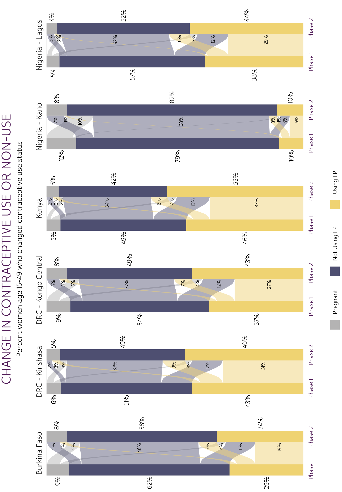

```{r, setup, echo=FALSE}
knitr::opts_chunk$set(
  echo = FALSE, 
  comment = NA, 
  message = FALSE,
  R.options = list(width = 88),
  fig.align = 'center'
)

source(here::here("r/utilities.r"))
```

# Advanced Data Visualization

```{r, echo=FALSE}
# knitr options 
knitr::opts_chunk$set(
  echo = TRUE, 
  eval = T,
  layout="l-page", 
  fig.width = 12,
  fig.height = 8,
  R.options = list(width = 100)
)

# tibble options 
options(tibble.print_min = 10)
```

In Chapter 4, we demonstrated how to calculate key family planning indicators for PMA panel surveys. We also created simple bar charts to help readers compare confidence intervals for each population estimate. 

Chapter 5 digs into  some of the other data visualization tools that are commonly used for two-phase panel data: this will include color-coded crosstabs - or **heatmaps** - and **alluvial plots** resembling those shown in the PMA Longitudinal Brief for each survey. 

R users can build heatmaps with the same [ggplot2](https://ggplot2.tidyverse.org) package featured in Chapter 4, but alluvial plots are a bit more challenging. To make things easier, we'll build ours with [ggalluvial](https://corybrunson.github.io/ggalluvial), an extension package for [ggplot2](https://ggplot2.tidyverse.org) that includes tools designed specifically for alluvial plots.^[© Cory Brunson et al. (GPL-3)]  

## Chapter Setup 

In addition to [ggalluvial](https://corybrunson.github.io/ggalluvial), we'll also load three packages featured throughout this manual: [tidyverse](https://tidyverse.tidyverse.org/), [ipumsr](https://tech.popdata.org/ipumsr/), and [srvyr](http://gdfe.co/srvyr).

```{r}
library(tidyverse)
library(ipumsr)
library(srvyr)
library(ggalluvial)
```

This chapter features the same data extract showcased in Chapter 4, which includes all six of the available samples. It is organized in **wide format** with only **Female Respondents** selected. This chapter focuses on the following variables included in that extract:

  * `r varlink(RESULTFQ)` - Result of female questionnaire
  * `r varlink(PANELWEIGHT)` - Phase 2 female panel weight
  * `r varlink(RESIDENT)` - Household residence / membership
  * `r varlink(PREGNANT)` - Pregnancy status
  * `r varlink(GEOCD)` - Province, DRC
  * `r varlink(GEONG)` - State, Nigeria
  * `r varlink(CP)` - Contraceptive user
  * `r varlink(COUNTRY)` - PMA country (preselected)
  * `r varlink(EAID)` - Enumeration area (preselected)

Recall that our analysis in Chapter 4 concerned only *de facto* panel members who completed all or part of the Female Questionnaire in both Phase 1 and Phase 2. We also excluded women who are marked "NIU (not in universe)" for a key question concerning current contraceptive use (`r varlink(CP)`). As a reminder, you can load the extract into R and select relevant cases like so:  

```{r, results='hide'}
# import the data extract and metadata files
dat <- read_ipums_micro(
  ddi = "data/pma_00106.xml",
  data = "data/pma_00106.dat.gz"
) 

# inclusion criteria for analysis
dat <- dat %>% 
  filter(
    RESULTFQ_2 == 1,  # must have completed Phase 1 FQ
    RESIDENT_1 %in% c(11, 22) & # must be de facto population (both phases)
      RESIDENT_2 %in% c(11, 22),
    CP_1 < 90 & CP_2 < 90 # must answer "current FP use" question (both phases)
  ) 
```

\newpage 

Additionally, we will reference four variables created in Chapter 4:

  * `POP` - Population of interest 
  * `STRATA_RECODE` - Sample strata (adjusted to include DRC samples)
  * `FPSTATUS_1` - Pregnant, using contraception, or using no contraception at Phase 1
  * `FPSTATUS_2` - Pregnant, using contraception, or using no contraception at Phase 2

These variables were created like so: 

```{r}
# custom variables: `POP` and `FPSTATUS`
dat <- dat %>% 
  mutate(
    # Population of interest (country + region, where applicable)
    POP = case_when(
      !is.na(GEOCD) ~ paste("DRC -", as_factor(GEOCD)),
      !is.na(GEONG) ~ paste("Nigeria -", as_factor(GEONG)),
      TRUE ~ as_factor(COUNTRY) %>% as.character()
    ),
    # strata: includes placeholder values for DRC regions 
    STRATA_RECODE = if_else(
      is.na(GEOCD), 
      as.numeric(STRATA_1), 
      as.numeric(GEOCD)
    ),
    # Family planning use-status at Phase 1 
    FPSTATUS_1 = case_when(
      PREGNANT_1 == 1 ~ "Pregnant",
      CP_1 == 1 ~ "Using FP",
      CP_1 == 0 ~ "Not Using FP"
    ), 
    # Family planning use-status at Phase 2 
    FPSTATUS_2 = case_when(
      PREGNANT_2 == 1 ~ "Pregnant",
      CP_2 == 1 ~ "Using FP",
      CP_2 == 0 ~ "Not Using FP"
    ),
    # Create factors to control order of display in graphics output 
    across(
      c(FPSTATUS_1, FPSTATUS_2),
      ~.x %>% fct_relevel("Pregnant", "Not Using FP", "Using FP")
    )
  )

```

## Grouped Bar Charts

Now let's revisit the **grouped bar chart** we made to compare `FPSTATUS_1` and `FPSTATUS_2` for each population `POP` in Chapter 4. We made this chart in basically two steps. 

First, we used [srvyr](http://gdfe.co/srvyr/index.html) to build a summary table that incorporates survey weights from `r varlink(PANELWEIGHT)` and generates a 95% confidence interval for each estimate. We used [EAID_1](https://pma.ipums.org/pma-action/variables/EAID#codes_section) to generate the cluster-robust standard errors underlying each confidence interval, and we stratified standard error estimation by `STRATA_RECODE`.

Notice that we [group_by](http://gdfe.co/srvyr/reference/group_by.html) `FPSTATUS_1` and `FPSTATUS_2` here. When we do this, [survey_mean](http://gdfe.co/srvyr/reference/survey_mean.html) estimates the proportion of outcomes represented by the variable that appears *last*, which is `FPSTATUS_2`. The proportions sum to `1.0` for each combination of `POP` and `FPSTATUS_1`: in other words, we obtain the proportion of `FPSTATUS_2` *on the condition* that women from a given `POP` held a particular status represented by `FPSTATUS_1`. For this reason, this is known as a **conditional distribution**. 

```{r}
status_tbl <- dat %>% 
  group_by(POP) %>% 
  summarise(
    .groups = "keep",
    cur_data() %>% 
      as_survey_design(weight = PANELWEIGHT, id = EAID_1, strata = STRATA_RECODE) %>%
      group_by(FPSTATUS_1, FPSTATUS_2) %>% 
      summarise(survey_mean(prop = TRUE, prop_method = "logit", vartype = "ci"))
  )

status_tbl
```

\newpage 

The **grouped bar chart** made in Chapter 4 plots the estimated values in `coef` together with the confidence interval represented by `_low` and `_upp`. This chart is useful because it packs a lot of information into a single, reader-friendly graphic. However, we also mentioned at the end of Chapter 4 that it has some considerable drawbacks. Most importantly, we weren't able to include information from the **marginal distribution** in each phase. 

```{r, echo = FALSE,  fig.height=8}
# Custom font 
library(showtext)
sysfonts::font_add(
  family = "cabrito", 
  regular = "../../fonts/cabritosansnormregular-webfont.ttf"
)
showtext::showtext_auto()
update_geom_defaults("text", list(family = "cabrito", size = 4))

pma_bars <- function(
  title = NULL,     # an optional title 
  subtitle = NULL,  # an optional subtitle 
  xaxis = NULL,     # an optional label for the x-axis (displayed above)
  yaxis = NULL      # an optional label for the y-axis (displayed left)
){
  components <- list(
    theme_minimal() %+replace% theme(
      text = element_text(family = "cabrito", size = 13),
      plot.title = element_text(size = 22, color = "#00263A",
                                hjust = 0, margin = margin(b = 5)),
      plot.subtitle = element_text(hjust = 0, margin = margin(b = 10)),
      strip.background = element_blank(),
      strip.text.y = element_text(size = 16, angle = 0),
      panel.spacing = unit(1, "lines"),
      axis.title.y = element_text(angle = 0, margin = margin(r = 10))
    ),
    labs(
      title = title, subtitle = subtitle, y = str_wrap(yaxis, 10),
      x = NULL, fill = NULL
    ),
    scale_x_continuous(
      position = 'bottom',
      sec.axis = sec_axis(trans = ~., name = xaxis, breaks = NULL),
      labels = scales::label_percent()
    ),
    scale_y_discrete(limits = rev),
    geom_bar(stat = "identity", fill = "#98579BB0"),
    geom_errorbar(
      aes(xmin = `_low`, xmax = `_upp`), 
      width = 0.2, 
      color = "#00263A"
    )
  )
}

status_tbl %>% 
  ggplot(aes(x = coef, y = FPSTATUS_2)) + 
  facet_grid(cols = vars(FPSTATUS_1), rows = vars(POP)) + 
  pma_bars(
    "CHANGE IN CONTRACEPTIVE USE OR NON-USE",
    "Percent women age 15-49 who changed contraceptive use status",
    xaxis = "Phase 1 Status",
    yaxis = "Phase 2 Status"
  )
```

A **marginal distribution** for `FPSTATUS_1` would indicate the likelihood that a woman began the survey period pregnant, using family planning, or not using family planning. Likewise the marginal distribution for `FPSTATUS_2` estimates the likelihood that a woman would hold any such status at Phase 2, *independently of* her status at Phase 1. We call these distributions "marginal" because they're usually included in the row or column margins of a crosstab. 

## Heatmaps

<aside>
For consistency, `pma_heatmap` uses the same color scheme shown in the first figure of each PMA report. 
</aside>

Let's return to `status_tbl`, but this time we'll plot it as a crosstab with `color` and `alpha` (transparency) aesthetics. This type of crosstab is usually called a **heatmap**. First, we'll wrap a few cosmetic layout options into a custom function we'll call `pma_heatmap`. Feel free to create your own theme, but we include the code used to produce ours below (you'll need the `r funlink(showtext)` package to load a custom font like "cabrito", or you can omit that part to use the R default font).  

```{r}
pma_heatmap <- function(
    title = NULL,     # an optional title 
    subtitle = NULL,  # an optional subtitle 
    xaxis = NULL,     # an optional label for the x-axis (displayed below)
    yaxis = NULL      # an optional label for the y-axis (displayed right)
){
  components <- list(
    theme_minimal() %+replace% theme(
      text = element_text(family = "cabrito", size = 13),
      axis.text = element_text(size = 10),
      strip.text.x = element_text(size = 16, margin = margin(t = 10, b = 10)),
      strip.text.y = element_text(size = 16, angle = 0),
      strip.background = element_blank(),
      axis.title.y = element_text(angle = 0, margin = margin(r = 10)),
      axis.title.y.right = element_text(angle = 0, margin = margin(l = 10)),
      axis.title.x.bottom = element_text(margin = margin(t = 20)),
      plot.title = element_text(size = 22, color = "#00263A", 
                                hjust = 0, margin = margin(b = 5)),  
      plot.subtitle = element_text(hjust = 0, margin = margin(b = 10)),
      panel.grid = element_blank(),
      panel.spacing = unit(1, "lines"),
      legend.position = "none"
    ),
    labs(title = title, subtitle = subtitle, x = xaxis, y = str_wrap(yaxis, 10)),
    scale_fill_manual(values = c(
      "Pregnant" = "#B4B3B3", "Not Using FP" = "#4E4F71", "Using FP" = "#EFD372"
    )),
    scale_color_manual(values = c("black", "white")),
    scale_y_discrete(position = "right", limits = rev)
  )
}
```

The plot is built with rectangles from [geom_tile](https://ggplot2.tidyverse.org/reference/geom_tile.html) and text labels from [geom_text](https://ggplot2.tidyverse.org/reference/geom_text.html). Then, we tell [geom_tile](https://ggplot2.tidyverse.org/reference/geom_tile.html) to use one `fill` color for each type of response in `FPSTATUS_1`: this makes it easy for the reader to see that the totals in each tile sum to 100% in columns (not rows). The `alpha` aesthetic uses the value in `coef` to control the transparency of each color (by default, our minimum value `0` would be 100% transparent). 

\newpage 

```{r}
status_tbl %>% 
  ggplot(aes(x = FPSTATUS_1, y = FPSTATUS_2)) +
  geom_tile(aes(fill = FPSTATUS_1, alpha = coef)) + 
  geom_text(aes(
    label = scales::percent(coef, 1),
    color = coef > 0.5 & FPSTATUS_1 == "Not Using FP" # white vs black text
  )) + 
  facet_wrap(~POP, nrow = 3, scales = "fixed") + 
  pma_heatmap(
    "CHANGE IN CONTRACEPTIVE USE OR NON-USE",
    "Percent women age 15-49 who changed contraceptive use status",
    xaxis = "Phase 1 Status",
    yaxis = "Phase 2 Status"
  ) 
```

The nice thing about this heatmap layout is that - compared with our bar chart - it's much easier to include data from the marginal distribution of `FPSTATUS_1` and `FPSTATUS_2`. To do so, we'll first need to add them to `status_tbl`. 

\newpage 

<aside>
We use `r funlink(dplyr::full_join)`, but both `r funlink(dplyr::left_join)` and `r funlink(dplyr::right_join)` would work equally well in this case.
</aside>

First, we use `group_by(FPSTATUS_1)` to make the column margins and `r funlink(dplyr::join)` them to `status_tbl`. (Note that we set `vartype = NULL` because we won't be able to include confidence intervals on our heatmap.)  

```{r, message=FALSE}
status_tbl <- dat %>% 
  group_by(POP) %>% 
  summarise(
    cur_data() %>% 
      as_survey_design(weight = PANELWEIGHT, id = EAID_1, strata = STRATA_RECODE) %>%
      group_by(FPSTATUS_1) %>% 
      summarise(cols = survey_mean(prop = TRUE, prop_method = "logit", vartype = NULL))
  ) %>% 
  full_join(status_tbl, ., by = c("POP", "FPSTATUS_1"))
```

Next, we use `group_by(FPSTATUS_2)` to add row margins to `status_tbl`. 

```{r, message=FALSE}
status_tbl <- dat %>% 
  group_by(POP) %>% 
  summarise(
    cur_data() %>% 
      as_survey_design(weight = PANELWEIGHT, id = EAID_1, strata = STRATA_RECODE) %>%
      group_by(FPSTATUS_2) %>% 
      summarise(rows = survey_mean(prop = TRUE, prop_method = "logit", vartype = NULL))
  ) %>% 
  full_join(status_tbl, ., by = c("POP", "FPSTATUS_2"))
```

The column margins now appear in `cols`, while the row margins appear in `rows`.

```{r}
status_tbl
```

\newpage 

Now, we can simply [paste](https://www.rdocumentation.org/packages/base/versions/3.6.2/topics/paste) these values together with the original labels from `FPSTATUS_1` and `FPSTATUS_2`.

```{r, fig.height=9}
status_tbl %>% 
  ggplot(aes(
    x = paste0(scales::percent(cols, 1), "\n", FPSTATUS_1) %>% as_factor, 
    y = paste0(scales::percent(rows, 1), "\n", FPSTATUS_2) %>% as_factor
  )) +
  geom_tile(aes(fill = FPSTATUS_1, alpha = coef)) + 
  geom_text(aes(
    label = scales::percent(coef, 1),
    color = coef > 0.5 & FPSTATUS_1 == "Not Using FP"
  )) + 
  facet_wrap(~POP, nrow = 3, scales = "free") + 
  pma_heatmap(
    "CHANGE IN CONTRACEPTIVE USE OR NON-USE",
    "Percent women age 15-49 who changed contraceptive use status",
    xaxis = "Phase 1 Status",
    yaxis = "Phase 2 Status"
  )
```

\newpage 

The information contained in our heatmap is similar to what we saw in our bar chart, except for two things:

  1. There are no error bars on our heatmap. If we wanted to include information about the confidence interval for each estimation, we would have to include [text symbols](https://search.r-project.org/CRAN/refmans/gtools/html/stars.pval.html).
  2. While both plots show information about the conditional distribution of `FPSTATUS_2` given a starting point in `FPSTATUS_1`, only the heatmap includes the marginal distribution of each variable in its row and column margins. 
  
The marginal distribution may provide crucial information about the conditional distribution that we would otherwise miss. Consider Burkina Faso, where both users and non-users of family planning at Phase 1 were generally most likely to maintain their status at Phase 2. The marginal distribution adds additional information: non-users comprise a larger share of the overall population at Phase 1.    

In certain contexts, you may want to combine information from the Phase 1 marginal distribution together with the conditional distribution of outcomes at Phase 2. To continue with our example from Burkina Faso, you might report that - because
non-users represent about 62% of the population, only about 11% of the population adopted family planning at Phase 2 following non-use at Phase 1. That is: 18% of 62% is 11%. 

In contrast with the conditional distribution, this type of distribution describes the share of the population that experiences some combination of Phase 1 and Phase 2 outcomes *without* assuming a particular starting point at Phase 1. It's known as a **joint distribution** because it gives the probability that two events will happen together (in sequence). Let's return to our summary table, `status_tbl`: to find the estimated joint distribution for each combination of `FPSTATUS_1` and `FPSTATUS_2`, you could simply multiply each value in `cols` by the value in `coef`: 

```{r, R.options = list(width = 100)}
status_tbl %>% mutate(joint = cols * coef)
```

\newpage 

In practice, you'll usually want to let [srvyr](http://gdfe.co/srvyr) calculate a confidence interval for each joint probability. To do so, we'll add an [interact](http://gdfe.co/srvyr/reference/interact.html) function listing the variables in [group_by](http://gdfe.co/srvyr/reference/group_by.html) that we want to model jointly. 

```{r, R.options = list(width = 100)}
joint_tbl <- dat %>% 
  group_by(POP) %>% 
  summarise(
    .groups = "keep",
    cur_data() %>% 
      as_survey_design(weight = PANELWEIGHT, id = EAID_1, strata = STRATA_RECODE) %>%
      group_by(interact(FPSTATUS_1, FPSTATUS_2)) %>% 
      summarise(joint = survey_mean(prop = TRUE, prop_method = "logit", vartype = "ci"))
  )

joint_tbl
```

Now, the values in `joint` sum to `1.0` for each `POP`. Returning to our heatmap, we'll want to use the same color for all columns, indicating that the percentages sum for 100% for each population. 

```{r}
joint_tbl %>% 
  ggplot(aes(x = FPSTATUS_1, y = FPSTATUS_2)) +
  geom_tile(aes(alpha = joint), fill = "#98579B") + 
  geom_text(aes(
    label = scales::percent(joint, 1),
    color = joint > 0.5 & FPSTATUS_1 == "Not Using FP"
  )) + 
  facet_wrap(~POP, nrow = 3, scales = "fixed") + 
  pma_heatmap(
    "CHANGE IN CONTRACEPTIVE USE OR NON-USE",
    "Percent women age 15-49 who changed contraceptive use status",
    xaxis = "Phase 1 Status",
    yaxis = "Phase 2 Status"
  ) 
```

Information provided by the joint distribution nuances our story a bit further. To continue with our examination of Burkina Faso: we knew that family planning users and non-users at Phase 1 were each most likely to maintain, rather than switch their status at Phase 2. However, it's now clear that *continuous non-users* (non-users at both Phase 1 and Phase 2) represent a near-majority of the population.

## Alluvial plots 

**Alluvial plots** are an especially popular way to visualize longitudinal data, in part, because they combine information from each of the three distributions we've discussed. They also make it possible to show data from more than two variables (we'll use them again when Phase 3 data become available). You'll find alluvial plots on the first two pages of the PMA report for each sample. 

In an alluvial plot, the marginal distribution of responses for each variable are usually plotted in vertical stacks. The [ggalluvial](https://corybrunson.github.io/ggalluvial/index.html) package authors refer to these stacks as "strata", and they may be layered onto a [ggplot](https://ggplot2.tidyverse.org/reference/ggplot.html) with [geom_stratum](https://corybrunson.github.io/ggalluvial/reference/geom_stratum.html). In our case, the strata will show the marginal distribution of women in `FPSTATUS_1` and `FPSTATUS_2`. 

The **joint distribution** for any pair of variables is plotted in horizontal splines called "alluvia", which bridge the space between any given pair of strata. Alluvia are plotted with [geom_flow](https://corybrunson.github.io/ggalluvial/reference/geom_flow.html). 

Finally, we'll use color to map each alluvium with an originating stratum from `FPSTATUS_1`. This will help the reader visualize the conditional distribution of `FPSTATUS_2` responses given a starting point in `FPSTATUS_1`. 

To begin, let's revisit `joint_tbl`, which only contains the joint distribution for `FPSTATUS_1` and `FPSTATUS_2`. In fact, [ggalluvial](https://corybrunson.github.io/ggalluvial/index.html) will calculate the marginal distribution for both variables automatically if we reshape `joint_tbl` with [pivot_longer](https://tidyr.tidyverse.org/reference/pivot_longer.html) like so: 

```{r, R.options = list(width = 100)}
joint_tbl <- joint_tbl %>% 
  rowid_to_column("alluvium") %>% 
  pivot_longer(c(FPSTATUS_1, FPSTATUS_2), names_to = "x", values_to = "stratum") %>% 
  mutate(x = ifelse(x == "FPSTATUS_1", "Phase 1", "Phase 2")) %>% 
  arrange(x, alluvium)

joint_tbl
```

Here, we create the column `alluvium` to hold the original row number for each of the 56 combinations of `POP`, `FPSTATUS_1`, and `FPSTATUS_2`. When we [pivot_longer](https://tidyr.tidyverse.org/reference/pivot_longer.html), we repeat the value in `joint` once for each end of the same `alluvium`. The values in `stratum` describe the strata to to which each alluvium is attached, and `x` indicates whether the stratum is located in the Phase 1 or Phase 2 stack. 

<aside>
For consistency, `pma_alluvial` uses the same color scheme shown in the first alluvial plot in each PMA report.
</aside>

As with our heatmap, we'll want to define some custom fonts, color, and layout options in a function we'll call `pma_alluvial`: 

```{r}
pma_alluvial <- function(
    title = NULL,     # an optional title 
    subtitle = NULL,  # an optional subtitle 
    xaxis = NULL,     # an optional label for the x-axis (displayed below)
    yaxis = NULL      # an optional label for the y-axis (displayed left)
){
  components <- list(
    theme_minimal() %+replace% theme(
      text = element_text(family = "cabrito", size = 13),
      plot.title = element_text(size = 22, color = "#541E5A", 
                                hjust = 0.5, mar = margin(b = 5)),
      plot.subtitle = element_text(hjust = 0.5, margin = margin(b = 20)),
      strip.background = element_blank(),
      strip.text.x = element_text(size = 13, margin = margin(b = 5)),
      axis.text.x = element_text(color = "#541E5A", margin = margin(t = 5, b = 10)),
      axis.text.y = element_blank(),
      panel.spacing = unit(1, "lines"),
      plot.margin = margin(0, 100, 0, 100),
      legend.position = "bottom",
      legend.title = element_blank(),
      legend.spacing.x = unit(10, "pt"),
      panel.grid = element_blank()
    ),
    labs(
      title = title,
      subtitle = subtitle,
      x = xaxis,
      y = str_wrap(yaxis, 10),
    ),
    scale_fill_manual(values = c(
      "Pregnant" = "#B4B3B3", 
      "Not Using FP" = "#4E4F71", 
      "Using FP" = "#EFD372"
    )),
    scale_y_continuous(expand = c(0, 0))
  )
}
```

\newpage 

We'll start by mapping common aesthetics in a [ggplot](https://ggplot2.tidyverse.org/reference/ggplot.html) function. We'll map the values in `x` onto our x-axis, and we'll map the values in `joint` onto the y-axis. The remaining aesthetics are specific to the functions from [ggalluvial](https://corybrunson.github.io/ggalluvial/index.html): we'll use `stratum` to build vertical strata and to define colors mapped with "fill". We also use the identifying numbers in `alluvium` to organize responses into alluvia.

The remaining functions are straightforward, since they mainly use information passed from [ggplot](https://ggplot2.tidyverse.org/reference/ggplot.html). We make only one small modification to [geom_stratum](https://corybrunson.github.io/ggalluvial/reference/geom_stratum.html): setting `size = 0` removes border lines that appear around each stratum, by default. 

```{r, fig.width=18, fig.height=10, message=FALSE, warning=FALSE}
status_alluvial <- joint_tbl %>% 
  ggplot(aes(
    x = x, 
    y = joint,
    fill = stratum,
    stratum = stratum,
     alluvium = alluvium
  )) + 
  geom_flow() + 
  geom_stratum(size = 0) + 
  facet_wrap(~POP, scales = "free_x", nrow = 1) + 
  pma_alluvial(
    "CHANGE IN CONTRACEPTIVE USE OR NON-USE",
    "Percent women age 15-49 who changed contraceptive use status",
  ) 

status_alluvial
```

\newpage 

Of course, you should always include either y-axis gridlines or text labels for the probabilities shown on a plot like this one. We find it clearer to include the latter, which we'll build with [geom_text](https://ggplot2.tidyverse.org/reference/geom_text.html). 

<aside>
Values may not add to 100% due to rounding (values rounded to 0% are not labelled).
</aside>

These labels are a bit tricky, but the basic idea is that you use `stat = "stratum"` to label strata, and `stat = "flow"` to label alluvia. Then, you use [after_stat](https://ggplot2.tidyverse.org/reference/aes_eval.html) to build labels from statistics that [ggalluvial](https://corybrunson.github.io/ggalluvial/index.html) uses to construct the plot - check out [this list](https://corybrunson.github.io/ggalluvial/reference/stat_stratum.html#computed-variables) of available statistics for details. We'll use the `prop` statistic to obtain *both* the marginal and joint probabilities.

```{r, eval = FALSE}
status_alluvial +
  geom_text(
    stat = "stratum",   # label strata
    aes(label = ifelse( 
      x == 1, # labels the strata for Phase 1, otherwise blank ""           
      scales::percent(after_stat(prop), 1), 
      ""
    )),
    nudge_x = -0.2,  # nudge a bit to the left 
    hjust = "right", # right-justify
  ) + 
  geom_text(
    stat = "stratum", # label strata
    aes(label = ifelse(
      x == 2, # labels the strata for Phase 2, otherwise blank ""    
      scales::percent(after_stat(prop), 1), 
      ""
    )),
    nudge_x = 0.2,  # nudge a bit to the right 
    hjust = "left", # left-justify
  ) +
  geom_text(
    stat = "flow",   # label alluvia 
    aes(label = ifelse( 
      after_stat(flow) == "to" &  # only label the destination (right-side)
        after_stat(prop) >= 0.01, # hide if 0%
      scales::percent(after_stat(prop), 1), 
      "" 
    )),
    nudge_x = -0.2,  # nudge a bit to the left
    hjust = "right", # right-justify
    size = 3         # use a slightly smaller font 
  ) 
```

Now, it's easy to identify the proportion of women at each phase *and* the proportion who switched or maintained their status between phases. If possible, we recommend aligning alluvial plots for every sample in a single row as shown: this allows the readers to visually compare the relative size of strata and alluvia across samples. 

\newpage 

```{r, echo=FALSE, out.width="90%"}

```

