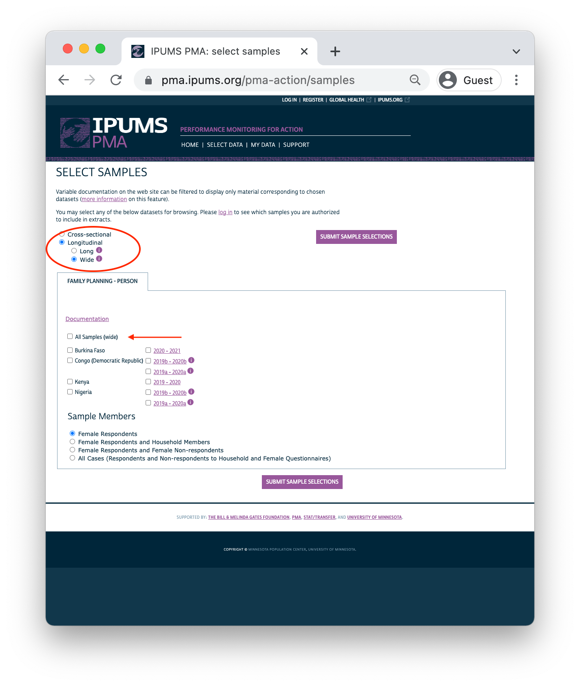
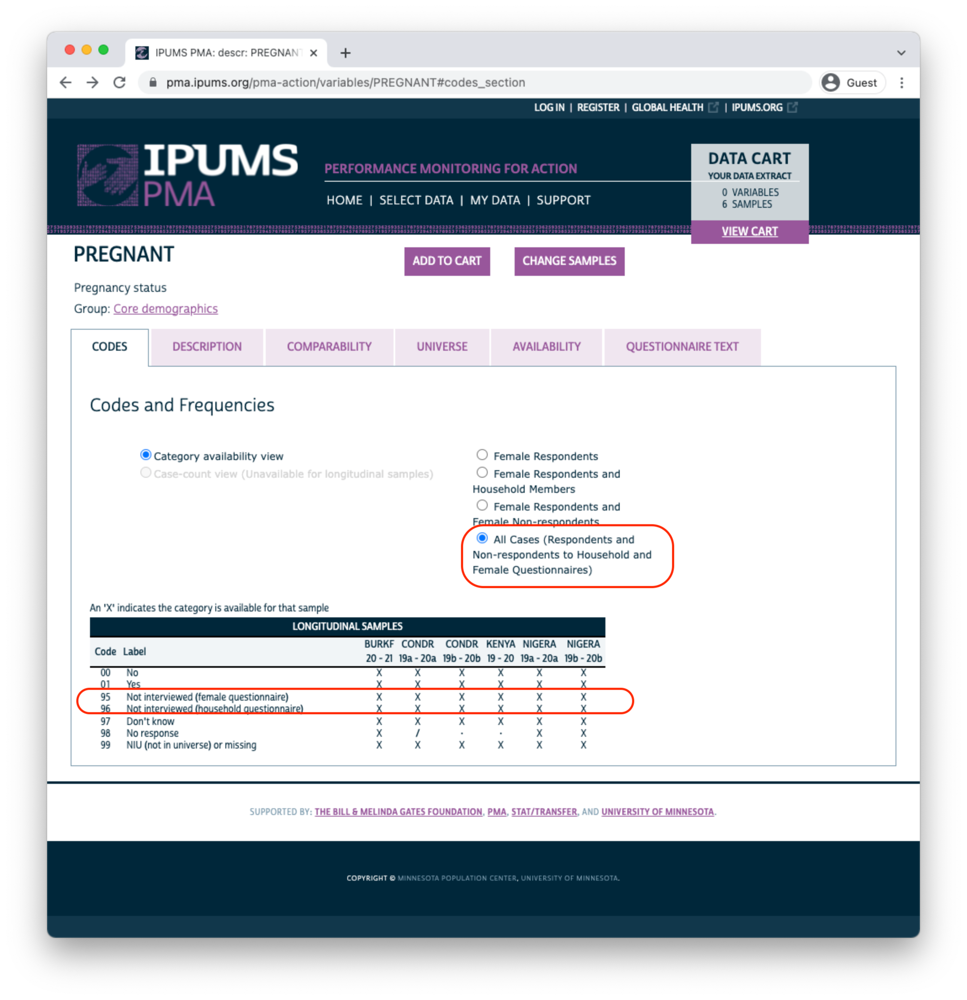
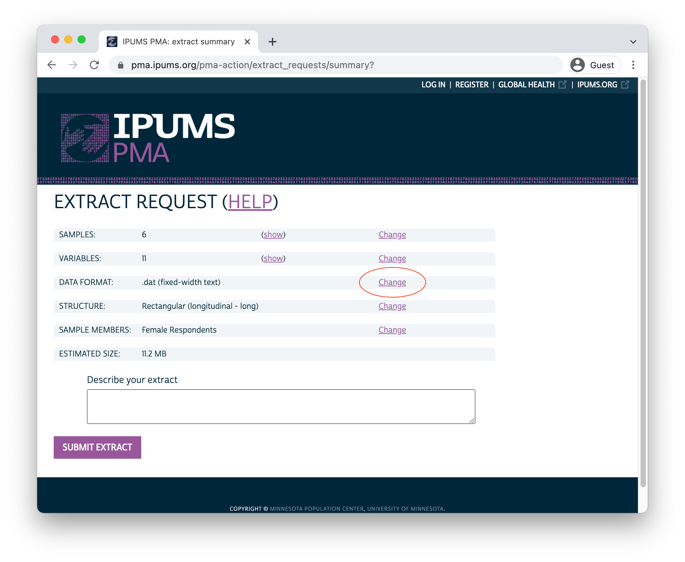

```{r, setup, echo=FALSE}
knitr::opts_chunk$set(
  echo = FALSE, 
  comment = NA, 
  message = FALSE,
  R.options = list(width = 88),
  fig.align = "center"
)

source(here::here("r/utilities.r"))
```

# Longitudinal Data Extracts

```{r, echo=FALSE, results='hide'}
knitr::opts_chunk$set(echo = FALSE, eval = TRUE, out.width = "85%")
```

This chapter provides a guided tour of the [IPUMS PMA data extract system](https://pma.ipums.org/pma/). While you may also access the original data directly from our partners at [PMA](https://www.pmadata.org/), harmonized data from IPUMS have a few additional features. For instance, you can request an extract that: 

<aside>
[Register here](https://pma.ipums.org/pma/register.shtml) to access IPUMS PMA data **at no cost.** See our [user guide](https://pma.ipums.org/pma/userguide.shtml) for details.
</aside>

  - includes samples from multiple countries  
  - includes samples from multiple rounds of data collection 
  - are formatted in either **long** or **wide** format 

IPUMS PMA also makes it easy to switch between multiple [units of analysis](https://pma.ipums.org/pma-action/variables/group) covered in PMA surveys. In addition to the data featured in this guide, you'll find surveys representing: 

<aside>
A video tour of the longitudinal extract system is available [here](https://www.youtube.com/embed/VwjYHDvpHk0) on the IPUMS PMA Youtube channel. 
</aside> 

  - [Service Delivery Points (SDPs)](https://tech.popdata.org/pma-data-hub/#category:Service_Delivery_Points)
  - [Client Exit Interviews conducted at SDPs](https://tech.popdata.org/pma-data-hub/#category:Client_Exit_Interviews)
  - Participants in special surveys covering topics like [COVID-19](https://tech.popdata.org/pma-data-hub/#category:COVID-19), [nutrition](https://tech.popdata.org/pma-data-hub/#category:Nutrition), and maternal & newborn health 
  
To get started with a longitudinal data extract, you'll need to select the **Family Planning** topic under the **Person** unit of analysis. 

```{r, out.width="85%"}
knitr::include_graphics("images/unit.png")
```

## Sample Selection

Once you've selected the **Family Planning** option, you'll next need to choose between cross-sectional or longitudinal samples. Cross-sectional samples are selected by default; these are nationally or sub-nationally representative samples collected each year dating backward as far as 2013.

```{r}
knitr::include_graphics("images/cross-sectional.png")
```

<aside>
Annual cross-sectional samples are also available for each of the countries participating in the new PMA panel study. See our [last post](../2022-03-01-phase2-discovery/) for details.
</aside>

Longitudinal samples are only available from 2019 onward, and they include all of the available phases for each sampled country (sub-nationally representative samples for DRC and Nigeria are listed separately). You'll only find longitudinal samples for countries where Phase 2 data has been made available; Phase 1 data for Cote d'Ivoire, India, and Uganda can currently be found under the Cross-sectional sample menu (Phase 2 data will be released soon!). 

\newpage 

Clicking the Longitudinal button reveals options for either **long** or **wide** format. You'll find the same samples available in either case.

**Important:** if you decide to change formats after selecting variables, your Data Cart will be emptied and you'll need to begin again from scratch.

```{r}

```

\newpage 

After you've selected one of the available longitudinal formats, choose one or more samples listed below. There are also several Sample Members options listed.

```{r}
knitr::include_graphics("images/cases.png")
```

<aside>
`r varlink(PANELWOMAN)` indicates whether an individual is a member of the panel study. 

`r varlink(RESULTFQ)` indicates whether an individual completed the Female Questionnaire. 
</aside>

**Female Respondents** only includes women who completed *all or part* of a Female Questionnaire. **This option selects all members of the panel study.** In addition, it includes women who only participated in only one phase - we will demonstrate how to identify and drop these cases below.^[Women who completed all or part of the Female Questionnaire in *more than one phase* of the study are considered **panel members**. Women who completed it only at Phase 1 are included in a longitudinal extract, but they are not **panel members**. Likewise, women who completed it for the first time at Phase 2 are included, but are not **panel members** if they 1) will reach age 50 before Phase 3, or 2) declined the invitation to participate again in Phase 3.]  

**Female Respondents and Female Non-respondents** includes all women who were eligible to participate in a Female Questionnaire. Eligible women are those age 15-49 who were listed on the roster collected in a Household Questionnaire. If an eligible woman declined the Female Questionnaire or was not available, variables associated with that questionnaire will be coded "Not interviewed (female questionnaire)".

\newpage 

<aside>
`r varlink(ELIGIBLE)` indicates whether an individual was eligible for the female questionnaire.

`r varlink(RESULTHQ)` indicates whether a member of the individual's household completed the Household Questionnaire. 
</aside>

**Female Respondents and Household Members** adds records for all other members of a Female Respondent's household. These household members did not complete the Female Questionnaire, but were listed on the household roster provided by the respondent to a Household Questionnaire. Basic [demographic](https://internal.pma.ipums.org/pma-action/variables/group?id=hh_roster) variables are available for each household member, as are common [wealth](https://internal.pma.ipums.org/pma-action/variables/group?id=hh_wealth), [water](https://internal.pma.ipums.org/pma-action/variables/group?id=water_watersource), [sanitation](https://internal.pma.ipums.org/pma-action/variables/group?id=water_wash), and other variables shared for all members of the same household.  

**All Cases** includes all members listed on the household roster from a Household Questionnaire. If the Household Questionnaire was declined or if no respondent was available, any panel member appearing in other phases of the study will be coded "Not interviewed (household questionnaire)" for variables associated with the missing Household Questionnaire. 

After you've selected samples and sample members for your extract, click the "Submit Sample Selections" button to return to the main data browsing menu.

## Variable Selection

You can browse IPUMS PMA variables by topic or alphabetically by name, or you can [search](https://pma.ipums.org/pma-action/variables/search) for a particular term in a variable name, label, value labels, or description. 

```{r}
knitr::include_graphics("images/topics.png")
```

\newpage 

In this example, we'll select the [Discontinuation of Family Planning](https://pma.ipums.org/pma-action/variables/group?id=fem_fpst) topic. The availability of each associated variable is shown in a table containing all of the samples we've selected. 

  * `X` indicates that the variable is available for *all phases*
  * `/` indicates that the variable is available for *one phase*
  * `-` indicates that the variable is not available for *any phase*
  
You can click the `+` button to add a variable to your cart, or click a variable name to learn more.
  
```{r}
knitr::include_graphics("images/table.png")
```

### Codes 

<aside>
"Case-count view" is not available for longitudinal samples, where each sample includes data from multiple phases. For cross-sectional samples, this option shows the frequency of each response.
</aside>

Let's take a look at the variable `r varlink(PREGNANT)`. You'll find the variable name and label shown at the top of the page. Below, you'll see several tabs beginning with the [CODES](https://pma.ipums.org/pma-action/variables/PREGNANT#codes_section) tab. For discrete variables, this tab shows all of the available codes and value labels associated with each response. You'll also see the same `X`, `/`, and `-` symbols in a table indicating the availability of each response in each sample.

```{r}
knitr::include_graphics("images/codes-fr.png")
```

\newpage

Above, there are no responses for "Not interviewed (female questionnaire)" and "Not interviewed (household questionnaire)"; this is because only samples members included in a "Female Respondents" extract are displayed by default. If we instead choose "All Cases", this variable will include those response options because we'll include every person listed on the household roster (even if the Household or Female Questionnaire was not completed). 

```{r}

```

\newpage

The symbol `/` again indicates that a particular response is available for some - but not all - phases of the study. For `PREGNANCY` it indicates that one of the options was either unavailable or was not selected by any sample respondents in a particular phase. If a variable was not included in all phases of the study, all response options will be marked with this symbol. For example, consider the variable `r varlink(COVIDCONCERN)`, indicating the respondent's level of concern about becoming infected with COVID-19.  

```{r}
knitr::include_graphics("images/covidconcern.png")
```

Because Phase 1 questionnaires were administered prior to the emergence of COVID-19, this variable only appeared on Phase 2 questionnaires. The symbol `/` indicates limited availability across phases. 

### Variable Description

You'll find a detailed description for each variable on the [DESCRIPTION](https://pma.ipums.org/pma-action/variables/PREGNANT#description_section) tab. This tab also indicates whether a particular question appeared on the Household or Female Questionnaire.

```{r}
knitr::include_graphics("images/desc.png")
```

### Comparability Notes

The [COMPARABILITY](https://pma.ipums.org/pma-action/variables/PREGNANT#comparability_section) tab describes important differences between samples. Additionally, it may contain information about similar variables appearing in [DHS](https://dhsprogram.com/) samples provided by [IPUMS DHS](https://www.idhsdata.org/idhs/). 

```{r}
knitr::include_graphics("images/comp.png")
```

### Sample Universe

The [UNIVERSE](https://pma.ipums.org/pma-action/variables/PREGNANT#universe_section) tab describes selection criteria for this question. In this case, there are some differences between samples: 

  * In DRC samples, all women aged 15-49 received this question.
  * For all other samples, the question was skipped if any such woman previously indicated that she was menopausal or had a hysterectomy.
  
```{r}
knitr::include_graphics("images/universe.png")
```

### Availability Across Samples

The [AVAILABILITY](https://pma.ipums.org/pma-action/variables/PREGNANT#availability_section) tab shows all other samples (including cross-sectional samples) where this variable is available. 

```{r}
knitr::include_graphics("images/avail.png")
```

### Questionnaire Text 

Finally, you'll find the full text of each question on the [QUESTIONNAIRE TEXT](https://pma.ipums.org/pma-action/variables/PREGNANT#questionnaire_text_section) tab. Each phase of the survey is shown separately, and you may click the "view entire document: text" link to view the complete questionnaire for a particular sample in any given phase. 

```{r}
knitr::include_graphics("images/question.png")
```

### Checkout 

Use the buttons at the top of this page to add the variable to your Data Cart, or to "VIEW CART" and begin checkout. 

```{r, fig.align='center'}
# knitr::include_graphics("images/buttons.png")
htmltools::img(
  src = "images/buttons.png",
  style = 
    "margin-top: 20px; margin-bottom: 25px; max-width: 100%; width: 1033px;"
)
```

## Data for R Users

Your Data Cart shows all of the variables you've selected, plus several "preselected" variables that will be automatically included in your extract. Click the "CREATE DATA EXTRACT" button to prepare your download. 

```{r}
knitr::include_graphics("images/cart.png")
```

### Select a Fixed-width File

Before you submit an extract request, you'll have the opportunity to choose a "Data Format". **R users should selected Fixed-width text (.dat)** - you'll notice that data formatted for Stata, SPSS, and SAS are also available. CSV files are provided, but not recommended. (If you wish to change Sample Members, you may do so again here.) 

```{r}

```

Once the Fixed-width option is selected, you may add a description and then proceed to the download page.

### Download 

After a few moments, you'll receive an email indicating that your extract has been created. You'll need to obtain two files from the download page: 

  * Click the green "Download DAT" button to download the data file. You'll receive a file with a number like `pma_00001.dat.gz`.  
  * Right click on "DDI" and click "Save link as". You'll receive a corresponding XML file like `pma_00001.xml`. 


```{r, fig.align='center'}
# knitr::include_graphics("images/download.png")
htmltools::img(
  src = "images/download.png", 
  style = "margin-top: 20px; margin-bottom: 25px;"
)
```

Place both files in a folder that R can use as its [working directory](https://r4ds.had.co.nz/workflow-projects.html?q=working%20directory#where-does-your-analysis-live). We **strongly recommend** using [RStudio projects](https://r4ds.had.co.nz/workflow-projects.html?q=working%20directory#rstudio-projects) to manage all of the files and analysis scripts used for a particular research project. We'll place our files in a subfolder called "data" within our own RStudio project folder. 

Open RStudio (or R) and load the packages `r funlink(ipumsr)` and `r funlink(tidyverse)`. If you are not using an RStudio project, you will need to change your working directory to match the location of your downloaded files. 

```{r, eval=FALSE, echo=TRUE}
library(ipumsr)
library(tidyverse)
setwd("~/Downloads") # ONLY if not using an RStudio project (change as needed)
```

We’ll now demonstrate loading both a long and a wide extract, and we’ll take a brief look at the structure of each.

```{r}
knitr::opts_chunk$set(echo = TRUE, eval = TRUE)
```

## Long Data Structure

We've downloaded a **long** data extract (Female Respondents only) and saved it in a folder called "data" in our working directory. We'll now load it into R as an object called `long`. 

To load an IPUMS PMA extract into R, you'll need to reference *both* the DDI file *and* the fixed-width data file in the function `r funlink(ipumsr::read_ipums_micro)` from `ipumsr`.

```{r, results='hide'}
long <- read_ipums_micro(
  ddi = "data/pma_00095.xml",
  data = "data/pma_00095.dat.gz"
)
```

In a **long** extract, data from each phase will be organized in *separate rows*. Here, responses from three panel members are shown: 

```{r}
long %>% 
  filter(FQINSTID %>% str_starts("011") | FQINSTID %>% str_starts("015")) %>% 
  arrange(FQINSTID) %>% 
  select(FQINSTID, PHASE, AGE, PANELWOMAN)
```

Each panel member receives a unique ID shown in `r varlink(FQINSTID)`. The variable `r varlink(PHASE)` shows that each woman's responses to the Phase 1 Female Questionnaire appears in the first row, while her Phase 2 responses appear in the second. `r varlink(AGE)` shows each woman's age when she completed the Female Questionnaire for each phase.

`r varlink(PANELWOMAN)` indicates whether the woman completed all or part of the Female Questionnaire in a *prior* phase, and that she'd agreed to continue participating in the panel study at that time. The value `NA` appears in the rows for Phase 1, as `PANELWOMAN` was not included in Phase 1 surveys. 

\newpage 

We mentioned above that you'll also include responses from some non-panel members when you request an extract with Female Respondents. These include women who did not complete all or part the Female Questionnaire in a prior phase, as indicated by `r varlink(PANELWOMAN)`. These women are not assigned a value for `r varlink(FQINSTID)` - instead, you'll find an empty string:

```{r}
long %>% count(PHASE, PANELWOMAN, FQINSTID == "")
```

For most longitudinal analysis applications, you'll need to drop non-panel members together with any women who did not fully complete the Phase 2 Female Questionnaire. We'll demonstrate using [group_by](https://dplyr.tidyverse.org/reference/group_by.html) to ensure that there is one row for every `r varlink(FQINSTID)` where `PHASE == 1` and another row where `PHASE == 2 & RESULTFQ == 1`. 

```{r}
long <- long %>% 
  group_by(FQINSTID) %>% 
  filter(any(PHASE == 1) & any(PHASE == 2 & RESULTFQ == 1)) %>% 
  ungroup() 
```

The [PMA Longitudinal Briefs](../2022-03-01-phase2-discovery/index.html#inclusion-criteria-for-analysis) published for each sample also include only members of the *de facto* population. These are women who slept in the household during the night prior to the interview for each Household Questionnaire, such that `r varlink(RESIDENT)` takes the value `11` or `22`. We'll use [group_by](https://dplyr.tidyverse.org/reference/group_by.html) again to include only *de facto* women from both phases. 

```{r}
long <- long %>% 
  group_by(FQINSTID) %>% 
  filter(all(RESIDENT %in% c(11, 22))) %>% 
  ungroup() 
```

\newpage 

Following these steps, you can check the size of each analytic sample like so. (Reminder: samples for DRC and Nigeria are sub-nationally representative, so we'll show separate frequencies for each `r varlink(GEOCD)` and `r varlink(GEONG)`). 

```{r}
long %>% count(COUNTRY, GEOCD, GEONG, PHASE)
```

## Wide Data Structure

We've also downloaded a **wide** data extract (Female Respondents only) and saved it in the "data" folder in our working directory. We'll also load this extract into R as an object named `wide`. 

```{r, results='hide', eval = TRUE}
wide <- read_ipums_micro(
  ddi = "data/pma_00084.xml",
  data = "data/pma_00084.dat.gz"
)
```

In a **wide** extract, all of the responses from one woman appear in the *same row*. The IPUMS extract system appends a numeric suffix to each variable name corresponding with the phase from which it was drawn. Consider our three example panel members again: 

```{r}
wide %>% 
  filter(FQINSTID %>% str_starts("011") | FQINSTID %>% str_starts("015")) %>% 
  select(FQINSTID, AGE_1, AGE_2, PANELWOMAN_1, PANELWOMAN_2)
```

Each panel member has one unique ID shown in `r varlink(FQINSTID)`. However, `r varlink(AGE)` is parsed into two columns: `AGE_1` shows each woman's age at Phase 1, and `AGE_2` shows her age at Phase 2. 

As we've discussed, `r varlink(PANELWOMAN)` is not available for Phase 1, as it indicates whether the woman completed all or part of the Female Questionnaire in a *prior* phase. For this reason, all values in `PANELWOMAN_1` are `NA`. Most variables are copied once for each phase, even if they - like `PANELWOMAN_1` - are not available for all phases. 

\newpage 

You might expect the total length of a **wide** extract to be half the length of a corresponding **long** extract. This is not the case! A **wide** extract includes one row for each woman who completed all or part of the Female Questionnaire *for any phase* - you'll find placeholder columns for phases where the interview was not conducted. 

```{r}
wide %>% 
  filter(FQINSTID == "0C8VQU6B03BXLAVVZ8SB90EKQ") %>% 
  select(RESULTFQ_1, AGE_1, RESULTFQ_2, AGE_2)
```

In a **long** extract, rows for the missing phase are dropped. In this example, the woman was "not at home" for the Phase 2 Female Questionnaire. When we select a **long** extract containing only Female Respondents, her Phase 2 row is excluded automatically (it will be included if you request an extract containing Female Respondents and Female Non-respondents). 

```{r, results='hide', echo = FALSE}
long <- read_ipums_micro(
  ddi = "data/pma_00095.xml",
  data = "data/pma_00095.dat.gz"
)
```

```{r}
long %>% 
  filter(FQINSTID == "0C8VQU6B03BXLAVVZ8SB90EKQ") %>% 
  select(PHASE, RESULTFQ, AGE)
```

Again: for most longitudinal analysis applications, you'll need to remove cases where women were not interviewed for Phase 1 or where the Phase 2 Female Questionnaire was not completed: 

```{r}
wide <- wide %>% filter(RESULTFQ_2 == 1 & !is.na(RESULTFQ_1)) 
```

The *de facto* population appearing in [PMA Longitudinal Briefs](../2022-03-01-phase2-discovery/index.html#inclusion-criteria-for-analysis) is defined in **wide** extracts by cases where the values `11` or `12` appear in *both* `RESIDENT_1` and `RESIDENT_2`:

```{r}
wide <- wide %>% filter(RESIDENT_1 %in% c(11, 22) & RESIDENT_2 %in% c(11, 22))
```

\newpage 

Following these steps, each analytic sample contains the same number of cases shown in the final **long** format extract above. 

```{r}
wide %>%
  group_by(COUNTRY, GEOCD, GEONG) %>%
  count()
```

## Which format is best for me? 

The choice between **long** and **wide** formats ultimately depends on your research objectives. 

Many data manipulation tasks, for example, are faster and easier to perform in the **wide** format. In the example above, we needed to identify women who completed a Female Questionnaire and were members of the *de facto* population in both phases. In the **long** format, we first had to group the data by `FQINSTID` with [group_by](https://dplyr.tidyverse.org/reference/group_by.html), thereby ensuring that a Phase 1 and Phase 2 check could be performed for each woman. In preparing for this post, this approach took about 36.5 seconds. By comparison, the same task was achieved without [group_by](https://dplyr.tidyverse.org/reference/group_by.html) in **wide** format in just 0.16 seconds. If your workflow requires multiple comparisons between phases, the **wide** format may be the best choice! 

On the other hand, many of the longitudinal modeling packages available for R require data to be in a **long** format - this includes both the [survival](https://cran.r-project.org/web/packages/survival/index.html) package for Cox regression and the [lme4](https://github.com/lme4/lme4) package for multilevel models. Users who prefer the **wide** format for data cleaning and exploration can manually switch to **long** format with help from [pivot_longer](https://tidyr.tidyverse.org/reference/pivot_longer.html), for example:

```{r}
wide %>% select(FQINSTID, AGE_1, PREGNANT_1, AGE_2, PREGNANT_2)
```

\newpage 

With [pivot_longer](https://tidyr.tidyverse.org/reference/pivot_longer.html), you can strip the suffix `1` or `2` from each variable, placing the result in a new column called `PHASE`. Then, we'll pivot each woman's age and pregnancy status from 2 **wide** columns into a single **long** one. 

```{r}
wide %>% 
  select(FQINSTID, AGE_1, PREGNANT_1, AGE_2, PREGNANT_2) %>% 
  pivot_longer(
    !FQINSTID, 
    names_pattern = "(.*)_([1-2])",
    names_to = c(".value", "PHASE")
  )
```

Manipulating patterns in variable names with  [pivot_longer](https://tidyr.tidyverse.org/reference/pivot_longer.html) takes practice, and we imagine many users will find it easier to simply work with data in the **long** format from the beginning.

Fortunately, the IPUMS PMA extract system makes it easy to select the samples, sample members, and variables that matter to your particular research question. Choices for **long** and **wide** data formats save an additional data cleaning step, allowing you to jump into longitudinal analysis as quickly as possible. 
