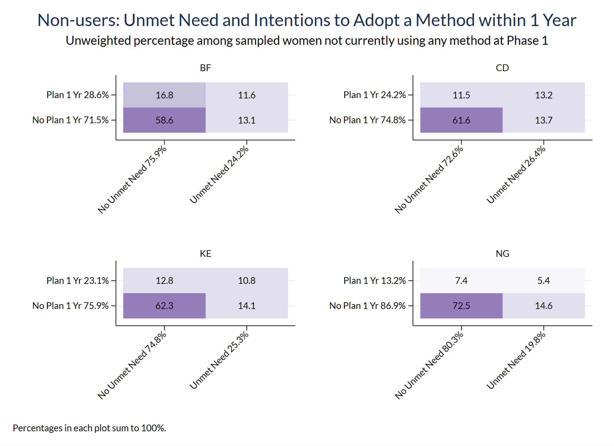
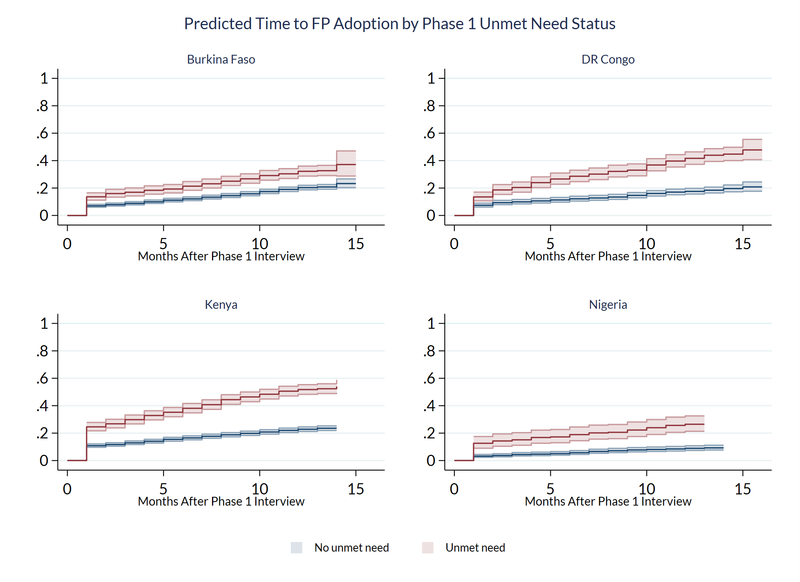
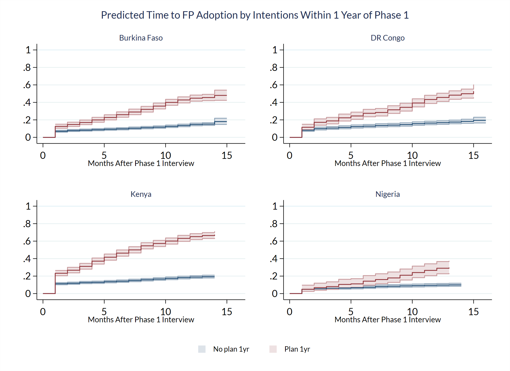

```{r, setup, echo=FALSE}
knitr::opts_chunk$set(
  eval = FALSE,
  echo = TRUE, 
  comment = NA, 
  message = FALSE,
  R.options = list(width = 88),
  fig.align = 'center'
)

source(here::here("r/utilities.r"))
```


# Contraceptive Calendar

As we've seen, PMA panel surveys represent annual interviews that will ultimately include three phases of data collection. Most questions will be repeated for a total of three observations each spaced one year apart. However, some data in PMA panel surveys are reported *monthly* up to three years prior to the interview in each phase. These data are provided as a comma-delimited character string known as the **Contraceptive Calendar**. 

Chapter 6 includes code you can use to parse and analyze data from the **Contraceptive Calendar**. These data are particularly exciting because they offer researchers an opportunity to explore longitudinal analysis techniques like [survival analysis](https://www.stata.com/manuals/st.pdf) to model the duration of events like: 

  - continuous use (or non-use) of a contraceptive method
  - birth spacing 
  - pregnancies leading to birth or termination 
  
To demonstrate, we'll test whether women with [unmet need](https://pma.ipums.org/pma-action/variables/UNMETYN#codes_section) or [plans to adopt](https://pma.ipums.org/pma-action/variables/FPPLANWHEN#codes_section) a family planning method at Phase 1 were quicker to begin using one in the months between Phase 1 and Phase 2. 
  
The term "survival analysis" refers to the probability that a person "survives" a particular condition for a given period of time, most commonly in clinical research settings. In the social sciences, this type of analysis is also known as "event history", "time-to-event", or "duration" analysis. We use the term "survival" in order to match the terminology used in Stata's [survival time](https://www.stata.com/manuals/st.pdf) commands featured in this chapter. 

## Chapter Setup

Two calendar variables are available for each country in the PMA panel study. The main calendar - which we refer to as the **Contraceptive Calendar** - is named as follows: 

  * `r slink(CALENDARBF)`
  * `r slink(CALENDARCD)`
  * `r slink(CALENDARKE)`
  * `r slink(CALENDARNG)`
  
This calendar represents contraceptive use, pregnancy, pregnancy termination, and birth information for each month preceding the interview for the Female Questionnaire in a particular phase of the panel study. Women are asked to recall their status for each month in the calendar period, and their responses are recorded in a single comma-delimited string with the following codes: 

  * `B` - Birth
  * `P` - Pregnant
  * `T` - Pregnancy ended
  * `0` - No family planning method used
  * `1` - Female Sterilization
  * `2` - Male Sterilization
  * `3` - Implant
  * `4` - IUD
  * `5` - Injectables
  * `7` - Pill
  * `8` - Emergency Contraception
  * `9` - Male Condom
  * `10` - Female Condom
  * `11` - Diaphragm
  * `12` - Foam / Jelly
  * `13` - Standard Days / Cycle beads
  * `14` - LAM
  * `30` - Rhythm method
  * `31` - Withdrawal
  * `39` - Other traditional methods

For example, consider a woman sampled in Kenya who gave birth during the month of the interview following 8 prior months of pregnancy. If she had used the pill every month up until the month she became pregnant, her string in `r slink(CALENDARKE)` would look like this:

`B,P,P,P,P,P,P,P,P,7,7,7,7,7,7,7,7,7,7,7,7,7,7,7,7,7,7,7,7,7,7,7,7,7,7,7`

\newpage 

The second calendar is the **Discontinuation Calendar**, and it gives the *reason why* a woman stopped using a contraceptive method for each month following an episode of continuous use. This calendar is represented by the following variables: 

  * `r slink(CALENDARBFWHY)`
  * `r slink(CALENDARCDWHY)`
  * `r slink(CALENDARKEWHY)`
  * `r slink(CALENDARNGWHY)`


Like the **Contraceptive Calendar**, the **Discontinuation Calendar** is a single comma-delimited string. It contains the following codes for months when a method was discontinued (and is blank otherwise): 

  * `1` - Infrequent sex / husband away
  * `2` - Became pregnant while using
  * `3` - Wanted to become pregnant
  * `4` - Husband / partner disapproved
  * `5` - Wanted more effective method
  * `6` - Side effects / health concerns
  * `7` - Lack of access / too far
  * `8` - Costs too much
  * `9` - Inconvenient to use
  * `10` - Up to God / fatalistic
  * `11` - Difficult to get pregnant / menopausal
  * `12` - Marital dissolution / separation
  * `96` - Other
  
Returning to our example, if the same woman reported that she stopped using the pill because she wanted to become pregnant, her string in `slink(CALENDARKEWHY)` would look like this:
  
`,,,,,,,,,3,,,,,,,,,,,,,,,,,,,,,,,,,,`

Note that the length of the string is padded by blank values before and after the only month in which this woman stopped using the pill. This ensures that *all calendars in the same sample contain the same number of values* including blanks. Women who were interviewed one month before the final interviews were collected, for example, will always have a blank value for the left-most space on their calendar. 

However, calendars from *different samples may be different lengths*. In this chapter, we'll demonstrate how to work with a data extract containing multiple samples. To do so, 
we will parse the comma-delimited string from each country into multiple columns, and then reshape the data so that one response for each month occupies a single row. Following these steps, you'll be able to merge and analyze data from calendars collected in multiple countries covering a range of different dates. 

\newpage 

All six of the currently available longitudinal samples are included in the data extract featured in this chapter (**Female Respondents** only). We've selected a **wide** format extract, so that the variables from each phase appear together in the same row. For example, the Kenya contraceptive calendar from Phase 1 is named `r slink(CALENDARKE_1)`, while the Kenya contraceptive calendar from Phase 2 is named `r slink(CALENDARKE_2)`. 

We've selected all of the calendar variables listed above, plus these additional variables that we'll need for our analysis: 

  * `r slink(RESULTFQ)` - Result of female questionnaire
  * `r slink(FQINSTID)` - Unique ID for female questionnaire 
  * `r slink(RESIDENT)` - Household residence / membership
  * `r slink(INTFQMON)` & `r slink(INTFQYEAR)` - Date of Female Questionnaire interview 
  * `r slink(FPCURREFFMETHRC)` - Most effective current family planning method (recoded^[The related variable `r slink(FPCURREFFMETH)` reports the most effective method reported by each woman. In `r slink(FPCURREFFMETHRC)`, these responses are combined with detailed information about her use of the lactational amenorrhea method (LAM), emergency contraception, or specific types of injectable methods.]) 
  * `r slink(PREGNANT)` - Current pregnancy status
  * `r slink(UNMETYN)` - Total unmet need
  * `r slink(FPPLANVAL)` - When will start using FP method in the future - value
  * `r slink(FPPLANWHEN)` - When will start using FP method in the future - unit 
  * `r slink(KID1STBIRTHMO)` & `r slink(KID1STBIRTHYR)` - Date of first childbirth
  * `r slink(LASTBIRTHMO)` & `r slink(LASTBIRTHYR)` - Date of most recent childbirth
  * `r slink(PANELBIRTHMO)` & `r slink(PANELBIRTHYR)` - Date of childbirth during the panel study
  * `r slink(OTHERBIRTHMO)` & `r slink(OTHERBIRTHYR)` - Date of any other childbirth during the calendar period 
  * `r slink(PREGENDMO)` & `r slink(PREGENDYR)` - Date of most recent pregnancy termination (miscarriage, abortion, or stillbirth)
  * `r slink(PANELPREGENDMO)` & `r slink(PANELPREGENDYR)` - Date of pregnancy termination during the panel study (miscarriage, abortion, or stillbirth)
  * `r slink(FPBEGINUSEMO)` & `r slink(FPBEGINUSEYR)` - Date of adoption for currently used family planning method

We'll load the data extract into Stata and, following the **Inclusion Criteria for Analysis** described in Chapter 1, we'll drop cases for women who did not complete the Female Questionnaire or were not members of the *de facto* population in both phases. 

```{stata}
use pma_00122, clear
keep if resultfq_1 == 1 & resultfq_2 == 1
keep if resident_1 == 11 | resident_1 == 22
keep if resident_2 == 11 | resident_2 == 22
```

We'll also create a two-letter ISO code for each county called `country_cal`. 

  *  `country_cal` - Country two-letter ISO code 

```{stata}

decode country, gen(country_cal)
replace country_cal = "BF" if country_cal == "burkina faso"
replace country_cal = "CD" if country_cal == "congo, democratic republic"
replace country_cal = "KE" if country_cal == "kenya"
replace country_cal = "NG" if country_cal == "nigeria"
```

Finally, we'll also create a short ID number for each woman, making it easier for the reader to follow the same individual's responses throughout several reformatting steps. **This is for display purposes only** - in practice, the 41-character variable `r slink(FQINSTID)` should be used as a unique identifier for each panel member. 

  *  `id` - Short ID for each panel member (for display only)

```{stata}
gen id = _n, before(sample_1)
```

In order to make this chapter a bit easier to follow, we're going to omit survey design information - weights and identifiers for samples clusters and strata - featured in previous chapters. It is possible to use Stata `svy` functions for Cox regression and for parametric survival regression, but we recommend that beginners start with the basics before confronting complex survey design. Confidence intervals shown in this chapter may be narrower as a result. 

## Century Month Codes (CMC)

As shown above, we'll be referencing several variables representing **dates** in this post. Generally, IPUMS PMA publishes every date with two variables: one representing the month (e.g. `r slink(INTFQMON)`) and one representing the year (e.g. `r slink(INTFQYEAR)`). Sometimes, you'll notice a third variable representing dates with a **century month code (CMC)**: each CMC represents the number of months that have passed between a given date and January 1900. CMC dates are particularly useful for calculating the time between events because they replace two variables (with different units) with one simple integer. 

Some CMC variables are available directly from IPUMS PMA (e.g. `r slink(INTFQCMC)`), but we'll create our own CMC variables for all of the dates we'll reference in this post. CMC dates are simply calculated as follows: 

$$CMC = Month + 12*(Year – 1900)$$

Because all or part of a date may be **missing** (the month or year), and because certain dates may be "NIU (not in universe)" (e.g. "date of most recent childbirth" for women who have never given birth), we'll need to consider specific circumstances where we should use a missing value (`.`) in a CMC variable. 

In the contraceptive calendar, we'll be measuring the time between events in *months*. Therefore, it would be insufficient to include cases where a woman only reported the *year* in which an event occurred. We'll create a function that generates missing values (`.`) if the numeric code representing a month is `90` or higher (all valid months are coded 1 through 12), and if a year is `9000` or higher (all valid years are in the 1900s or 2000s). Otherwise, we'll use the CMC formula to calculate the appropriate CMC value for each date. 

We'll create one `cmc` for each date in our data extract: 

```{stata}
* Generate CMC variables
gen intfqcmc_1 = intfqmon_1 +12*(intfqyear_1 - 1900) if ///
                 intfqmon_1 < 90 & intfqyear_1 < 9000
gen intfqcmc_2 = intfqmon_2 +12*(intfqyear_2 - 1900) if ///
                 intfqmon_2 < 90 & intfqyear_2 < 9000

foreach s in kid1stbirth lastbirth otherbirth panelbirth ///
             pregend panelpregend fpbeginuse {
    gen `s'cmc_1 = `s'mo_1 + 12*(`s'yr_1 - 1900) if ///
                   `s'mo_1 < 90 & `s'yr_1 < 9000
    gen `s'cmc_2 = `s'mo_2 + 12*(`s'yr_2 - 1900) if ///
                   `s'mo_2 < 90 & `s'yr_2 < 9000                   
}
```

\newpage 

Let's check our work. For example, consider how we've handled `r slink(PANELBIRTHCMC_2)` - the date of a woman's childbirth that happened during the panel study. If we count the dates by `r slink(PANELBIRTHMO_2)` and examine a few rows, we see that one woman reported code `97` indicating that she did not know the precise month of birth. Meanwhile, there were 15,064 cases coded `99` indicating that they were "NIU (not in universe)" (no birth occurred during the panel study). We've coded both of these case types with missing values (`.`); all other values follow the CMC formula to count the number of months between January 1900 and the month of birth. 

```{stata}
* List six examples
preserve
contract panelbirthmo_2 panelbirthyr_2 panelbirthcmc_2, freq(freq)
list in -6/-1, nolabel noobs sep(6)
restore
```
<div style="font-size: 0.8em">
```
  +----------------------------------------+
  | pane~o_2   pane~r_2   pane~c_2    freq |
  |----------------------------------------|
  |       12       2017       1416       1 |
  |       12       2018       1428      13 |
  |       12       2019       1440      99 |
  |       12       2020       1452      90 |
  |       97       2017          .       1 |
  |       99       9999          .   15064 |
  +----------------------------------------+
```
</div>


## Calendar Length

You may be wondering: why does IPUMS PMA publish a separate calendar variable for *each country*? 

This is because the width of each calendar variable differs according to the number of months women were asked to recall in a particular sample. This, in turn, depends on the range of dates in which women were interviewed for the Female Questionnaire in a particular phase. 

You can find the precise range of dates included in each calendar on the [description tab](https://pma.ipums.org/pma-action/variables/CALENDARKE#universe_section) for each country's calendar variable. Here, for example, we see that the Kenya Phase 1 sample includes dates from January 2017 to the month of the interview, and that its Phase 2 sample includes dates from January 2018 to the month of the interview. Note: the two calendars overlap between January 2018 and the Phase 1 interview. 

```{r, echo=FALSE, eval=TRUE}
knitr::include_graphics("images/startmo.png")
```

\newpage 

The first month in each country's calendar is listed below: 

```{r, echo=FALSE, eval=TRUE}
library(kableExtra)
options(knitr.kable.NA = '')

calstart <- read_csv("data/calstart.csv", show_col_types = F) 

calstart %>%   
  kable(escape = FALSE, format = "html", table.attr = "style='width:70%;'") %>% 
  kable_styling() %>% 
  add_header_above(c("Start Contraceptive Calendar" = 3)) %>% 
  scroll_box(
    width = "100%", 
    box_css = paste(
      sep = "; ",
      "margin-bottom: 1em",
      "margin-top: 0em",
      "border: 0px solid #ddd",
      "padding: 5px"
    )
  ) 
```


All women in the same sample were asked to recall events dating backward to a common start date (always in January, as shown above). However, the length of each woman's calendar will vary depending on the date of her interview. Interviews were collected over a period of months shown in the table below.

```{r, echo=FALSE, eval=TRUE}
calstop <- read_csv("data/calstop.csv", show_col_types = F) 

calstop %>%   
  kable(escape = FALSE, format = "html", table.attr = "style='width:70%;'") %>% 
  kable_styling() %>% 
  add_header_above(c("Stop Contraceptive Calendar" = 3)) %>% 
  scroll_box(
    width = "100%", 
    box_css = paste(
      sep = "; ",
      "margin-bottom: 1em",
      "margin-top: 0em",
      "border: 0px solid #ddd",
      "padding: 5px"
    )
  ) 
```

To determine the precise length of each woman's calendar, we'll need to create variables for the CMC date of its first month in `calstart_1` and `calstart_2`, and also for the CMC date of its last month in `calstop_1` and `calstop_2`. 

  * `calstart_1` - CMC for a woman's first calendar month in Phase 1
  * `calstop_1` - CMC for a woman's last calendar month in Phase 1
  * `calstart_2` - CMC for a woman's first calendar month in Phase 2
  * `calstop_2` - CMC for a woman's last calendar month in Phase 2
  
We'll manually set `calstart_1` and `calstart_2` like so: 

```{stata}
* Gen the cmc date for the first month of each country's survey
gen calstart_1 = 2017
replace calstart_1 = 2018 if country_cat == "BF"
gen calstart_2 = 2018
replace calstart_1 = 12*(calstart_1 -1900) + 1
replace calstart_2 = 12*(calstart_2 -1900) + 1
```

\newpage 

`calstop_1` and `calstop_2` can be copied directly from the dates we made above for `intfqcmc_1` and `intfqcmc_2`.

```{stata}
* Gen vars that cover a range of months in each sample
gen calstop_1 = intfqcmc_1
gen calstop_2 = intfqcmc_2
```

## Formatting Calendar Strings 

Now that we know the appropriate dates for each value in all calendar variables, we'll begin separating each string into columns. We'll first want to use [`reshape`](https://www.stata.com/manuals/dreshape.pdf) to reformat the dataset so that *each calendar variable appears in a separate row*, including calendars collected in different phases of the panel study. Let's save a reformatted dataset named `post6_cal1`. For now, it will only include `id`, `r slink(COUNTRY)`, and all variables that start with `cal`. 

```{stata}
keep id country_cat cal*

save post6_cal1, replace
```

We'll reshape the data in two steps. First, we'll merge data from each Phase one column per country. Second, we'll merge data from each country into a finally, unified column. 

### Merge Phases 

Here, we'll strip the numeric suffix from each calendar variable: we'll store this information in a new column called `phase`. All of the calendar variables from the same phase will then be stored in a separate row (resulting in two rows per woman). 

```{stata}
reshape long calendarke_ calendarkewhy_ calendarng_ calendarngwhy_ calendarbf_ calendarbfwhy_ calendarcd_ calendarcdwhy_ calstart_ calstop_ , i(id) j(phase)
rename calendarbfwhy_ calendarbfwhy
rename calendarbf_ calendarbf
rename calendarcdwhy_ calendarcdwhy
rename calendarcd_ calendarcd
rename calendarkewhy_ calendarkewhy
rename calendarke_ calendarke
rename calendarng_ calendarng
rename calendarngwhy_ calendarngwhy
rename calstart_ calstart
rename calstop_ calstop
```

For example, the first three rows are shown: the first row is for the woman with `id == 1` in `phase == 1`, while the second row is her `phase == 2` record. The data for the woman with `id == 2` begins in row three, as so on. 

```{stata}
list in 1/3
```
<div style="font-size: 0.8em">
```
     +---------------------------------------------------------------------------------+
  1. |   id   |   phase   |   calend~e   |   cal~ewhy   |   calend~g   |   cal~gwhy    |
     |    1   |       1   |              |              |              |               |
     |---------------------------------------------------------------------------------|
     | calendarbf                                                                      |
     |                                   ,,,,,,,,,,0,0,0,0,0,0,0,0,0,0,0,0,B,P,P,P,P.. |
     |---------------------------------------------------------------------------------|
     |                                            calendarbfwhy | calend~d | cal~dwhy  |
     |                      ,,,,,,,,,,,,,,,,,,,,,,,,,,,,,,,,,,, |          |           |
     |---------------------------------------------------------------------------------|
     |         countr~l         |         calstart          |         calstop          |
     |               BF         |             1417          |            1442          |
     +---------------------------------------------------------------------------------+

     +---------------------------------------------------------------------------------+
  2. |   id   |   phase   |   calend~e   |   cal~ewhy   |   calend~g   |   cal~gwhy    |
     |    1   |       2   |              |              |              |               |
     |---------------------------------------------------------------------------------|
     | calendarbf                                                                      |
     | ,,,,,,,,,,,3,3,3,3,3,3,0,0,0,0,0,0,0,0,0,0,0,0,0,0,0,0,0,B,P,P,P,P,P,P,P,0,0,.. |
     |---------------------------------------------------------------------------------|
     |                                            calendarbfwhy | calend~d | cal~dwhy  |
     |          ,,,,,,,,,,,,,,,,,,,,,,,,,,,,,,,,,,,,,,,,,,,,,,, |          |           |
     |---------------------------------------------------------------------------------|
     |         countr~l         |         calstart          |         calstop          |
     |               BF         |             1417          |            1453          |
     +---------------------------------------------------------------------------------+

     +---------------------------------------------------------------------------------+
  3. |   id   |   phase   |   calend~e   |   cal~ewhy   |   calend~g   |   cal~gwhy    |
     |    2   |       1   |              |              |              |               |
     |---------------------------------------------------------------------------------|
     | calendarbf                                                                      |
     |                                   ,,,,,,,,,,,P,P,P,P,P,P,P,0,0,0,0,0,0,0,3,3,.. |
     |---------------------------------------------------------------------------------|
     |                                            calendarbfwhy | calend~d | cal~dwhy  |
     |                     ,,,,,,,,,,,,,,,,,,,,,,,,,6,,,,,,,,,, |          |           |
     |---------------------------------------------------------------------------------|
     |         countr~l         |         calstart          |         calstop          |
     |               BF         |             1417          |            1441          |
     +---------------------------------------------------------------------------------+
```
</div>

### Merge Countries

Before we reshape a second time, we'll want to identify suffixes that we can again strip and use as new column names (just as we did with `_1` and `_2` when we created `phase`). Let's use `fpstatus` for the main contraceptive calendar, and `whystop` for the discontinuation calendar. When we `reshape long` again, these suffixes will appear as two new columns containing each type of calendar. 

  * `fpstatus` - Calendar string derived from the main **Contraceptive Calendar**
  * `whystop` - Calendar string derived from the **Discontinuation Calendar** 
  
```{stata}
* relocate calendarbfwhy calendarbf
order calendarbf* , before(calendarke)

* rename variables
foreach i in calendarbf calendarcd calendarke calendarng {
	rename `i' `i'fpstatus
}

foreach v in calendar*why {
	rename `v' `v'stop
}

* reshape again to long
reshape long calendar@fpstatus calendar@whystop, i(id phase) j(country_cal) string
rename calendarfpstatus fpstatus
rename calendarwhystop whystop
```

Notice that each woman now occupies *eight rows*: that's four country calendars per phase. We've also stripped the 2-letter country code from each calendar name to create `country_cal`: this indicates the country associated with each calendar. 

```{stata}
list in 1/8
```
<div style="font-size: 0.8em">
```
     +----------------------------------------------------------------------------------+
  1. |           id           |           phase           |           country           |
     |            1           |               1           |                bf           |
     |----------------------------------------------------------------------------------|
     | fpstatus                                                                         |
     |                                   ,,,,,,,,,,0,0,0,0,0,0,0,0,0,0,0,0,B,P,P,P,P,.. |
     |----------------------------------------------------------------------------------|
     |                                                 whystop  | countr~l  | calstart  |
     |                     ,,,,,,,,,,,,,,,,,,,,,,,,,,,,,,,,,,,  |       BF  |     1417  |
     |----------------------------------------------------------------------------------|
     |                                     calstop                                      |
     |                                        1442                                      |
     +----------------------------------------------------------------------------------+
```
\newpage
```
     +----------------------------------------------------------------------------------+
  2. |           id           |           phase           |           country           |
     |            1           |               1           |                cd           |
     |----------------------------------------------------------------------------------|
     | fpstatus                                                                         |
     |                                                                                  |
     |----------------------------------------------------------------------------------|
     |                                                 whystop  | countr~l  | calstart  |
     |                                                          |       BF  |     1417  |
     |----------------------------------------------------------------------------------|
     |                                     calstop                                      |
     |                                        1442                                      |
     +----------------------------------------------------------------------------------+

     +----------------------------------------------------------------------------------+
  3. |           id           |           phase           |           country           |
     |            1           |               1           |                ke           |
     |----------------------------------------------------------------------------------|
     | fpstatus                                                                         |
     |                                                                                  |
     |----------------------------------------------------------------------------------|
     |                                                 whystop  | countr~l  | calstart  |
     |                                                          |       BF  |     1417  |
     |----------------------------------------------------------------------------------|
     |                                     calstop                                      |
     |                                        1442                                      |
     +----------------------------------------------------------------------------------+

     +----------------------------------------------------------------------------------+
  4. |           id           |           phase           |           country           |
     |            1           |               1           |                ng           |
     |----------------------------------------------------------------------------------|
     | fpstatus                                                                         |
     |                                                                                  |
     |----------------------------------------------------------------------------------|
     |                                                 whystop  | countr~l  | calstart  |
     |                                                          |       BF  |     1417  |
     |----------------------------------------------------------------------------------|
     |                                     calstop                                      |
     |                                        1442                                      |
     +----------------------------------------------------------------------------------+
     +----------------------------------------------------------------------------------+
  5. |           id           |           phase           |           country           |
     |            1           |               2           |                bf           |
     |----------------------------------------------------------------------------------|
     | fpstatus                                                                         |
     | ,,,,,,,,,,,3,3,3,3,3,3,0,0,0,0,0,0,0,0,0,0,0,0,0,0,0,0,0,B,P,P,P,P,P,P,P,0,0,0.. |
     |----------------------------------------------------------------------------------|
     |                                                 whystop  | countr~l  | calstart  |
     |         ,,,,,,,,,,,,,,,,,,,,,,,,,,,,,,,,,,,,,,,,,,,,,,,  |       BF  |     1417  |
     |----------------------------------------------------------------------------------|
     |                                     calstop                                      |
     |                                        1453                                      |
     +----------------------------------------------------------------------------------+
```
\newpage
```
     +----------------------------------------------------------------------------------+
  6. |           id           |           phase           |           country           |
     |            1           |               2           |                cd           |
     |----------------------------------------------------------------------------------|
     | fpstatus                                                                         |
     |                                                                                  |
     |----------------------------------------------------------------------------------|
     |                                                 whystop  | countr~l  | calstart  |
     |                                                          |       BF  |     1417  |
     |----------------------------------------------------------------------------------|
     |                                     calstop                                      |
     |                                        1453                                      |
     +----------------------------------------------------------------------------------+

     +----------------------------------------------------------------------------------+
  7. |           id           |           phase           |           country           |
     |            1           |               2           |                ke           |
     |----------------------------------------------------------------------------------|
     | fpstatus                                                                         |
     |                                                                                  |
     |----------------------------------------------------------------------------------|
     |                                                 whystop  | countr~l  | calstart  |
     |                                                          |       BF  |     1417  |
     |----------------------------------------------------------------------------------|
     |                                     calstop                                      |
     |                                        1453                                      |
     +----------------------------------------------------------------------------------+

     +----------------------------------------------------------------------------------+
  8. |           id           |           phase           |           country           |
     |            1           |               2           |                ng           |
     |----------------------------------------------------------------------------------|
     | fpstatus                                                                         |
     |                                                                                  |
     |----------------------------------------------------------------------------------|
     |                                                 whystop  | countr~l  | calstart  |
     |                                                          |       BF  |     1417  |
     |----------------------------------------------------------------------------------|
     |                                     calstop                                      |
     |                                        1453                                      |
     +----------------------------------------------------------------------------------+

```
</div>

\newpage 

Lastly, we can drop any row where `country` does not match the value in `country_cal`. The first few rows show that each woman now occupies only two rows apiece. 

```{stata}
keep if upper(country) == country_cat
list in 1/6
```
<div style="font-size: 0.8em">
```
     +----------------------------------------------------------------------------------+
  1. |           id           |           phase           |           country           |
     |            1           |               1           |                bf           |
     |----------------------------------------------------------------------------------|
     | fpstatus                                                                         |
     |                                   ,,,,,,,,,,0,0,0,0,0,0,0,0,0,0,0,0,B,P,P,P,P,.. |
     |----------------------------------------------------------------------------------|
     |                                                  whystop | countr~l  | calstart  |
     |                      ,,,,,,,,,,,,,,,,,,,,,,,,,,,,,,,,,,, |       BF  |     1417  |
     |----------------------------------------------------------------------------------|
     |                                     calstop                                      |
     |                                        1442                                      |
     +----------------------------------------------------------------------------------+

     +----------------------------------------------------------------------------------+
  2. |           id           |           phase           |           country           |
     |            1           |               2           |                bf           |
     |----------------------------------------------------------------------------------|
     | fpstatus                                                                         |
     | ,,,,,,,,,,,3,3,3,3,3,3,0,0,0,0,0,0,0,0,0,0,0,0,0,0,0,0,0,B,P,P,P,P,P,P,P,0,0,0.. |
     |----------------------------------------------------------------------------------|
     |                                                  whystop | countr~l  | calstart  |
     |          ,,,,,,,,,,,,,,,,,,,,,,,,,,,,,,,,,,,,,,,,,,,,,,, |       BF  |     1417  |
     |----------------------------------------------------------------------------------|
     |                                     calstop                                      |
     |                                        1453                                      |
     +----------------------------------------------------------------------------------+

     +----------------------------------------------------------------------------------+
  3. |           id           |           phase           |           country           |
     |            2           |               1           |                bf           |
     |----------------------------------------------------------------------------------|
     | fpstatus                                                                         |
     |                                   ,,,,,,,,,,,P,P,P,P,P,P,P,0,0,0,0,0,0,0,3,3,3.. |
     |----------------------------------------------------------------------------------|
     |                                                  whystop | countr~l  | calstart  |
     |                     ,,,,,,,,,,,,,,,,,,,,,,,,,6,,,,,,,,,, |       BF  |     1417  |
     |----------------------------------------------------------------------------------|
     |                                     calstop                                      |
     |                                        1441                                      |
     +----------------------------------------------------------------------------------+
```
\newpage
```
     +----------------------------------------------------------------------------------+
  4. |           id           |           phase           |           country           |
     |            2           |               2           |                bf           |
     |----------------------------------------------------------------------------------|
     | fpstatus                                                                         |
     | ,,,,,,,,,,,,5,5,5,5,5,5,5,5,5,B,P,P,P,P,P,P,P,P,0,0,0,0,0,0,3,3,3,3,3,3,3,3,3,.. |
     |----------------------------------------------------------------------------------|
     |                                                  whystop | countr~l  | calstart  |
     |         ,,,,,,,,,,,,,,,,,,,,,,,,,,,,,,,,,,,,6,,,,,,,,,,, |       BF  |     1417  |
     |----------------------------------------------------------------------------------|
     |                                     calstop                                      |
     |                                        1453                                      |
     +----------------------------------------------------------------------------------+

     +----------------------------------------------------------------------------------+
  5. |           id           |           phase           |           country           |
     |            3           |               1           |                bf           |
     |----------------------------------------------------------------------------------|
     | fpstatus                                                                         |
     |                                   ,,,,,,,,,,,0,0,0,0,0,0,0,0,0,0,0,0,0,0,0,0,0.. |
     |----------------------------------------------------------------------------------|
     |                                                  whystop | countr~l  | calstart  |
     |                                                          |       BF  |     1417  |
     |----------------------------------------------------------------------------------|
     |                                     calstop                                      |
     |                                        1441                                      |
     +----------------------------------------------------------------------------------+

     +----------------------------------------------------------------------------------+
  6. |           id           |           phase           |           country           |
     |            3           |               2           |                bf           |
     |----------------------------------------------------------------------------------|
     | fpstatus                                                                         |
     |                                                                                  |
     |----------------------------------------------------------------------------------|
     |                                                  whystop | countr~l  | calstart  |
     |                                                          |       BF  |     1417  |
     |----------------------------------------------------------------------------------|
     |                                     calstop                                      |
     |                                        1453                                      |
     +----------------------------------------------------------------------------------+
```
</div>


We're nearly ready to split each string into more usable variables for our analysis. But, before we do so: you might notice that there are still some calendars represented by empty character strings `""` (see `fpstatus` in row 6 above). These are cases where calendar data are not available. 

### Blank Strings

There are two reasons why a woman's calendar might be unavailable. 

<aside>
The **universe tab** explains why some cases are "NIU (not in universe)".
</aside>

First, these women might be "NIU (not in universe)", as described on the IPUMS PMA [universe tab](https://pma.ipums.org/pma-action/variables/CALENDARKE#universe_section) for each country's contraceptive calendar. Generally, NIU cases are women who reported no qualifying event during the calendar period: a blank string could indicate that she was never pregnant and never adopted or discontinued a family planning method in any month during that period.

```{r, eval=TRUE, echo=FALSE}
knitr::include_graphics("images/universe2.png")
```

Second, a blank might reflect **missing** data, like the duration of a pregnancy or an episode of continuous contraceptive use. Contraceptive calendars **do not contain missing values for individual months**, so you'll find the complete calendar missing if data from any one month was missing. 

\newpage 

About 1 in every 5 calendars in our dataset `cals` is blank `""` for one of the two reasons mentioned above.

```{stata}
* gen a var to indicate if fpstatus == "" and proportion table of this variable
gen empty_fpstatu = fpstatus == ""

table ( empty_fpstatu ) () (), nototals statistic(frequency) statistic(proportion) missing
```
<div style="font-size: 0.8em">
```
---------------------------------------
              |  Frequency   Proportion
--------------+------------------------
empty_fpstatu |                        
  0           |     28,153        .7947
  1           |      7,271        .2053
---------------------------------------
```
</div>


In some research applications, you might want to complete the empty calendars for women who were NIU. 

For example: if a woman used the contraceptive pill from the beginning of the calendar period continuously through the day of the interview, her calendar is currently blank because she neither started nor stopped using the pill in that time span. You might want to fill her calendar with the value `7` repeated once for every month between `calstart` and `calstop`. 

Similarly, we can complete all calendars for women who never used a family planning method and were never pregnant during the calendar period: in this case, we'll repeat the value `0`. 

Note, however, that it is *not* possible to complete calendars for women who experienced birth or pregnancy termination during the calendar period. If these calendars are blank, we cannot determine the duration of the pregnancy or whether any family planning method was used prior to the pregnancy. We'll flag these cases with a new variable we'll call `calmissing`. 

  * `calmissing` - Indicates whether a blank calendar cannot be completed from other variables 

We'll begin by attaching all of the `cmc` variables we created above (except `intfqcmc`) along with the variables `r slink(PREGNANT)` and `r slink(FPCURREFFMETHRC)`. In order to match the format of `cals`, we'll again use `reshape long` to create separate rows for the dates collected from each `phase`. 

```{stata}
 post6_filtered_dataset, clear
keep id *cmc* pregnant* fpcurreffmethrc*
drop intfq*
* reshape to long
unab vars : *_1
local vars " `vars'" 
local vars : subinstr local vars "_1" " ", all

reshape long pregnant_ fpcurreffmethrc_ kid1stbirthcmc_ lastbirthcmc_ ///
             otherbirthcmc_ panelbirthcmc_ pregendcmc_ panelpregendcmc_ ///
             fpbeginusecmc_ , i(id) j(phase)

rename pregnant_ pregnant
rename fpcurreffmethrc_ fpcurreffmethrc
rename kid1stbirthcmc_ kid1stbirthcmc
rename lastbirthcmc_ lastbirthcmc
rename otherbirthcmc_ otherbirthcmc
rename panelbirthcmc_ panelbirthcmc
rename pregendcmc_ pregendcmc
rename panelpregendcmc_ panelpregendcmc
rename fpbeginusecmc_ fpbeginusecmc

* merge this dataset with the dataset we saved as post6_cal1 by id and phase
merge 1:1 id phase using post6_cal1,  nogenerate 
```

Now, we'll create `calmissing` to indicate whether women with an empty value `""` in `fpstatus` were *actually* pregnant or adopted a family planning method at some point during the calendar period. In other words: we'll test whether any one of our `cmc` variables shows an event that occurred after `calstart`, but is not recorded in `fpstatus`. Likewise, this check will determine whether any such women are *currently* pregnant. 

```{stata}
* generate calmissing var
gen criteria = 0
foreach v of varlist *cmc {
	replace criteria  = 1 if `v'!= . & `v' >= calstart
}
gen calmissing = 0, after(phase)
replace calmissing = 1 if fpstatus == "" & whystop == "" & (pregnant == 1 | criteria == 1)
drop criteria
* relocate calstart
order calstart , after(calmissing)
```

Let's take a look at the woman in row 6, where we previously saw a blank string. 

```{stata}
list in 6
```
<div style="font-size: 0.8em">
```
     +----------------------------------------------------------------------------------+
  6. | id | phase | calmis~g | calstart | pregnant  | fpcurr~c  | kid1st~c  | lastbi~c  |
     |  3 |     2 |        0 |     1417 |       no  | niu (not  |        .  |        .  |
     |----------------------------------------------------------------------------------|
     |  otherb~c   |  panelb~c   |  pregen~c   |  panelp~c   |  fpbegi~c   |  country   |
     |         .   |         .   |         .   |         .   |         .   |       bf   |
     |----------------------------------------------------------------------------------|
     | fpstatus                                                                         |
     |                                                                                  |
     |----------------------------------------------------------------------------------|
     |                                                     whystop     |    calstop     |
     |                                                                 |       1453     |
     +----------------------------------------------------------------------------------+
```
</div>


We know that this woman has never given birth because all of the `cmc` variables related to birth are missing (`.`); moreover, `pregnant == no` indicates that she is not currently pregnant. She also has not used contraception, as indicated by `r slink(FPCURREFFMETHRC)` and `fpbeginusecmc`. So, we have marked `calmissing = 0` because it's safe to auto-complete her calendar with the value `0` for every month between `calstart` and `calstop`.

On the other hand, consider the woman in row 10, whose Phase 2 `fpstatus` calendar is also an empty string.

```{stata}
list in 10
```
<div style="font-size: 0.8em">
```
+----------------------------------------------------------------------------------+
 10. | id | phase | calmis~g | calstart | pregnant  | fpcurr~c  | kid1st~c  | lastbi~c  |
     |  5 |     2 |        1 |     1417 |       no  | niu (not  |     1366  |     1422  |
     |----------------------------------------------------------------------------------|
     |  otherb~c   |  panelb~c   |  pregen~c   |  panelp~c   |  fpbegi~c   |  country   |
     |         .   |         .   |         .   |         .   |         .   |       bf   |
     |----------------------------------------------------------------------------------|
     | fpstatus                                                                         |
     |                                                                                  |
     |----------------------------------------------------------------------------------|
     |                                                     whystop     |    calstop     |
     |                                                                 |       1453     |
     +----------------------------------------------------------------------------------+
```
</div>


You can see in `lastbirthcmc` that she gave birth in month `1422`, 5 months after 
we'd hope to see reported events beginning in `calstart == 1417`. We have flagged this row with `calmissing == 1` because we won't be able to reconstruct her `fpstatus` calendar without knowing exactly when she became pregnant for this birth, or whether she was using a family planning method in any month prior. 

Counting the number of women flagged by `calmissing` we see that we'll now be able to reduce the number of missing calendars from 1 in 5 cases to less than 1 in 20.  

Prior to this procedure, 1 in 5 rows in `cals` contained an empty `fpstatus` calendar. With help from `calmissing`, we'll now be able to reduce the proportion of empty calendars to less than 1 in 20.  

```{stata}
* create another prop table to compare with simply using fpstatus as criteria
gen empty_fpstatu = fpstatus == ""

table ( empty_fpstatu ) ( calmissing ) (), nototals statistic(frequency) statistic(proportion) 
```
<div style="font-size: 0.8em">

```
---------------------------------
               |     calmissing  
               |       0        1
---------------+-----------------
empty_fpstatu  |                 
  0            |                 
    Frequency  |  28,153         
    Proportion |   .7947         
  1            |                 
    Frequency  |   5,811    1,460
    Proportion |    .164   .04121
---------------------------------
```
</div>

```{stata}
drop empty_fpstatu
```

We'll now complete the missing calendars for women who were not flagged by `calmissing`. First, we'll recode `fpcurreffmethrc` to match the values used in the calendar:

```{stata}
* relabel fpcurreffmethrc
gen fpcur = fpcurreffmethrc
label define fpcurreffmethrc_code 999 "0" 101 "1" 102 "2" 111 "3" 112 "4" 121 "5" 123 "5" 131 "7" 132 "8" 141 "9" 142 "10" 151 "11" 152 "12" 160 "13" 170 "14" 210 "30" 220 "31" 240 "39"
label values fpcur fpcurreffmethrc_code
decode fpcur, gen(fpcurreffmethrc_new)
drop fpcur
```

Then, we'll create `caldur` to calculate the duration (in months) of each woman's calendar. 

  * `caldur` - Duration of a woman's calendar (in months)

```{stata}
* gen caldur to calculate the duration of each woman
gen caldur = calstop - calstart + 1
```

\newpage

Finally, we'll complete each empty string in `fpstatus` for women not flagged by `calmissing` (leaving it the same otherwise). To clean-up, we'll also drop any variables that are no longer needed.

```{stata}
* Generate a long string of repeated values of fpcurreffmethrc_new and 
* insert it into fpstatus, for respondents where fpstatus == "" & calmissing == 0
capture drop longstring 
gen longstring = ""
sum caldur

forvalues i = 1/`=r(max)' {
	replace longstring = longstring + fpcurreffmethrc_new + ", " if `i' <= caldur
}
replace longstring = substr(longstring, 1, strlen(longstring) - 2)
replace fpstatus = longstring if trim(fpstatus) == "" & calmissing == 0
drop longstring

generate new_string = subinstr(fpstatus,"  ", "", .)
* drop variables
drop *cmc caldur calstop calmissing pregnant fpcurreffmethrc fpcurreffmethrc_new fpstatus
```

### Split Months into Columns   

We've now completed as many of the missing calendars as we can, so it's time to transform each calendar string into variables that will be usable in survival analysis. 

We'll begin with another `reshape` command to position `fpstatus` and `whystop` together in a single column. Notice the temporary column `name` describes the type of calendar that appears in the temporary column `value`. 

```{stata}
* reshape it to long so one value per row
rename new_string value_fpstatus
rename whystop value_whystop
reshape long value_, i(id phase) j(name) string
rename value_ value
list in 1/5
```
<div style="font-size: 0.8em">

```
     +----------------------------------------------------------------------------------+
  1. |    id     |    phase     |         name     |     calstart     |     country     |
     |     1     |        1     |     fpstatus     |         1417     |          bf     |
     |----------------------------------------------------------------------------------|
     | value                                                                            |
     | ,,,,,,,,,,0,0,0,0,0,0,0,0,0,0,0,0,B,P,P,P,P,P,P,P,P,0,0,0,0,0                    |
     +----------------------------------------------------------------------------------+

     +----------------------------------------------------------------------------------+
  2. |    id     |    phase     |         name     |     calstart     |     country     |
     |     1     |        1     |      whystop     |         1417     |          bf     |
     |----------------------------------------------------------------------------------|
     | value                                                                            |
     |                     ,,,,,,,,,,,,,,,,,,,,,,,,,,,,,,,,,,,                          |
     +----------------------------------------------------------------------------------+

     +----------------------------------------------------------------------------------+
  3. |    id     |    phase     |         name     |     calstart     |     country     |
     |     1     |        2     |     fpstatus     |         1417     |          bf     |
     |----------------------------------------------------------------------------------|
     | value                                                                            |
     | ,,,,,,,,,,,3,3,3,3,3,3,0,0,0,0,0,0,0,0,0,0,0,0,0,0,0,0,0,B,P,P,P,P,P,P,P,0,0,0.. |
     +----------------------------------------------------------------------------------+

     +----------------------------------------------------------------------------------+
  4. |    id     |    phase     |         name     |     calstart     |     country     |
     |     1     |        2     |      whystop     |         1417     |          bf     |
     |----------------------------------------------------------------------------------|
     | value                                                                            |
     | ,,,,,,,,,,,,,,,,,,,,,,,,,,,,,,,,,,,,,,,,,,,,,,,                                  |
     +----------------------------------------------------------------------------------+

     +----------------------------------------------------------------------------------+
  5. |    id     |    phase     |         name     |     calstart     |     country     |
     |     2     |        1     |     fpstatus     |         1417     |          bf     |
     |----------------------------------------------------------------------------------|
     | value                                                                            |
     | ,,,,,,,,,,,P,P,P,P,P,P,P,0,0,0,0,0,0,0,3,3,3,3,3,3,3,3,3,3,3                     |
     +----------------------------------------------------------------------------------+
```
</div>


Now, we'll split each string into several columns. Begin by finding the maximum length of any string: you'll need to create this many columns. 

```{stata}
* calculate the number of variables we need to generate by counting the number of "," then plus 1
gen l1 = length(value)
gen l2= length(subinstr(value,",","",.))
gen tempvalue = trim(value)
replace tempvalue = subinstr(tempvalue,",",", ",.)

gen l = l1 - l2
replace l = l+1 if l != 0

. summarize l

    Variable |        Obs        Mean    Std. dev.       Min        Max
-------------+---------------------------------------------------------
           l |     70,848    33.62432    18.14379          0         48
```

Next, we'll split each string into columns. If any given calendar has fewer than 48 values, we'll fill the remaining columns with blank values as needed. 

```{stata}
local num = `r(max)'

* Insert | into empty spaces in the variable named value 
* so we can strip out the commas
forvalues i = 1/10 {
    replace value = subinstr(trim(value)," ","",.)
}
forvalues i = 1/10 {
    replace value = subinstr(value,",,",",|,",.)
}
replace value = "|" + value if substr(value,1,1) == ","
replace value = value + "|" if substr(value,-1,1) == ","

replace value = strreverse(subinstr(value,","," ",.))

*split value to variables
forvalues n = 1/`num' {
    gen value`n' = word(value,`n') if `n' <= l & word(value,`n') != "|"

}

drop l1 l2 l value
```

```{stata}
. list in 1
```
<div style="font-size: 0.8em">

```
     +-----------------------------------------------------------------------------------+
  1. |    id     |     phase     |         name     |     calstart     |     country     |
     |     1     |         1     |     fpstatus     |         1417     |          bf     |
     |-----------------------------------------------------------------------------------|
     | tempvalue                                                                         |
     | , , , , , , , , , , 0, 0, 0, 0, 0, 0, 0, 0, 0, 0, 0, 0, B, P, P, P, P, P, P, P,.. |
     |-----------------------------------------------------------------------------------|
     | value1 | value2 | value3 | value4 | value5 | value6 | value7  | value8  | value9  |
     |      0 |      0 |      0 |      0 |      0 |      P |      P  |      P  |      P  |
     |-----------------------------------------------------------------------------------|
     | value10 | value11 | value12 | value13 | value14  | value15  | value16  | value17  |
     |       P |       P |       P |       P |       B  |       0  |       0  |       0  |
     |---------+---------+---------+---------+----------+----------+----------+----------|
     | value18 | value19 | value20 | value21 | value22  | value23  | value24  | value25  |
     |       0 |       0 |       0 |       0 |       0  |       0  |       0  |       0  |
     |---------+---------+---------+---------+----------+----------+----------+----------|
     | value26 | value27 | value28 | value29 | value30  | value31  | value32  | value33  |
     |       0 |         |         |         |          |          |          |          |
     |---------+---------+---------+---------+----------+----------+----------+----------|
     | value34 | value35 | value36 | value37 | value38  | value39  | value40  | value41  |
     |         |         |         |         |          |          |          |          |
     |-----------------------------------------------------------------------------------|
     |  value42  |  value43  |  value44  |  value45  |  value46  |  value47  |  value48  |
     |           |           |           |           |           |           |           |
     +-----------------------------------------------------------------------------------+
```
</div>


As you can see, this produced 48 columns named `value48` to `value1`, where `value1` is the earliest month in chronological time. You'll notice some empty or missing strings for women whose calendar included empty placeholders (e.g. `,,,,,,,3,3,3...`). 

We'll now `reshape` again, placing each month into a single column temporarily called `value`. The label in `name` describes whether a particular `value` originated in the `fpstatus` or `whystop` calendar. We strip the numeric suffix from each column to create `month`, which indicates the sequential month associated with each `value`. 

```{stata}
* reshape to long again by value
reshape long value, i(id phase name) j(month)

list in 1/5
```
<div style="font-size: 0.7em">

```
     +----------------------------------------------------------------------------------------------------------+
  1. |     id      |     phase      |         name      |     month      |     calstart      |     country      |
     |      1      |         1      |     fpstatus      |         1      |         1417      |          bf      |
     |----------------------------------------------------------------------------------------------------------|
     |                                                                                        tempvalue | value |
     | , , , , , , , , , , 0, 0, 0, 0, 0, 0, 0, 0, 0, 0, 0, 0, B, P, P, P, P, P, P, P, P, 0, 0, 0, 0, 0 |     0 |
     +----------------------------------------------------------------------------------------------------------+

     +----------------------------------------------------------------------------------------------------------+
  2. |     id      |     phase      |         name      |     month      |     calstart      |     country      |
     |      1      |         1      |     fpstatus      |         2      |         1417      |          bf      |
     |----------------------------------------------------------------------------------------------------------|
     |                                                                                        tempvalue | value |
     | , , , , , , , , , , 0, 0, 0, 0, 0, 0, 0, 0, 0, 0, 0, 0, B, P, P, P, P, P, P, P, P, 0, 0, 0, 0, 0 |     0 |
     +----------------------------------------------------------------------------------------------------------+

     +----------------------------------------------------------------------------------------------------------+
  3. |     id      |     phase      |         name      |     month      |     calstart      |     country      |
     |      1      |         1      |     fpstatus      |         3      |         1417      |          bf      |
     |----------------------------------------------------------------------------------------------------------|
     |                                                                                        tempvalue | value |
     | , , , , , , , , , , 0, 0, 0, 0, 0, 0, 0, 0, 0, 0, 0, 0, B, P, P, P, P, P, P, P, P, 0, 0, 0, 0, 0 |     0 |
     +----------------------------------------------------------------------------------------------------------+

     +----------------------------------------------------------------------------------------------------------+
  4. |     id      |     phase      |         name      |     month      |     calstart      |     country      |
     |      1      |         1      |     fpstatus      |         4      |         1417      |          bf      |
     |----------------------------------------------------------------------------------------------------------|
     |                                                                                        tempvalue | value |
     | , , , , , , , , , , 0, 0, 0, 0, 0, 0, 0, 0, 0, 0, 0, 0, B, P, P, P, P, P, P, P, P, 0, 0, 0, 0, 0 |     0 |
     +----------------------------------------------------------------------------------------------------------+

     +----------------------------------------------------------------------------------------------------------+
  5. |     id      |     phase      |         name      |     month      |     calstart      |     country      |
     |      1      |         1      |     fpstatus      |         5      |         1417      |          bf      |
     |----------------------------------------------------------------------------------------------------------|
     |                                                                                        tempvalue | value |
     | , , , , , , , , , , 0, 0, 0, 0, 0, 0, 0, 0, 0, 0, 0, 0, B, P, P, P, P, P, P, P, P, 0, 0, 0, 0, 0 |     0 |
     +----------------------------------------------------------------------------------------------------------+

     +----------------------------------------------------------------------------------------------------------+
```
</div>


From `month` and `calstart`, we'll derive `calcmc` to mark the *calendar* month for each `value`. 

```{stata}
cals <- cals %>%
* gen calcmc to mark the calendar month
gen calcmc = calstart + month - 1
```

### One Row per Month 

Finally, we'll use `reshape wide` to align the months for each available calendar, and then arrange each woman's calendar by `calcmc`. If any month includes no value from either Phase 1 or Phase 2, we'll remove it from our data frame (these are placeholder values for future months). 

```{stata}
keep id phase calcmc name value
* reshape wide
reshape wide value, i(id phase calcmc) j(name) string
reshape wide valuefpstatus valuewhystop, i(id calcmc) j(phase)
rename valuefpstatus1 fpstatus_1
rename valuefpstatus2 fpstatus_2
rename valuewhystop1 whystop_1 
rename valuewhystop2 whystop_2
replace fpstatus_1 = trim(fpstatus_1)
replace fpstatus_2 = trim(fpstatus_2)
* filter data
drop if missing(fpstatus_1) & fpstatus_2 == ""
```

In its final format, `cals` contains one row for every month covered by the contraceptive calendar from either Phase 1 or Phase 2. You'll notice that the two calendars contain overlapping months, as with the dates between `calcmc` 1417 and 1442 for the first woman shown below. 

```{stata}
* sort by id and descending by calcmc
gsort id -calcmc
list in 1/40, noobs
```
<div style="font-size: 0.8em">

```
  +---------------------------------------------------------+
  | id   calcmc   fpstat~1   whysto~1   fpstat~2   whysto~2 |
  |---------------------------------------------------------|
  |  1     1453                                3            |
  |  1     1452                                3            |
  |  1     1451                                3            |
  |  1     1450                                3            |
  |  1     1449                                3            |
  |---------------------------------------------------------|
  |  1     1448                                3            |
  |  1     1447                                0            |
  |  1     1446                                0            |
  |  1     1445                                0            |
  |  1     1444                                0            |
  |---------------------------------------------------------|
  |  1     1443                                0            |
  |  1     1442          0                     0            |
  |  1     1441          0                     0            |
  |  1     1440          0                     0            |
  |  1     1439          0                     0            |
  |---------------------------------------------------------|
  |  1     1438          0                     0            |
  |  1     1437          0                     0            |
  |  1     1436          0                     0            |
  |  1     1435          0                     0            |
  |  1     1434          0                     0            |
  |---------------------------------------------------------|
  |  1     1433          0                     0            |
  |  1     1432          0                     0            |
  |  1     1431          0                     0            |
  |  1     1430          B                     B            |
  |  1     1429          P                     P            |
  |---------------------------------------------------------|
  |  1     1428          P                     P            |
  |  1     1427          P                     P            |
  |  1     1426          P                     P            |
  |  1     1425          P                     P            |
  |  1     1424          P                     P            |
  |---------------------------------------------------------|
  |  1     1423          P                     P            |
  |  1     1422          P                     0            |
  |  1     1421          0                     0            |
  |  1     1420          0                     0            |
  |  1     1419          0                     0            |
  |---------------------------------------------------------|
  |  1     1418          0                     0            |
  |  1     1417          0                     0            |
  |  2     1452                                5            |
  |  2     1451                                5            |
  |  2     1450                                5            |
  +---------------------------------------------------------+
```
</div>


## Analysis  

There are many ways to work with the contraceptive calendar data once you've formatted it this way. For example, we just saw that the `fpstatus_1` and `fpstatus_2` columns are a *nearly* perfect match for the woman marked `id == 1`: she reports that she used no method of contraception between month `1417` until month `1421`. Then, in Phase 1 she recalled that she became pregnant in month `1422`; in Phase 2, she instead recalled that she became pregnant in month `1423`. In both phases, she reports that she gave birth in month `1430`, and then returned to using no family planning method. 

We encourage researchers to explore sources of **recall bias** that may account for discrepancies between the Phase 1 and Phase 2 calendars. Generally, we assume that individuals remember events more reliably when they are in recent memory, but this may not always be true! For more on the reliability of responses in contraceptive calendars across PMA samples, we strongly recommend checking out work by Anglewicz et al. [-@Anglewicz2022-mx].

Here, we'd like to highlight just one way that the PMA panel design might help researchers understand patterns in the calendar data. In previous chapters, we saw that IPUMS PMA includes variables indicating whether women had [unmet need](https://pma.ipums.org/pma-action/variables/UNMETYN#codes_section) or [plans to adopt](https://pma.ipums.org/pma-action/variables/FPPLANWHEN#codes_section) a contraceptive method in each phase. We'll now examine these variables at Phase 1, and use the **Contraceptive Calendar** data from Phase 2 to test whether either factor influences the adoption rate of contraceptive methods reported one year later. 

First, we'll need to identify women who were not using any family planning method at Phase 1. These are cases where `r slink(FPCURREFFMETHRC_1)` is coded `999` for "NIU (not in universe)". We'll drop any other cases from our dataset. 

```{stata}
use post6_filtered_dataset, clear
keep if fpcurreffmethrc_1 == 999
replace unmetyn_1 = unmetyn_1 == 1

* mutate variables
gen fpplanyr_1 = 0
replace fpplanyr_1 = 1 if fpplanwhen_1 == 1 & fpplanval_1 <= 12
replace fpplanyr_1 = 1 if fpplanwhen_1 == 2 & fpplanval_1 == 1
replace fpplanyr_1 = 1 if fpplanwhen_1 == 3 | fpplanwhen_1 == 4

save post6_nonusers, replace
```

We'll follow steps in Chapter 4 to identify women who meet the PMA criteria for "unmet need" in `r slink(UNMETYN_1)`, and also those who planned to adopt a family planning method within one year at Phase 1 as shown in `r slink(FPPLANVAL_1)` and `r slink(FPPLANWHEN_1)`.

\newpage 

We'll use Stata's `post` command to make a dataset listing the joint and marginal probabilities of being in each combination of `r slink(unmetyn_1)` and `r slink(fpplanval_1)` and then use the `heatplot` program to visualize those probabilities.

```{stata}
svyset _n, strata(country)

capture postclose toplot
tempfile postout
postfile toplot unmetyn_1 fpplanyr_1 country margin_u margin_f joint using `postout', replace

levelsof country, local(clist)
foreach j in `clist' {
	forvalues i = 0/1 {
		forvalues k = 0/1 {
			capture drop y
			gen y = unmetyn_1 == `i'
			quietly svy, subpop(if country == `j'): proportion y 
			local postit (`i') (`k') (`j') (`=100*r(table)[1,2]') 
			capture drop y
			gen y = fpplanyr_1 == `k'
			quietly svy, subpop(if country == `j'): proportion y 
			local postit `postit' (`=100*r(table)[1,2]') 
			capture drop y
			gen y = unmetyn_1 == `i' & fpplanyr_1 == `k'
			quietly svy, subpop(if country == `j'): proportion y 
			local postit `postit' (`=100*r(table)[1,2]') 
			post toplot `postit'			
		}
	}
}
capture postclose toplot
use `postout', clear

label define country 1 "BF" 2 "CD" 7 "KE" 9 "NG", replace
label values country country

gen     margin_f_label = "Plan 1 Yr "     + string(round(margin_f,1.1)) + "%" if fpplanyr_1 == 1
replace margin_f_label = "No Plan 1 Yr "  + string(round(margin_f,1.1)) + "%" if fpplanyr_1 == 0
gen     margin_u_label = "Unmet Need "    + string(round(margin_u,1.1)) + "%" if unmetyn_1 == 1
replace margin_u_label = "No Unmet Need " + string(round(margin_u,1.1)) + "%" if unmetyn_1 == 0
```

\newpage 

Before we begin our analysis, let's see the proportion of `nonusers` in each country who had unmet need or plans to adopt a family planning method within one year at Phase 1.

```{stata}
    
* Make four sub-plots
foreach c in 1 2 7 9 {    
    heatplot joint margin_f_label margin_u_label if country == `c', ///
        legend(off) graphregion(color(white))  ///
        values(format(%4.1f)) ///
        cuts(5 10 15 20 25) ///
        color(purples, intensity(0.6)) ///
        discrete ///
        xlabel(,  labsize(small) angle(45)) ///
        ylabel(,  labsize(small)) ///
        subtitle("`: label country `c''", size(small)) ///
        xtitle("") ytitle("") ///
        name(hm`c', replace)
}

* Combine them together
graph combine hm1 hm2 hm7 hm9, ///
    rows(2) ///
    title("Non-users: Unmet Need and Intentions to Adopt a Method within 1 Year", size(medium)) ///
    subtitle("Unweighted percentage among sampled women not currently using any method at Phase 1", size(small)) ///
    note("Percentages in each plot sum to 100%.", size(vsmall)) ///
    graphregion(color(white))
```

```{r, echo=FALSE, eval=TRUE, out.width="100%"}

```

As you can see, a majority of Phase 1 non-users in each country had both no unmet need and no plans to adopt a method within the next year. We might expect these women to be *least likely* to adopt a method within the subsequent months covered by the Phase 2 contraceptive calendar. 

Conversely, we might expect women who planned to adopt a method would be *most likely* to adopt one within the year, but also that this might be mitigated by factors related to unmet need. 

Let's now attach the contraceptive calendar data we formatted above. We'll exclude months before `intfqcmc_1` and women we identified with `calmissing` where all values in `fpstatus_2` are now missing (`.`). Finally, we'll exclude women for whom either `r slink(UNMETYN_1)` or `r slink(FPPLANYR_1)` is missing (`.`), NIU, or otherwise unavailable.

```{stata}
use post6_nonusers, clear

* keep only certain variables
keep id country intfqcmc_1 unmetyn_1 fpplanyr_1
save post6_nonuser, replace
* merge post6_nonuser and post6_cals
use post6_cals, clear
merge m:1 id using post6_nonuser, nogenerate 
* only keep months after intfqcmc_1 and exclude women for whom either 
* UNMETYN_1 or FPPLANYR_1 is missing, NIU, or otherwise coded NA
keep if calcmc >= intfqcmc_1
keep if !missing(fpstatus_2) & !missing(unmetyn_1) & !missing(fpplanyr_1)

list in 1/20, noobs
```
<div style="font-size: 0.8em">

```
+----------------------------------------------------------------------------------------------------+
  | id   calcmc   fpstat~1   whysto~1   fpstat~2   whysto~2   country   unmety~1   intfqc~1   fpplan~1 |
  |----------------------------------------------------------------------------------------------------|
  |  1     1453                                3              burkina   no unmet       1442          1 |
  |  1     1452                                3              burkina   no unmet       1442          1 |
  |  1     1451                                3              burkina   no unmet       1442          1 |
  |  1     1450                                3              burkina   no unmet       1442          1 |
  |  1     1449                                3              burkina   no unmet       1442          1 |
  |----------------------------------------------------------------------------------------------------|
  |  1     1448                                3              burkina   no unmet       1442          1 |
  |  1     1447                                0              burkina   no unmet       1442          1 |
  |  1     1446                                0              burkina   no unmet       1442          1 |
  |  1     1445                                0              burkina   no unmet       1442          1 |
  |  1     1444                                0              burkina   no unmet       1442          1 |
  |----------------------------------------------------------------------------------------------------|
  |  1     1443                                0              burkina   no unmet       1442          1 |
  |  1     1442          0                     0              burkina   no unmet       1442          1 |
  |  2     1452                                5              burkina   no unmet       1441          0 |
  |  2     1451                                5              burkina   no unmet       1441          0 |
  |  2     1450                                5              burkina   no unmet       1441          0 |
  |----------------------------------------------------------------------------------------------------|
  |  2     1449                                5              burkina   no unmet       1441          0 |
  |  2     1448                                5              burkina   no unmet       1441          0 |
  |  2     1447                                5              burkina   no unmet       1441          0 |
  |  2     1446                                5              burkina   no unmet       1441          0 |
  |  2     1445                                5              burkina   no unmet       1441          0 |
  +----------------------------------------------------------------------------------------------------+

```
</div>


### Right-censoring 

A key concept in survival analysis is the idea of **right-censoring**, which refers to cases where the event of interest happens after the last observation point (or no at all). It's important that we identify these cases now so that we don't mistake them for women who first adopted a method during the month of the Phase 2 interview. 

First, we'll want to identify the earliest month in which each woman reported using a method, if she did so at all. To do this, we'll begin by identifying months of contraceptive `USE` as those where `FPSTATUS_2` contains any value other than `0`, `B`, `P`, or `T`. 

```{stata}
gen mo = calcmc - intfqcmc_1
gen use = fpstatus_2 != "0" & fpstatus_2 != "B" & fpstatus_2 != "P" & fpstatus_2 != "T"
```

Above, we saw that 6 months pass before the woman with `id == 1` adopts a a method (code `3` for implant). However, some women *never* adopt a method before the Phase 2 interview. These cases are right-censored. 

Ultimately, we'll want to include only one row for each woman in our analysis. For those who adopted a method, we'll need to find the earliest month of `use`. For right-censored cases, we'll include only the month of the Phase 2 interview. 

We begin by numbering each month in a variable call `mo`, counting upward from `0` for the Phase 1 interview. We'll then create an exact copy of `mo` called `usemo` that is missing (`.`) for months of non-`use`. 

The minimum value in `usemo` is the month of adoption, and we'll flag this month with a variable called `adopt`. However, if *no method was adopted* we'll need to flag the maximum value in `mo` with both `adopt` *and* an additional variable indicating that the case is right-censored. This final variable, which we'll call `rc`, helps Stata distinguish women who never adopted a method before Phase 2. 

```{stata}
bysort id: gen usemo = mo if use == 1
bysort id: egen use_sum = sum(use)
bysort id: egen adopt = min(usemo) if use_sum >= 1
bysort id: egen adopt2 = max(mo) if use_sum == 0
replace adopt = adopt2 if missing(adopt)
drop adopt2 use_sum
bysort id: gen rc = 1 if adopt == mo & use == 0
bysort id: replace rc = 0 if adopt == mo & use == 1
```

Finally, we'll now drop every row except for those matching `adopt`. This leaves one row for each woman. 

```{stata}
keep if adopt == mo
```

### Survival Models 

We'll now fit three survival models predicting the duration of continuous non-use for the women in our dataset: one model for `r slink(UNMETYN_1)`, one for `r slink(FPPLANYR_1)`, and one for their interaction effect, which we'll call `interact_1`. For each model, `sts list` reports the likelihood that a baseline non-user would have adopted any family planning method for each month in the calendar period. 

```{stata}
gen     interact_1 = "Unmet Need, Plan 1 Yr"       if unmetyn_1 == 1 & fpplanyr_1 == 1
replace interact_1 = "Unmet Need, No Plan 1 Yr"    if unmetyn_1 == 1 & fpplanyr_1 == 0
replace interact_1 = "No Unmet Need, Plan 1 Yr"    if unmetyn_1 == 0 & fpplanyr_1 == 1
replace interact_1 = "No Unmet Need, No Plan 1 Yr" if unmetyn_1 == 0 & fpplanyr_1 == 0
save post6_survival,replace
```

To run the survival time statistics (sts) or time-to-event analysis commands in Stata, we generate a variable that indicates whether the respondent experienced the event of interest.  In our case, if `rc` is not 1, then they adopted a family planning methods, so our variable that indicates they had the event will be `notrc`.  Similarly, generate a variable indicating the time when they entered observation in the study.  Stata's survival analysis commands do not expect to see failures in the very first period of observation, but this dataset has quite a few women who were not using contraception at the time of the Phase 1 interview but who remember adopting it that very month (`mo = 0`) so we increment the `mo` variable by one month (in these instances, women may have adopted a method just days or a few weeks after the Phast 1 interview, but before a full month had passed). 

```{stata}
gen notrc = !rc
```

\newpage 
Now we tell Stata how to treat this data with survival analysis commands, using the [`stset` command](https://www.stata.com/manuals/ststset.pdf). The arguments here indicate that `mo` is the time variable, and that `notrc` is the variable that indicates which participants experienced the event of interest. The command returns a summary of what it sees in the dataset.

```{stata}
stset mo, failure(notrc ) origin(min)
```
<div style="font-size: 0.8em">

```
Survival-time data settings

         Failure event: notrc!=0 & notrc<.
Observed time interval: (origin, mo]
     Exit on or before: failure
     Time for analysis: (time-origin)
                Origin: min

--------------------------------------------------------------------------
      9,206  total observations
          0  exclusions
--------------------------------------------------------------------------
      9,206  observations remaining, representing
      2,245  failures in single-record/single-failure data
     98,758  total analysis time at risk and under observation
                                                At risk from t =         0
                                     Earliest observed entry t =         0
                                          Last observed exit t =        16
```
</div>

\newpage
Let's start with the model featuring `r slink(UNMETYN_1)`. 

```{stata}
sts list if co == 1, failure by(unmetyn_1 )
```
<div style="font-size: 0.8em">

```
        Failure _d: notrc
  Analysis time _t: (mo-origin)
            Origin: min

Kaplan–Meier failure function
By variable: unmetyn_1

             At           Net     Failure      Std.
  Time     risk   Fail   lost    function     error     [95% conf. int.]
------------------------------------------------------------------------
no unmet need 
     1     2245    157      0      0.0699    0.0054     0.0601    0.0813
     2     2088     20      0      0.0788    0.0057     0.0684    0.0908
     3     2068     21      0      0.0882    0.0060     0.0772    0.1007
     4     2047     25      0      0.0993    0.0063     0.0877    0.1125
     5     2022     27      0      0.1114    0.0066     0.0990    0.1251
     6     1995     22      0      0.1212    0.0069     0.1083    0.1354
     7     1973     27      0      0.1332    0.0072     0.1198    0.1479
     8     1946     26      0      0.1448    0.0074     0.1309    0.1600
     9     1920     30      0      0.1581    0.0077     0.1437    0.1739
    10     1890     37      0      0.1746    0.0080     0.1595    0.1910
    11     1853     35     97      0.1902    0.0083     0.1746    0.2071
    12     1721     27    906      0.2029    0.0085     0.1868    0.2202
    13      788      5    687      0.2080    0.0087     0.1914    0.2257
    14       96      3     70      0.2327    0.0164     0.2024    0.2668
    15       23      0     23      0.2327    0.0164     0.2024    0.2668
unmet need 
     1      632     86      0      0.1361    0.0136     0.1116    0.1653
     2      546     15      0      0.1598    0.0146     0.1335    0.1908
     3      531      6      0      0.1693    0.0149     0.1422    0.2009
     4      525      9      0      0.1835    0.0154     0.1555    0.2160
     5      516      6      0      0.1930    0.0157     0.1643    0.2260
     6      510     13      0      0.2136    0.0163     0.1837    0.2477
     7      497     11      0      0.2310    0.0168     0.2001    0.2659
     8      486     12      0      0.2500    0.0172     0.2181    0.2857
     9      474     11      0      0.2674    0.0176     0.2347    0.3037
    10      463     15      0      0.2911    0.0181     0.2574    0.3283
    11      448      8     21      0.3038    0.0183     0.2696    0.3413
    12      419     11    257      0.3221    0.0186     0.2871    0.3601
    13      151      1    135      0.3266    0.0190     0.2908    0.3654
    14       15      1     12      0.3715    0.0469     0.2875    0.4707
    15        2      0      2      0.3715    0.0469     0.2875    0.4707
------------------------------------------------------------------------
Note: Net lost equals the number lost minus the number who entered.
```
</div>

The column `At risk` shows the total number of non-users remaining after the number of months passed in `time`. The column `Failure function` shows the estimated probability that a randomly selected woman would adopt a form of contraception in that month.  The final two columns report a 95% confidence interval by default. 

For example, row 1 shows that there were 2245 women in the Phase 1 Burkina Faso sample who were not using family planning and did not meet PMA criteria for "unmet need". Among these, `Fail` shows that 157 adopted a family planning method within one month following the Phase 1 interview.  If 7.0% adopted a method, then 93.0% of the group remain in the `At risk` pool before one month had passed. 

Below that, row 16 shows that there were 632 women in the Phase 1 Burkina Faso sample who were not using family planning, but *did* meet PMA criteria for "unmet need". Among these, `Fail` shows that 86 adopted a family planning method less than one month after the interview: this leaves 86.4% of the group remaining before one month had passed.^[As a reminder: these estimates are not weighted, and the confidence intervals do not account for the PMA cluster sampling procedure.] 

We'll produce a "time-to-event" plot by inverting the probabilities reported in `Failure function` and its accompanying confidence interval. This plot uses [`sts graph`](https://www.stata.com/manuals/ststsgraph.pdf) to draw two step-wise functions: one for those with unmet need at Phase 1 and those with no unmet need.  The command also shows a shaded confidence interval for each step. The code constructs a separate figure for each country and uses the `grc1leg` command to combine the figures into a single figure and show only a single legend.

```{stata}
sts graph if co == 1, failure by(unmetyn_1 ) ylabel(0(.2)1.0, angle(0)) ///
ci title(Burkina Faso, size(small)) graphregion(color(white))  ///
yline(1,lcolor(ltblue*.5) lwidth(thin)) legend(size(small) symxsize(small) ///
symysize(small) region(lcolor(none)) order(1 "No unmet need" 3 "Unmet need") ///
row(1)) name(hm1, replace) xtitle(Months After Phase 1 Interview, size(small)) 
sts graph if co == 2, failure by(unmetyn_1 ) ylabel(0(.2)1.0, angle(0)) ///
ci title(DR Congo, size(small))     graphregion(color(white))   ///
yline(1,lcolor(ltblue*.5) lwidth(thin)) ///
yline(1,lcolor(ltblue*.5) lwidth(thin)) legend(size(small) symxsize(small) ///
symysize(small) region(lcolor(none)) order(1 "No unmet need" 3 "Unmet need") ///
row(1)) name(hm2, replace) xtitle(Months After Phase 1 Interview, size(small))

sts graph if co == 7, failure by(unmetyn_1 ) ylabel(0(.2)1.0, angle(0)) ///
ci title(Kenya, size(small))        graphregion(color(white))  ///
yline(1,lcolor(ltblue*.5) lwidth(thin)) legend(size(small) symxsize(small) ///
symysize(small) region(lcolor(none)) order(1 "No unmet need" 3 "Unmet need") ///
row(1)) name(hm3, replace) xtitle(Months After Phase 1 Interview, size(small))

sts graph if co == 9, failure by(unmetyn_1 ) ylabel(0(.2)1.0, angle(0)) ///
ci title(Nigeria, size(small))      graphregion(color(white))  ///
yline(1,lcolor(ltblue*.5) lwidth(thin)) legend(size(small) symxsize(small) ///
symysize(small) region(lcolor(none)) order(1 "No unmet need" 3 "Unmet need") ///
row(1)) name(hm4, replace) xtitle(Months After Phase 1 Interview, size(small))

grc1leg  hm1 hm2 hm3 hm4, rows(2) graphregion(color(white)) legend(hm1) ///
title(Predicted Time to FP Adoption by Phase 1 Unmet Need Status, size(small)) ///
xcommon ycommon
```

```{r, echo=FALSE, eval=TRUE, out.width="100%"}

```

In general, we see evidence that non-users with unmet need at Phase 1 were significantly quicker to adopt a method compared to women with no unmet need in each country. 

\nwepage
Let's now consider how the adoption rate might be influenced to by `r slink(FPPLANYR_1)`. 

```{stata}

sts graph if co == 1, failure by(fpplanyr_1 ) ylabel(0(.2)1.0, angle(0)) ///
ci title(Burkina Faso, size(small)) graphregion(color(white))  ///
yline(1,lcolor(ltblue*.5) lwidth(thin)) legend(size(small) symxsize(small) ///
symysize(small) region(lcolor(none)) order(1 "No plan 1yr" 3 "Plan 1yr") ///
row(1)) name(hm1, replace) xtitle(Months After Phase 1 Interview, size(small))

sts graph if co == 2, failure by(fpplanyr_1 ) ylabel(0(.2)1.0, angle(0)) ///
ci title(DR Congo, size(small)) graphregion(color(white))  ///
yline(1,lcolor(ltblue*.5) lwidth(thin)) legend(size(small) symxsize(small) ///
symysize(small) region(lcolor(none)) order(1 "No plan 1yr" 3 "Plan 1yr") ///
row(1)) name(hm2, replace) xtitle(Months After Phase 1 Interview, size(small))

sts graph if co == 7, failure by(fpplanyr_1 ) ylabel(0(.2)1.0, angle(0)) ///
ci title(Kenya, size(small)) graphregion(color(white))  ///
yline(1,lcolor(ltblue*.5) lwidth(thin)) legend(size(small) symxsize(small) ///
symysize(small) region(lcolor(none)) order(1 "No plan 1yr" 3 "Plan 1yr") ///
row(1)) name(hm3, replace) xtitle(Months After Phase 1 Interview, size(small))

sts graph if co == 9, failure by(fpplanyr_1 ) ylabel(0(.2)1.0, angle(0)) ///
ci title(Nigeria, size(small)) graphregion(color(white))  ///
yline(1,lcolor(ltblue*.5) lwidth(thin)) legend(size(small) symxsize(small) ///
symysize(small) region(lcolor(none)) order(1 "No plan 1yr" 3 "Plan 1yr") ///
row(1)) name(hm4, replace) xtitle(Months After Phase 1 Interview, size(small))

grc1leg  hm1 hm2 hm3 hm4, rows(2) graphregion(color(white)) legend(hm1) ///
title(Predicted Time to FP Adoption by Intentions Within 1 Year of Phase 1, ///
size(small)) xcommon ycommon
```

```{r, echo=FALSE, eval=TRUE, out.width="100%"}

```

Here, we see that women who planned to adopt a method within 1 year following the Phase 1 interview were significantly quicker to begin using one compared to women who had no such plans (except within the first few months for women in Nigeria, where this difference was not statistically significant). 

\nwepage
Finally, let's consider the interaction reported in `interact_1`. 

```{stata}
sts graph if co == 1, failure by(interact_1 ) ylabel(0(.2)1.0, angle(0)) ///
ci title(Burkina Faso, size(small)) graphregion(color(white)) ///
yline(1,lcolor(ltblue*.5) lwidth(thin)) ///
legend(size(small) symxsize(small) ///
symysize(small) region(lcolor(none)) ///
order(9 "No need; No plan" 10 "No need; Plan 1yr" 11 "Unmet need; No plan" ///
12 "Unmet need; Plan 1yr" )) name(hm1, replace) ///
xtitle(Months After Phase 1 Interview, size(small))
		
sts graph if co == 2, failure by(interact_1 ) ylabel(0(.2)1.0, angle(0)) ///
ci title(DR Congo, size(small)) graphregion(color(white))  ///
yline(1,lcolor(ltblue*.5) lwidth(thin)) ///
legend(size(small) symxsize(small) ///
symysize(small) region(lcolor(none)) ///
order(9 "No need; No plan" 10 "No need; Plan 1yr" 11 "Unmet need; No plan" ///
12 "Unmet need; Plan 1yr" )) name(hm2, replace) ///
xtitle(Months After Phase 1 Interview, size(small))

sts graph if co == 7, failure by(interact_1 ) ylabel(0(.2)1.0, angle(0)) ///
ci title(Kenya, size(small)) graphregion(color(white))  ///
yline(1,lcolor(ltblue*.5) lwidth(thin)) ///
legend(size(small) symxsize(small) ///
symysize(small) region(lcolor(none)) ///
order(9 "No need; No plan" 10 "No need; Plan 1yr" 11 "Unmet need; No plan" ///
12 "Unmet need; Plan 1yr" )) name(hm3, replace) ///
xtitle(Months After Phase 1 Interview, size(small))

sts graph if co == 9, failure by(interact_1 ) ylabel(0(.2)1.0, angle(0)) ///
ci title(Nigeria, size(small)) graphregion(color(white))  ///
yline(1,lcolor(ltblue*.5) lwidth(thin)) ///
legend(size(small) symxsize(small) ///
symysize(small) region(lcolor(none)) ///
order(9 "No need; No plan" 10 "No need; Plan 1yr" 11 "Unmet need; No plan" ///
 12 "Unmet need; Plan 1yr" )) name(hm4, replace) ///
 xtitle(Months After Phase 1 Interview, size(small))

grc1leg  hm1 hm2 hm3 hm4, rows(2) graphregion(color(white)) legend(hm1) ///
title(Predicted Time to FP Adoption by Phase 1 Intentions and Unmet Need, ///
size(small)) xcommon ycommon
```

```{r, echo=FALSE, eval=TRUE, out.width="100%"}
knitr::include_graphics("images/f6_04.png")
```

The interaction between `r slink(UNMETYN_1)` and `r slink(FPPLANYR_1)` seems to confirm at least one of our hypotheses: non-users who had no unmet need and no plans to adopt a method within the year (those portrayed with the blue lines) were significantly slower to do so (again, except for the first few months shown in Nigeria). Women without plans to adopt a method were also somewhat slower to adopt a method if they experienced unmet need, but there are considerable differences in the strength of this finding across countries and over the length of the calendar period. Overall, women who planned to adopt a method were significantly quicker to do so, but the mitigating effects of unmet need are generally unclear. 


